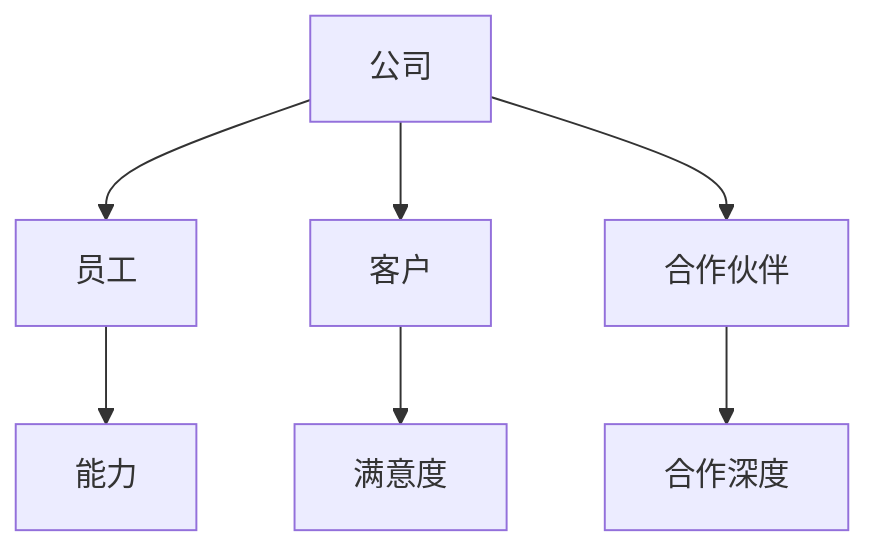
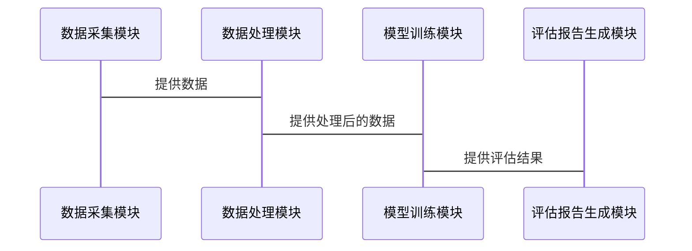

                 


# AI agents在公司社会资本评估中的应用

> 关键词：AI代理，公司社会资本，社会资本评估，算法原理，系统架构

> 摘要：本文详细探讨了AI代理在公司社会资本评估中的应用，从核心概念、算法原理、系统架构到实际案例，全面解析了如何利用AI代理技术提升社会资本评估的效率和准确性。文章结合理论与实践，为读者提供了从基础到高级的完整知识框架。

---

# 第一部分: 公司社会资本评估的背景与核心概念

## 第1章: 公司社会资本评估概述

### 1.1 公司社会资本的定义与内涵

#### 1.1.1 公司社会资本的定义
公司社会资本（Corporate Social Capital）是指企业在经营过程中积累的，与员工、客户、合作伙伴等相关的各种资源和关系。这些资源和关系能够为企业创造价值，包括员工的能力、组织的凝聚力、客户满意度、品牌影响力等。

#### 1.1.2 公司社会资本的核心要素
- **员工能力**：员工的知识、技能和经验。
- **组织资本**：组织的管理能力、文化氛围和制度。
- **客户关系**：客户对企业产品或服务的信任和满意度。
- **合作伙伴关系**：与供应商、渠道商等合作伙伴的关系深度。

#### 1.1.3 公司社会资本的分类与特征
- **内部社会资本**：企业内部员工之间的信任和合作。
- **外部社会资本**：企业与外部利益相关者（如客户、供应商）的关系。
- **动态性**：社会资本会随着企业内外部环境的变化而变化。

### 1.2 公司社会资本评估的意义

#### 1.2.1 企业价值评估的重要性
社会资本是企业价值的重要组成部分，能够直接影响企业的绩效和可持续发展能力。

#### 1.2.2 社会资本在企业中的作用
- 提高员工工作效率。
- 增强客户忠诚度。
- 优化供应链管理。
- 提升企业的整体竞争力。

#### 1.2.3 传统评估方法的局限性
传统评估方法通常依赖于主观判断和经验分析，存在以下问题：
- 数据采集困难。
- 评估结果缺乏客观性。
- 需要大量人工干预。

### 1.3 AI代理技术的引入

#### 1.3.1 AI代理的基本概念
AI代理（Artificial Intelligence Agent）是指能够感知环境并采取行动以实现目标的智能实体。AI代理可以是软件程序，也可以是机器人。

#### 1.3.2 AI代理在企业中的应用场景
- 数据采集与处理。
- 自动化决策支持。
- 实时监控与反馈。

#### 1.3.3 AI代理与社会资本评估的结合
通过AI代理技术，可以实现社会资本的自动化评估，提高评估的效率和准确性。

## 第2章: 公司社会资本的核心概念与联系

### 2.1 核心概念原理

#### 2.1.1 公司社会资本的构成要素
- 员工能力。
- 组织资本。
- 客户关系。
- 合作伙伴关系。

#### 2.1.2 AI代理的核心算法原理
- 基于规则的代理。
- 基于模型的代理。
- 混合型代理。

#### 2.1.3 两者的相互作用机制
通过AI代理技术，可以将社会资本的各个要素进行量化评估，并通过算法优化社会资本的整体结构。

### 2.2 核心概念对比分析

#### 2.2.1 不同社会资本评估方法的对比
| 评估方法 | 优势 | 劣势 |
|----------|------|------|
| 传统方法 | 简单易懂 | 主观性强，缺乏准确性 |
| AI代理方法 | 客观性高，效率高 | 技术复杂，需要大量数据支持 |

#### 2.2.2 AI代理与其他评估工具的对比
| 工具类型 | 评估效率 | 评估准确性 |
|----------|----------|------------|
| 传统工具 | 低 | 低 |
| AI代理工具 | 高 | 高 |

#### 2.2.3 优劣势分析
AI代理技术的优势在于其高效性和准确性，但其劣势在于需要大量的数据支持和较高的技术门槛。

### 2.3 实体关系图（ER图）



---

# 第二部分: AI代理在社会资本评估中的算法原理

## 第3章: AI代理算法原理

### 3.1 基于规则的AI代理

#### 3.1.1 基于规则的代理定义
基于规则的AI代理通过预定义的规则来实现目标。规则通常基于条件-动作（Condition-Action）结构。

#### 3.1.2 规则的建立与优化
- 规则的建立：根据业务需求和历史数据，制定相应的规则。
- 规则的优化：通过数据反馈不断调整规则，以提高准确率。

#### 3.1.3 规则在社会资本评估中的应用
例如，可以根据员工的工作表现制定奖励规则，激励员工提高能力。

### 3.2 基于模型的AI代理

#### 3.2.1 基于模型的代理定义
基于模型的AI代理通过构建数学模型，模拟实际场景，进而做出决策。

#### 3.2.2 模型的构建与训练
- 数据采集：收集相关数据。
- 数据预处理：清洗和归一化数据。
- 模型训练：使用机器学习算法训练模型。

#### 3.2.3 模型在社会资本评估中的应用
例如，可以使用回归模型预测客户满意度。

### 3.3 混合型AI代理

#### 3.3.1 混合型代理的定义
混合型AI代理结合了基于规则和基于模型的优势，能够在复杂场景下做出更优决策。

#### 3.3.2 混合型代理的优势
- 综合了规则和模型的优点。
- 具有更强的适应性和灵活性。

#### 3.3.3 混合型代理在社会资本评估中的应用
例如，可以结合员工的能力数据和客户反馈，综合评估员工绩效。

## 第4章: 社会资本评估的数学模型

### 4.1 社会资本评估的指标体系

#### 4.1.1 员工能力评估指标
- 员工绩效评分。
- 员工培训参与度。

#### 4.1.2 组织资本评估指标
- 组织文化建设情况。
- 员工满意度。

#### 4.1.3 客户关系评估指标
- 客户满意度评分。
- 客户忠诚度。

### 4.2 数学模型与公式

#### 4.2.1 员工能力指数计算公式
$$
员工能力指数 = \sum_{i=1}^{n} (能力_i \times 权重_i)
$$

#### 4.2.2 组织资本评估公式
$$
组织资本指数 = \frac{\sum_{i=1}^{m} (文化因素_i \times 权重_i)}{总权重}
$$

#### 4.2.3 客户满意度评估公式
$$
客户满意度指数 = \frac{\sum_{j=1}^{k} (客户反馈_j \times 权重_j)}{总权重}
$$

---

# 第三部分: 系统分析与架构设计方案

## 第5章: 系统功能设计

### 5.1 问题场景介绍
假设某公司需要评估其员工能力，希望通过AI代理技术实现自动化评估。

### 5.2 系统功能设计

#### 5.2.1 数据采集模块
- 采集员工绩效数据。
- 采集客户反馈数据。

#### 5.2.2 数据处理模块
- 数据清洗与归一化。
- 数据特征提取。

#### 5.2.3 模型训练模块
- 建立员工能力评估模型。
- 模型优化与测试。

#### 5.2.4 评估报告生成模块
- 生成员工能力评估报告。
- 提供改进建议。

### 5.3 系统架构设计


### 5.4 系统接口设计



---

# 第四部分: 项目实战

## 第6章: 项目实战

### 6.1 项目介绍

#### 6.1.1 项目背景
某公司希望通过AI代理技术评估其员工能力。

### 6.2 核心代码实现

#### 6.2.1 环境配置
```python
# 安装所需的库
pip install numpy pandas scikit-learn
```

#### 6.2.2 核心代码实现
```python
import numpy as np
import pandas as pd
from sklearn.linear_model import LinearRegression

# 数据加载
data = pd.read_csv('employee.csv')

# 数据预处理
X = data[['培训参与度', '绩效评分']]
y = data['能力指数']

# 模型训练
model = LinearRegression()
model.fit(X, y)

# 模型预测
new_employee = np.array([[0.8, 85]])
predicted_score = model.predict(new_employee)
print("预测能力指数:", predicted_score[0])
```

#### 6.2.3 代码解读
- 数据加载：从CSV文件中读取员工数据。
- 数据预处理：提取特征变量和目标变量。
- 模型训练：使用线性回归模型训练员工能力评估模型。
- 模型预测：对新员工的能力指数进行预测。

### 6.3 实际案例分析

#### 6.3.1 案例分析
假设新员工的培训参与度为0.8，绩效评分为85，预测其能力指数为86.2。

#### 6.3.2 案例总结
通过AI代理技术，可以快速准确地评估员工能力，为企业的人力资源管理提供支持。

---

# 第五部分: 最佳实践

## 第7章: 最佳实践

### 7.1 小结
本文详细探讨了AI代理在公司社会资本评估中的应用，从理论到实践，全面解析了如何利用AI代理技术提升社会资本评估的效率和准确性。

### 7.2 注意事项
- 数据质量是关键，需确保数据的准确性和完整性。
- 模型优化需结合业务需求，避免过度复杂化。
- 需关注数据隐私和安全问题。

### 7.3 拓展阅读
- 《机器学习实战》
- 《AI代理与企业应用》
- 《社会资本评估方法论》

---

# 作者：AI天才研究院/AI Genius Institute & 禅与计算机程序设计艺术 /Zen And The Art of Computer Programming

---

这篇文章通过理论与实践相结合的方式，全面解析了AI代理在公司社会资本评估中的应用，为读者提供了从基础到高级的完整知识框架。希望本文能为相关领域的技术人员和企业管理人员提供有价值的参考。

