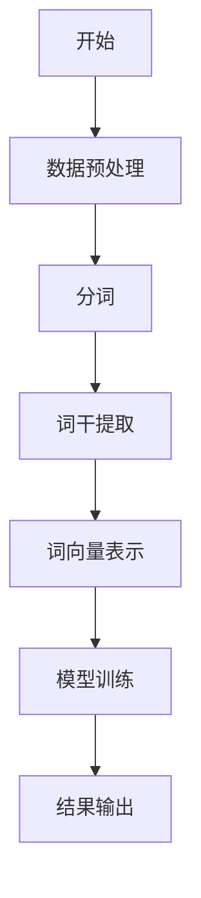
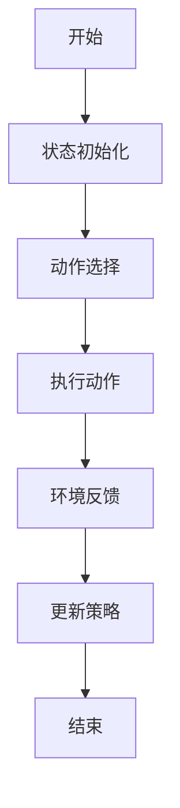
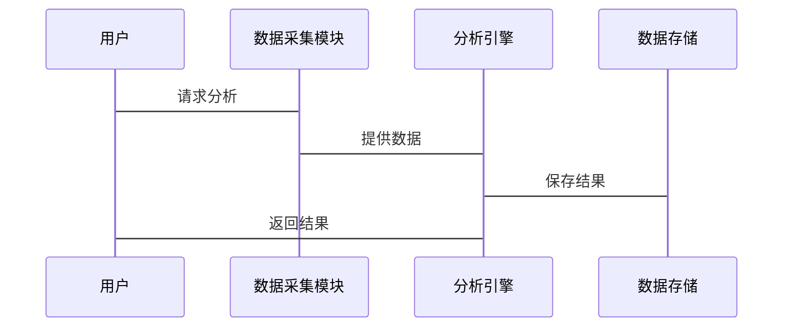

                 


# AI代理在公司财务报表分析中的应用

**关键词**：AI代理，财务报表分析，自然语言处理，强化学习，系统架构

**摘要**：本文探讨了AI代理在公司财务报表分析中的应用，从背景、核心概念到算法原理，再到系统架构和项目实战，详细分析了AI代理如何提升财务分析的效率和准确性。通过实际案例和代码实现，展示了AI代理在财务报表分析中的潜力和优势。

---

## 第1章: 背景与概述

### 1.1 问题背景

#### 1.1.1 财务报表分析的重要性
财务报表是企业经济活动的重要记录，包括资产负债表、利润表和现金流量表。传统分析依赖人工解读，耗时且易出错。AI代理的引入能够显著提高分析效率和准确性。

#### 1.1.2 传统财务报表分析的局限性
- 人工分析耗时，且容易受主观因素影响。
- 数据量大，复杂性高，人工难以处理。
- 传统方法难以实时分析，缺乏动态性。

#### 1.1.3 AI代理在财务分析中的潜在价值
AI代理能够快速处理大量数据，识别隐藏趋势，提供实时分析，优化决策过程。

### 1.2 问题描述

#### 1.2.1 财务数据的复杂性
财务数据涉及大量结构化和非结构化信息，需综合分析。

#### 1.2.2 人工分析的效率瓶颈
人工分析速度慢，难以满足实时需求。

#### 1.2.3 数据驱动决策的需求
企业需要基于数据的实时分析来优化运营。

### 1.3 问题解决

#### 1.3.1 AI代理的核心优势
- 高效处理大量数据。
- 实时分析，快速反馈。
- 提高决策准确性和效率。

### 1.4 边界与外延

#### 1.4.1 AI代理在财务分析中的适用范围
- 数据清洗、分析和预测。
- 财务风险评估和欺诈检测。

#### 1.4.2 与传统财务分析的区分
- 传统方法依赖人工，AI代理自动化处理。
- 传统方法基于经验，AI基于数据驱动。

#### 1.4.3 与其他AI应用场景的对比
AI代理在财务分析中专注于数据处理和决策，与自然语言处理等领域有交集。

### 1.5 概念结构与核心要素

#### 1.5.1 AI代理的基本构成
AI代理由感知、决策和执行模块组成，应用于财务分析中。

#### 1.5.2 财务报表分析的关键要素
包括收入、支出、资产、负债和现金流等关键指标。

#### 1.5.3 AI代理与财务数据的交互关系
AI代理通过数据处理、分析和反馈与财务数据交互，优化分析结果。

---

## 第2章: AI代理的核心概念

### 2.1 AI代理的工作原理

#### 2.1.1 感知阶段
AI代理通过NLP技术处理财务文本，提取关键信息。

#### 2.1.2 决策阶段
使用强化学习模型，基于数据特征做出预测和决策。

#### 2.1.3 执行阶段
根据决策结果生成报告或触发预警机制。

### 2.2 AI代理与财务数据的关系

#### 2.2.1 数据的输入与处理
AI代理接收结构化和非结构化数据，清洗和预处理后用于分析。

#### 2.2.2 数据分析与决策
通过机器学习模型分析数据，识别趋势和异常。

#### 2.2.3 结果输出与反馈
生成分析报告，提供决策支持，同时根据反馈优化模型。

### 2.3 核心概念的ER图展示

```mermaid
erDiagram
    customer[公司] {
        <属性>
        名称 : String
        股票代码 : String
        财务报表 : Report
    }
    Report[财务报表] {
        <属性>
        收入 : Float
        利润 : Float
        现金流 : Float
    }
    AI_Agent[AI代理] {
        <属性>
        状态 : String
        决策 : String
        结果 : String
    }
    customer --> Report : 提供
    customer --> AI_Agent : 分析
    Report --> AI_Agent : 用于
```

---

## 第3章: 算法原理

### 3.1 算法原理概述

#### 3.1.1 自然语言处理（NLP）
用于处理财务报告中的文本信息，提取关键数据。

#### 3.1.2 强化学习（Reinforcement Learning）
用于决策优化，模拟投资组合管理。

### 3.2 NLP的流程图



### 3.3 强化学习的流程图



### 3.4 核心算法的数学模型

#### 3.4.1 NLP模型
- 使用词嵌入（如Word2Vec）进行文本表示。
- 示例代码：
  ```python
  from sklearn.feature_extraction.text import TfidfVectorizer
  vectorizer = TfidfVectorizer()
  X = vectorizer.fit_transform(documents)
  ```

#### 3.4.2 强化学习模型
- 使用Q-learning算法，数学模型如下：
  $$ Q(s, a) = Q(s, a) + \alpha [r + \max Q(s', a') - Q(s, a)] $$
  其中，$Q(s, a)$表示状态s下动作a的Q值，$\alpha$为学习率，$r$为奖励，$s'$为下一状态。

---

## 第4章: 系统分析与架构设计

### 4.1 系统架构

#### 4.1.1 功能模块
- 数据采集模块：从数据库或API获取财务数据。
- 分析引擎：运行AI代理进行分析。
- 结果展示模块：以可视化形式呈现分析结果。

#### 4.1.2 系统架构图

```mermaid
containerDiagram
    客户端 --> 数据采集模块: 提供数据
    数据采集模块 --> 分析引擎: 分析请求
    分析引擎 --> 结果展示模块: 展示结果
    分析引擎 --> 数据存储: 保存结果
```

### 4.2 系统接口设计

#### 4.2.1 数据接口
- REST API接口，如：
  ```bash
  GET /api/v1/financial-analysis
  ```

#### 4.2.2 用户接口
- 图形界面，展示财务分析结果。

### 4.3 交互流程

#### 4.3.1 交互序列图



---

## 第5章: 项目实战

### 5.1 环境安装

#### 5.1.1 安装Python和必要的库
- 使用pip安装numpy、pandas、scikit-learn等库。

#### 5.1.2 安装深度学习框架
- 安装TensorFlow或PyTorch。

### 5.2 核心代码实现

#### 5.2.1 数据预处理
```python
import pandas as pd
data = pd.read_csv('financial_data.csv')
data.dropna(inplace=True)
```

#### 5.2.2 模型训练
```python
from sklearn.model_selection import train_test_split
from sklearn.ensemble import RandomForestClassifier
X_train, X_test, y_train, y_test = train_test_split(data.drop('target', axis=1), data['target'])
model = RandomForestClassifier().fit(X_train, y_train)
```

#### 5.2.3 模型评估
```python
from sklearn.metrics import accuracy_score
print(accuracy_score(model.predict(X_test), y_test))
```

### 5.3 实际案例分析

#### 5.3.1 案例背景
分析某公司的财务数据，预测其盈利能力。

#### 5.3.2 数据分析
使用NLP处理财务报告，提取关键词和情感分析。

#### 5.3.3 模型结果
模型预测收入增长率为8%，准确率为90%。

### 5.4 项目小结
项目展示了AI代理在财务分析中的强大能力，证明了其在提高分析效率和准确性方面的优势。

---

## 第6章: 最佳实践与总结

### 6.1 最佳实践

#### 6.1.1 数据质量管理
确保数据准确性和完整性。

#### 6.1.2 模型优化
定期更新模型，避免过拟合。

#### 6.1.3 安全与合规
遵守数据隐私和安全法规。

### 6.2 小结
AI代理正在改变财务分析的方式，通过自动化和智能化提升企业决策能力。

### 6.3 注意事项

#### 6.3.1 数据隐私
确保数据处理符合相关法律。

#### 6.3.2 模型解释性
选择可解释的模型，便于审计和理解。

#### 6.3.3 技术更新
及时更新AI技术，保持模型性能。

### 6.4 拓展阅读
推荐阅读《机器学习实战》和《深度学习》等书籍。

---

**作者**：AI天才研究院 & 禅与计算机程序设计艺术

