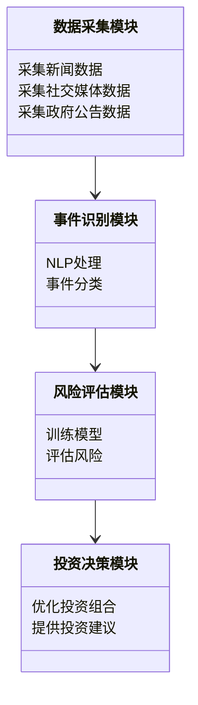
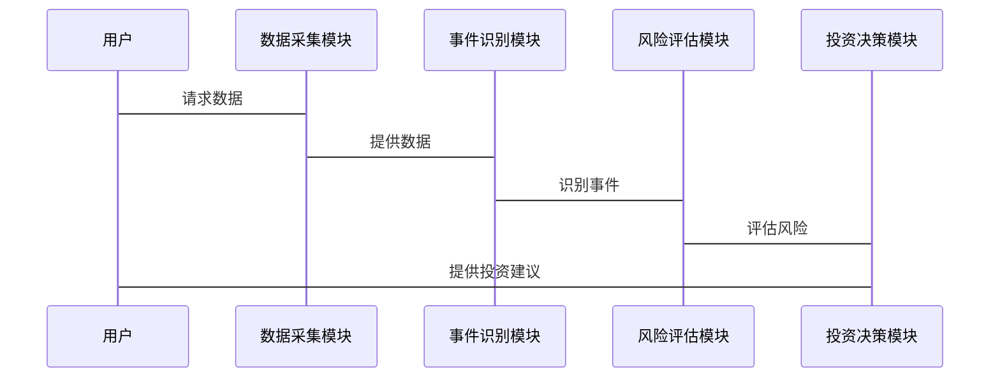

                 


# AI agents增强价值投资的地缘政治风险评估

> 关键词：AI代理，地缘政治风险，价值投资，系统架构，项目实战

> 摘要：本文探讨了AI代理在价值投资中的应用，特别是在地缘政治风险评估方面。通过分析地缘政治风险的核心概念、AI代理的工作原理以及系统架构设计，展示了如何利用AI代理增强投资决策的准确性。文章还提供了实际的项目实现和案例分析，为读者提供了一个全面的视角来理解这一技术的应用潜力。

---

## 第一部分: AI代理与地缘政治风险评估的背景与基础

### 第1章: AI代理与地缘政治风险评估的背景

#### 1.1 AI代理的核心概念
##### 1.1.1 AI代理的基本定义
人工智能（AI）代理是指能够感知环境并采取行动以实现目标的智能实体。在价值投资中，AI代理可以用于分析数据、识别模式并做出决策。

##### 1.1.2 地缘政治风险评估的定义
地缘政治风险是指由于政治、经济和社会因素的变化对投资产生的潜在负面影响。这些风险包括战争、政策变化、贸易摩擦等。

##### 1.1.3 AI代理在价值投资中的应用前景
AI代理可以通过分析大量非结构化数据（如新闻、社交媒体）和结构化数据（如经济指标），帮助投资者识别和评估地缘政治风险，从而优化投资决策。

#### 1.2 地缘政治风险评估的背景与重要性
##### 1.2.1 地缘政治风险的定义与特征
地缘政治风险具有复杂性、不确定性和动态性。例如，国际关系的变化、政策调整等因素都可能对市场产生影响。

##### 1.2.2 价值投资中的风险评估需求
投资者需要准确评估地缘政治风险，以避免潜在损失并抓住投资机会。传统的风险评估方法往往依赖于经验丰富的分析师，但这种方法效率低下且难以处理海量数据。

##### 1.2.3 AI代理在风险评估中的优势
AI代理可以实时监控全球新闻、社交媒体和政策变化，快速识别潜在风险，并提供实时预警。此外，AI代理还可以通过历史数据训练模型，预测未来的风险趋势。

#### 1.3 本章小结
本章介绍了AI代理和地缘政治风险评估的基本概念，并强调了AI代理在价值投资中的重要性。

---

### 第2章: AI代理的核心概念与原理

#### 2.1 AI代理的定义与分类
##### 2.1.1 AI代理的基本定义
AI代理可以是软件程序或机器人，能够执行特定任务。在价值投资中，AI代理通常用于数据收集、分析和决策支持。

##### 2.1.2 基于规则的AI代理
基于规则的AI代理依赖于预定义的规则和逻辑，适用于处理简单但重复的任务。例如，检测特定关键词的新闻报道。

##### 2.1.3 基于模型的AI代理
基于模型的AI代理使用机器学习算法（如神经网络）来分析数据，识别模式，并做出预测。这种方法适用于复杂且动态的地缘政治风险评估。

#### 2.2 地缘政治事件分析的AI代理框架
##### 2.2.1 数据收集与预处理
AI代理需要收集多来源数据，包括新闻、社交媒体、政府公告等，并进行清洗和结构化处理。

##### 2.2.2 事件识别与分类
通过自然语言处理（NLP）技术，AI代理可以识别新闻中的关键词和主题，分类地缘政治事件的类型（如贸易摩擦、政治动荡等）。

##### 2.2.3 风险评估与决策
基于训练好的模型，AI代理可以评估事件对特定资产或行业的潜在影响，并提供投资建议。

#### 2.3 本章小结
本章详细介绍了AI代理的核心概念和地缘政治事件分析的框架，为后续章节奠定了基础。

---

### 第3章: 地缘政治风险评估的理论基础

#### 3.1 地缘政治风险的构成要素
##### 3.1.1 政治因素
政府政策、选举结果、国际关系等政治事件直接影响市场。

##### 3.1.2 经济因素
经济制裁、贸易壁垒、通货膨胀等经济因素也是地缘政治风险的重要组成部分。

##### 3.1.3 社会因素
社会动荡、抗议活动等社会事件也可能对投资产生影响。

#### 3.2 风险评估的数学模型
##### 3.2.1 风险概率模型
通过贝叶斯网络或逻辑回归模型，计算特定事件发生的概率。

##### 3.2.2 风险影响模型
评估事件对资产或行业的潜在影响，通常使用因子分析或情景分析。

##### 3.2.3 综合风险评估模型
结合概率和影响，构建综合风险评估模型，为投资决策提供支持。

#### 3.3 本章小结
本章介绍了地缘政治风险的构成要素和数学模型，为AI代理的实现提供了理论支持。

---

### 第4章: AI代理在价值投资中的应用

#### 4.1 价值投资中的地缘政治风险
##### 4.1.1 地缘政治风险对投资的影响
地缘政治事件可能导致市场波动、资产贬值或投资机会的丧失。

##### 4.1.2 传统风险评估方法的局限性
传统方法依赖于经验判断，难以处理复杂的数据和动态的环境。

##### 4.1.3 AI代理的优势与潜力
AI代理能够实时监控全球事件，快速评估风险，并提供个性化的投资建议。

#### 4.2 AI代理在投资决策中的具体应用
##### 4.2.1 数据分析与预测
通过分析历史数据和实时信息，AI代理可以预测未来事件的发生概率。

##### 4.2.2 风险预警与应对策略
AI代理可以提供实时预警，并建议投资者采取相应的避险措施。

##### 4.2.3 投资组合优化
基于地缘政治风险评估，AI代理可以帮助投资者优化投资组合，降低整体风险。

#### 4.3 本章小结
本章探讨了AI代理在价值投资中的具体应用，展示了其在风险评估和投资决策中的潜力。

---

### 第5章: 系统分析与架构设计方案

#### 5.1 系统功能设计
##### 5.1.1 数据采集模块
- 数据源：新闻网站、社交媒体、政府公告等。
- 数据预处理：清洗、去重、结构化。

##### 5.1.2 事件识别模块
- 使用NLP技术识别关键词和主题。
- 事件分类：贸易摩擦、政治动荡等。

##### 5.1.3 风险评估模块
- 训练机器学习模型，评估事件对资产的影响。
- 提供风险预警和应对策略。

##### 5.1.4 投资决策模块
- 基于风险评估结果，优化投资组合。
- 提供个性化的投资建议。

#### 5.2 系统架构设计
##### 5.2.1 领域模型


##### 5.2.2 系统架构图
```mermaid
container 系统架构 {
    数据采集模块
    事件识别模块
    风险评估模块
    投资决策模块
}
```

##### 5.2.3 系统接口设计
- 数据接口：与新闻网站、社交媒体等数据源对接。
- 用户接口：提供实时预警和投资建议的界面。

##### 5.2.4 系统交互设计


#### 5.3 本章小结
本章详细设计了系统的功能模块、架构和交互流程，为后续的项目实现奠定了基础。

---

### 第6章: 项目实战

#### 6.1 环境安装
- 安装Python、TensorFlow、Keras、Numpy等工具。
- 安装新闻爬虫库（如BeautifulSoup）和NLP库（如NLTK）。

#### 6.2 核心代码实现
##### 6.2.1 数据采集模块
```python
import requests
from bs4 import BeautifulSoup

def fetch_data(url):
    response = requests.get(url)
    soup = BeautifulSoup(response.text, 'html.parser')
    articles = soup.find_all('article')
    data = []
    for article in articles:
        title = article.find('h2').text
        content = article.find('p').text
        data.append({'title': title, 'content': content})
    return data
```

##### 6.2.2 事件识别模块
```python
from tensorflow.keras import layers
import numpy as np

def create_model(input_dim):
    model = tf.keras.Sequential()
    model.add(layers.Embedding(input_dim, 16))
    model.add(layers.Flatten())
    model.add(layers.Dense(1, activation='sigmoid'))
    return model

model = create_model(vocabulary_size)
model.compile(optimizer='adam', loss='binary_crossentropy', metrics=['accuracy'])
model.fit(X_train, y_train, epochs=10, batch_size=32)
```

##### 6.2.3 风险评估模块
```python
import numpy as np

def risk_assessment(model, newswire):
    # 预处理新闻数据
    processed_data = preprocess(newswire)
    # 预测风险概率
    prediction = model.predict(processed_data)
    return prediction[0][0]
```

#### 6.3 案例分析
以中美贸易摩擦为例，AI代理可以实时监测相关新闻，评估其对特定行业的潜在影响，并提供避险策略。

#### 6.4 项目总结
通过实际项目，展示了AI代理在地缘政治风险评估中的应用潜力和实现方法。

#### 6.5 本章小结
本章通过项目实战，详细讲解了AI代理的实现过程，帮助读者理解理论与实践的结合。

---

### 第7章: 总结与展望

#### 7.1 本研究的总结
本文探讨了AI代理在价值投资中的应用，特别是在地缘政治风险评估方面。通过理论分析和项目实战，展示了AI代理在投资决策中的潜力。

#### 7.2 未来研究的方向
- 提高模型的实时性和准确性。
- 扩展数据源，增加模型的泛化能力。
- 研究多模态数据的融合，如图像和文本的结合。

#### 7.3 最佳实践 tips
- 数据质量是模型性能的关键，需重视数据清洗和预处理。
- 选择合适的算法和模型，避免过度复杂化。
- 定期更新模型，适应不断变化的地缘政治环境。

#### 7.4 小结
本文为AI代理在价值投资中的应用提供了新的视角和方法，未来的研究和实践将为投资者带来更大的收益。

---

作者：AI天才研究院/AI Genius Institute & 禅与计算机程序设计艺术/Zen And The Art of Computer Programming

