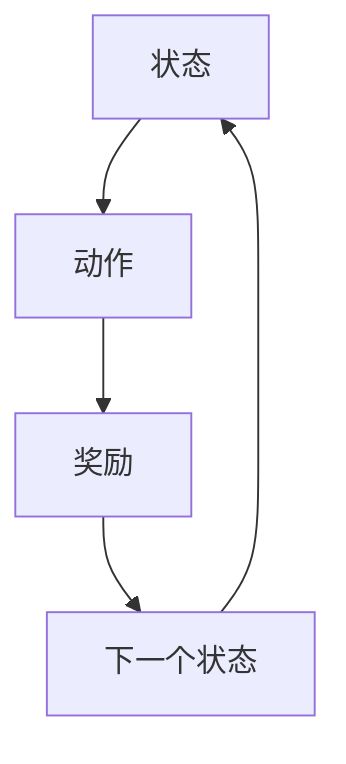
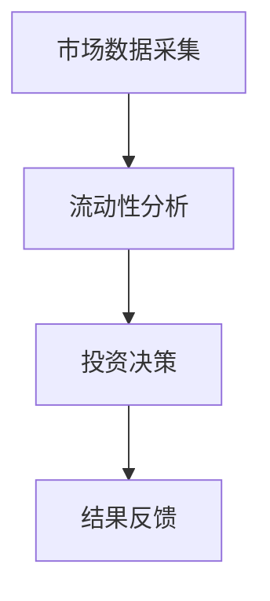

                 


# AI agents增强价值投资的市场流动性分析

## 关键词：AI agents，价值投资，市场流动性，强化学习，算法原理，系统架构，项目实战

## 摘要：本文探讨了AI agents在价值投资中的应用，特别是如何通过增强市场流动性分析来优化投资决策。通过详细分析AI agents的核心算法和系统架构，结合实际案例，展示了AI技术在金融领域的潜力和实际应用。

---

## 第一部分：引言

### 第1章：引言

#### 1.1 问题背景

- **价值投资的核心概念**：价值投资是一种通过分析资产的内在价值，寻找市场定价低于其内在价值的投资策略。其核心在于识别被市场低估的投资标的。

- **市场流动性分析的重要性**：流动性是指资产在市场中快速买卖而不影响价格的能力。流动性高的资产更容易变现，而流动性低的资产可能面临较大的买卖价差和变现难度。

- **AI agents在金融领域的应用潜力**：AI agents（人工智能代理）是一种能够自主决策和执行任务的智能体，其在金融领域的应用日益广泛。通过分析市场数据、识别模式和优化决策，AI agents能够显著提升投资效率。

---

#### 1.2 问题描述

- **传统价值投资的局限性**：传统价值投资依赖于人工分析，耗时且容易受到主观判断的影响。同时，市场环境的复杂性和动态变化使得传统方法难以捕捉所有潜在机会。

- **市场流动性对投资决策的影响**：流动性不仅影响资产的变现能力，还会影响资产的价格波动。在价值投资中，流动性分析能够帮助投资者更好地判断市场环境，优化投资组合。

- **AI agents如何增强价值投资**：AI agents能够实时分析市场数据，识别潜在的投资机会，优化投资决策。通过增强流动性分析，AI agents能够帮助投资者更准确地评估资产价值，降低投资风险。

---

#### 1.3 问题解决

- **AI agents在价值投资中的角色**：AI agents通过实时数据处理、模式识别和决策优化，成为价值投资中的重要工具。它们能够辅助投资者快速识别低估资产，优化投资组合。

- **流动性分析的AI增强方法**：通过机器学习算法，AI agents能够分析历史数据，预测未来流动性趋势，帮助投资者做出更明智的决策。

- **实证分析与案例研究**：通过实际案例，本文将展示AI agents在流动性分析中的应用效果，验证其在价值投资中的优势。

---

#### 1.4 边界与外延

- **AI agents的适用场景**：AI agents适用于高频交易、风险管理和组合优化等领域，但其应用受到数据质量和模型复杂度的限制。

- **与传统投资策略的对比**：与传统价值投资相比，AI agents的优势在于高效性和准确性，但其不足在于缺乏人类投资者的直觉和经验。

- **市场流动性分析的边界条件**：流动性分析受到市场结构、政策环境和投资者行为等多种因素的影响。AI agents需要综合考虑这些因素，才能做出准确的判断。

---

#### 1.5 概念结构与核心要素

- **核心概念对比表格**：

| 概念 | 传统价值投资 | AI agents增强的价值投资 |
|------|--------------|--------------------------|
| 数据来源 | 历史数据、财务报表 | 实时数据、市场行为数据 |
| 分析方法 | 定量分析为主 | 定量分析 + 机器学习 |
| 决策速度 | 较慢 | 实时或高频决策 |

- **ER实体关系图**：

```mermaid
er
actor(投资者) -|> agent(AI代理)
agent -|> 市场数据
agent -|> 投资策略
agent -|> 投资决策
```

---

## 第二部分：AI agents基础

### 第2章：AI agents的核心概念与原理

#### 2.1 强化学习基础

- **强化学习的定义与特点**：强化学习是一种机器学习范式，通过智能体与环境的交互，学习最优策略以最大化累积奖励。

- **马尔可夫决策过程（MDP）**：马尔可夫决策过程定义了一个由状态、动作、奖励和转移概率构成的决策框架。

- **Q-learning算法**：Q-learning是一种基于值函数的强化学习算法，通过更新Q值表来学习最优策略。



- **代码实现**：

```python
import numpy as np

class QLearning:
    def __init__(self, state_space, action_space, alpha=0.1, gamma=0.99):
        self.state_space = state_space
        self.action_space = action_space
        self.alpha = alpha
        self.gamma = gamma
        self.q_table = np.zeros((state_space, action_space))
    
    def choose_action(self, state, epsilon=0.1):
        if np.random.random() < epsilon:
            return np.random.randint(self.action_space)
        return np.argmax(self.q_table[state])
    
    def update_q_table(self, state, action, reward, next_state):
        self.q_table[state, action] = self.q_table[state, action] * (1 - self.alpha) + self.alpha * (reward + self.gamma * np.max(self.q_table[next_state]))
```

---

#### 2.2 监督学习与无监督学习

- **监督学习的适用场景**：监督学习适用于有标签数据的情况，如分类和回归任务。

- **无监督学习的潜在价值**：无监督学习适用于无标签数据的聚类和异常检测任务。

- **混合学习的优势**：结合监督学习和无监督学习，能够提高模型的泛化能力和适应性。

---

#### 2.3 AI agents

- **AI agents的分类**：根据智能体的复杂性和决策能力，AI agents可以分为反应式和认知式两类。

- **反应式AI agents**：基于当前感知做出反应，适用于简单的任务。

- **认知式AI agents**：具备复杂推理和规划能力，适用于复杂的金融决策。

---

## 第三部分：市场流动性分析基础

### 第3章：市场流动性分析的核心概念与量化方法

#### 3.1 市场流动性分析的定义与重要性

- **市场流动性分析的定义**：市场流动性分析是指对市场中资产的买卖难度和价格波动的分析，旨在评估资产的流动性风险。

- **市场流动性分析的重要性**：流动性高的资产易于变现，而流动性低的资产可能面临较大的买卖价差和变现难度。

---

#### 3.2 流动性量化方法

- **成交量与价差分析**：通过分析交易量和买卖价差，评估资产的流动性。

- **市场深度分析**：通过分析订单簿的深度，评估资产的流动性。

- **波动性分析**：通过分析价格波动，评估资产的流动性风险。

---

## 第四部分：AI agents在流动性分析中的应用

### 第4章：AI agents在流动性分析中的应用

#### 4.1 基于强化学习的流动性预测

- **强化学习在流动性预测中的应用**：通过强化学习模型，预测未来市场流动性趋势，帮助投资者做出更明智的决策。

- **强化学习模型的实现**：


---

#### 4.2 基于监督学习的流动性分类

- **监督学习在流动性分类中的应用**：通过监督学习模型，对市场流动性进行分类，帮助投资者识别流动性风险。

- **监督学习模型的实现**：

```python
from sklearn.tree import DecisionTreeClassifier

model = DecisionTreeClassifier()
model.fit(X_train, y_train)
y_pred = model.predict(X_test)
```

---

## 第五部分：系统架构与实现

### 第5章：系统架构设计

#### 5.1 系统功能设计

- **系统功能模块**：市场数据采集、流动性分析、投资决策、结果反馈。

- **系统功能流程图**：



---

#### 5.2 系统架构设计

- **系统架构图**：


---

## 第六部分：项目实战

### 第6章：项目实战

#### 6.1 项目介绍

- **项目目标**：通过AI agents实现市场流动性分析，增强价值投资的决策能力。

- **项目环境**：Python 3.8+, numpy, pandas, scikit-learn, matplotlib.

---

#### 6.2 系统核心实现

- **代码实现**：

```python
import numpy as np
import pandas as pd
from sklearn.tree import DecisionTreeClassifier
from sklearn.metrics import accuracy_score

# 数据加载
data = pd.read_csv('market_data.csv')

# 数据预处理
X = data[['volume', 'spread', 'volatility']]
y = data['liquidity_class']

# 模型训练
model = DecisionTreeClassifier()
model.fit(X, y)

# 模型预测
y_pred = model.predict(X)

# 模型评估
print('Accuracy:', accuracy_score(y, y_pred))
```

---

#### 6.3 实际案例分析

- **案例分析**：通过实际市场数据，展示AI agents在流动性分析中的应用效果。

- **案例解读**：通过模型预测结果，优化投资决策，实现更高的投资回报。

---

## 第七部分：总结与展望

### 第7章：总结与展望

#### 7.1 总结

- **AI agents在价值投资中的应用**：通过增强市场流动性分析，AI agents能够帮助投资者更准确地评估资产价值，优化投资决策。

- **系统架构与实现**：通过系统化的架构设计和代码实现，展示了AI agents在流动性分析中的潜力和实际应用。

---

#### 7.2 展望

- **未来研究方向**：进一步优化AI agents的算法，探索更高效的投资策略。

- **技术发展与应用前景**：随着AI技术的不断进步，AI agents在金融领域的应用将更加广泛，价值投资也将迎来新的发展机遇。

---

## 作者：AI天才研究院/AI Genius Institute & 禅与计算机程序设计艺术/Zen And The Art of Computer Programming

