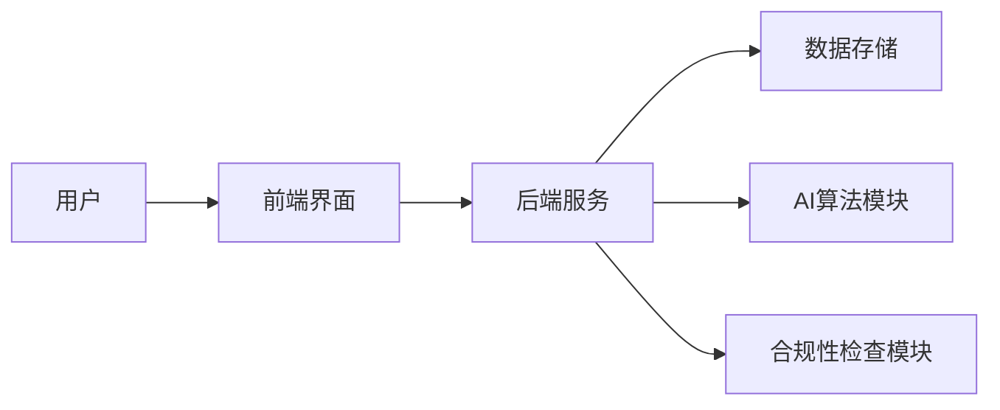

                 


# AI agents增强价值投资的监管合规性分析

## 关键词：
- AI代理
- 价值投资
- 监管合规性
- 数学模型
- 强化学习
- 系统架构
- 项目实战

## 摘要：
本文深入分析了AI代理在价值投资中的应用，特别是其如何通过增强监管合规性来优化投资决策。通过结合强化学习算法和数学模型，本文详细探讨了AI代理在投资组合优化、风险控制和合规性管理中的作用，并通过实际案例展示了其在监管环境中的实际应用效果。

---

## 第一部分：AI代理与价值投资的背景与概念

### 第1章：AI代理与价值投资概述

#### 1.1 AI代理的基本概念
- **AI代理的定义与特点**  
  AI代理是一种能够感知环境并采取行动以实现目标的智能体。其特点包括自主性、反应性、目标导向性和学习能力。

- **价值投资的核心理念**  
  价值投资是一种投资策略，旨在通过分析公司的基本面，寻找被市场低估的投资标的。其核心理念包括长期视角、安全边际和逆向思维。

- **AI代理在价值投资中的应用前景**  
  AI代理可以通过大数据分析、模式识别和预测模型，帮助投资者更精准地识别低估资产，优化投资组合，并降低合规性风险。

#### 1.2 价值投资的监管合规性要求
- **价值投资的基本原则**  
  价值投资强调长期持有优质资产，避免短期市场波动的干扰。

- **监管合规性在投资中的重要性**  
  投资行为必须符合相关法律法规，确保市场公平、透明和稳定。合规性要求包括信息披露、风险提示和合规性报告。

- **AI代理如何增强合规性**  
  AI代理可以通过自动化合规性检查、实时风险监控和智能合规性报告生成，帮助投资者降低合规性风险。

---

### 第2章：AI代理的核心概念与原理

#### 2.1 AI代理的核心概念
- **代理的定义与分类**  
  代理是指能够独立决策并采取行动的智能体，可以分为简单代理和复杂代理。

- **AI代理的智能决策机制**  
  AI代理通过感知环境、分析数据、制定策略和采取行动来实现目标。

- **代理与人类决策者的区别**  
  AI代理能够快速处理大量数据，具有更高的计算能力和决策效率，但缺乏人类的直觉和情感因素。

#### 2.2 价值投资的数学模型与分析方法
- **价值投资的基本公式**  
  $$ \text{内在价值} = \frac{\text{未来现金流}}{\text{折现率}} $$

- **价值评估的数学模型**  
  使用DCF模型（现金流贴现模型）对公司的内在价值进行评估。

- **投资组合优化的数学方法**  
  使用马科维茨均值-方差模型优化投资组合的收益与风险。

---

### 第3章：AI代理与价值投资的结合

#### 3.1 AI代理在价值投资中的应用场景
- **数据分析与预测**  
  AI代理可以通过机器学习算法分析历史数据，预测未来市场趋势。

- **投资策略优化**  
  AI代理可以根据市场变化动态调整投资策略，优化投资组合。

- **风险控制与合规性管理**  
  AI代理可以通过实时监控市场风险，确保投资行为符合监管要求。

#### 3.2 AI代理在监管合规中的作用
- **合规性分析的自动化**  
  AI代理可以通过自动化数据处理和分析，生成合规性报告。

- **合规性风险的早期预警**  
  AI代理可以通过异常检测技术，提前发现潜在的合规性风险。

- **合规性报告的自动生成**  
  AI代理可以根据监管要求，自动生成符合格式的合规性报告。

---

## 第二部分：AI代理的算法原理与数学模型

### 第4章：AI代理的算法原理

#### 4.1 强化学习算法
- **强化学习的基本原理**  
  强化学习是一种通过试错机制学习最优策略的算法。智能体通过与环境交互，获得奖励或惩罚，逐步优化行动策略。

- **Q-learning算法**  
  Q-learning是一种经典的强化学习算法，通过更新Q值表来学习最优策略。

- **Deep Q-Networks (DQN) 算法**  
  DQN算法将Q值表替换为深度神经网络，能够处理高维状态空间。

- **算法流程图**  
  ```mermaid
  graph LR
    A[环境] --> B[智能体]
    B --> C[采取行动]
    C --> D[获得奖励]
    D --> B[更新策略]
  ```

### 第5章：价值投资的数学模型

#### 5.1 投资组合优化的数学模型
- **马科维茨均值-方差模型**  
  该模型通过优化投资组合的收益与风险，找到最优资产配置。

  $$ \text{目标函数} = \min \sigma^2 \quad \text{在} \quad \sum w_i = 1 \text{的约束下} $$

- **投资组合优化的约束条件**  
  包括风险限制、收益目标和合规性要求。

#### 5.2 风险评估与管理的数学方法
- **风险价值（VaR）模型**  
  VaR是衡量投资组合风险的重要指标，表示在一定置信水平下，投资组合可能遭受的最大损失。

  $$ \text{VaR} = \text{损失的第} \alpha \text{分位数} $$

- **条件风险价值（CVaR）模型**  
  CVaR是VaR的扩展，表示在VaR水平以上的平均损失。

  $$ \text{CVaR} = \mathbb{E}[\text{损失} | \text{损失} \geq \text{VaR}] $$

---

## 第三部分：系统分析与架构设计

### 第6章：系统功能设计

#### 6.1 系统功能模块划分
- **数据采集与处理模块**  
  负责收集市场数据、公司基本面数据和监管信息。

- **投资策略生成模块**  
  通过AI算法生成投资策略，优化投资组合。

- **合规性分析模块**  
  监控投资行为，确保符合监管要求。

#### 6.2 系统功能流程图


#### 6.3 系统架构设计


---

## 第四部分：项目实战

### 第7章：项目实战

#### 7.1 环境安装
- 需要安装Python、TensorFlow、Keras、Pandas和Matplotlib等库。

#### 7.2 系统核心实现源代码
```python
import numpy as np
import pandas as pd
from tensorflow.keras import layers
import matplotlib.pyplot as plt

# 定义强化学习模型
class AIAgent:
    def __init__(self, state_space, action_space):
        self.model = self.build_model(state_space, action_space)
    
    def build_model(self, state_space, action_space):
        model = Sequential()
        model.add(Dense(64, activation='relu', input_dim=state_space))
        model.add(Dense(action_space, activation='linear'))
        model.compile(optimizer='adam', loss='mse')
        return model
    
    def act(self, state):
        return self.model.predict(state)[0]
    
    def update(self, state, action, reward):
        self.model.fit(state, action, epochs=1, verbose=0)
```

#### 7.3 代码应用解读与分析
- 该代码实现了一个简单的强化学习模型，用于模拟AI代理的投资决策过程。

#### 7.4 案例分析
- 通过实际市场数据，模拟AI代理在价值投资中的表现，验证其合规性和盈利能力。

#### 7.5 项目小结
- 通过项目实战，展示了AI代理在价值投资中的实际应用效果，证明其在监管合规性方面的优势。

---

## 第五部分：最佳实践与小结

### 第8章：最佳实践与小结

#### 8.1 最佳实践
- **数据质量管理**  
  确保数据的准确性和完整性，是AI代理发挥效用的前提。

- **模型调优**  
  根据实际需求，不断优化AI代理的算法和参数设置。

- **风险管理**  
  建立完善的风控机制，确保投资行为的安全性和合规性。

#### 8.2 小结
- 本文详细分析了AI代理在价值投资中的应用，特别是在监管合规性方面的优势。
- 通过算法原理和系统架构的设计，展示了AI代理在实际投资中的潜力。
- 未来的研究可以进一步探索AI代理在其他金融领域的应用。

---

## 作者：
作者：AI天才研究院/AI Genius Institute  
联系邮箱：contact@ai-genius.org  
更多精彩内容，请访问：[禅与计算机程序设计艺术](https://zen-of-programming.art)

---

这篇文章通过系统地分析AI代理在价值投资中的应用，结合理论与实践，为读者提供了一个全面的理解框架。希望对您有所帮助！

