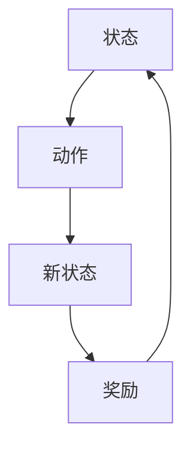
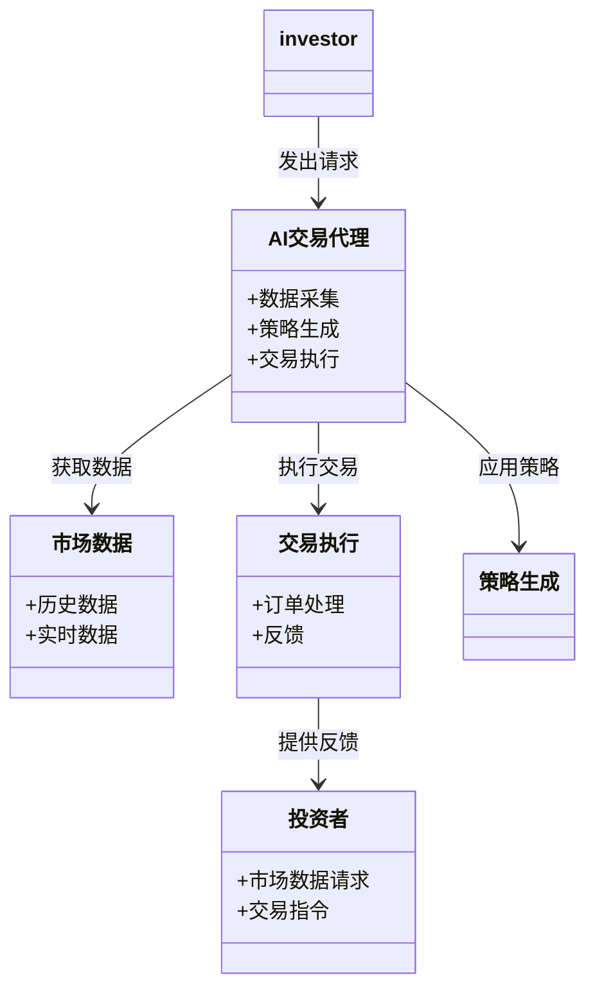

                 


# AI agents实时监控市场：捕捉价值投资机会

**关键词**：AI agents, 金融市场, 价值投资, 实时监控, 强化学习

**摘要**：本文探讨AI agents在金融市场实时监控中的应用，分析其如何通过捕捉价值投资机会提升投资收益。文章从背景、核心概念、算法原理到系统架构、项目实战，最后总结最佳实践，全面解析AI agents在金融投资中的潜力。

---

## 第1章: AI agents与金融市场概述

### 1.1 AI agents的基本概念

#### 1.1.1 AI agents的定义
AI agents（人工智能代理）是能够感知环境并采取行动以实现目标的智能实体。在金融市场中，AI agents用于实时数据处理和自动化交易。

#### 1.1.2 AI agents在金融市场的应用
AI agents广泛应用于股票交易、外汇交易等领域，通过实时数据分析优化投资决策。

#### 1.1.3 实时监控市场的必要性
实时监控帮助投资者及时捕捉市场动态，AI agents通过自动化处理提升决策效率。

### 1.2 价值投资的核心要素

#### 1.2.1 价值投资的基本原理
价值投资寻找被市场低估的资产，依赖于深入的基本面分析和长期视角。

#### 1.2.2 市场监控在价值投资中的作用
实时监控帮助识别市场低估机会，及时应对市场变化。

#### 1.2.3 AI agents在价值投资中的优势
AI agents通过大数据分析和机器学习模型，提高价值投资的效率和准确性。

### 1.3 本章小结
AI agents通过实时监控和自动化决策，为价值投资提供强大的技术支持。

---

## 第2章: AI agents的核心概念与联系

### 2.1 AI agents的核心原理

#### 2.1.1 感知层：数据采集与处理
AI agents通过API接口获取市场数据，清洗和转换数据以供分析。

#### 2.1.2 决策层：策略制定与优化
基于机器学习模型生成交易策略，通过强化学习优化决策过程。

#### 2.1.3 执行层：交易执行与反馈
根据决策执行交易，并收集反馈以改进模型。

### 2.2 AI agents的实体关系图

```mermaid
er
actor: 投资者
agent: AI交易代理
market_data: 市场数据
strategy: 投资策略
execution: 交易执行
feedback: 反馈机制
actor --> agent: 请求
agent --> market_data: 数据获取
agent --> strategy: 策略应用
agent --> execution: 执行交易
execution --> feedback: 反馈
```

### 2.3 本章小结
AI agents的分层结构确保了实时监控和高效决策。

---

## 第3章: AI agents的算法原理

### 3.1 强化学习算法

#### 3.1.1 Q-learning算法



#### 3.1.2 算法数学模型

$$ Q(s,a) = Q(s,a) + \alpha (r + \gamma \max Q(s',a') - Q(s,a)) $$

---

## 第4章: 系统分析与架构设计

### 4.1 问题场景介绍

### 4.2 系统功能设计



---

## 第5章: 项目实战

### 5.1 环境安装

安装Python、Pandas、NumPy、TensorFlow等库。

### 5.2 核心代码实现

```python
import numpy as np
import pandas as pd

def get_market_data():
    # 获取市场数据
    pass

def train_model(data):
    # 训练模型
    pass

def execute_trade(strategy):
    # 执行交易
    pass

# 主函数
def main():
    data = get_market_data()
    model = train_model(data)
    strategy = model.predict(data)
    execute_trade(strategy)

if __name__ == "__main__":
    main()
```

### 5.3 代码解读与分析

解释代码功能，展示如何获取数据、训练模型和执行交易。

### 5.4 案例分析

分析一个实际案例，展示AI agents如何捕捉价值投资机会。

### 5.5 本章小结

总结项目实战的关键步骤和成果。

---

## 第6章: 最佳实践与注意事项

### 6.1 小结

总结AI agents在金融市场中的应用价值。

### 6.2 注意事项

提醒数据质量和模型调优的重要性。

### 6.3 拓展阅读

推荐相关书籍和论文，供读者深入学习。

---

## 作者

作者：AI天才研究院 & 禅与计算机程序设计艺术

---

这篇文章系统地介绍了AI agents在金融市场实时监控中的应用，从理论到实践，帮助读者全面理解其价值投资机会捕捉的能力。

