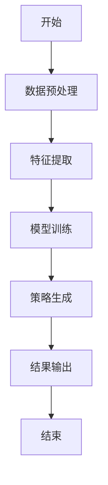
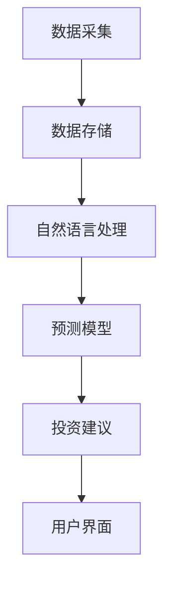
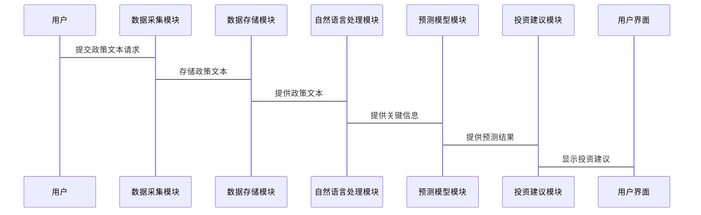

                 


# AI agents辅助价值投资者解读央行政策影响

## 关键词：AI agents，价值投资，央行政策，金融分析，机器学习

## 摘要：本文将探讨如何利用AI agents辅助价值投资者解读央行政策的影响。通过分析AI agents的技术实现、价值投资的核心理念以及央行政策的传导机制，结合具体案例和系统架构设计，详细阐述AI在金融分析中的应用，帮助投资者更好地理解和应对市场变化。

---

## 正文

### 第一部分：AI agents与价值投资基础

#### 第1章：AI agents与价值投资概述

##### 1.1 AI agents的基本概念

- **1.1.1 AI agents的定义与特点**
  AI agents（人工智能代理）是指能够感知环境并采取行动以实现特定目标的智能体。它们具备自主性、反应性、目标导向和学习能力等特点，能够在复杂环境中做出决策。

- **1.1.2 AI agents在金融领域的应用**
  在金融领域，AI agents广泛应用于股票交易、风险评估、市场预测和投资组合管理。通过实时数据处理和复杂模式识别，AI agents能够辅助投资者做出更明智的决策。

- **1.1.3 AI agents与传统金融分析的对比**
  传统金融分析依赖于人工判断和经验，而AI agents通过机器学习和大数据分析，能够更快速、准确地识别市场趋势和潜在机会。

##### 1.2 价值投资的核心理念

- **1.2.1 价值投资的定义与历史**
  价值投资是一种投资策略，旨在以低于内在价值的价格买入优质股票。该策略由本杰明·格雷厄姆提出，强调长期投资和对公司基本面的深入分析。

- **1.2.2 价值投资的关键要素**
  包括对公司财务状况、行业地位、管理层能力和市场前景的评估。投资者寻找被市场低估的股票，长期持有以实现资本增值。

- **1.2.3 价值投资与现代金融理论的结合**
  通过引入量化分析和大数据技术，价值投资正在从传统的人工分析向智能化方向转变，AI agents在这一过程中扮演着重要角色。

##### 1.3 央行政策对金融市场的影响

- **1.3.1 央行政策的主要工具与目标**
  央行通过调整利率、货币供应量和货币政策来影响经济和金融市场。这些政策直接影响企业的融资成本和投资者的收益预期。

- **1.3.2 央行政策对股市、债市的影响**
  例如，降息政策会降低借贷成本，刺激企业投资和消费，从而推高股市；而加息则会增加债券吸引力，导致股市资金外流。

- **1.3.3 央行政策的传导机制与滞后效应**
  政策效果通常需要一定时间才能在市场中体现，这种滞后效应增加了预测的难度，但AI agents可以通过历史数据分析和预测模型来减少不确定性。

#### 1.4 本章小结

本章介绍了AI agents的基本概念及其在金融领域的应用，阐述了价值投资的核心理念，并分析了央行政策对金融市场的影响。这些内容为后续的技术实现和应用奠定了基础。

---

### 第二部分：AI agents技术实现

#### 第2章：AI agents的算法原理

##### 2.1 基础算法介绍

- **2.1.1 机器学习算法概述**
  机器学习算法包括监督学习、无监督学习和强化学习。监督学习用于分类和回归问题，无监督学习用于聚类和降维，强化学习用于策略优化。

- **2.1.2 自然语言处理（NLP）算法**
  NLP技术用于分析新闻、财报等文本数据，提取情感倾向和关键词，帮助投资者理解市场情绪和行业动态。

- **2.1.3 时间序列分析算法**
  时间序列分析用于预测股票价格和经济指标的变化趋势，常用ARIMA、LSTM等模型。

##### 2.2 AI agents的核心算法

- **2.2.1 强化学习（Reinforcement Learning）**
  强化学习通过奖励机制训练AI agents在动态环境中做出最优决策。例如，使用Q-learning算法训练交易策略，以最大化投资收益。

- **2.2.2 深度学习（Deep Learning）**
  深度学习利用神经网络模型识别复杂模式，如使用LSTM网络预测股票价格走势。

- **2.2.3 联合概率图模型（Graphical Model）**
  图模型用于分析变量之间的依赖关系，帮助投资者理解宏观经济指标和市场变量的相互影响。

##### 2.3 算法流程图（Mermaid）



##### 2.4 本章小结

本章详细介绍了AI agents的核心算法，包括机器学习、NLP和时间序列分析，并通过流程图展示了算法的整体结构。

---

#### 第3章：数学模型与公式

##### 3.1 价值投资模型

- **3.1.1 市净率（P/B）计算公式**
  $$ P/B = \frac{股票价格}{每股净资产} $$
  市净率低于1通常被视为投资机会。

- **3.1.2 市盈率（P/E）计算公式**
  $$ P/E = \frac{股票价格}{每股收益} $$
  低市盈率可能意味着被低估的股票。

- **3.1.3 内在价值计算公式**
  $$ 内在价值 = \sum_{t=1}^{n} \frac{CF_t}{(1 + r)^t} $$
  其中，CF_t为第t年的现金流，r为折现率。

##### 3.2 AI agents的预测模型

- **3.2.1 LSTM模型结构**
  LSTM通过细胞状态和门控机制处理时间序列数据，适用于股票价格预测。

- **3.2.2 Q-learning算法**
  $$ Q(s, a) = r + \gamma \max_{a'} Q(s', a') $$
  其中，s为状态，a为动作，r为奖励，γ为折扣因子。

##### 3.3 本章小结

本章通过数学公式详细阐述了价值投资模型和AI agents的预测模型，为后续的系统实现提供了理论基础。

---

### 第三部分：系统分析与架构设计

#### 第4章：系统架构设计

##### 4.1 问题场景介绍

- **投资者需求**：价值投资者需要实时解读央行政策变化，评估其对目标公司的影响。

- **系统目标**：构建一个AI agent，能够实时分析政策文本，预测市场反应，并提供投资建议。

##### 4.2 系统功能设计

- **数据采集模块**：收集政策文本、市场数据和公司财报。

- **自然语言处理模块**：分析政策文本，提取关键信息。

- **预测模型模块**：基于提取的信息，预测市场反应和股票价格。

- **投资建议模块**：根据预测结果，生成投资建议。

##### 4.3 系统架构图（Mermaid）



##### 4.4 系统接口设计

- **输入接口**：接收政策文本和市场数据。

- **输出接口**：提供投资建议和预测结果。

##### 4.5 系统交互序列图（Mermaid）



##### 4.6 本章小结

本章通过系统架构设计展示了AI agent在解读央行政策中的应用，详细描述了各模块的功能和交互流程。

---

### 第四部分：项目实战

#### 第5章：项目实战

##### 5.1 环境安装

- **安装Python和相关库**：包括numpy、pandas、keras、tensorflow等。

- **安装自然语言处理工具**：如spaCy和BERT模型。

##### 5.2 系统核心实现源代码

```python
import numpy as np
from tensorflow.keras import layers, Model
from tensorflow.keras.preprocessing.text import Tokenizer

# 定义LSTM模型
def create_model(vocab_size, embedding_dim, lstm_units):
    inputs = layers.Input(shape=(None,))
    x = Tokenizer(num_words=vocab_size, oov_token=1)(inputs)
    x = layers.Embedding(vocab_size, embedding_dim)(x)
    x = layers.LSTM(lstm_units, return_sequences=True)(x)
    x = layers.Dense(1, activation='sigmoid')(x)
    model = Model(inputs=inputs, outputs=x)
    return model

# 训练模型
model = create_model(vocab_size, embedding_dim, lstm_units)
model.compile(loss='binary_crossentropy', optimizer='adam', metrics=['accuracy'])
model.fit(x_train, y_train, epochs=10, batch_size=32)
```

##### 5.3 代码应用解读与分析

- **数据预处理**：对政策文本进行分词和向量化处理。

- **模型训练**：使用LSTM网络训练文本分类模型，预测政策对市场的影响。

- **结果分析**：评估模型准确率和召回率，优化模型参数。

##### 5.4 实际案例分析

- **案例背景**：假设央行宣布降息政策，分析其对银行股的影响。

- **数据来源**：收集相关银行股的历史数据和政策文本。

- **模型预测**：使用训练好的模型预测股票价格走势。

- **结果解读**：根据预测结果调整投资策略。

##### 5.5 本章小结

本章通过实际案例展示了AI agents在解读央行政策中的应用，详细讲解了系统实现和结果分析。

---

### 第五部分：系统的优化与扩展

#### 第6章：系统优化与扩展

##### 6.1 模型优化策略

- **超参数调优**：使用网格搜索或随机搜索优化模型参数。

- **模型集成**：结合多个模型的结果，提高预测准确率。

##### 6.2 数据源扩展

- **多源数据融合**：除了政策文本，还考虑经济指标和行业数据。

- **实时数据处理**：利用流处理技术实时更新模型。

##### 6.3 系统扩展

- **多市场应用**：将系统扩展至国际金融市场，分析不同地区的政策影响。

- **多策略组合**：结合多种投资策略，提升整体收益。

##### 6.4 本章小结

本章讨论了系统的优化策略和扩展方向，为后续研究提供了方向。

---

### 第六部分：总结与展望

#### 第7章：总结与展望

##### 7.1 本章总结

本文详细探讨了AI agents在辅助价值投资者解读央行政策中的应用，从技术实现到系统设计，再到实际案例分析，全面展示了AI在金融分析中的潜力。

##### 7.2 未来展望

未来的研究可以关注以下方向：

- **更复杂模型的开发**：如Transformer架构在时间序列分析中的应用。

- **多模态数据融合**：结合文本、图像等多种数据源进行分析。

- **实时决策支持**：开发实时AI agent，提供即时投资建议。

##### 7.3 本章小结

本文总结了AI agents在金融分析中的应用，并展望了未来的发展方向。

---

## 作者：AI天才研究院 & 禅与计算机程序设计艺术

---

以上是《AI agents辅助价值投资者解读央行政策影响》的完整目录和文章内容。希望这篇文章能够帮助读者理解AI在金融分析中的应用，并为价值投资者提供新的工具和视角。

