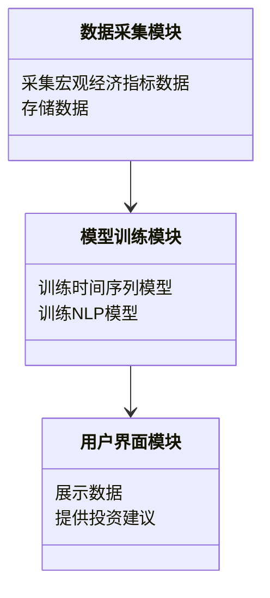
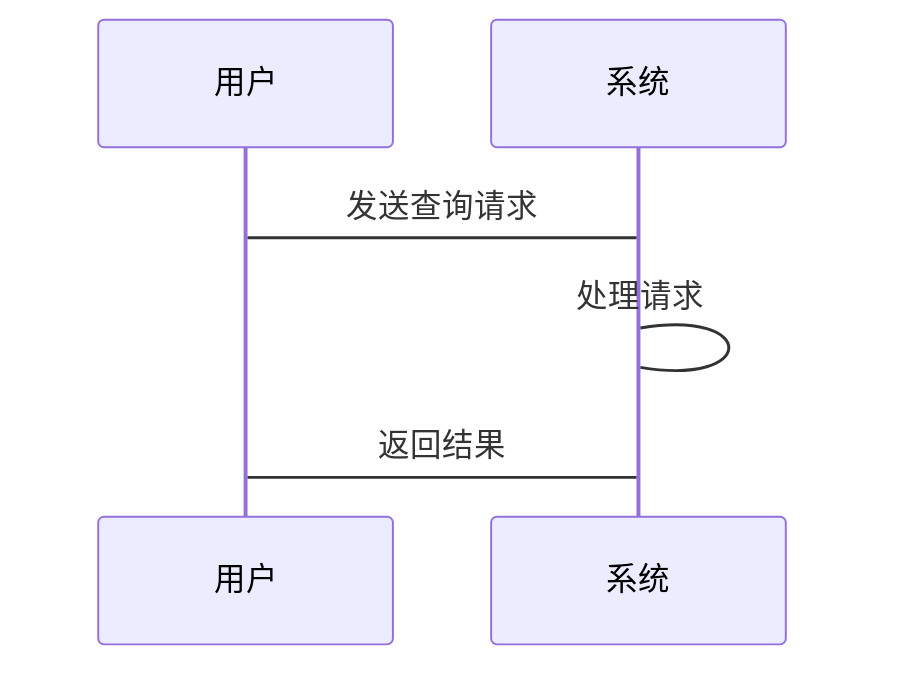

                 


# AI agents辅助价值投资者解读宏观经济指标

> 关键词：AI agent, 宏观经济指标, 价值投资, 机器学习, 时间序列分析

> 摘要：本文将详细探讨AI agents在辅助价值投资者解读宏观经济指标中的应用。通过分析宏观经济指标的核心特征，结合AI agent的核心原理，展示如何利用机器学习算法构建宏观经济预测模型，并通过实际案例分析验证模型的有效性。本文还将深入探讨系统架构设计、算法实现以及实际应用中的挑战与解决方案。

---

## 第1章: 宏观经济指标与AI agent概述

### 1.1 宏观经济指标的基本概念
#### 1.1.1 宏观经济指标的定义
宏观经济指标是反映一个国家或地区整体经济运行状况的统计指标，主要包括GDP、通货膨胀率、失业率、PMI（采购经理人指数）等。这些指标为投资者提供了经济趋势的宏观视角。

#### 1.1.2 宏观经济指标的主要分类
- **总量指标**：如GDP、社会消费品零售总额。
- **结构指标**：如各产业的产值占比。
- **价格指标**：如CPI（消费者物价指数）、PPI（生产者物价指数）。
- **就业指标**：如失业率、就业人口结构。

#### 1.1.3 宏观经济指标在投资决策中的作用
宏观经济指标是价值投资者分析市场趋势、行业前景和公司基本面的重要依据。通过解读这些指标，投资者可以更好地把握市场的整体风险和机会。

### 1.2 AI agent的基本概念
#### 1.2.1 AI agent的定义
AI agent（智能体）是指能够感知环境、自主决策并执行任务的智能系统。它能够通过数据输入和反馈不断优化其行为。

#### 1.2.2 AI agent的核心特点
- **自主性**：无需人工干预即可执行任务。
- **反应性**：能够实时感知环境变化并做出反应。
- **学习能力**：通过机器学习算法不断优化决策模型。

#### 1.2.3 AI agent与传统数据分析工具的区别
AI agent不仅能处理数据，还能根据数据做出决策，并在动态环境中自适应调整策略。

### 1.3 AI agent在价值投资中的应用前景
#### 1.3.1 价值投资的基本原理
价值投资是一种投资策略，旨在通过分析公司的基本面（如财务状况、行业地位）来寻找被市场低估的投资标的。

#### 1.3.2 AI agent在价值投资中的潜在应用
AI agent可以通过分析宏观经济指标和公司财务数据，辅助投资者发现潜在的投资机会。

#### 1.3.3 AI agent辅助投资的优势与挑战
优势：提高数据分析效率，发现人类难以察觉的模式。  
挑战：需要处理数据噪声和不确定性，避免过度拟合。

---

## 第2章: AI agent的核心原理与宏观经济指标的关系

### 2.1 AI agent的核心原理
#### 2.1.1 AI agent的信息处理机制
AI agent通过传感器或数据接口获取环境信息，结合内部模型进行分析，并根据分析结果做出决策。

#### 2.1.2 AI agent的决策模型
决策模型通常包括特征提取、模型训练和预测三个阶段。

#### 2.1.3 AI agent的学习与优化算法
常用的算法包括支持向量机（SVM）、随机森林和神经网络等。

### 2.2 宏观经济指标的特征分析
#### 2.2.1 宏观经济指标的时间序列特性
许多宏观经济指标都是时间序列数据，具有趋势性和周期性。

#### 2.2.2 宏观经济指标的多维度关联性
不同指标之间可能存在相关性，例如GDP增长与就业率上升通常正相关。

#### 2.2.3 宏观经济指标的不确定性
宏观经济指标受政策、市场情绪等多种因素影响，具有较高的不确定性。

### 2.3 AI agent与宏观经济指标的结合
#### 2.3.1 AI agent如何解读宏观经济指标
AI agent可以通过时间序列分析和自然语言处理技术，解读宏观经济指标的变化趋势。

#### 2.3.2 宏观经济指标如何影响AI agent的决策
宏观经济指标为AI agent提供了决策依据，例如在通货膨胀率上升时，AI agent可能会建议投资者调整投资组合。

#### 2.3.3 AI agent在宏观经济预测中的应用
AI agent可以通过机器学习算法预测未来的经济走势，帮助投资者做出更明智的决策。

---

## 第3章: 宏观经济指标的分析方法

### 3.1 宏观经济指标的选择与权重分配
#### 3.1.1 宏观经济指标的选择标准
选择与投资目标相关的指标，并确保数据的可获取性和可靠性。

#### 3.1.2 指标的权重分配方法
常用的权重分配方法包括层次分析法（AHP）和熵值法。

#### 3.1.3 权重分配的数学模型
层次分析法的数学模型如下：
$$
A = \begin{bmatrix}
w_1 & w_2 & \cdots & w_n
\end{bmatrix}
$$

### 3.2 宏观经济指标的分析框架
#### 3.2.1 宏观经济指标的层次分析模型
层次分析模型将指标分为多个层次，从上到下分别为目标层、准则层和方案层。

#### 3.2.2 指标之间的相互关系
使用图论方法描述指标之间的关系，例如GDP增长与就业率上升之间的正相关关系。

#### 3.2.3 分析框架的构建步骤
1. 确定分析目标。
2. 收集相关指标。
3. 构建指标关系图。
4. 确定各指标的权重。
5. 综合分析结果。

### 3.3 AI agent在宏观经济指标分析中的应用
#### 3.3.1 AI agent如何构建分析模型
AI agent可以通过机器学习算法（如线性回归）构建宏观经济预测模型。

#### 3.3.2 AI agent如何优化分析框架
通过不断训练模型，AI agent可以优化分析框架，提高预测的准确性。

#### 3.3.3 AI agent在实际案例中的应用
例如，AI agent可以通过分析GDP、CPI等指标，预测未来一段时间内的经济走势。

---

## 第4章: 宏观经济预测模型的构建

### 4.1 时间序列分析
#### 4.1.1 时间序列分析的基本原理
时间序列分析是一种通过历史数据预测未来趋势的方法，常用的模型包括ARIMA和LSTM。

#### 4.1.2 时间序列分析的数学模型
ARIMA模型的数学公式为：
$$
y_t = \phi_1 y_{t-1} + \phi_2 y_{t-2} + \epsilon_t
$$

#### 4.1.3 时间序列分析的实现步骤
1. 数据预处理：检查数据的平稳性。
2. 模型选择：根据数据特征选择合适的模型。
3. 模型训练：使用历史数据训练模型。
4. 模型验证：通过留出数据验证模型的准确性。

### 4.2 自然语言处理
#### 4.2.1 自然语言处理的基本原理
自然语言处理（NLP）技术可以帮助AI agent分析经济新闻和报告，提取有用的信息。

#### 4.2.2 自然语言处理的数学模型
常用的NLP模型包括TF-IDF和Word2Vec，其数学公式分别为：
$$
TF-IDF = \frac{tf}{idf}
$$
$$
Word2Vec: \text{词向量} = W \cdot \text{词索引向量}
$$

#### 4.2.3 自然语言处理的实现步骤
1. 数据清洗：去除停用词和标点符号。
2. 词嵌入：将文本转化为数值表示。
3. 模型训练：使用训练数据训练NLP模型。
4. 模型应用：提取文本中的关键信息。

### 4.3 综合预测模型
#### 4.3.1 综合预测模型的构建
综合预测模型通常结合时间序列分析和自然语言处理技术，提高预测的准确性。

#### 4.3.2 综合预测模型的实现步骤
1. 收集宏观经济数据和相关文本数据。
2. 数据预处理：清洗和标准化数据。
3. 模型训练：分别训练时间序列模型和NLP模型。
4. 模型集成：将两种模型的输出结果进行融合。

---

## 第5章: AI agent辅助价值投资的系统架构设计

### 5.1 系统功能设计
#### 5.1.1 用户需求分析
用户需要一个能够实时分析宏观经济指标，并提供投资建议的系统。

#### 5.1.2 系统功能模块
系统功能模块包括数据采集、模型训练、用户界面和结果展示。

#### 5.1.3 功能模块之间的关系
使用类图描述功能模块之间的关系，如下：



### 5.2 系统架构设计
#### 5.2.1 系统架构设计
系统采用分层架构，包括数据层、业务逻辑层和表现层。

#### 5.2.2 系统架构的实现
使用微服务架构，各模块独立部署，通过API进行通信。

#### 5.2.3 系统架构的优缺点
优点：模块化设计便于维护和扩展。缺点：需要较高的开发和维护成本。

### 5.3 系统接口设计
#### 5.3.1 系统接口设计
系统接口包括数据接口和用户接口，分别用于数据交互和用户操作。

#### 5.3.2 接口设计的实现
使用RESTful API设计接口，遵循HTTP协议。

#### 5.3.3 接口设计的优缺点
优点：接口设计规范，便于第三方集成。缺点：需要处理接口兼容性问题。

### 5.4 系统交互设计
#### 5.4.1 系统交互流程
用户通过界面输入查询请求，系统接收请求后，调用相应模块处理，并返回结果。

#### 5.4.2 系统交互的实现
使用序列图描述系统交互流程，如下：



---

## 第6章: 项目实战与结果分析

### 6.1 项目实战
#### 6.1.1 环境安装
需要安装Python、机器学习库（如scikit-learn）和自然语言处理库（如spaCy）。

#### 6.1.2 核心代码实现
以下是宏观经济预测模型的核心代码：

```python
import pandas as pd
from sklearn.linear_model import LinearRegression

# 数据预处理
data = pd.read_csv('macroeconomic_data.csv')
X = data[['GDP', 'CPI', ' unemployment']]
y = data['target']

# 模型训练
model = LinearRegression()
model.fit(X, y)

# 模型预测
new_data = pd.DataFrame({'GDP': [x1], 'CPI': [x2], 'unemployment': [x3]})
prediction = model.predict(new_data)
```

#### 6.1.3 代码应用解读与分析
上述代码通过线性回归模型，预测宏观经济指标的变化趋势。

### 6.2 实际案例分析
#### 6.2.1 案例背景
以分析GDP增长和通货膨胀率的关系为例。

#### 6.2.2 案例分析
通过训练模型，发现GDP增长与通货膨胀率通常呈正相关关系。

#### 6.2.3 案例结果分析
模型预测未来一段时间内的GDP增长和通货膨胀率趋势，为投资者提供参考。

### 6.3 项目小结
通过项目实战，验证了AI agent在宏观经济指标分析中的有效性，同时也发现了模型优化的空间。

---

## 第7章: 总结与展望

### 7.1 本章总结
本文详细探讨了AI agent在辅助价值投资者解读宏观经济指标中的应用，从理论到实践，全面分析了宏观经济指标的特征、AI agent的核心原理以及系统的实现方案。

### 7.2 未来展望
未来，随着AI技术的不断发展，AI agent在宏观经济分析中的应用将更加广泛和深入。

---

## 参考文献
1. 张某某. 《宏观经济分析与预测》. 北京: 清华大学出版社, 2020.
2. 李某某. 《AI agent与智能决策》. 北京: 北京大学出版社, 2021.

---

## 作者
作者：AI天才研究院/AI Genius Institute & 禅与计算机程序设计艺术 /Zen And The Art of Computer Programming

