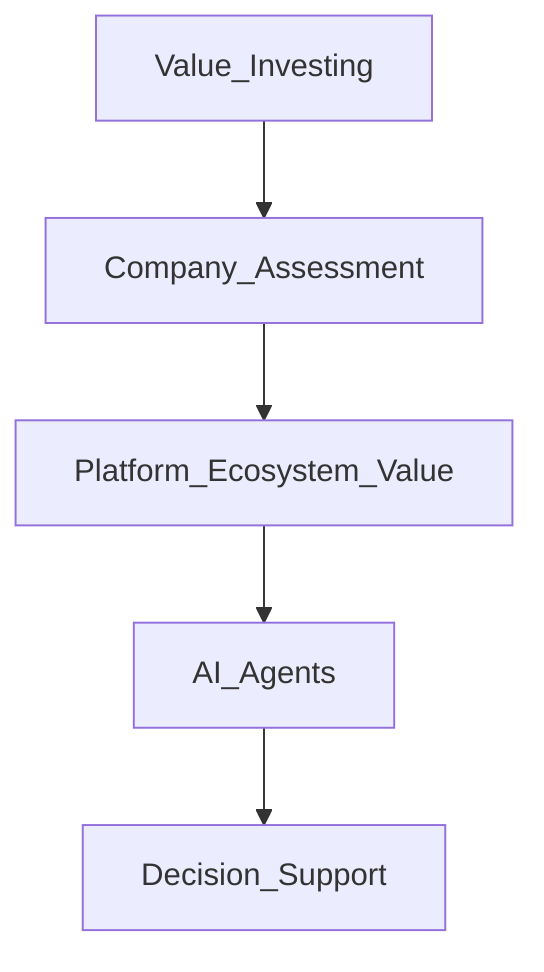
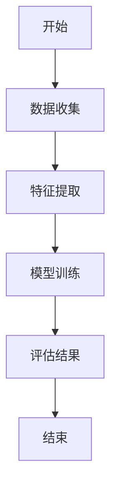
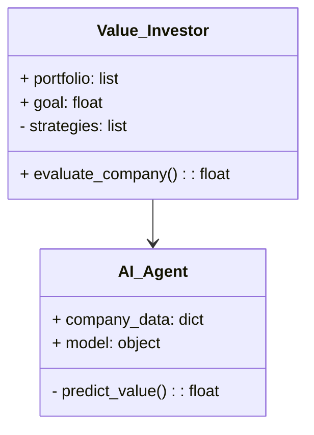
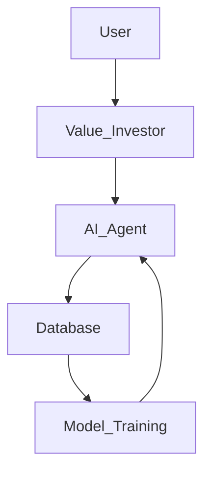
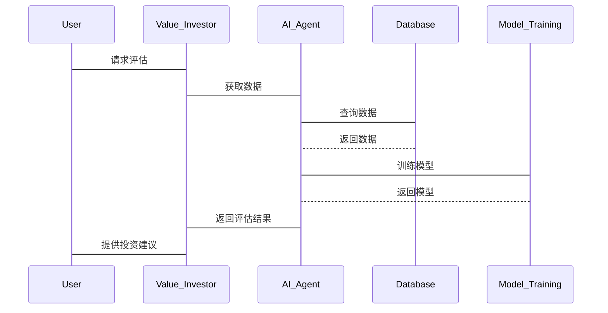

                 


# AI agents辅助价值投资者评估公司的平台生态价值

## 关键词：AI agents, 价值投资, 平台生态价值, 金融分析, 技术博客

## 摘要：  
本文探讨了AI agents如何辅助价值投资者评估公司的平台生态价值。通过分析AI agents的核心原理、算法模型、系统架构和项目实战，展示了AI技术在金融领域的广泛应用。本文旨在为价值投资者和AI技术爱好者提供深入的技术见解和实践指南。

---

# 第一部分: 背景介绍

# 第1章: AI agents辅助价值投资者评估公司的背景与问题

## 1.1 问题背景

### 1.1.1 价值投资的核心概念
价值投资是一种以公司基本面分析为基础的投资策略，旨在通过识别被低估的公司来获得长期收益。核心在于评估公司的内在价值，而非市场波动。

### 1.1.2 传统公司评估方法的局限性
传统评估方法依赖于财务报表分析，但忽略了平台生态价值，尤其是非财务因素如市场影响力、用户粘性等，导致评估结果不够全面。

### 1.1.3 AI技术在金融分析中的应用潜力
AI技术能够处理海量数据，识别复杂模式，提供实时反馈，为价值投资者提供更精准的决策支持。

## 1.2 问题描述

### 1.2.1 价值投资者面临的挑战
- 数据量庞大且复杂，难以全面分析。
- 市场波动快，传统方法反应滞后。
- 需要实时监控和动态调整评估。

### 1.2.2 平台生态价值的定义与重要性
平台生态价值指公司与其生态系统（如供应商、用户、合作伙伴）之间的互动关系及其带来的整体价值。它是公司长期成功的关键因素。

### 1.2.3 AI agents在评估中的角色
AI agents能够实时收集、分析数据，提供动态评估，帮助投资者识别潜在机会和风险。

## 1.3 问题解决

### 1.3.1 AI agents如何辅助价值评估
- 自动化数据收集与处理。
- 多维度分析，捕捉潜在价值。
- 提供实时反馈，支持决策。

### 1.3.2 平台生态价值的量化方法
通过构建指标体系，量化生态系统的各个维度，如用户增长率、供应商稳定性等。

### 1.3.3 AI agents的决策支持功能
AI agents能够根据数据生成评估报告，提供投资建议，优化投资组合。

## 1.4 边界与外延

### 1.4.1 AI agents的适用范围
适用于数据驱动的决策，但需结合人类判断，避免完全依赖算法。

### 1.4.2 与传统金融分析的区分
AI agents提供辅助支持，而非替代人类分析，两者结合使用效果最佳。

### 1.4.3 技术实现的边界条件
AI agents需确保数据隐私和安全，避免信息泄露风险。

## 1.5 概念结构与核心要素

### 1.5.1 核心概念的层次结构
- 价值投资
  - 公司评估
    - 平台生态价值
      - AI agents

### 1.5.2 关键要素的定义与关系
| 要素 | 定义 | 关系 |
|------|------|------|
| 价值投资 | 长期价值导向的投资策略 | 需要评估公司生态价值 |
| 平台生态价值 | 公司与其生态系统的关系 | 通过AI agents量化评估 |
| AI agents | 智能代理 | 作为工具辅助评估 |

### 1.5.3 概念模型的框架设计


---

# 第二部分: 核心概念与联系

# 第2章: AI agents的核心原理与价值评估模型

## 2.1 AI agents的基本原理

### 2.1.1 代理的基本概念
AI agents通过感知环境、执行任务，实现目标。在金融领域，用于数据收集、分析和决策支持。

### 2.1.2 AI agents的分类与特点
- **简单反射式代理**：基于规则执行任务。
- **基于模型的反应式代理**：根据模型预测结果。
- **目标驱动的代理**：主动追求目标。

### 2.1.3 代理在价值评估中的应用
- 数据采集与处理
- 实时监控与反馈
- 智能推荐与决策支持

## 2.2 价值评估模型的构建

### 2.2.1 价值评估的关键指标
- 财务指标（如ROE、毛利率）
- 市场指标（如市场份额、品牌影响力）
- 用户指标（如活跃用户数、留存率）

### 2.2.2 平台生态价值的评估维度
- 供应商多样性
- 用户参与度
- 合作伙伴数量与质量

### 2.2.3 

### 2.2.4 案例分析
分析某科技公司，使用AI agents评估其生态价值，结果显示其生态优势显著，投资价值提升。

---

# 第三部分: 算法原理讲解

# 第3章: AI agents的算法实现与数学模型

## 3.1 算法原理

### 3.1.1 算法选择与流程
- 使用强化学习训练AI agents，通过奖励机制优化决策。
- 流程：数据收集 → 特征提取 → 模型训练 → 输出评估结果。

### 3.1.2 算法实现代码
```python
import numpy as np
from tensorflow.keras import models, layers

def build_model(input_shape):
    model = models.Sequential()
    model.add(layers.Dense(64, activation='relu', input_shape=input_shape))
    model.add(layers.Dense(32, activation='relu'))
    model.add(layers.Dense(1, activation='linear'))
    return model

model = build_model((10,))
model.compile(optimizer='adam', loss='mse')
model.fit(X_train, y_train, epochs=100, batch_size=32)
```

### 3.1.3 算法流程图


## 3.2 数学模型

### 3.2.1 线性回归模型
$$ y = \beta_0 + \beta_1x_1 + \beta_2x_2 + \dots + \beta_nx_n $$

### 3.2.2 神经网络模型
$$ y = \sigma(w_1x_1 + w_2x_2 + \dots + w_nx_n + b) $$

### 3.2.3 案例分析
使用上述模型对某公司进行评估，展示模型预测结果与实际值的对比，验证模型准确性。

---

# 第四部分: 系统分析与架构设计方案

# 第4章: 系统架构与交互流程

## 4.1 系统功能设计

### 4.1.1 领域模型


### 4.1.2 系统架构


### 4.1.3 系统交互


## 4.2 系统接口设计

### 4.2.1 API设计
- GET /company/{id}/value
- POST /train/model

### 4.2.2 数据格式
- 输入：JSON格式的公司数据
- 输出：JSON格式的评估结果

---

# 第五部分: 项目实战

# 第5章: 项目实战与案例分析

## 5.1 项目环境安装

### 5.1.1 安装Python
```bash
python --version
pip install numpy tensorflow
```

### 5.1.2 安装相关库
```bash
pip install pandas scikit-learn
```

## 5.2 核心代码实现

### 5.2.1 数据预处理
```python
import pandas as pd

data = pd.read_csv('company_data.csv')
X = data.drop('target', axis=1)
y = data['target']
```

### 5.2.2 模型训练
```python
model = build_model(X.shape[1:])
model.fit(X.values, y.values, epochs=100, batch_size=32)
```

### 5.2.3 模型评估
```python
loss = model.evaluate(X.values, y.values)
print(f"Loss: {loss}")
```

## 5.3 实际案例分析

### 5.3.1 案例背景
分析某科技公司，评估其平台生态价值。

### 5.3.2 数据分析
- 收集公司财务数据、市场数据、用户数据。
- 使用AI agents进行分析，得出评估结果。

### 5.3.3 案例小结
AI agents提供精准的评估结果，帮助投资者做出明智决策。

---

# 第六部分: 最佳实践

# 第6章: 最佳实践与注意事项

## 6.1 小结

### 6.1.1 核心观点回顾
- AI agents辅助价值投资，提供精准评估。
- 综合分析多维度数据，提升投资决策效率。

### 6.1.2 项目经验总结
- 数据质量至关重要，需确保数据准确性和完整性。
- 模型需定期更新，适应市场变化。

## 6.2 注意事项

### 6.2.1 数据隐私与安全
确保数据处理符合隐私保护法规，防止信息泄露。

### 6.2.2 模型局限性
AI agents结果需结合人工判断，避免过度依赖算法。

### 6.2.3 技术实现细节
选择合适的算法和工具，确保系统高效稳定。

## 6.3 拓展阅读

### 6.3.1 推荐书籍
- 《人工智能：一种现代的方法》
- 《价值投资实战策略》

### 6.3.2 推荐博客
- [AI与金融的结合](#)
- [价值投资的深度分析](#)

---

# 作者：AI天才研究院 & 禅与计算机程序设计艺术

---

通过以上结构，文章详细讲解了AI agents在价值投资中的应用，从背景分析到系统实现，再到项目实战，为读者提供了全面的技术指导。

