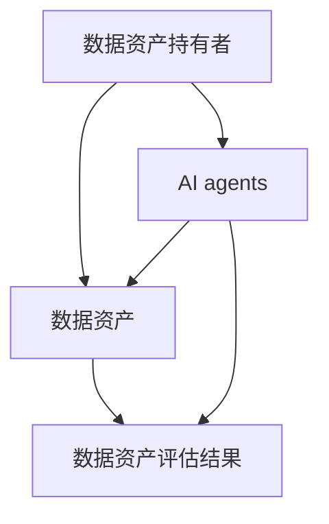
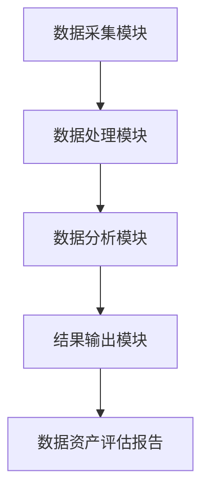

                 


---

# AI agents辅助价值投资者评估公司的数据资产价值

> 关键词：AI agents, 数据资产, 价值投资者, 数据资产评估, 金融投资

> 摘要：本文探讨了如何利用AI agents辅助价值投资者评估公司的数据资产价值。通过分析数据资产的核心概念、评估模型、系统架构及实际案例，展示了AI技术在金融投资中的应用潜力，为价值投资者提供了新的工具和视角。

---

## # 第1章: 数据资产价值评估的背景与意义

### ## 1.1 数据资产的定义与特征

#### ### 1.1.1 数据资产的定义
数据资产是指企业拥有或控制的、能够为企业带来经济利益的数据资源。这些数据可以是结构化或非结构化的，包括客户信息、交易记录、市场数据等。

#### ### 1.1.2 数据资产的特征
- **可量化性**：数据资产的价值可以通过特定的指标进行评估。
- **可扩展性**：数据资产可以被多个业务部门或外部投资者复用。
- **动态性**：数据资产的价值会随着时间、市场环境和技术进步而变化。

#### ### 1.1.3 数据资产的重要性
数据资产是企业核心竞争力的一部分，尤其是在数字化转型的今天，数据驱动的决策越来越重要。

---

### ## 1.2 价值投资者的核心需求

#### ### 1.2.1 价值投资的基本原理
价值投资是一种投资策略，通过分析企业的基本面，寻找被市场低估的投资标的。

#### ### 1.2.2 数据资产在价值评估中的作用
数据资产可以帮助投资者更全面地评估企业的价值，尤其是在数据驱动的行业中。

#### ### 1.2.3 传统评估方法的局限性
传统评估方法通常忽略了数据资产的无形价值，导致评估结果不够准确。

---

### ## 1.3 AI agents在数据资产评估中的作用

#### ### 1.3.1 AI agents的基本概念
AI agents是具有感知和决策能力的智能体，能够通过数据驱动的方法完成特定任务。

#### ### 1.3.2 AI agents在金融领域的应用
AI agents可以用于市场分析、风险评估、投资组合优化等领域。

#### ### 1.3.3 AI agents辅助价值评估的优势
AI agents能够快速处理海量数据，提供实时的资产评估结果，帮助投资者做出更明智的决策。

---

## # 第2章: 数据资产价值评估的核心概念

### ## 2.1 数据资产的分类与属性

#### ### 2.1.1 数据资产的分类
- **结构化数据**：如数据库中的表格数据。
- **非结构化数据**：如文本、图像、视频等。

#### ### 2.1.2 数据资产的生命周期
数据资产从生成、存储、处理到应用，都有一个完整的生命周期。

#### ### 2.1.3 数据资产的量化维度
- **数据的完整性**：数据是否完整、准确。
- **数据的可用性**：数据是否易于访问和处理。
- **数据的商业价值**：数据是否能够为企业创造经济利益。

---

### ## 2.2 数据资产价值的影响因素

#### ### 2.2.1 数据的完整性
数据的完整性影响数据的可靠性和可用性。

#### ### 2.2.2 数据的准确性
数据的准确性是数据价值的重要体现。

#### ### 2.2.3 数据的可扩展性
数据的可扩展性决定了数据的使用范围和价值。

#### ### 2.2.4 数据的合规性
数据的合规性是数据资产合法性的保障。

---

### ## 2.3 数据资产价值评估的模型与方法

#### ### 2.3.1 常见的数据资产评估模型
- **层次分析法（AHP）**：通过权重分配进行综合评估。
- **数据价值指数法**：基于多个指标计算数据的价值指数。

#### ### 2.3.2 数据资产价值的多维度评估
数据资产的价值需要从多个维度进行综合评估，包括数据的完整性、准确性、可扩展性等。

#### ### 2.3.3 数据资产的市场价值与内在价值
市场价值是数据资产的实际交易价格，内在价值是数据资产的真实价值。

---

## # 第3章: AI agents与数据资产评估的实体关系

### ## 3.1 实体关系图

#### ### 3.1.1 数据资产持有者
数据资产持有者是拥有或控制数据资产的个人或组织。

#### ### 3.1.2 数据资产
数据资产是企业的核心资源，包括结构化和非结构化数据。

#### ### 3.1.3 数据资产评估结果
数据资产评估结果是AI agents对数据资产价值的评估结果。

---

### ## 3.2 AI agents在实体关系中的角色

#### ### 3.2.1 数据收集与处理
AI agents负责收集和处理数据资产，确保数据的完整性和准确性。

#### ### 3.2.2 数据分析与建模
AI agents通过对数据进行分析和建模，评估数据资产的价值。

#### ### 3.2.3 结果输出与反馈
AI agents将评估结果输出给数据资产持有者，并根据反馈进行优化。

---

### ## 3.3 Mermaid实体关系图



---

## # 第4章: 数据资产评估的数学模型与算法

### ## 4.1 数据资产评估的数学模型

#### ### 4.1.1 数据价值指数模型
$$ V = \sum_{i=1}^{n} w_i \cdot f_i $$
其中，$V$ 是数据价值指数，$w_i$ 是第 $i$ 个指标的权重，$f_i$ 是第 $i$ 个指标的评估值。

#### ### 4.1.2 数据资产评估的优化模型
$$ \max V = \sum_{i=1}^{n} w_i \cdot f_i $$
$$ \text{约束条件} $$

---

### ## 4.2 数据资产评估的算法实现

#### ### 4.2.1 数据预处理
- 数据清洗：去除重复数据和异常值。
- 数据转换：将数据转换为适合模型处理的形式。

#### ### 4.2.2 数据分析与建模
- 使用机器学习算法（如随机森林、神经网络）对数据进行建模。

#### ### 4.2.3 结果输出
- 生成数据资产评估报告，包括数据的价值指数、优势和劣势。

---

## # 第5章: 数据资产评估系统的架构设计

### ## 5.1 系统功能设计

#### ### 5.1.1 数据采集模块
负责收集数据资产，包括结构化和非结构化数据。

#### ### 5.1.2 数据处理模块
对数据进行清洗、转换和预处理。

#### ### 5.1.3 数据分析模块
使用机器学习算法对数据进行分析和建模。

#### ### 5.1.4 结果输出模块
生成数据资产评估报告，包括价值指数和优化建议。

---

### ## 5.2 系统架构设计



---

## # 第6章: 项目实战与案例分析

### ## 6.1 项目环境安装

#### ### 6.1.1 安装Python
```bash
python --version
pip install numpy pandas scikit-learn
```

#### ### 6.1.2 安装AI框架
```bash
pip install tensorflow scikit-learn
```

---

### ## 6.2 数据资产评估代码实现

#### ### 6.2.1 数据预处理
```python
import pandas as pd
data = pd.read_csv('data.csv')
data = data.dropna()
```

#### ### 6.2.2 数据分析与建模
```python
from sklearn.ensemble import RandomForestRegressor
model = RandomForestRegressor()
model.fit(X_train, y_train)
```

#### ### 6.2.3 结果输出
```python
importances = model.feature_importances_
print(importances)
```

---

### ## 6.3 案例分析与结果解读

#### ### 6.3.1 案例背景
某科技公司拥有大量客户数据，希望通过数据资产评估确定数据的商业价值。

#### ### 6.3.2 数据分析结果
模型评估结果显示，客户数据的价值指数为0.85，具有较高的商业价值。

---

## # 第7章: 最佳实践与注意事项

### ## 7.1 最佳实践

#### ### 7.1.1 数据隐私保护
在数据资产评估过程中，必须遵守数据隐私保护法规。

#### ### 7.1.2 数据质量管理
数据质量是数据资产评估的基础，必须重视数据的完整性和准确性。

#### ### 7.1.3 模型优化
根据评估结果不断优化模型，提高评估的准确性。

---

### ## 7.2 注意事项

#### ### 7.2.1 数据资产评估的局限性
数据资产评估结果仅供参考，不能完全替代人工判断。

#### ### 7.2.2 数据安全风险
在数据资产评估过程中，必须防范数据泄露和滥用的风险。

#### ### 7.2.3 模型的可解释性
复杂的模型可能难以解释，需要选择合适的模型以确保可解释性。

---

## # 第8章: 总结与展望

### ## 8.1 本章总结

通过本文的探讨，我们了解了AI agents在数据资产评估中的重要作用，掌握了数据资产评估的核心概念和方法。

### ## 8.2 未来展望

随着AI技术的不断发展，数据资产评估将更加精准和高效，为价值投资者提供更强大的工具。

---

作者：AI天才研究院/AI Genius Institute & 禅与计算机程序设计艺术 /Zen And The Art of Computer Programming

