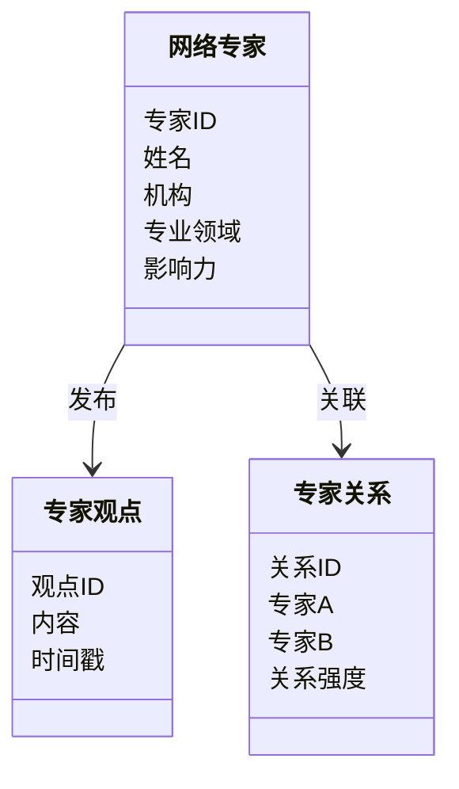
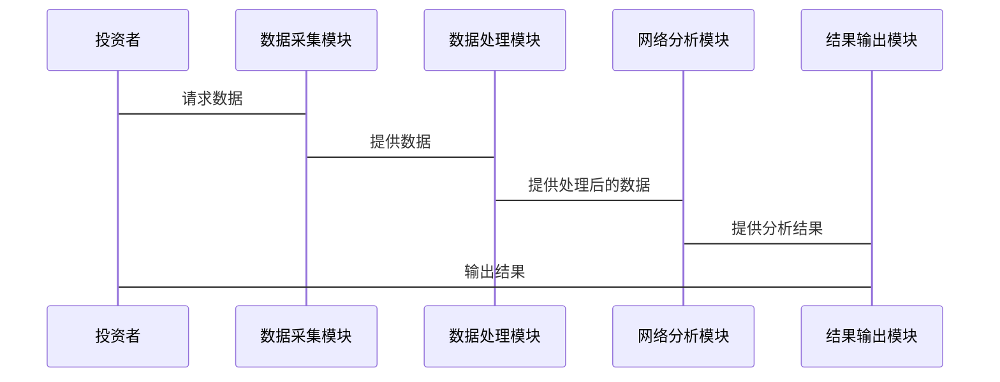

                 


# AI agents辅助价值投资者进行专家网络分析

## 关键词
AI agents, 价值投资, 专家网络分析, 算法原理, 系统架构, 项目实战

## 摘要
本文详细探讨了AI代理如何辅助价值投资者进行专家网络分析。首先，我们介绍了AI代理的核心概念和其在投资决策中的作用。接着，我们分析了专家网络分析的基本原理和常见算法。然后，我们从系统架构的角度详细设计了如何构建一个基于AI代理的专家网络分析系统，包括功能设计、架构实现和接口设计。最后，我们通过一个实际案例展示了如何将这些理论应用于投资实践，总结了项目的最佳实践和未来的发展方向。

---

# 第一部分: AI agents辅助价值投资者进行专家网络分析的背景与概念

## 第1章: 背景介绍

### 1.1 问题背景

#### 1.1.1 价值投资的核心要素
价值投资是一种长期投资策略，主要关注企业的内在价值。投资者通过分析企业的财务状况、行业地位、竞争优势等因素，寻找被市场低估的投资标的。然而，传统的方法依赖于分析师的主观判断，难以全面捕捉市场中的潜在信息。

#### 1.1.2 专家网络分析的意义
专家网络分析通过构建专家网络，分析专家之间的关系、影响力和观点，帮助投资者更好地理解市场动态。专家网络分析可以揭示行业内的关键人物、他们的观点分布以及这些观点如何影响市场。

#### 1.1.3 AI agents在投资决策中的作用
AI代理（AI agents）是一种能够自主决策和执行任务的智能体。它们可以在大量数据中快速识别模式，提取关键信息，并提供决策支持。在专家网络分析中，AI代理可以自动收集、处理和分析专家数据，帮助投资者做出更明智的投资决策。

### 1.2 问题描述

#### 1.2.1 传统专家网络分析的局限性
传统专家网络分析方法依赖于人工数据收集和分析，效率低且容易出错。此外，专家的观点可能受到主观因素的影响，导致分析结果的不准确性。

#### 1.2.2 AI agents如何解决这些问题
AI代理可以通过自然语言处理（NLP）、机器学习和图论等技术，自动化地构建和分析专家网络。AI代理可以实时监控专家的言论，识别市场趋势，并为投资者提供实时的决策支持。

#### 1.2.3 专家网络分析的边界与外延
专家网络分析的边界在于如何定义“专家”以及如何构建专家网络。外延则包括如何将专家网络分析与其他投资策略相结合，如基本面分析和技术分析。

### 1.3 核心概念与联系

#### 1.3.1 AI agents与专家网络分析的关系
AI代理是专家网络分析的技术基础，而专家网络分析则是AI代理在投资领域的具体应用。AI代理通过数据处理和分析能力，增强了专家网络分析的效率和准确性。

#### 1.3.2 实体关系图（ER图）架构
下图展示了专家网络分析的核心实体及其关系：

```mermaid
erd
    title 专家网络分析 ER 图
    网络专家 (专家ID, 姓名, 机构, 专业领域)
    专家观点 (观点ID, 内容, 时间戳)
    专家关系 (关系ID, 专家A, 专家B, 关系强度)
    网络分析结果 (分析ID, 关键专家, 趋势分析, 投资建议)
```

#### 1.3.3 核心概念原理对比分析表
下表对比了传统专家网络分析和基于AI代理的专家网络分析在效率、准确性和实时性方面的差异：

| 特性 | 传统方法 | 基于AI代理的方法 |
|------|----------|------------------|
| 效率 | 低       | 高               |
| 准确性 | 中等     | 高               |
| 实时性 | 低       | 高               |

---

# 第二部分: AI agents的核心原理与算法

## 第2章: AI agents的核心原理

### 2.1 AI agents的基本原理

#### 2.1.1 AI agents的定义与分类
AI代理是一种能够感知环境并采取行动以实现目标的智能体。根据智能水平，AI代理可以分为基于规则的代理和基于机器学习的代理。

#### 2.1.2 AI agents的决策机制
AI代理的决策机制通常包括感知、推理和行动三个步骤。感知涉及数据的收集和处理，推理涉及模式识别和预测，行动涉及输出结果。

#### 2.1.3 AI agents的自适应能力
基于机器学习的AI代理具有自适应能力，可以通过在线学习不断优化其模型，适应环境的变化。

### 2.2 AI agents的算法原理

#### 2.2.1 基于规则的AI agents
基于规则的AI代理通过预定义的规则进行决策。例如，当某个专家的影响力超过阈值时，触发警报。

#### 2.2.2 基于机器学习的AI agents
基于机器学习的AI代理通过训练数据学习专家网络的特征，例如使用聚类分析将专家分为不同的群体。

#### 2.2.3 基于强化学习的AI agents
基于强化学习的AI代理通过与环境的交互获得奖励，优化其决策策略。

## 第3章: 专家网络分析的核心算法

### 3.1 专家网络分析的基本原理

#### 3.1.1 专家网络的构建方法
专家网络的构建需要收集专家的基本信息、观点和关系。数据来源包括新闻、社交媒体和行业报告。

#### 3.1.2 专家网络的特征提取
特征提取包括专家的影响力、观点的一致性和观点的变化率。

#### 3.1.3 专家网络的分析方法
分析方法包括基于图论的网络分析和基于机器学习的模式识别。

### 3.2 专家网络分析的算法实现

#### 3.2.1 基于协同过滤的专家推荐算法
协同过滤算法通过分析专家的观点相似性，推荐相关专家。

#### 3.2.2 基于聚类分析的专家网络分群算法
聚类分析算法将专家分为不同的群体，便于分析群体的影响力。

#### 3.2.3 基于图论的专家网络关系强度计算算法
基于图论的算法计算专家之间的关系强度，例如使用PageRank算法。

---

# 第三部分: 系统分析与架构设计

## 第4章: 系统分析与架构设计方案

### 4.1 问题场景介绍

#### 4.1.1 价值投资者的需求分析
价值投资者需要实时了解行业专家的观点，以便做出投资决策。

#### 4.1.2 专家网络分析的业务流程
业务流程包括数据收集、数据处理、网络构建、分析和结果输出。

#### 4.1.3 AI agents在投资决策中的应用场景
应用场景包括实时监控专家观点、自动生成投资建议和动态调整投资组合。

### 4.2 系统功能设计

#### 4.2.1 领域模型（Domain Model）



#### 4.2.2 系统架构设计


#### 4.2.3 系统接口设计



---

# 第四部分: 项目实战

## 第5章: 项目实战

### 5.1 环境安装

#### 5.1.1 安装Python和相关库
安装Python 3.8及以上版本，并安装以下库：
- `networkx`：用于图论分析
- `node2vec`：用于网络嵌入
- `scikit-learn`：用于机器学习算法

### 5.2 系统核心实现源代码

#### 5.2.1 数据处理代码

```python
import networkx as nx
from sklearn.metrics.pairwise import cosine_similarity

# 示例数据
experts = [
    {"name": "专家A", "领域": "科技"},
    {"name": "专家B", "领域": "金融"},
    {"name": "专家C", "领域": "科技"}
]

views = [
    {"专家": "专家A", "内容": "科技行业前景乐观", "时间": "2023-10-01"},
    {"专家": "专家B", "内容": "金融行业风险增加", "时间": "2023-10-02"},
    {"专家": "专家C", "内容": "科技行业值得投资", "时间": "2023-10-03"}
]

# 构建专家网络
G = nx.Graph()
G.add_nodes_from(experts["name"])
for i in range(len(views)):
    view = views[i]
    G.add_edge(view["专家"], view["专家"] + "_view_" + str(i))

# 计算节点嵌入
# （此处省略具体实现，可以使用node2vec等库）
```

#### 5.2.2 网络分析代码

```python
# 示例聚类分析代码
from sklearn.cluster import KMeans

# 假设我们有专家的观点向量matrix
matrix = ...  # shape (n_experts, n_features)
kmeans = KMeans(n_clusters=3, random_state=0)
clusters = kmeans.fit_predict(matrix)
print(clusters)
```

### 5.3 案例分析与详细解读

#### 5.3.1 案例分析
以科技行业为例，分析三位专家的观点和影响力。专家A和专家C的观点相似，而专家B的观点与其他专家不同。通过聚类分析，我们可以将专家分为两类：科技行业专家和金融行业专家。

#### 5.3.2 结果解读
根据分析结果，科技行业的专家影响力较高，而金融行业的专家影响力较低。这表明科技行业是当前市场的热点。

### 5.4 项目小结

---

# 第五部分: 最佳实践、小结、注意事项、拓展阅读

## 第6章: 最佳实践与总结

### 6.1 最佳实践 tips
- 确保数据的质量和完整性。
- 定期更新模型以适应市场变化。
- 结合多种分析方法以提高准确性。

### 6.2 小结
本文详细介绍了AI代理在价值投资者专家网络分析中的应用。通过构建专家网络和分析专家观点，投资者可以更好地理解市场动态，做出更明智的投资决策。

### 6.3 注意事项
- 数据隐私和安全问题需要特别注意。
- 模型的解释性需要考虑投资者的理解能力。

### 6.4 拓展阅读
- 《深度学习在金融领域的应用》
- 《图论在社交网络分析中的应用》
- 《强化学习在投资决策中的应用》

---

# 作者：AI天才研究院/AI Genius Institute & 禅与计算机程序设计艺术 /Zen And The Art of Computer Programming

