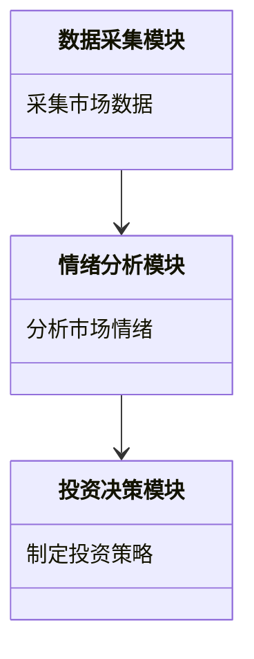
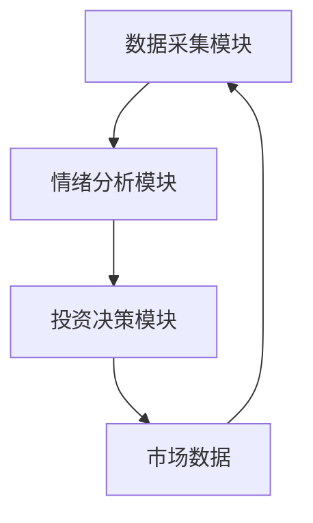
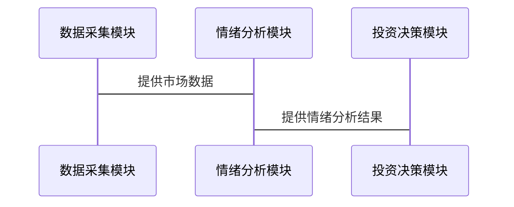

                 

# AI agents辅助价值投资者进行情绪分析

> 关键词：AI代理，价值投资，情绪分析，自然语言处理，投资决策，情感计算

> 摘要：本文详细探讨了AI代理如何辅助价值投资者进行情绪分析。通过分析情绪分析的核心算法、系统架构设计以及实际项目案例，本文旨在为投资者提供一种基于AI的辅助决策工具，帮助他们在投资决策中更好地理解和利用市场情绪。

---

# 第1章: AI代理与价值投资概述

## 1.1 问题背景与描述

### 1.1.1 投资者情绪分析的重要性
在金融市场中，投资者的情绪往往会影响市场走势。情绪分析能够帮助投资者识别市场中的乐观或悲观情绪，从而做出更明智的投资决策。例如，当市场情绪过于乐观时，投资者可能会警惕潜在的回调风险；而当市场情绪低落时，投资者可能会寻找被低估的投资机会。

### 1.1.2 AI代理在投资决策中的作用
AI代理能够通过自然语言处理和机器学习技术，从海量的市场数据中提取情绪信息。这些信息可以帮助投资者更好地理解市场的整体情绪状态，从而优化投资策略。

### 1.1.3 情绪分析在价值投资中的应用
价值投资者通常关注公司的基本面，但市场情绪同样会影响股票的价格波动。通过AI代理的情绪分析，价值投资者可以更好地把握市场情绪对股价的短期影响，从而做出更合理的投资决策。

## 1.2 问题解决与边界

### 1.2.1 情绪分析的核心问题
情绪分析的核心问题是如何从文本数据中准确提取情绪信息。这需要结合自然语言处理技术，对文本进行分词、情感分类和情感强度分析。

### 1.2.2 AI代理的边界与限制
AI代理在情绪分析中的应用存在一定的边界。例如，情绪分析无法完全替代人类的判断，特别是在处理复杂的情感语境时，AI代理可能会出现误判。

### 1.2.3 价值投资与情绪分析的结合点
价值投资与情绪分析的结合点在于利用情绪分析识别市场的短期波动，从而优化投资策略。例如，当市场情绪过于悲观时，投资者可以寻找被低估的股票进行投资。

## 1.3 概念结构与核心要素

### 1.3.1 情绪分析的定义与分类
情绪分析是指通过自然语言处理技术，从文本数据中提取情绪信息的过程。根据分析的粒度，情绪分析可以分为整体情绪分析和细粒度情绪分析。

### 1.3.2 AI代理的核心功能与属性
AI代理在情绪分析中的核心功能包括数据采集、情感分类和情感强度分析。其属性包括数据处理能力、情感分类准确性和实时性。

### 1.3.3 价值投资的关键要素与流程
价值投资的关键要素包括公司基本面分析、市场情绪分析和投资策略制定。其流程通常包括数据采集、分析与决策制定。

---

# 第2章: 核心概念与联系

## 2.1 情绪分析的原理与方法

### 2.1.1 基于自然语言处理的情感计算
情感计算是指通过自然语言处理技术，从文本中提取情感信息的过程。情感计算的核心在于识别文本中的情感倾向和情感强度。

### 2.1.2 基于机器学习的情感分析模型
基于机器学习的情感分析模型通常包括数据预处理、特征提取、模型训练和模型评估几个步骤。常用的模型包括支持向量机(SVM)和随机森林。

### 2.1.3 情感分析的特征提取与分类
情感分析的特征提取包括词袋模型和词嵌入模型。情感分类通常采用逻辑回归、SVM和神经网络等方法。

## 2.2 AI代理与价值投资的关联

### 2.2.1 AI代理在情绪分析中的角色
AI代理在情绪分析中的角色包括数据采集、情感分类和情感强度分析。它能够帮助投资者快速识别市场情绪的变化。

### 2.2.2 情绪分析对投资决策的影响
情绪分析可以帮助投资者识别市场情绪的变化，从而优化投资策略。例如，当市场情绪过于乐观时，投资者可能会减少投资。

### 2.2.3 价值投资中情绪分析的边界与适用场景
情绪分析在价值投资中的适用场景包括短期市场情绪预测和市场情绪对股价的影响分析。其边界在于情绪分析无法完全替代基本面分析。

## 2.3 情绪分析与投资决策的关系

### 2.3.1 情绪分析对市场预测的辅助作用
情绪分析可以辅助市场预测，特别是在识别市场拐点时具有重要作用。例如，当市场情绪从乐观转向悲观时，可能是市场下跌的信号。

### 2.3.2 情绪分析在风险管理中的应用
情绪分析可以帮助投资者识别市场风险，例如市场情绪过于悲观时，投资者可以减少投资以避免潜在的损失。

### 2.3.3 情绪分析对投资策略优化的贡献
情绪分析可以优化投资策略，例如通过情绪分析识别市场情绪的变化，从而动态调整投资组合。

---

# 第3章: 情绪分析的核心算法与实现

## 3.1 情绪分析的算法原理

### 3.1.1 基于规则的简单情绪分析
基于规则的情绪分析通过预定义的规则对文本进行情感分类。例如，如果文本中包含“好”、“优秀”等正面词汇，则判定为正面情感。

### 3.1.2 基于机器学习的情感分类模型
基于机器学习的情感分类模型通常采用支持向量机(SVM)和随机森林等算法。这些算法能够通过训练数据学习情感分类的特征。

### 3.1.3 基于深度学习的情感分析模型
基于深度学习的情感分析模型通常采用循环神经网络(RNN)和Transformer模型。这些模型能够更好地捕捉文本的情感信息。

## 3.2 情绪分析的数学模型

### 3.2.1 朴素贝叶斯分类器
朴素贝叶斯分类器是一种基于概率的分类算法，常用于情感分类。其数学公式如下：
$$ P(y|x) = \frac{P(x|y)P(y)}{P(x)} $$

### 3.2.2 支持向量机(SVM)模型
SVM是一种基于统计学习的分类算法，常用于情感分类。其数学公式如下：
$$ y = \text{sign}(\sum_{i=1}^{n} \alpha_i y_i x_i \cdot x + b) $$

### 3.2.3 循环神经网络(RNN)与Transformer模型
RNN和Transformer模型是基于深度学习的情感分析模型。RNN的数学公式如下：
$$ h_t = \tanh(W_h h_{t-1} + W_x x_t) $$
$$ y = W_y h_T + b $$

---

# 第4章: 系统分析与架构设计

## 4.1 系统功能设计

### 4.1.1 数据采集模块
数据采集模块负责从社交媒体、新闻网站等渠道采集市场相关的文本数据。

### 4.1.2 情绪分析模块
情绪分析模块负责对采集的文本数据进行情感分类和情感强度分析。

### 4.1.3 投资决策模块
投资决策模块根据情绪分析结果和市场数据，制定投资策略。

## 4.2 系统架构设计

### 4.2.1 领域模型类图

### 4.2.2 系统架构图

## 4.3 系统接口设计

### 4.3.1 API接口
API接口用于不同模块之间的数据传递和功能调用。

### 4.3.2 交互序列图

---

# 第5章: 项目实战

## 5.1 环境配置与数据预处理

### 5.1.1 环境配置
安装必要的Python库，如numpy、pandas、scikit-learn和transformers。

### 5.1.2 数据预处理
对文本数据进行分词、去停用词和向量化处理。

## 5.2 情绪分析模型实现

### 5.2.1 情感分类模型
使用预训练的BERT模型进行情感分类。

### 5.2.2 情感强度分析
通过回归模型预测情感强度。

## 5.3 投资策略优化

### 5.3.1 基于情绪分析的投资策略
根据市场情绪的变化动态调整投资组合。

### 5.3.2 策略表现评估
通过回测分析评估投资策略的有效性。

---

# 第6章: 总结与展望

## 6.1 最佳实践 tips
在实际应用中，投资者应结合基本面分析和情绪分析，制定更加全面的投资策略。

## 6.2 小结
本文详细探讨了AI代理如何辅助价值投资者进行情绪分析，通过算法实现和系统设计，为投资者提供了一种基于AI的辅助决策工具。

## 6.3 注意事项
投资者在使用情绪分析工具时，应关注模型的准确性和数据的及时性，避免因情绪分析误判导致的投资损失。

## 6.4 拓展阅读
建议投资者进一步阅读相关领域的学术论文和实践案例，以更好地理解和应用情绪分析技术。

---

作者：AI天才研究院 & 禅与计算机程序设计艺术

