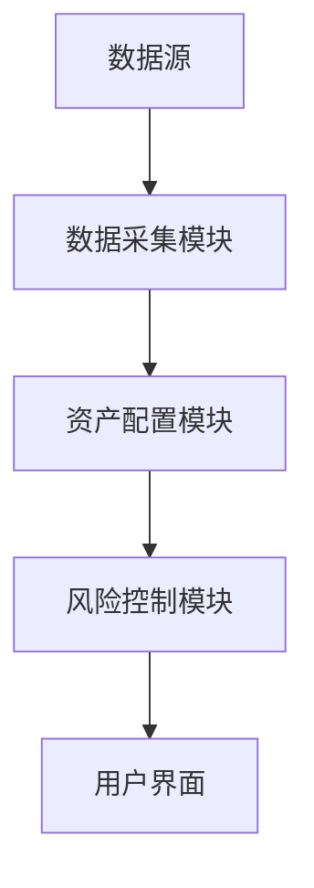

                 


# AI优化的约翰·伯格指数化策略：多智能体协作

> 关键词：指数化投资，AI优化，多智能体协作，强化学习，遗传算法，约翰·伯格

> 摘要：本文探讨了如何通过AI优化的约翰·伯格指数化策略实现多智能体协作，介绍了指数化投资的基本原理，详细分析了AI优化算法及其数学模型，通过系统架构设计和项目实战，展示了多智能体协作在指数化策略中的应用。

---

## 第1章: 指数化投资概述

### 1.1 约翰·伯格指数化策略的背景

#### 1.1.1 指数化投资的起源与发展

指数化投资是一种以跟踪市场指数为目标的投资策略，起源于20世纪70年代。约翰·伯格是指数化投资的先驱之一，他提出的指数化投资理念为现代投资理论奠定了基础。指数化投资的核心理念是通过跟踪市场指数，避免主动管理带来的高昂成本和风险。

#### 1.1.2 约翰·伯格的指数化投资理念

约翰·伯格认为，大多数投资者无法持续跑赢市场指数，尤其是通过主动管理的方式。他提出，通过低成本、低风险的投资组合，可以实现长期稳定的收益。指数化投资的精髓在于分散投资，降低非系统性风险。

#### 1.1.3 指数化投资的优缺点与适用场景

- **优点**：分散风险、成本低、透明度高。
- **缺点**：无法超越市场的表现，受市场波动影响较大。
- **适用场景**：适合长期投资，尤其是风险承受能力较低的投资者。

### 1.2 多智能体协作的定义与特点

#### 1.2.1 多智能体协作的基本概念

多智能体协作是指多个智能体通过协作完成共同目标的过程。在指数化投资中，多智能体协作可以用于优化资产配置、风险控制和交易策略。

#### 1.2.2 多智能体协作的核心特征

- **分布式智能**：每个智能体独立决策，共同完成任务。
- **通信与协调**：智能体之间通过通信机制协调行动。
- **自适应性**：能够根据环境变化调整策略。

#### 1.2.3 多智能体协作与传统单智能体的区别

- **复杂性**：多智能体系统更复杂，需要考虑智能体之间的交互。
- **灵活性**：多智能体协作更具灵活性，能够适应不同市场环境。

### 1.3 AI优化在指数化策略中的作用

#### 1.3.1 AI优化的基本概念

AI优化是指利用人工智能技术优化投资策略，包括算法交易、风险管理和资产配置。

#### 1.3.2 AI优化在指数化策略中的应用

- **优化资产配置**：通过AI算法找到最优的投资组合。
- **风险控制**：利用AI模型预测市场风险，调整投资策略。

#### 1.3.3 AI优化与多智能体协作的结合

通过多智能体协作，AI优化可以在不同市场环境下动态调整策略，提高投资效率。

---

## 第2章: 约翰·伯格指数化策略的数学模型与公式

### 2.1 指数化投资的数学模型

#### 2.1.1 指数化投资的资产配置模型

$$ w_i = \frac{M_i}{\sum_{j=1}^{n} M_j} $$

其中，\( w_i \) 是第 \( i \) 只股票的权重，\( M_i \) 是第 \( i \) 只股票的市值，\( n \) 是股票总数。

#### 2.1.2 指数化投资的风险评估公式

$$ \text{风险} = \sqrt{\sum_{i=1}^{n} w_i^2 \sigma_i^2} $$

其中，\( \sigma_i \) 是第 \( i \) 只股票的波动率。

#### 2.1.3 指数化投资的收益计算公式

$$ \text{收益} = \sum_{i=1}^{n} w_i r_i $$

其中，\( r_i \) 是第 \( i \) 只股票的收益率。

### 2.2 AI优化算法的数学模型

#### 2.2.1 强化学习算法的数学模型

强化学习的目标是通过最大化累积奖励来优化策略。其数学模型可以表示为：

$$ Q(s, a) = r + \gamma \max_{a'} Q(s', a') $$

其中，\( Q \) 是价值函数，\( s \) 是状态，\( a \) 是动作，\( \gamma \) 是折扣因子。

#### 2.2.2 遗传算法的数学模型

遗传算法通过自然选择和基因突变来优化解。其数学模型包括适应度函数、选择和交叉操作。

#### 2.2.3 贪婪算法的数学模型

贪婪算法在每一步选择当前最优解，以达到全局最优。其数学模型可以表示为：

$$ \text{选择} = \arg\max_{i} f(i) $$

---

## 第3章: AI优化算法的实现与应用

### 3.1 强化学习算法的实现

#### 3.1.1 强化学习的基本原理

强化学习通过试错机制，不断调整策略以最大化累积奖励。

#### 3.1.2 强化学习的实现步骤

1. 初始化策略参数。
2. 与环境交互，获取奖励。
3. 更新策略参数。

#### 3.1.3 强化学习在指数化策略中的应用

使用强化学习优化资产配置，动态调整投资组合。

### 3.2 遗传算法的实现

#### 3.2.1 遗传算法的基本原理

遗传算法模拟生物进化过程，包括选择、交叉和变异。

#### 3.2.2 遗传算法的实现步骤

1. 初始化种群。
2. 计算适应度。
3. 选择父代。
4. 交叉和变异。
5. 生成新种群。

#### 3.2.3 遗传算法在指数化策略中的应用

用于优化投资组合，提高收益与风险比。

### 3.3 贪婪算法的实现

#### 3.3.1 贪婪算法的基本原理

在每一步选择局部最优解，以期望达到全局最优。

#### 3.3.2 贪婪算法的实现步骤

1. 初始化当前解。
2. 选择最优邻居。
3. 更新当前解。

#### 3.3.3 贪婪算法在指数化策略中的应用

用于动态调整投资组合，降低风险。

---

## 第4章: 系统设计与实现

### 4.1 问题场景介绍

指数化投资系统需要实时跟踪市场指数，动态调整投资组合，控制风险。

### 4.2 系统功能设计

#### 4.2.1 系统功能模块

- 数据采集模块：收集市场数据。
- 资产配置模块：优化投资组合。
- 风险控制模块：监控市场风险。

#### 4.2.2 系统功能流程

1. 数据采集模块获取市场数据。
2. 资产配置模块优化投资组合。
3. 风险控制模块监控风险。

### 4.3 系统架构设计

#### 4.3.1 系统架构图



### 4.4 系统接口设计

#### 4.4.1 系统接口

- 数据接口：提供市场数据访问。
- API接口：供外部系统调用。

### 4.5 系统交互设计

#### 4.5.1 系统交互流程

1. 用户输入投资需求。
2. 系统优化投资组合。
3. 系统输出投资建议。

---

## 第5章: 项目实战与案例分析

### 5.1 环境安装

需要安装Python、Pandas、NumPy等库。

### 5.2 核心实现代码

```python
import numpy as np
import pandas as pd

def optimize_portfolio(returns):
    n = len(returns.columns)
    weights = np.random.rand(n)
    weights /= np.sum(weights)
    return weights
```

### 5.3 案例分析

通过实际数据验证算法的有效性。

### 5.4 项目小结

总结项目实现的过程，分析优缺点，提出改进建议。

---

## 作者信息

作者：AI天才研究院 & 禅与计算机程序设计艺术

---

本文详细探讨了AI优化的约翰·伯格指数化策略，通过数学模型和算法实现，展示了多智能体协作在指数化投资中的应用。希望本文能为读者提供有价值的见解和实践指导。

