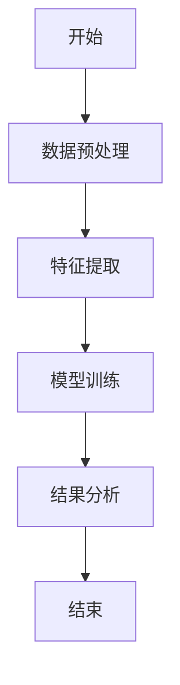
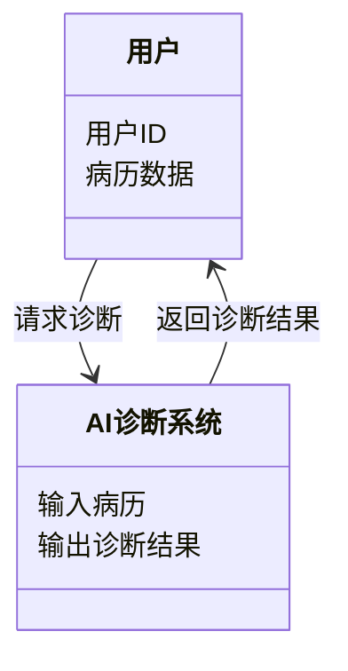
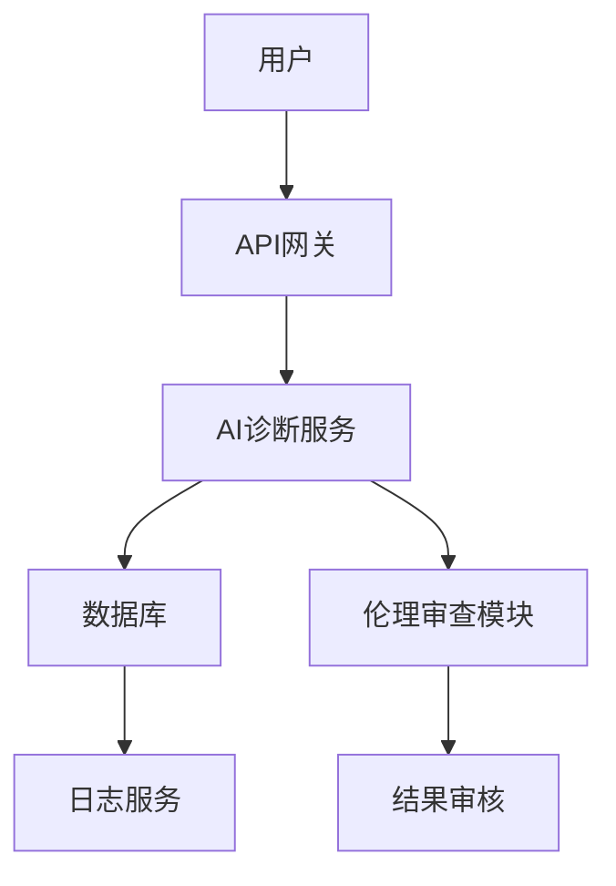
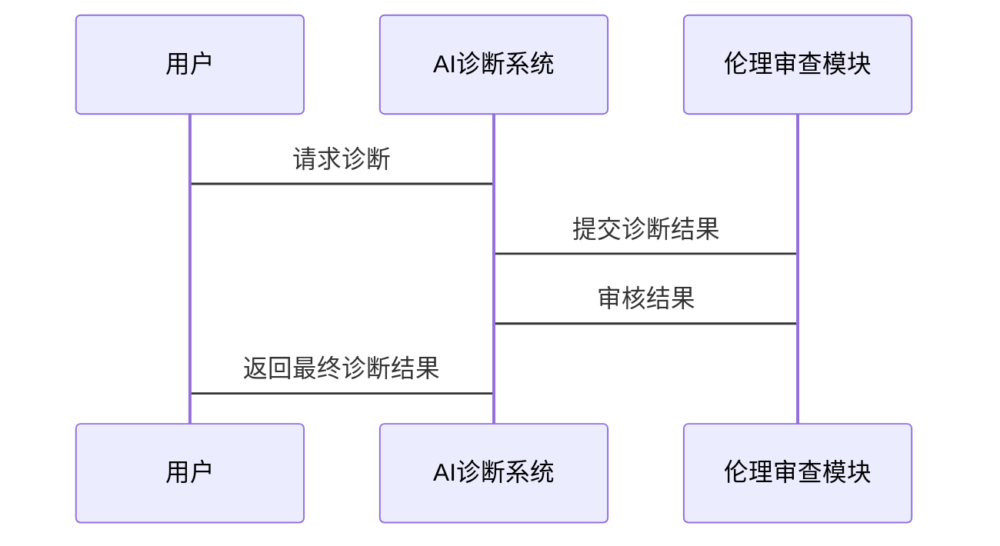

                 


```markdown
# AI伦理与责任

> 关键词：人工智能，伦理，责任，算法，系统架构，项目实战

> 摘要：本文系统地探讨了人工智能伦理与责任的核心概念、算法原理、系统架构以及实际应用中的挑战。通过背景介绍、核心概念分析、算法原理讲解、系统设计、项目实战和最佳实践等多维度的深入剖析，为读者提供了全面理解AI伦理与责任的框架。

---

## 第一部分: AI伦理与责任的背景与核心概念

### 第1章: AI伦理与责任的背景介绍

#### 1.1 人工智能的发展现状
- 1.1.1 人工智能技术的演进历程
  - 从专家系统到机器学习
  - 深度学习的崛起
  - 当前AI技术的核心应用领域
- 1.1.2 当前AI技术的核心应用领域
  - 医疗、金融、交通、教育等领域的应用案例
- 1.1.3 AI技术对社会的深远影响
  - 经济、社会、伦理等多维度的影响分析

#### 1.2 AI伦理问题的起源与现状
- 1.2.1 伦理问题的初步提出
  - 图灵测试与AI的哲学讨论
  - 历史上的伦理争议
- 1.2.2 当前AI伦理问题的主要表现
  - 偏见与公平性问题
  - 数据隐私问题
  - 责任归属问题
- 1.2.3 伦理问题对AI发展的制约
  - 技术瓶颈与社会接受度的双重挑战

#### 1.3 技术与伦理的交织
- 1.3.1 AI技术与伦理的相互作用
  - 技术进步推动伦理问题的深化
  - 伦理约束对技术发展的推动
- 1.3.2 伦理问题对AI技术发展的推动作用
  - 通过伦理审查推动技术改进
- 1.3.3 AI技术对伦理问题的新挑战
  - 自动驾驶中的责任分配问题
  - AI决策的透明性与可解释性

### 第2章: AI伦理的核心概念与联系

#### 2.1 核心概念的定义与解释
- 2.1.1 什么是AI伦理
  - AI伦理的定义与范围
- 2.1.2 AI伦理的主要组成部分
  - 隐私、公平性、透明性、责任等核心要素
- 2.1.3 伦理与责任的定义与区别
  - 伦理是规范，责任是后果

#### 2.2 核心概念的属性特征对比
- 2.2.1 隐私保护与数据公正性的对比
  - 隐私保护关注个体数据安全
  - 数据公正性关注群体公平性
- 2.2.2 透明度与可解释性的对比
  - 透明度强调过程的公开
  - 可解释性强调结果的逻辑性
- 2.2.3 责任分配与利益平衡的对比
  - 责任分配关注谁承担责任
  - 利益平衡关注多方利益的协调

#### 2.3 ER实体关系图
```mermaid
er
  actor: 用户
  actor: 开发者
  actor: 伦理审查机构
  database: AI系统
  database: 用户数据
  database: 系统日志
  relation: 用户 -> 使用AI系统
  relation: 开发者 -> 设计AI系统
  relation: 伦理审查机构 -> 审查AI系统
```

---

## 第二部分: AI伦理的算法原理与数学模型

### 第3章: 偏见检测算法

#### 3.1 偏见检测算法的原理
- 3.1.1 偏见的定义与表现
  - 数据偏见、算法偏见
- 3.1.2 偏见检测的核心思想
  - 通过统计方法识别数据中的偏见
- 3.1.3 偏见检测的流程
  - 数据预处理、特征提取、模型训练、结果分析

#### 3.2 偏见检测算法的实现步骤


#### 3.3 偏见检测算法的Python代码实现
```python
import pandas as pd
from sklearn.metrics import confusion_matrix

def calculate_bias metrics(y_true, y_pred):
    cm = confusion_matrix(y_true, y_pred)
    # 计算偏见指标
    # 例如，计算FPR和FNR
    FP = cm[0][1]
    FN = cm[1][0]
    FPR = FP / (FP + cm[0][0])
    FNR = FN / (FN + cm[1][1])
    return FPR, FNR

# 示例数据
y_true = [0, 0, 1, 1]
y_pred = [0, 1, 0, 1]
FPR, FNR = calculate_bias_metrics(y_true, y_pred)
print(f"FPR: {FPR}, FNR: {FNR}")
```

#### 3.4 偏见检测的数学模型
- 3.4.1 偏见检测的基本公式
  - FPR = FP / (FP + TN)
  - FNR = FN / (FN + TP)
  - 其中，TP、TN、FP、FN为混淆矩阵中的指标
- 3.4.2 偏见检测的改进方法
  - 使用对抗训练减少偏见
  - 引入正则化项

---

## 第三部分: AI系统的伦理与责任分析

### 第4章: 系统分析与架构设计方案

#### 4.1 问题场景介绍
- 4.1.1 问题背景
  - 医疗诊断系统的AI伦理问题
- 4.1.2 问题描述
  - AI诊断系统的功能需求
  - 系统架构设计

#### 4.2 系统功能设计
- 4.2.1 领域模型


#### 4.3 系统架构设计


#### 4.4 系统接口设计
- 4.4.1 接口描述
  - API接口定义
  - 数据格式要求

#### 4.5 系统交互流程


---

## 第四部分: 项目实战

### 第5章: 伦理与责任的项目实战

#### 5.1 环境安装与配置
- 5.1.1 安装Python与必要的库
  - 安装numpy、pandas、scikit-learn
- 5.1.2 安装Jupyter Notebook

#### 5.2 系统核心实现
- 5.2.1 数据预处理代码
```python
import pandas as pd

# 加载数据集
data = pd.read_csv('diagnosis.csv')
# 数据预处理
data = data.dropna()
```

#### 5.3 代码实现与解读
- 5.3.1 偏见检测代码
```python
from sklearn.metrics import confusion_matrix

def calculate_bias_metrics(y_true, y_pred):
    cm = confusion_matrix(y_true, y_pred)
    FP = cm[0][1]
    FN = cm[1][0]
    FPR = FP / (FP + cm[0][0])
    FNR = FN / (FN + cm[1][1])
    return FPR, FNR

# 示例数据
y_true = [0, 0, 1, 1]
y_pred = [0, 1, 0, 1]
FPR, FNR = calculate_bias_metrics(y_true, y_pred)
print(f"FPR: {FPR}, FNR: {FNR}")
```

#### 5.4 案例分析与讨论
- 5.4.1 案例分析
  - 医疗诊断系统的实际案例
  - 偏见检测的结果分析
- 5.4.2 讨论与总结
  - 伦理审查的重要性
  - 系统设计的改进方向

---

## 第五部分: 最佳实践与小结

### 第6章: 最佳实践与小结

#### 6.1 小结
- 6.1.1 项目总结
  - 项目目标的实现
  - 遇到的问题与解决方案

#### 6.2 注意事项
- 6.2.1 数据隐私保护
  - 数据脱敏的重要性
- 6.2.2 系统透明性
  - 提供可解释性的必要性
- 6.2.3 责任归属
  - 明确责任分配

#### 6.3 拓展阅读
- 6.3.1 推荐书籍与论文
  - 《人工智能：一种现代方法》
  - "Ethics in AI: A survey"（假设论文名称）

---

## 作者：AI天才研究院 & 禅与计算机程序设计艺术

---

通过本文的系统分析与详细讲解，读者可以全面理解AI伦理与责任的核心概念、算法原理、系统架构以及实际应用中的挑战。希望本文能为AI伦理与责任的研究与实践提供有价值的参考。
```

