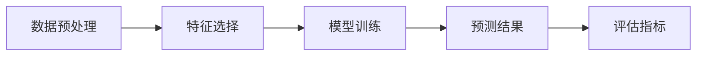

                 


# AI助力巴菲特式护城河分析：多维度评估竞争优势

## 关键词：AI技术、巴菲特投资理念、护城河分析、企业竞争优势、多维度评估

## 摘要：本文结合巴菲特的价值投资理念，探讨如何利用人工智能技术进行护城河分析，通过多维度的企业竞争优势评估，构建智能化的分析框架，帮助企业识别和强化竞争优势，打造可持续的商业壁垒。

---

# 第一部分：AI助力巴菲特式护城河分析的背景与基础

## 第1章：巴菲特投资理念与护城河分析

### 1.1 投资大师巴菲特的核心理念

#### 1.1.1 巴菲特的价值投资理论
- **价值投资**：巴菲特强调以低于内在价值的价格购买优质资产，长期持有，等待其价值的实现。
- **护城河概念**：护城河是企业竞争优势的核心，能够防止竞争对手侵蚀市场份额，确保企业长期盈利。

#### 1.1.2 护城河在企业竞争优势中的作用
- **市场地位**：强大的市场地位可以为企业带来定价权和客户忠诚度。
- **竞争壁垒**：技术、品牌、网络效应等构成的竞争壁垒，使企业难以被替代。

#### 1.1.3 护城河分析的核心要素
| 核心要素 | 描述 | 示例 |
|----------|------|------|
| 成本优势 | 低成本生产模式 | 沃尔玛的供应链管理 |
| 品牌忠诚度 | 强大品牌影响力 | 可口可乐的品牌价值 |
| 网络效应 | 用户越多，价值越高 | 微信的社交网络 |

---

## 第2章：AI技术在商业分析中的应用

### 2.1 人工智能与商业分析的结合

#### 2.1.1 AI在企业竞争优势分析中的优势
- **数据处理能力**：AI可以处理海量数据，识别潜在模式。
- **预测能力**：通过机器学习模型预测企业未来表现。
- **实时分析**：实时监控市场动态，快速响应变化。

#### 2.1.2 数据驱动的商业决策新范式
- **数据采集**：从多个来源获取数据，如财报、新闻、社交媒体。
- **数据分析**：利用AI技术进行深度分析，提取关键指标。
- **决策支持**：基于分析结果，制定投资策略。

---

# 第二部分：护城河分析的核心概念与AI模型

## 第3章：护城河分析的多维度框架

### 3.1 护城河的多维度评估模型

#### 3.1.1 市场地位与竞争壁垒
- **市场占有率**：企业在市场中的份额占比。
- **竞争对手分析**：评估竞争对手的优势和劣势。

#### 3.1.2 财务表现与盈利能力
- **ROE（净资产收益率）**：衡量企业盈利能力的重要指标。
- **现金流分析**：评估企业的财务健康状况。

#### 3.1.3 管理团队与组织能力
- **管理团队稳定性**：领导层的稳定性和经验。
- **组织架构优化**：高效的组织架构能够提高运营效率。

#### 3.1.4 创新能力与技术优势
- **研发投入**：企业的研发投入占收入的比例。
- **技术专利数量**：专利数量反映技术优势。

---

## 第4章：AI驱动的护城河分析框架

### 4.1 机器学习算法在护城河分析中的应用

#### 4.1.1 线性回归模型
- **用途**：预测企业未来盈利能力。
- **公式**：$y = \beta_0 + \beta_1x + \epsilon$
- **流程图**：使用数据预处理、特征选择、模型训练等步骤。



---

# 第三部分：系统架构与技术实现

## 第5章：护城河分析系统的架构设计

### 5.1 系统功能模块划分

#### 5.1.1 数据采集模块
- **功能**：从多个数据源采集企业数据，如财报、新闻、社交媒体。
- **工具**：使用爬虫技术（如BeautifulSoup、Selenium）进行数据抓取。

#### 5.1.2 数据预处理模块
- **功能**：清洗数据，处理缺失值、异常值。
- **工具**：使用Pandas进行数据清洗和特征工程。

#### 5.1.3 模型训练与评估模块
- **功能**：训练机器学习模型，评估模型性能。
- **工具**：使用Scikit-learn进行模型训练和评估。

#### 5.1.4 结果展示与决策支持模块
- **功能**：将分析结果可视化，提供决策支持。
- **工具**：使用Matplotlib或Seaborn进行数据可视化。

---

## 第6章：系统接口与数据流设计

### 6.1 系统接口设计

#### 6.1.1 数据接口设计
- **输入接口**：接收企业数据。
- **输出接口**：返回处理后的数据。

#### 6.1.2 模型调用接口设计
- **输入接口**：接收特征数据。
- **输出接口**：返回预测结果。

#### 6.1.3 结果展示接口设计
- **输入接口**：接收模型输出。
- **输出接口**：展示分析结果。

---

# 第四部分：项目实战与案例分析

## 第7章：护城河分析项目实战

### 7.1 环境安装与配置

```python
# 环境配置
import pandas as pd
import numpy as np
from sklearn.model import RandomForestClassifier
from sklearn.metrics import accuracy_score
```

### 7.2 数据预处理与特征工程

```python
# 数据预处理
data = pd.read_csv('enterprise_data.csv')
data.dropna(inplace=True)
```

### 7.3 模型训练与评估

```python
# 训练随机森林模型
model = RandomForestClassifier(n_estimators=100)
model.fit(X_train, y_train)
y_pred = model.predict(X_test)
print("准确率:", accuracy_score(y_test, y_pred))
```

### 7.4 结果可视化与解读

```python
# 可视化代码
import matplotlib.pyplot as plt

plt.figure(figsize=(10, 6))
plt.plot(y_test, label='实际值')
plt.plot(y_pred, label='预测值')
plt.xlabel('样本数')
plt.ylabel('值')
plt.legend()
plt.show()
```

---

# 第五部分：总结与展望

## 第8章：总结与最佳实践

### 8.1 最佳实践Tips

- **数据质量**：确保数据来源可靠，处理干净。
- **模型选择**：根据问题类型选择合适的算法。
- **实时监控**：持续监控市场动态，及时调整分析模型。

### 8.2 小结

本文通过结合巴菲特的投资理念和AI技术，构建了一个多维度的护城河分析框架，展示了如何利用机器学习模型和系统架构设计，提升企业竞争优势评估的效率和准确性。

### 8.3 注意事项

- **数据隐私**：注意数据隐私和合规性。
- **模型解释性**：确保模型的可解释性，便于业务理解。
- **持续优化**：定期更新模型，适应市场变化。

### 8.4 拓展阅读

- **书籍推荐**：《巴菲特传》、《机器学习实战》。
- **技术博客**：深入学习随机森林和LSTM的应用。

---

作者：AI天才研究院/AI Genius Institute & 禅与计算机程序设计艺术 /Zen And The Art of Computer Programming

---

通过这篇文章，读者可以全面了解AI如何助力巴菲特式护城河分析，掌握多维度评估企业竞争优势的方法，为投资决策提供有力支持。

