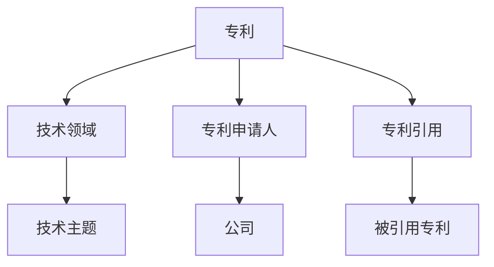
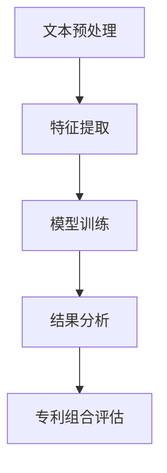

                 


# AI协作分析专利组合：评估技术驱动型公司的未来价值

**关键词**：AI协作分析、专利组合评估、技术驱动型公司、专利组合分析、AI驱动的技术洞察

**摘要**：  
随着技术驱动型公司在全球市场中的竞争加剧，专利组合已成为评估公司技术创新能力和市场竞争力的关键指标。然而，传统专利分析方法在复杂性和效率上存在局限性。本文通过AI协作分析的方法，探讨如何利用人工智能技术对专利组合进行深入分析，揭示其在技术评估、市场洞察和公司价值评估中的应用。本文将从核心概念、算法原理、系统架构到实际案例，全面解析AI协作分析在专利组合评估中的价值与应用。

---

## 第一部分：AI协作分析专利组合的背景与核心概念

### 第1章：AI协作分析专利组合的背景介绍

#### 1.1 问题背景与问题描述
技术驱动型公司依赖技术创新来维持竞争优势，而专利组合是其技术创新的核心体现。然而，传统专利分析方法依赖人工分类、统计分析和简单的技术趋势预测，难以应对以下挑战：  
- **复杂性**：专利数据量庞大，且技术领域广泛，人工分析效率低且容易出错。  
- **关联性**：传统方法难以发现专利之间的隐性关联，例如技术交叉、潜在的技术布局等。  
- **实时性**：技术发展迅速，专利组合需要动态更新和分析，而传统方法难以满足实时性需求。  

#### 1.2 问题解决与边界
AI协作分析通过引入自然语言处理（NLP）、机器学习（ML）和图论等技术，解决了传统方法的局限性。其主要优势包括：  
- **自动化与智能化**：通过AI技术实现专利文本的自动分类、关联分析和网络化布局。  
- **高效率与准确性**：AI算法能够快速处理海量专利数据，并发现潜在的技术关系。  
- **动态更新**：基于AI的系统可以实时跟踪技术趋势和专利动态，支持公司的技术布局和战略调整。  

#### 1.3 核心概念与技术驱动型公司
技术驱动型公司的专利组合通常具有以下特点：  
- **技术领域集中**：公司专注于特定技术领域，专利组合具有较高的技术相关性。  
- **技术布局广泛**：公司可能在多个技术领域布局专利，形成技术生态。  
- **技术前瞻性**：专利组合可能包含前瞻性技术，能够引领市场趋势。  

通过AI协作分析，技术驱动型公司可以更高效地评估专利组合的价值，发现潜在的技术机会和风险。

---

### 第2章：AI协作分析的核心概念与联系

#### 2.1 核心概念原理
AI协作分析专利组合的核心在于将专利文本与技术领域、申请人、技术主题等实体进行关联。以下是关键的技术原理：  
- **自然语言处理（NLP）**：通过对专利文本的分词、实体识别和语义理解，提取技术主题、关键词和专利之间的关联性。  
- **机器学习（ML）**：利用分类、聚类和深度学习模型，对专利进行自动分类、技术趋势预测和价值评估。  
- **图论与网络分析**：通过构建专利-技术-公司的网络图，分析专利组合的技术布局、技术关联性和公司间的竞争关系。  

#### 2.2 核心概念属性特征对比表
以下是AI协作分析与传统专利分析的对比表：

| **维度**         | **传统专利分析**                  | **AI协作分析**                     | **优势对比**                          |
|------------------|------------------------------------|-------------------------------------|---------------------------------------|
| **分析方法**     | 手工分类、统计分析                | 自动化分类、关联分析、网络分析    | 提高效率与准确性                       |
| **技术关联性**   | 单点分析，难以发现隐性关联        | 网络化分析，发现潜在技术关系      | 揭示技术布局与协同关系                |
| **数据处理能力** | 依赖人工经验，处理能力有限        | 处理海量数据，支持实时更新        | 支持动态技术评估                      |
| **结果呈现**     | 统计报表、单点分析结果            | 网络图、技术布局图、动态趋势图      | 更直观、更具洞察力                    |

#### 2.3 ER实体关系图（Mermaid）
以下是专利组合分析的ER实体关系图：



---

## 第二部分：AI协作分析的算法原理与数学模型

### 第3章：AI协作分析的算法原理

#### 3.1 算法流程与步骤
AI协作分析专利组合的算法流程如下：  
1. **文本预处理**：对专利文本进行分词、去除停用词、词干提取等处理。  
2. **特征提取**：通过TF-IDF、Word2Vec等方法提取专利文本的特征向量。  
3. **模型训练**：利用分类模型（如SVM、随机森林）或深度学习模型（如BERT）对专利进行分类和关联分析。  
4. **结果分析**：基于网络分析方法，构建技术布局图和公司竞争图，评估专利组合的价值和潜力。  

#### 3.2 算法流程图（Mermaid）
以下是算法流程图：



#### 3.3 核心算法实现代码
以下是Python实现的核心算法代码：

```python
import numpy as np
from sklearn.feature_extraction.text import TfidfVectorizer
from sklearn.svm import SVC
from sklearn.metrics import accuracy_score

# 示例专利文本
texts = [
    "一种基于人工智能的图像识别方法",
    "一种基于深度学习的自然语言处理系统",
    "一种基于机器学习的数据分析方法",
    "一种基于神经网络的图像分类算法"
]

# 文本预处理与特征提取
vectorizer = TfidfVectorizer()
X = vectorizer.fit_transform(texts)

# 模型训练
model = SVC()
model.fit(X, ['图像识别', '自然语言处理', '数据分析', '图像分类'])

# 测试与评估
test_texts = ["一种基于深度学习的图像识别算法"]
test_X = vectorizer.transform(test_texts)
predicted = model.predict(test_X)
print("预测结果：", predicted)
print("准确率：", accuracy_score(predicted, ['图像识别']))
```

#### 3.4 数学模型与公式
以下是AI协作分析中常用的数学模型：  
- **TF-IDF公式**：  
  $$ TF-IDF(t, d) = TF(t, d) \times ID

