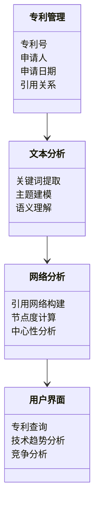
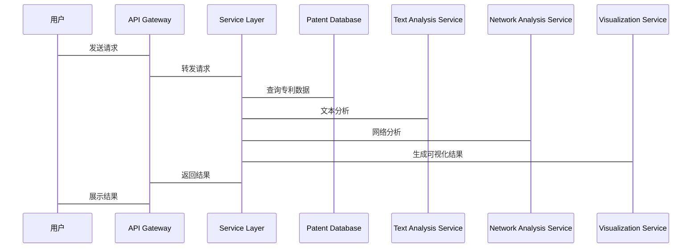

                 


# AI协作分析公司专利引用网络：评估技术领先地位

**关键词**：AI协作、专利引用网络、技术领先地位、文本挖掘、网络分析、系统架构

**摘要**：本文探讨了利用AI协作分析公司专利引用网络的方法，旨在评估技术领先地位。通过详细分析专利引用网络的结构与属性，结合文本挖掘和网络分析算法，构建AI协作分析系统，并通过项目实战验证其有效性。

---

# 第1章 AI协作分析的背景与意义

## 1.1 专利在技术竞争中的重要性

### 1.1.1 专利的基本概念与作用
专利是企业技术实力的体现，具有法律保护和技术垄断作用。通过专利，企业可以保护创新成果，防止技术被他人滥用。

### 1.1.2 专利引用网络的定义与特点
专利引用网络是指多个专利之间通过引用关系形成的网络结构。其特点包括复杂性、动态性和层次性。

### 1.1.3 AI在专利分析中的优势
AI能够快速处理大量专利数据，提取关键词和语义信息，帮助发现隐藏的技术趋势和竞争关系。

## 1.2 技术领先地位评估的核心问题

### 1.2.1 技术领先性的定义
技术领先性指企业在特定技术领域的创新能力、市场占有率和研发投入等方面的表现。

### 1.2.2 专利引用网络分析的必要性
通过分析专利引用网络，可以揭示技术的发展路径和关键节点，帮助企业制定技术战略。

### 1.2.3 AI协作分析的创新点
利用AI技术，专利引用网络分析能够实现自动化和智能化，提高分析效率和准确性。

## 1.3 本章小结
本章介绍了专利的重要性及其在网络分析中的作用，强调了AI在技术领先地位评估中的优势。

---

# 第2章 专利引用网络的核心概念与分析方法

## 2.1 专利引用网络的结构与属性

### 2.1.1 引用关系的定义
引用关系是指一个专利被另一个专利引用，形成的技术依赖关系。

### 2.1.2 网络节点与边的属性
节点代表专利，边代表引用关系。每个节点都有专利号、申请人、申请日期等属性。

### 2.1.3 网络的度分布与聚类特性
度分布反映了节点的连接数量，聚类特性展示了网络的紧密程度。

## 2.2 专利引用网络的分析方法

### 2.2.1 基于图论的网络分析
使用图论方法分析网络的结构特征，如度数、中心性等。

### 2.2.2 基于语义的文本分析
通过文本挖掘技术提取专利文本中的关键词和主题，进行语义分析。

### 2.2.3 综合分析方法的优缺点
综合分析方法结合了图论和文本分析，能够全面评估技术领先地位。

## 2.3 专利引用网络的可视化

### 2.3.1 可视化工具与方法
常用的可视化工具包括Gephi、NetworkX等，方法包括节点布局和边长调整。

### 2.3.2 通过可视化发现技术趋势
可视化可以帮助发现技术热点和演变趋势，为企业制定研发策略提供依据。

### 2.3.3 可视化在竞争分析中的应用
可视化分析可以帮助企业识别竞争对手的技术布局和优势领域。

## 2.4 本章小结
本章详细介绍了专利引用网络的结构和分析方法，强调了可视化在技术评估中的作用。

---

# 第3章 AI协作分析的算法原理

## 3.1 文本挖掘与专利分析

### 3.1.1 分词与关键词提取
使用分词工具对专利文本进行分词，并提取高频关键词。

### 3.1.2 语义分析与主题建模
通过主题建模技术（如LDA）识别专利文本的主题分布。

### 3.1.3 基于深度学习的文本理解
利用预训练语言模型（如BERT）进行文本表示和语义理解。

## 3.2 专利引用网络的构建算法

### 3.2.1 基于规则的引用关系提取
通过预设规则匹配专利引用关系。

### 3.2.2 基于相似度的自动引用识别
计算专利文本的相似度，自动识别引用关系。

### 3.2.3 引用网络的动态更新方法
定期更新网络数据，确保分析结果的实时性。

## 3.3 算法实现的数学模型

### 3.3.1 TF-IDF公式
$$TF-IDF(t, d) = \frac{1}{1 + \log(\text{term count in } d)} \times \log\left(\frac{N + 1}{\text{count}(t) + 1}\right)$$

### 3.3.2 PageRank算法
$$PR(i) = \sum_{j \in In(i)} \frac{PR(j)}{OutL(j)}$$

## 3.4 本章小结
本章详细讲解了AI协作分析的算法原理，包括文本挖掘和网络构建的具体方法。

---

# 第4章 系统分析与架构设计方案

## 4.1 问题场景介绍

### 4.1.1 项目背景
企业需要通过专利分析来评估技术领先地位，制定研发策略。

### 4.1.2 项目目标
构建一个基于AI的专利引用网络分析系统，提供技术评估和竞争分析功能。

## 4.2 系统功能设计

### 4.2.1 领域模型设计


### 4.2.2 系统架构设计


### 4.2.3 系统接口设计


## 4.3 本章小结
本章详细介绍了系统架构设计，包括功能模块、架构图和接口设计。

---

# 第5章 项目实战

## 5.1 环境安装

### 5.1.1 安装Python环境
使用Anaconda安装Python 3.8及以上版本。

### 5.1.2 安装依赖库
安装必要的库，如networkx、numpy、scikit-learn、textblob、spacy。

## 5.2 核心代码实现

### 5.2.1 引用网络构建
```python
import networkx as nx
from textblob import TextBlob

def build_patent_network(patents):
    G = nx.Graph()
    for patent in patents:
        G.add_node(patent['patent_id'])
        for cited_patent in patent['cited_patents']:
            G.add_edge(patent['patent_id'], cited_patent)
    return G
```

### 5.2.2 文本分析
```python
from textblob import TextBlob

def extract_keywords(text):
    blob = TextBlob(text)
    keywords = blob.noun_phrases
    return keywords
```

### 5.2.3 网络分析
```python
def calculate centrality(G):
    return nx.eigenvector_centrality(G)
```

## 5.3 案例分析

### 5.3.1 数据准备
从专利数据库中获取目标公司的专利数据，包括专利号、申请人、申请日期和引用关系。

### 5.3.2 分析过程
1. 使用文本挖掘提取关键词。
2. 构建引用网络。
3. 计算节点中心性，识别关键专利。
4. 可视化网络结构，分析技术趋势。

### 5.3.3 结果解读
通过中心性分析，识别出公司在特定技术领域的核心专利，评估其技术领先性。

## 5.4 本章小结
本章通过实际案例展示了AI协作分析的实现过程，验证了系统设计的有效性。

---

# 第6章 最佳实践与小结

## 6.1 最佳实践 tips

### 6.1.1 数据质量管理
确保专利数据的准确性和完整性，避免因数据错误影响分析结果。

### 6.1.2 算法优化建议
根据具体需求选择合适的算法，合理配置参数，提高分析效率。

### 6.1.3 可视化工具选择
选择合适的可视化工具，确保结果清晰易懂。

## 6.2 小结
本文详细介绍了AI协作分析公司专利引用网络的方法，从背景介绍到系统设计，再到项目实战，全面展示了如何利用AI技术评估技术领先地位。

## 6.3 注意事项

### 6.3.1 数据隐私
注意专利数据的隐私保护，遵守相关法律法规。

### 6.3.2 算法局限性
认识到算法的局限性，避免过度依赖AI分析结果。

## 6.4 拓展阅读

### 6.4.1 相关技术
推荐阅读《自然语言处理实战》和《图论与网络流》。

### 6.4.2 应用领域
进一步了解AI在知识产权管理和技术战略中的应用。

---

**作者：AI天才研究院 & 禅与计算机程序设计艺术**

