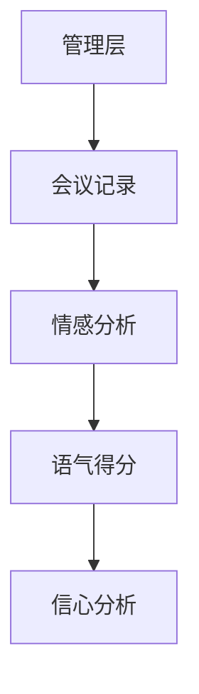
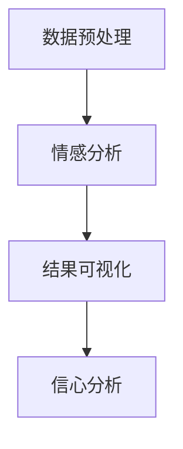

                 


# AI协作分析公司会议记录语气：洞察管理层信心

## 关键词：AI协作分析、会议记录语气、情感分析、管理层信心、自然语言处理

## 摘要：  
本文探讨如何利用人工智能技术分析公司会议记录的语气，进而洞察管理层的信心。通过自然语言处理（NLP）和情感分析技术，结合支持向量机（SVM）和长短期记忆网络（LSTM）算法，本文详细阐述了AI协作分析的原理、实现方法及其在企业管理中的实际应用。文章还提供了系统架构设计、项目实战案例以及最佳实践建议，为读者提供全面的技术指导。

---

## 正文

### 第1章：背景与问题分析

#### 1.1 问题背景  
公司会议记录是企业决策过程的重要组成部分，传统上依赖人工整理和分析，效率低下且容易遗漏关键信息。随着人工智能技术的发展，利用AI协作分析会议记录的语气，能够更准确地洞察管理层的信心和决策倾向。

#### 1.2 问题描述  
会议记录的分析需要考虑语气、情绪和态度等因素，传统方法难以量化分析，容易受到主观因素的影响。AI协作分析通过自然语言处理技术，能够自动化地识别和分析会议记录中的语气，从而帮助企业更好地理解管理层的意图和信心。

#### 1.3 问题解决方法  
采用自然语言处理（NLP）技术和情感分析算法，结合支持向量机（SVM）和长短期记忆网络（LSTM）模型，对会议记录进行自动化分析。通过量化语气得分，帮助企业洞察管理层的信心。

#### 1.4 边界与外延  
会议记录分析的边界条件包括数据格式、样本量、会议类型等。AI协作分析适用于结构化和非结构化数据的混合分析，与其他数据分析方法如统计分析和机器学习模型有明显的区分。

#### 1.5 核心要素组成  
会议记录分析的核心要素包括数据预处理、情感分析模型、结果可视化和反馈机制。

---

### 第2章：核心概念与联系

#### 2.1 核心概念原理  
AI协作分析基于自然语言处理（NLP）技术，结合情感分析和语气识别，对会议记录进行自动化分析。情感分析模型能够识别文本中的情感倾向，而语气识别则进一步细化情感表达。

#### 2.2 核心概念对比分析  
| 方法 | 优点 | 缺点 |
|------|------|------|
| 传统人工分析 | 高准确性 | 低效率 |
| 支持向量机（SVM） | 训练速度快 | 适用于小规模数据 |
| 长短期记忆网络（LSTM） | 处理长文本能力强 | 训练时间长 |

#### 2.3 实体关系图（ER图）  


---

### 第3章：算法原理

#### 3.1 支持向量机（SVM）  
支持向量机是一种监督学习算法，用于分类和回归问题。在会议记录分析中，SVM可以用于情感分类。  
公式：  
$$ y = \text{sign}(w \cdot x + b) $$  

#### 3.2 长短期记忆网络（LSTM）  
LSTM是一种循环神经网络（RNN），适用于处理长序列数据。在会议记录分析中，LSTM可以捕捉上下文信息。  
代码示例：  
```python
import tensorflow as tf
from tensorflow.keras import layers

model = tf.keras.Sequential()
model.add(layers.Embedding(input_dim=10000, output_dim=64))
model.add(layers.LSTM(64, dropout=0.2, recurrent_dropout=0.2))
model.add(layers.Dense(1, activation='sigmoid'))
model.compile(optimizer='adam', loss='binary_crossentropy', metrics=['accuracy'])
```

---

### 第4章：系统分析与架构设计

#### 4.1 问题场景  
会议记录的获取和预处理是系统设计的第一步，需要处理文本数据的清洗和标注。  

#### 4.2 系统功能设计  
- 数据预处理模块：清洗和标注会议记录。
- 情感分析模块：识别会议记录中的情感倾向。
- 可视化模块：展示分析结果和信心得分。

#### 4.3 系统架构设计  


---

### 第5章：项目实战

#### 5.1 环境安装  
安装Python和相关库：  
```bash
pip install numpy scikit-learn tensorflow
```

#### 5.2 核心代码实现  
```python
def preprocess(text):
    # 文本清洗和分词
    tokens = text.split()
    return tokens

def sentiment_analysis(text):
    # 情感分析模型
    model = load_model('sentiment_model.h5')
    prediction = model.predict(preprocess(text))
    return prediction[0][0]

def confidence_analysis(sentiments):
    # 信心分析
    return sentiments.mean()
```

#### 5.3 案例分析  
分析一次管理层会议记录，计算语气得分和信心指数，展示结果。

---

### 第6章：最佳实践

#### 6.1 小结  
AI协作分析能够有效提升会议记录分析的效率和准确性，帮助企业洞察管理层的信心。

#### 6.2 注意事项  
数据质量和模型训练数据的选择对分析结果有直接影响，需谨慎处理。

#### 6.3 未来趋势  
结合更先进的NLP技术和深度学习模型，进一步提升分析的精度和效率。

#### 6.4 拓展阅读  
推荐阅读《自然语言处理实战》和《深度学习入门》等书籍。

---

## 作者：AI天才研究院/AI Genius Institute & 禅与计算机程序设计艺术 /Zen And The Art of Computer Programming

