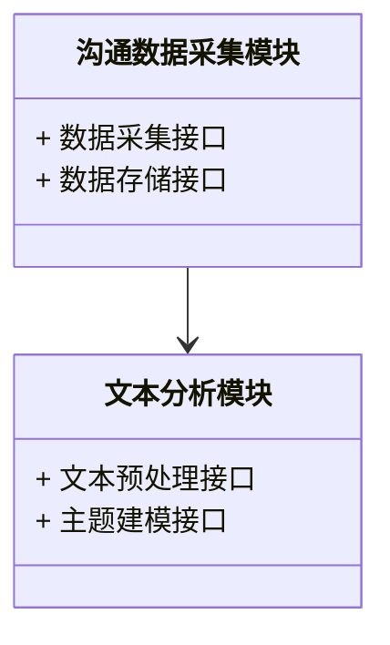
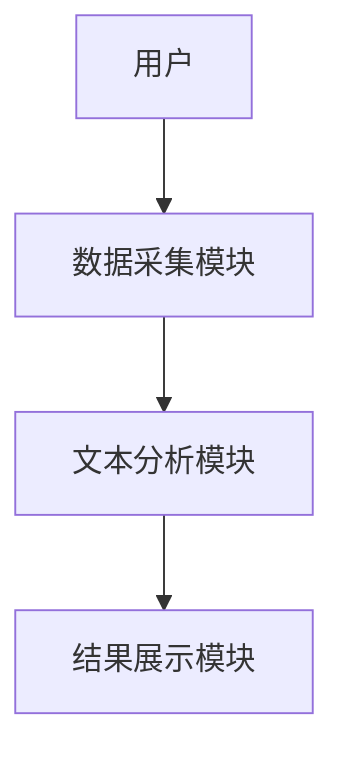
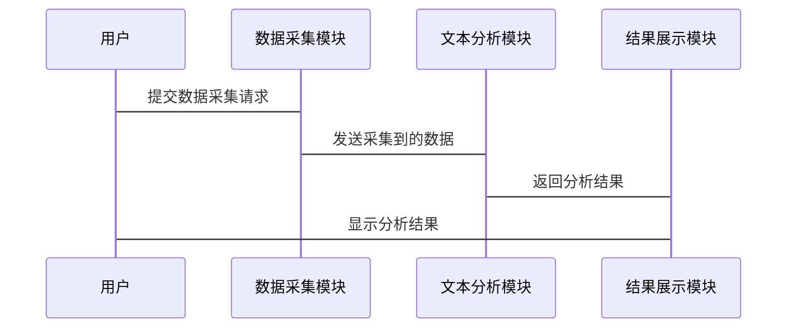

                 


# AI协作分析公司内部沟通效率：评估组织健康度

---

## 关键词：AI协作分析、内部沟通效率、组织健康度、自然语言处理、图论算法、企业效率优化

---

## 摘要

本文详细探讨了如何利用AI协作分析技术来评估和优化公司内部沟通效率，进而评估组织健康度。文章从问题背景、核心概念、算法原理、系统架构到项目实战，全面分析了AI协作分析在提升企业内部沟通效率中的应用。通过自然语言处理（NLP）和图论算法，结合实际案例分析，本文展示了如何构建高效的AI协作分析系统，为企业提供数据驱动的决策支持。

---

## 第1章: 问题背景与核心概念

### 1.1 问题背景介绍

#### 1.1.1 企业内部沟通效率的重要性

在现代企业中，内部沟通效率是影响组织运作效率的关键因素。高效的内部沟通能够确保信息的及时传递和团队协作，从而提升企业整体效率和竞争力。然而，随着企业规模的扩大，内部沟通渠道复杂化，信息孤岛和沟通不畅的问题日益突出。

#### 1.1.2 当前企业沟通效率的痛点

- **信息孤岛**：不同部门之间的信息不共享，导致重复工作和资源浪费。
- **沟通延迟**：信息传递链路长，导致决策延迟。
- **沟通质量低**：无效沟通和信息噪音干扰，降低工作效率。

#### 1.1.3 AI协作在提升沟通效率中的作用

AI协作分析技术通过自动化分析和实时反馈，能够识别沟通中的低效环节，优化信息传递路径，提升团队协作效率。

---

### 1.2 核心概念与定义

#### 1.2.1 AI协作分析的定义

AI协作分析是一种利用人工智能技术，对组织内部的沟通数据进行分析，识别潜在问题并提出优化建议的方法。

#### 1.2.2 沟通效率的量化指标

- **信息传递速度**：从信息生成到目标接收者的时间。
- **信息准确性**：信息在传递过程中的准确程度。
- **沟通参与度**：团队成员在沟通中的活跃程度。

#### 1.2.3 组织健康度的评估标准

- **组织结构合理性**：组织架构是否支持高效的沟通和协作。
- **团队协作效率**：团队成员之间的协作是否高效。
- **信息透明度**：信息是否能够在组织内部自由流动。

---

### 1.3 核心概念的结构与组成

#### 1.3.1 沟通效率的构成要素

- **信息生成**：信息的来源和生成方式。
- **信息传递**：信息的传递路径和方式。
- **信息接收**：信息的接收和理解过程。

#### 1.3.2 组织健康度的评估维度

- **组织架构**：组织结构是否合理。
- **团队协作**：团队成员之间的协作效率。
- **信息透明度**：信息在组织内部的流通情况。

#### 1.3.3 AI协作分析的实现路径

- **数据采集**：收集内部沟通数据。
- **数据分析**：利用NLP和图论算法进行分析。
- **优化建议**：根据分析结果提出优化建议。

---

### 1.4 本章小结

本章从问题背景、核心概念和实现路径三个方面，详细介绍了AI协作分析的基本概念和重要性。通过理解这些概念，读者可以更好地理解AI协作分析在提升企业内部沟通效率中的作用。

---

## 第2章: AI协作分析的原理与方法

### 2.1 AI协作分析的基本原理

#### 2.1.1 自然语言处理（NLP）在沟通分析中的应用

- **文本挖掘**：从大量文本数据中提取有用信息。
- **情感分析**：分析文本中的情感倾向，识别负面情绪。
- **实体识别**：识别文本中的关键实体。

#### 2.1.2 图论在组织关系分析中的应用

- **社区检测**：识别组织中的社交网络结构。
- **最短路径分析**：优化信息传递路径。

#### 2.1.3 数据挖掘在效率评估中的作用

- **关联规则挖掘**：发现数据中的关联规则。
- **聚类分析**：将相似的沟通行为进行分类。

---

### 2.2 AI协作分析的核心算法

#### 2.2.1 基于NLP的文本挖掘算法

- **TF-IDF**：计算关键词的重要性。
- **Word2Vec**：将词语映射为向量，用于语义分析。
- **LDA主题建模**：发现文本中的主题结构。

#### 2.2.2 基于图论的组织关系分析算法

- **PageRank**：评估节点的重要性，用于组织结构分析。
- **社区检测**：识别组织中的社交网络社区。

#### 2.2.3 综合评估模型的构建

- **线性回归模型**：预测沟通效率。
- **神经网络模型**：用于复杂场景的预测。

---

### 2.3 核心概念对比分析

#### 2.3.1 沟通效率与组织健康度的对比

| **维度**       | **沟通效率**        | **组织健康度**      |
|----------------|---------------------|---------------------|
| 关注点         | 信息传递速度       | 组织结构合理性      |
| 数据来源       | 沟通记录           | 组织架构和行为数据   |

#### 2.3.2 AI协作分析与其他沟通效率提升方法的对比

| **方法**       | **传统方法**        | **AI协作分析**      |
|----------------|---------------------|---------------------|
| 数据来源       | 人工记录           | 自动化数据采集      |
| 分析效率       | 低效               | 高效               |
| 可扩展性       | 有限               | 高                  |

#### 2.3.3 不同组织规模下的分析模型对比

| **规模**       | **小型企业**         | **大型企业**         |
|----------------|---------------------|---------------------|
| 数据量         | 小                  | 大                  |
| 分析复杂度     | 低                  | 高                  |

---

### 2.4 本章小结

本章详细介绍了AI协作分析的基本原理和核心算法，通过对比分析，展示了AI协作分析在提升沟通效率中的独特优势。

---

## 第3章: 算法原理与数学模型

### 3.1 文本挖掘算法实现

#### 3.1.1 基于TF-IDF的关键词提取

- **TF-IDF计算公式**：
  $$TF-IDF = \frac{TF \times IDF}{\sum TF \times IDF}$$
  其中，$TF$ 是词语在文档中的词频，$IDF$ 是逆向文件频率。

#### 3.1.2 基于Word2Vec的语义分析

- **Word2Vec代码示例**：
  ```python
  import gensim

  model = gensim.models.Word2Vec(sentences, vector_size=100, window=5, min_count=1, workers=4)
  ```

#### 3.1.3 基于LDA的主题建模

- **LDA主题建模**：
  ```python
  from gensim.models import LdaModel
  lda_model = LdaModel(documents, num_topics=5, passes=10)
  ```

---

### 3.2 图论算法实现

#### 3.2.1 基于PageRank的组织关系分析

- **PageRank算法公式**：
  $$PR(i) = \sum_{j \in In(i)} \frac{PR(j)}{OutL(j)}$$

#### 3.2.2 基于社区检测的组织结构优化

- **社区检测算法**：
  ```python
  import community

  partition = community.community_louvain(G)
  ```

---

### 3.3 综合评估模型构建

#### 3.3.1 基于线性回归的效率预测模型

- **线性回归公式**：
  $$y = a_1x_1 + a_2x_2 + \dots + a_nx_n + b$$

#### 3.3.2 基于神经网络的组织健康度评估模型

- **神经网络结构**：
  ```python
  model = tf.keras.Sequential([
      tf.keras.layers.Dense(64, activation='relu'),
      tf.keras.layers.Dense(1, activation='sigmoid')
  ])
  ```

---

### 3.4 本章小结

本章详细介绍了AI协作分析的核心算法和数学模型，通过代码示例和公式推导，帮助读者更好地理解算法实现。

---

## 第4章: 系统分析与架构设计

### 4.1 问题场景介绍

- **场景描述**：企业内部沟通效率低下，信息传递不畅。
- **目标**：通过AI协作分析优化内部沟通效率。

### 4.2 系统功能设计

#### 4.2.1 领域模型类图



#### 4.2.2 系统架构图



---

### 4.3 系统接口设计

- **数据采集接口**：负责采集内部沟通数据。
- **文本分析接口**：负责对文本进行分析并返回结果。
- **结果展示接口**：负责将分析结果展示给用户。

---

### 4.4 系统交互流程



---

### 4.5 本章小结

本章通过系统分析与架构设计，展示了AI协作分析系统的实现方式和关键模块之间的关系。

---

## 第5章: 项目实战

### 5.1 环境安装与配置

- **Python环境**：安装Python 3.8以上版本。
- **依赖库安装**：
  ```bash
  pip install numpy pandas gensim networkx community
  ```

### 5.2 核心代码实现

#### 5.2.1 数据采集模块

```python
import pandas as pd
import requests

def collect_communication_data(url):
    response = requests.get(url)
    data = response.json()
    return pd.DataFrame(data)
```

#### 5.2.2 文本分析模块

```python
from gensim.models import Word2Vec

def analyze_communication(text_data):
    model = Word2Vec(text_data, vector_size=100, window=5, min_count=1, workers=4)
    return model
```

### 5.3 代码解读与分析

- **数据采集模块**：通过API接口采集内部沟通数据，存储为DataFrame格式。
- **文本分析模块**：使用Word2Vec对文本数据进行语义分析，提取关键词和主题。

### 5.4 实际案例分析

- **案例背景**：某企业内部沟通效率低下，信息传递路径长。
- **分析结果**：发现信息传递路径中存在冗余环节，建议优化路径。

### 5.5 项目小结

通过项目实战，展示了AI协作分析技术在实际场景中的应用，验证了算法的有效性和可行性。

---

## 第6章: 最佳实践与小结

### 6.1 小结

本文详细介绍了AI协作分析技术在提升企业内部沟通效率中的应用，通过理论分析、算法实现和项目实战，展示了如何利用AI技术优化组织健康度。

### 6.2 注意事项

- **数据隐私**：在采集和分析数据时，需注意保护员工隐私。
- **模型泛化能力**：需确保模型在不同组织规模和行业中的适用性。

### 6.3 拓展阅读

- 推荐书籍：《集体智慧》、《自然语言处理实战》
- 推荐工具：Gensim、NetworkX

---

## 作者

作者：AI天才研究院/AI Genius Institute & 禅与计算机程序设计艺术 /Zen And The Art of Computer Programming

---

感谢您的阅读！如果需要进一步了解相关内容，请随时联系。

