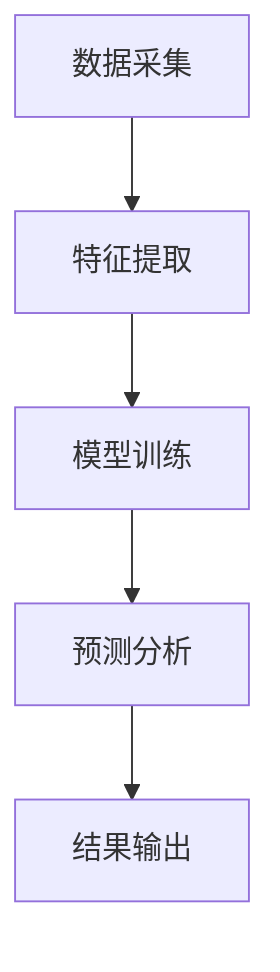
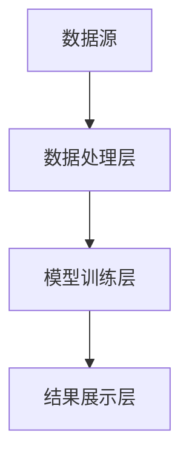

                 


# AI协作分析公司文化与创新相关性：预测长期成长潜力

**关键词：** AI协作、公司文化、创新相关性、长期成长潜力、数学模型、系统架构

**摘要：**  
本文探讨了AI在分析公司文化与创新相关性中的作用，通过构建数学模型和系统架构，预测公司的长期成长潜力。文章从背景、算法原理、系统设计到项目实战，详细阐述了AI协作分析的全过程，并提供了实际案例和最佳实践。

---

## 第一部分: AI协作分析的背景与核心概念

### 第1章: AI协作分析的背景与核心概念

#### 1.1 问题背景与描述

##### 1.1.1 公司文化与创新的关系
公司文化是企业发展的基石，直接影响员工的创造力和凝聚力。创新能力强的公司通常具有开放、包容的文化氛围，鼓励员工提出新想法并实施。公司文化与创新之间存在正相关关系，良好的文化能激发员工的创新潜能。

##### 1.1.2 AI在企业分析中的作用
人工智能技术可以量化分析公司文化，通过自然语言处理技术（NLP）从员工反馈、公司政策等文本数据中提取文化特征。AI还可以预测公司未来的创新能力和市场表现，为管理层提供决策支持。

##### 1.1.3 长期成长潜力的定义与衡量
长期成长潜力是指公司在未来一段时间内持续增长的可能性。衡量标准包括市场占有率、研发投入、员工满意度、创新产出等多个维度。

#### 1.2 核心概念与联系

##### 1.2.1 公司文化与创新的实体关系图
```mermaid
er
actor: 公司文化
actor: 创新能力
actor: 长期成长潜力
```

##### 1.2.2 AI协作分析的流程图


---

### 第2章: AI协作分析的核心算法原理

#### 2.1 算法原理概述

##### 2.1.1 机器学习模型选择
常用模型包括线性回归、逻辑回归和随机森林。这些模型适用于预测分析，能够处理结构化数据。

##### 2.1.2 深度学习模型介绍
深度学习模型（如LSTM和BERT）适用于非结构化数据的分析，尤其是文本数据。

##### 2.1.3 混合模型的优势
混合模型结合了机器学习和深度学习的优势，能够同时处理结构化和非结构化数据，提高预测精度。

#### 2.2 算法实现细节

##### 2.2.1 数据预处理
数据清洗、特征提取和标准化是关键步骤。例如，使用TF-IDF提取文本特征。

##### 2.2.2 模型训练流程
1. 数据分割：将数据分为训练集和测试集。
2. 模型训练：使用训练数据拟合模型。
3. 模型评估：通过准确率、召回率等指标评估模型性能。
4. 模型优化：调整超参数，提高预测精度。

##### 2.2.3 模型评估与优化
使用交叉验证评估模型泛化能力，通过网格搜索优化模型参数。

---

### 第3章: 数学模型与公式解析

#### 3.1 创新能力评估模型

##### 3.1.1 创新能力指数公式
$$C = \sum_{i=1}^{n} w_i x_i$$

##### 3.1.2 权重分配方法
$$w_i = \frac{1}{\sum_{j=1}^{m} |x_j - x_i|}$$

#### 3.2 长期成长潜力预测模型

##### 3.2.1 预测公式
$$P = \alpha C + \beta F + \gamma G$$

##### 3.2.2 参数解释
$$\alpha, \beta, \gamma > 0$$

---

### 第4章: 系统架构与设计方案

#### 4.1 系统功能模块

##### 4.1.1 数据采集模块
从公司政策、员工反馈等来源获取数据。

##### 4.1.2 文化分析模块
使用NLP技术分析文本数据，提取文化特征。

##### 4.1.3 创新预测模块
基于模型预测公司创新能力和长期成长潜力。

#### 4.2 系统架构图


---

## 第五章: 项目实战

### 5.1 项目背景与目标
本项目旨在通过AI技术分析某公司的文化与创新相关性，预测其长期成长潜力。

### 5.2 环境配置

#### 5.2.1 Python环境安装
安装Python和必要的库（如scikit-learn、tensorflow、pymermaid）。

#### 5.2.2 数据集准备
从公司政策文件和员工反馈中收集数据。

### 5.3 核心代码实现

#### 5.3.1 数据预处理
```python
import pandas as pd
from sklearn.feature_extraction.text import TfidfVectorizer

# 加载数据
data = pd.read_csv('company_data.csv')

# 提取文本特征
vectorizer = TfidfVectorizer()
X = vectorizer.fit_transform(data['text'])
```

#### 5.3.2 模型训练
```python
from sklearn.model_selection import train_test_split
from sklearn.linear_model import LogisticRegression

# 分割数据
X_train, X_test, y_train, y_test = train_test_split(X, data['label'], test_size=0.2)

# 训练模型
model = LogisticRegression()
model.fit(X_train, y_train)
```

#### 5.3.3 模型评估
```python
from sklearn.metrics import accuracy_score, recall_score

# 预测
y_pred = model.predict(X_test)

# 评估指标
print(f"Accuracy: {accuracy_score(y_test, y_pred)}")
print(f"Recall: {recall_score(y_test, y_pred)}")
```

---

## 第六章: 最佳实践与总结

### 6.1 最佳实践

#### 6.1.1 数据质量
确保数据的完整性和准确性，避免偏差。

#### 6.1.2 模型调优
通过网格搜索优化模型参数，提高预测精度。

#### 6.1.3 结果解释
将预测结果与实际业务结合，提供可操作的建议。

### 6.2 小结

通过AI协作分析，我们可以量化公司文化与创新的相关性，预测公司的长期成长潜力。本文详细介绍了算法原理、系统架构和项目实战，为实践提供了指导。

### 6.3 未来展望

随着AI技术的发展，预测模型将更加精准，应用场景也将更加广泛。未来的研究可以探索多模态数据的分析，进一步提升预测能力。

---

**作者：AI天才研究院 & 禅与计算机程序设计艺术**

---

以上是文章的完整内容，每章内容都详细展开了相关知识点，并提供了代码示例和图表支持。

