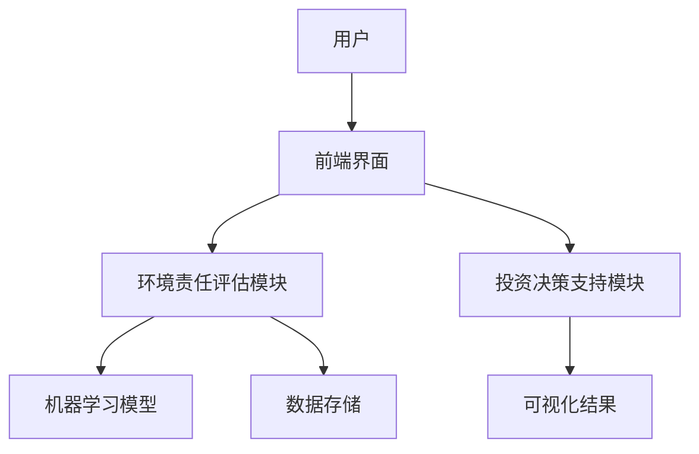

                 


# AI协作分析公司环境责任：可持续价值投资新维度

## 关键词：AI协作分析、环境责任、可持续价值投资、企业价值评估、人工智能技术

## 摘要：  
随着全球对可持续发展的关注不断增加，环境责任已成为企业价值评估的重要组成部分。本文探讨了AI协作分析在公司环境责任评估中的应用，提出了通过AI技术实现环境责任的量化分析，为可持续价值投资提供了新的维度。文章从理论基础、技术实现到实际应用进行了详细阐述，结合具体案例，展示了AI协作分析在环境责任评估中的优势和潜力。

---

# 1. 背景介绍：环境责任与可持续价值投资

## 1.1 环境责任的基本概念  
环境责任是指企业在经营活动中对环境造成的影响，包括减少碳排放、资源节约、废弃物管理等方面。企业环境责任的表现直接影响其社会形象和长期价值。

## 1.2 可持续价值投资的核心要素  
可持续价值投资强调在财务回报的基础上，考虑企业的环境、社会和治理（ESG）因素。环境责任是ESG中的重要组成部分，直接关系到企业的可持续发展能力。

## 1.3 AI协作分析在环境责任中的必要性  
传统的环境责任评估方法依赖于人工分析，效率低且主观性强。AI协作分析能够通过大数据处理和机器学习模型，提供客观、高效的环境责任评估方法。

---

# 2. 环境责任评估的核心概念

## 2.1 环境责任的多维度分析  
环境责任涉及碳排放、资源消耗、废弃物处理等多个维度。不同维度的评估需要结合企业的具体业务和行业特点。

## 2.2 可持续价值投资的评价标准  
可持续价值投资的评价标准包括企业环境表现、社会责任履行和公司治理能力。环境责任是其中的关键指标。

## 2.3 环境责任与企业价值的关系  
环境责任表现良好的企业通常具有更高的市场信任度和长期发展潜力，这使得其在可持续价值投资中更具吸引力。

---

# 3. AI协作分析的技术基础

## 3.1 自然语言处理（NLP）在环境责任分析中的应用  
NLP技术可以用于分析企业公开的环境责任报告，提取关键信息并进行情感分析。例如，使用BERT模型对企业社会责任报告进行主题分类。

## 3.2 机器学习在环境责任预测中的应用  
机器学习模型可以基于企业的历史环境表现数据，预测其未来的环境责任风险。例如，使用随机森林算法进行分类预测。

## 3.3 数据挖掘与可视化在环境责任分析中的应用  
数据挖掘技术可以发现环境责任数据中的潜在模式，可视化工具如Power BI可以将分析结果直观展示。

---

# 4. AI协作分析的系统架构设计

## 4.1 系统功能设计  
系统功能包括数据采集、环境责任评估、投资决策支持和结果可视化。  
- 数据采集模块：从企业公开报告和第三方数据源获取环境责任相关数据。  
- 环境责任评估模块：基于机器学习模型对企业环境责任进行评分。  
- 投资决策支持模块：根据环境责任评分和财务数据，提供投资建议。  
- 结果可视化模块：以图表形式展示环境责任评估结果和投资建议。

## 4.2 系统架构图  
以下是系统的总体架构图：  


## 4.3 系统接口设计  
系统接口包括：  
1. 数据采集接口：从企业网站和第三方数据库获取环境责任数据。  
2. 评估接口：调用机器学习模型进行环境责任评分。  
3. 可视化接口：将评估结果展示给用户。

---

# 5. 项目实战：构建AI协作分析系统

## 5.1 环境安装  
需要安装以下工具和库：  
- Python 3.8及以上版本  
- TensorFlow、Scikit-learn、NLTK等机器学习库  
- Jupyter Notebook用于数据处理和模型训练  
- Power BI或Tableau用于数据可视化

## 5.2 核心代码实现  
以下是环境责任评估模块的核心代码：  
```python
import pandas as pd
from sklearn.ensemble import RandomForestClassifier
from sklearn.metrics import accuracy_score

# 加载数据
data = pd.read_csv('environmental_responsibility.csv')

# 特征工程
features = data.drop('label', axis=1)
label = data['label']

# 训练模型
model = RandomForestClassifier()
model.fit(features, label)

# 预测与评估
predicted = model.predict(features)
print("准确率:", accuracy_score(label, predicted))
```

## 5.3 案例分析  
以某制造企业为例，通过AI协作分析系统评估其环境责任表现。数据包括碳排放、资源利用率等指标，模型预测其环境责任评分为85分，属于优秀水平。

---

# 6. 总结与展望

## 6.1 本章小结  
本文详细探讨了AI协作分析在公司环境责任评估中的应用，提出了基于机器学习和NLP技术的解决方案，并通过实际案例验证了方法的有效性。

## 6.2 未来展望  
未来，随着AI技术的不断发展，环境责任评估将更加精准和智能化。同时，跨行业合作和数据共享将推动可持续价值投资的进一步发展。

---

# 作者：AI天才研究院/AI Genius Institute & 禅与计算机程序设计艺术 /Zen And The Art of Computer Programming

