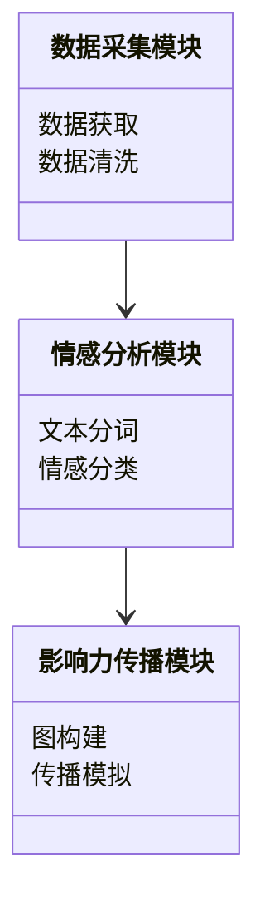

                 


# AI协作分析公司社交网络影响力：评估品牌价值

---

## 关键词：
AI协作、社交网络影响力、品牌价值、影响力传播模型、情感分析、图论算法、文本挖掘

---

## 摘要：
在当今数字化时代，社交网络已成为企业品牌传播和价值评估的重要渠道。本文从AI协作的角度出发，详细探讨如何通过社交网络数据来评估公司的品牌价值。文章首先介绍社交网络影响力评估的背景与核心概念，然后分析基于AI的情感分析和影响力传播模型的算法原理，接着从系统架构和项目实战的角度，展示如何设计和实现一个完整的社交网络影响力评估系统。最后，本文总结了AI协作在品牌价值评估中的最佳实践，并展望了未来的研究方向。通过本文的系统性分析，读者可以全面理解AI如何助力企业社交网络影响力的评估与优化。

---

# 第1章: 社交网络影响力与品牌价值概述

## 1.1 社交网络影响力的定义与重要性
### 1.1.1 社交网络影响力的定义
社交网络影响力是指企业在社交网络平台上通过内容传播、用户互动等方式所形成的影响力和话语权。这种影响力通常通过用户的关注数、互动频率、内容传播广度等指标来衡量。

### 1.1.2 社交网络影响力的重要性
- **品牌曝光**：社交网络影响力直接影响企业的品牌曝光度。
- **用户信任**：高影响力意味着用户对品牌的信任度更高。
- **市场反馈**：社交网络是企业获取市场反馈的重要渠道。

### 1.1.3 品牌价值与社交网络影响力的关系
品牌价值是企业长期积累的结果，而社交网络影响力是品牌价值在数字化时代的直接体现。两者的结合为企业提供了全新的价值评估维度。

---

## 1.2 企业社交网络影响力评估的背景与挑战
### 1.2.1 当前企业社交网络影响力评估的现状
随着社交媒体的普及，企业越来越依赖社交网络进行品牌推广。然而，如何量化这些影响力仍是一个难题。

### 1.2.2 传统评估方法的局限性
- **主观性**：传统评估方法依赖人工判断，结果不够客观。
- **数据孤岛**：不同平台的数据难以整合。
- **实时性不足**：传统方法难以捕捉实时变化。

### 1.2.3 AI技术在社交网络影响力评估中的优势
- **数据处理能力**：AI能够高效处理海量数据。
- **实时分析**：AI可以实时监控社交网络数据，提供动态评估。
- **精准预测**：通过算法模型，AI可以预测品牌影响力的变化趋势。

---

## 1.3 本书的核心目标与内容框架
### 1.3.1 本书的核心目标
通过AI技术，系统性地分析和评估企业的社交网络影响力，并将其与品牌价值评估相结合。

### 1.3.2 本书的内容框架
1. 第1章：社交网络影响力与品牌价值概述。
2. 第2章：社交网络影响力评估的核心概念。
3. 第3章：基于AI的情感分析算法。
4. 第4章：影响力传播模型与图论算法。
5. 第5章：社交网络影响力评估系统设计。
6. 第6章：项目实战：基于Python的影响力评估系统实现。
7. 第7章：AI协作在品牌价值评估中的最佳实践。
8. 第8章：总结与展望。

---

# 第2章: 社交网络影响力评估的核心概念

## 2.1 社交网络影响力评估的模型与方法
### 2.1.1 基于图论的影响力传播模型
影响力传播模型是基于社交网络的图结构，通过节点之间的关系来预测信息传播的范围和速度。

```mermaid
graph LR
A[用户1] -> B[用户2]
B -> C[用户3]
C -> D[用户4]
```

### 2.1.2 基于文本挖掘的情感分析模型
情感分析模型用于分析用户在社交网络上的文本内容，判断其情感倾向（正面、负面、中性）。

### 2.1.3 综合影响力评估的多维度框架
综合影响力评估框架结合了用户数量、互动频率、情感倾向等多个维度。

---

## 2.2 品牌价值的核心要素与社交网络属性
### 2.2.1 品牌价值的核心要素
- 品牌知名度
- 品牌美誉度
- 品牌忠诚度

### 2.2.2 社交网络属性的特征分析
- 用户活跃度
- 内容传播速度
- 情感倾向分布

### 2.2.3 品牌价值与社交网络属性的关联性分析
通过关联性分析，可以量化社交网络属性对品牌价值的具体贡献。

---

## 2.3 社交网络影响力评估的ER实体关系图
```mermaid
er
actor 用户
actor 帖子
actor 互动行为
```

---

# 第3章: 情感分析算法原理与实现

## 3.1 情感分析的核心原理
情感分析是通过自然语言处理技术，对文本内容进行情感分类的过程。

### 3.1.1 基于词袋模型的情感分析
词袋模型将文本表示为单词的集合，不考虑顺序。

### 3.1.2 基于词嵌入模型的情感分析
词嵌入模型（如Word2Vec）能够捕捉词语之间的语义关系。

---

## 3.2 情感分析算法的实现步骤
### 3.2.1 数据预处理
- 分词
- 去停用词
- 词向量化

### 3.2.2 模型训练
- 选择分类算法（如SVM、随机森林）
- 调参优化

### 3.2.3 结果评估
- 准确率、召回率、F1值

---

## 3.3 情感分析算法的数学模型
情感分析模型的训练过程可以用以下公式表示：

$$
P(y | x) = \frac{P(x | y) \cdot P(y)}{P(x)}
$$

其中，$y$ 是情感类别，$x$ 是输入文本。

---

# 第4章: 影响力传播模型与图论算法

## 4.1 影响力传播模型的原理
影响力传播模型模拟信息在社交网络中的传播过程。

### 4.1.1 基于图论的传播模型
- PageRank算法
- 加权传播模型

---

## 4.2 影响力传播模型的实现步骤
### 4.2.1 数据预处理
- 构建社交网络图
- 赋予边权重

### 4.2.2 算法实现
- 使用广度优先搜索（BFS）进行传播模拟

---

## 4.3 影响力传播模型的数学公式
影响力传播的概率可以用以下公式表示：

$$
P(i, t) = \sum_{j \in N(i)} P(j, t-1) \cdot w_{ij}
$$

其中，$P(i, t)$ 表示节点 $i$ 在时间 $t$ 的影响力，$N(i)$ 是节点 $i$ 的邻居，$w_{ij}$ 是边权重。

---

# 第5章: 社交网络影响力评估系统设计

## 5.1 系统功能模块设计
### 5.1.1 数据采集模块
- 从社交平台获取原始数据
- 数据清洗

### 5.1.2 情感分析模块
- 对文本数据进行情感分类
- 生成情感倾向报告

### 5.1.3 影响力传播模块
- 模拟信息传播过程
- 生成传播路径报告

---

## 5.2 系统架构设计


---

## 5.3 系统接口设计
### 5.3.1 数据接口
- RESTful API
- 数据格式：JSON

### 5.3.2 用户接口
- 友好的可视化界面
- 数据展示：图表形式

---

# 第6章: 项目实战——基于Python的影响力评估系统实现

## 6.1 环境安装与配置
- 安装Python
- 安装相关库（如NLTK、Scikit-learn、NetworkX）

## 6.2 核心代码实现
### 6.2.1 数据采集
```python
import requests
from bs4 import BeautifulSoup

def fetch_data(url):
    response = requests.get(url)
    soup = BeautifulSoup(response.text, 'html.parser')
    # 提取数据
    return data
```

### 6.2.2 情感分析
```python
from sklearn.feature_extraction.text import TfidfVectorizer
from sklearn.svm import SVC

vectorizer = TfidfVectorizer()
X = vectorizer.fit_transform(texts)
model = SVC()
model.fit(X, labels)
```

### 6.2.3 影响力传播
```python
import networkx as nx

G = nx.DiGraph()
G.add_edges_from(edges)
nx pagerank(G)
```

## 6.3 实际案例分析
- 数据来源：某公司社交媒体数据
- 实验结果：品牌价值提升的具体表现

---

## 6.4 项目小结
通过本项目，读者可以掌握社交网络影响力评估的完整流程，包括数据采集、情感分析和影响力传播的实现。

---

# 第7章: AI协作在品牌价值评估中的最佳实践

## 7.1 最佳实践 tips
### 7.1.1 数据质量管理
- 数据清洗
- 数据标注

### 7.1.2 模型调优
- 参数优化
- 模型融合

### 7.1.3 结果可视化
- 使用图表展示
- 可视化报告生成

---

## 7.2 小结
AI协作在品牌价值评估中的应用前景广阔，未来将更加智能化和个性化。

---

# 第8章: 总结与展望

## 8.1 总结
本文从理论到实践，系统性地介绍了AI协作在社交网络影响力评估中的应用，包括情感分析、影响力传播模型和系统设计等方面。

## 8.2 展望
未来的研究方向包括更复杂的传播模型、多模态数据融合以及实时影响力评估。

---

## 作者：
AI天才研究院  
禅与计算机程序设计艺术  

---

通过本文的系统性分析，读者可以全面理解AI如何助力企业社交网络影响力的评估与优化。希望本文能为相关领域的研究和实践提供有价值的参考。

