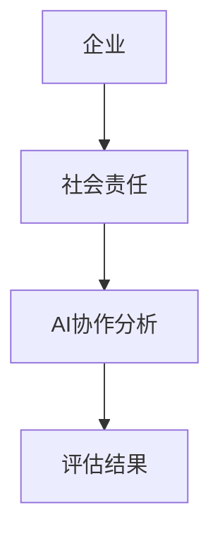
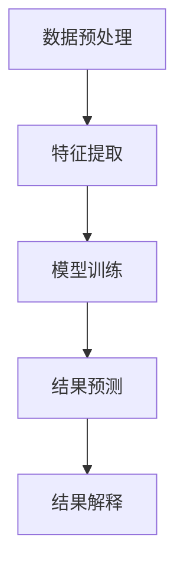
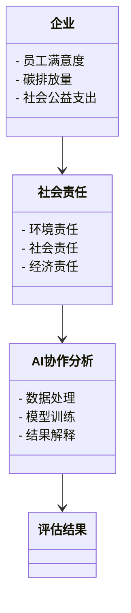
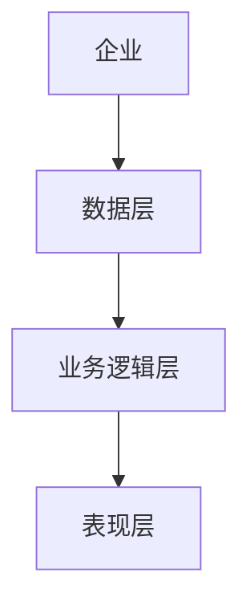

                 


# AI协作分析公司社会责任实践：全面评估企业价值

**关键词**：AI协作分析、企业社会责任、企业价值评估、社会责任评估、AI算法、企业风险管理

**摘要**：本文旨在探讨AI协作分析在公司社会责任实践中的应用，通过全面评估企业价值，帮助企业识别和优化社会责任表现。文章从背景介绍、核心概念、算法原理、系统架构、项目实战等多个维度进行详细分析，结合实际案例和最佳实践，为企业和社会提供可行的解决方案。

---

# 第一部分：AI协作分析的背景与概念

## 第1章：背景介绍

### 1.1 问题背景

#### 1.1.1 企业社会责任的定义与重要性
企业社会责任（Corporate Social Responsibility, CSR）是指企业在追求经济效益的同时，还需关注环境保护、员工权益、社会公益等方面的社会贡献。随着全球化和数字化的深入，企业社会责任已成为衡量企业综合价值的重要指标，直接影响企业的声誉、品牌形象和长期发展。

#### 1.1.2 AI技术在企业社会责任评估中的优势
传统的企业社会责任评估方法依赖于人工数据收集和分析，效率低且容易受主观因素影响。AI技术的引入，通过自动化数据处理、模式识别和预测分析，能够提高评估的准确性和效率，为企业和社会提供更客观的评估结果。

#### 1.1.3 当前企业社会责任评估的痛点与挑战
- 数据来源复杂：企业社会责任涉及多个维度，数据来源广泛且多样化。
- 数据量大：需要处理大量的非结构化数据，如文本、图像等。
- 数据质量参差不齐：部分数据可能存在缺失或不准确的问题。

### 1.2 问题描述

#### 1.2.1 企业社会责任的多维度评估需求
企业社会责任的评估需要考虑环境保护、员工福利、社会公益等多个维度，每个维度又包含多个子指标，评估过程复杂且耗时。

#### 1.2.2 现有评估方法的局限性
传统的评估方法通常依赖人工判断，存在主观性强、效率低、覆盖面窄等问题，难以满足现代企业的多样化需求。

#### 1.2.3 AI协作分析的必要性与可行性
AI技术能够通过大数据分析和机器学习算法，帮助企业高效、准确地评估社会责任表现，优化资源配置，提升企业综合竞争力。

### 1.3 问题解决

#### 1.3.1 AI协作分析的核心思路
通过收集和分析企业的社会责任相关数据，利用AI技术进行数据清洗、特征提取和模型训练，最终生成评估结果并提供改进建议。

#### 1.3.2 数据驱动的企业社会责任评估框架
- 数据收集：从企业内部系统、外部数据库、新闻媒体等多种渠道获取社会责任相关数据。
- 数据处理：清洗数据，去除噪声，提取关键特征。
- 模型训练：利用机器学习算法训练评估模型，生成评估结果。
- 结果分析：根据评估结果优化企业社会责任策略。

#### 1.3.3 技术与业务的深度融合
AI技术不仅能够提高评估效率，还能为企业提供数据驱动的决策支持，帮助企业更好地履行社会责任，实现可持续发展。

### 1.4 概念结构与核心要素

#### 1.4.1 企业社会责任的核心维度
- 环境责任：包括环境保护、节能减排等。
- 社会责任：包括员工权益、社区贡献等。
- 经济责任：包括经济效益、股东回报等。

#### 1.4.2 AI协作分析的关键要素
- 数据源：企业内部数据、外部公开数据。
- 数据处理：数据清洗、特征提取。
- AI模型：机器学习算法、自然语言处理技术。
- 评估结果：社会责任得分、改进建议。

#### 1.4.3 概念结构的可视化表示


---

## 第2章：核心概念与联系

### 2.1 AI协作分析的原理

#### 2.1.1 数据处理与特征提取
数据处理是AI协作分析的第一步，包括数据清洗、去重、格式转换等。特征提取则是从数据中提取能够反映企业社会责任的关键特征，如员工满意度、碳排放量等。

#### 2.1.2 模型训练与优化
利用机器学习算法（如支持向量机、随机森林等）对提取的特征进行训练，生成评估模型。通过交叉验证和调参优化，提高模型的准确性和稳定性。

#### 2.1.3 结果解释与反馈
模型生成的评估结果需要进行解释和反馈，帮助企业了解自身的社会责任表现，并根据结果制定改进措施。

### 2.2 核心概念属性对比表

| **核心概念** | **企业社会责任** | **AI协作分析** |
|--------------|------------------|----------------|
| **定义**     | 企业在经营过程中履行的社会义务。 | 利用AI技术对社会责任进行分析和评估。 |
| **目标**     | 提升企业形象，优化社会贡献。 | 提高评估效率，提供数据支持。 |
| **优势**     | 客观、全面、高效。 | 数据驱动，精准分析。 |

### 2.3 ER实体关系图


---

## 第3章：算法原理讲解

### 3.1 算法流程图



### 3.2 数学模型与公式

#### 3.2.1 损失函数
$$L = \frac{1}{n}\sum_{i=1}^{n}(y_i - \hat{y}_i)^2$$

#### 3.2.2 优化算法
$$\

---

# 第四部分：系统分析与架构设计

## 第4章：系统分析与架构设计

### 4.1 项目介绍

#### 4.1.1 项目背景
本项目旨在利用AI技术对企业社会责任进行评估，帮助企业优化社会责任表现，提升企业综合竞争力。

### 4.2 系统功能设计

#### 4.2.1 领域模型类图


#### 4.2.2 系统架构图


### 4.3 系统接口设计

#### 4.3.1 系统交互序列图


---

## 第5章：项目实战

### 5.1 环境安装

```bash
pip install numpy pandas scikit-learn
```

### 5.2 核心代码实现

```python
import pandas as pd
from sklearn.model import LinearRegression
from sklearn.metrics import mean_squared_error

# 数据加载
data = pd.read_csv('csr_data.csv')

# 特征提取
features = data[['员工满意度', '碳排放量', '社会公益支出']]
target = data['社会责任得分']

# 模型训练
model = LinearRegression()
model.fit(features, target)

# 结果预测
predictions = model.predict(features)
print('均方误差:', mean_squared_error(target, predictions))
```

### 5.3 代码应用解读与分析
通过上述代码，我们可以实现对企业社会责任的初步评估。数据加载和特征提取是关键步骤，模型训练和预测则帮助企业了解自身的社会责任表现。

### 5.4 实际案例分析与详细讲解剖析
以某制造企业为例，通过分析其员工满意度、碳排放量和公益支出，评估其社会责任表现，并提出改进建议。

### 5.5 项目小结
通过本项目，我们展示了AI协作分析在企业社会责任评估中的应用，为企业提供了高效、准确的评估方法。

---

## 第6章：最佳实践、小结、注意事项和拓展阅读

### 6.1 最佳实践
- 数据质量是关键，确保数据的准确性和完整性。
- 结合企业实际情况，选择合适的AI算法和模型。

### 6.2 小结
本文详细介绍了AI协作分析在企业社会责任评估中的应用，通过理论分析和实际案例，展示了AI技术在社会责任实践中的巨大潜力。

### 6.3 注意事项
- 数据隐私和安全问题需要高度重视。
- 模型的可解释性和透明度是实际应用中的重要考量。

### 6.4 拓展阅读
建议读者进一步学习机器学习和自然语言处理技术，探索AI在企业社会责任评估中的更多应用场景。

---

# 结语

AI协作分析为企业社会责任评估提供了新的思路和方法，帮助企业更好地履行社会责任，实现可持续发展。未来，随着技术的不断进步，AI在社会责任实践中的应用将更加广泛和深入。

---

**作者：AI天才研究院/AI Genius Institute & 禅与计算机程序设计艺术 /Zen And The Art of Computer Programming**

