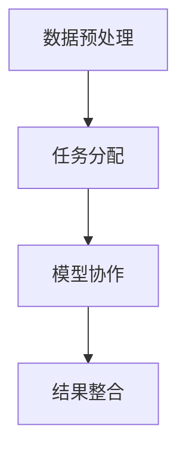
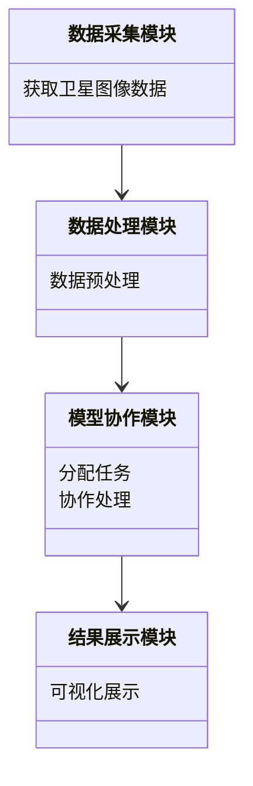
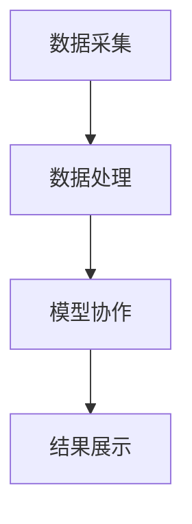

                 


# AI协作分析卫星图像数据：评估公司实际经营状况

> 关键词：AI协作，卫星图像数据，公司经营状况评估，图像分析，数据驱动决策

> 摘要：本文探讨如何利用AI协作技术分析卫星图像数据，评估公司实际经营状况。通过详细分析核心概念、算法原理、系统设计和项目实战，为读者提供全面的技术指导。

---

## 第一部分：背景介绍

### 第1章：问题背景与描述

#### 1.1 问题背景

随着全球经济的快速发展，企业经营状况的实时评估变得至关重要。传统的评估方法依赖于财务报表和现场调查，耗时且成本高昂。卫星图像数据作为一种新兴的数据源，提供了丰富的地理和经济信息，为评估公司经营状况提供了新的可能性。

#### 1.2 问题描述

卫星图像数据具有多样性、复杂性和高维性的特点，传统的数据分析方法难以高效处理这些数据。此外，企业经营状况的评估需要多维度的信息，如交通流量、建筑使用情况、员工数量等，这些信息在卫星图像中可能以非结构化的方式呈现，增加了分析的难度。

#### 1.3 问题解决与目标

通过AI协作技术，可以高效地从卫星图像中提取关键信息，结合其他数据源进行综合分析，实现对公司经营状况的实时评估。本文旨在探讨如何利用AI协作技术，分析卫星图像数据，评估公司经营状况。

#### 1.4 边界与外延

本文的研究范围限定在利用卫星图像数据评估公司经营状况，不涉及其他数据源的整合。此外，本文不考虑实时监控系统的设计，仅限于静态图像分析。

#### 1.5 核心概念与组成

- **AI协作**：指多个AI模型或算法协同工作，共同完成复杂任务。
- **卫星图像数据**：通过卫星拍摄的高分辨率图像，包含丰富的地理和经济信息。
- **公司经营状况评估**：通过对多维度数据的分析，评估公司的运营状况，包括盈利能力、市场表现等。

---

## 第二部分：核心概念与联系

### 第2章：核心概念原理

#### 2.1 AI协作的基本原理

AI协作通过多个AI模型协同工作，利用各自的优势，共同完成复杂任务。例如，图像分割任务可以分解为多个子任务，每个子任务由不同的模型负责，最终结果通过整合得到。

#### 2.2 卫星图像数据的特征分析

卫星图像数据具有以下特征：
- **多样性**：包含建筑物、道路、绿地等多种地物信息。
- **高维性**：每个像素包含多个波段的信息。
- **时间序列**：可以通过时间序列分析，观察地物的变化趋势。

#### 2.3 公司经营状况评估的指标体系

公司经营状况评估的关键指标包括：
- **盈利能力**：如净利润率、毛利率等。
- **市场表现**：如市场份额、品牌影响力等。
- **运营效率**：如库存周转率、资产利用率等。

### 第3章：概念属性特征对比与ER实体关系图

#### 3.1 核心概念属性对比

| 核心概念 | 定义 | 属性 | 示例 |
|----------|------|------|------|
| AI协作   | 多个AI模型协同工作 | 分布式计算、任务分解 | 图像分割、目标检测 |
| 卫星图像数据 | 卫星拍摄的高分辨率图像 | 多维性、多样性 | 建筑物、道路、绿地 |
| 公司经营状况评估 | 评估公司运营状况 | 多维度分析 | 利润能力、市场表现 |

#### 3.2 ER实体关系图

```mermaid
erd
  entity 公司经营状况评估 {
    经营指标
    财务数据
    卫星图像数据
  }
  entity 卫星图像数据 {
    建筑物
    道路
    绿地
  }
  entity AI协作 {
    图像分割
    目标检测
  }
```

---

## 第三部分：算法原理讲解

### 第4章：AI协作算法原理

#### 4.1 算法流程

AI协作分析卫星图像数据的流程如下：

1. 数据预处理：对卫星图像进行标准化处理，确保数据格式一致。
2. 任务分配：将图像分割任务分配给不同的AI模型。
3. 模型协作：各模型协同工作，完成图像分割任务。
4. 结果整合：将各模型的输出结果整合，得到最终的图像分割结果。



#### 4.2 算法实现

以下是一个简单的AI协作算法实现示例：

```python
def ai_collaboration(data):
    # 数据预处理
    processed_data = preprocess(data)
    
    # 任务分配
    tasks = distribute_tasks(processed_data)
    
    # 模型协作
    results = []
    for task in tasks:
        result = model_collaborate(task)
        results.append(result)
    
    # 结果整合
    final_result = integrate_results(results)
    return final_result
```

#### 4.3 数学模型与公式

AI协作算法的数学模型可以表示为：

$$
f(x) = w_1x_1 + w_2x_2 + ... + w_nx_n
$$

其中，$w_i$是第$i$个任务的权重，$x_i$是任务的输入数据。

---

## 第四部分：系统分析与架构设计

### 第5章：系统分析

#### 5.1 项目场景介绍

项目目标：利用AI协作技术，分析卫星图像数据，评估公司经营状况。

项目需求：实现对公司经营状况的实时评估，提供决策支持。

#### 5.2 系统功能设计

系统功能模块包括：
- 数据采集模块：负责获取卫星图像数据。
- 数据处理模块：对图像数据进行预处理。
- 模型协作模块：实现AI协作，完成图像分析任务。
- 结果展示模块：将分析结果以可视化形式展示。



#### 5.3 系统架构设计

系统架构包括数据采集、处理、分析和展示四个部分。



---

## 第五部分：项目实战

### 第6章：项目实战

#### 6.1 环境安装

需要安装以下环境：
- Python 3.8+
- TensorFlow 2.0+
- OpenCV 4.0+

安装命令：
```bash
pip install numpy
pip install tensorflow
pip install opencv-python
```

#### 6.2 核心代码实现

以下是一个简单的AI协作算法实现示例：

```python
import numpy as np
import tensorflow as tf
import cv2

def preprocess(image):
    # 数据预处理
    return image / 255.0

def model_collaborate(task):
    # AI协作模型
    model = tf.keras.Sequential([
        tf.keras.layers.Conv2D(32, (3,3), activation='relu'),
        tf.keras.layers.MaxPooling2D((2,2)),
        tf.keras.layers.Conv2D(64, (3,3), activation='relu'),
        tf.keras.layers.MaxPooling2D((2,2)),
        tf.keras.layers.Flatten(),
        tf.keras.layers.Dense(128, activation='relu'),
        tf.keras.layers.Dense(1, activation='sigmoid')
    ])
    model.compile(optimizer='adam', loss='binary_crossentropy', metrics=['accuracy'])
    model.fit(task['input'], task['label'], epochs=10, batch_size=32)
    return model.predict(task['input'])

def integrate_results(results):
    # 结果整合
    final_result = np.mean(results, axis=0)
    return final_result
```

#### 6.3 实际案例分析

以某公司为例，分析其卫星图像数据，评估其经营状况。

---

## 第六部分：总结与展望

### 第7章：总结与展望

#### 7.1 最佳实践 tips

- 数据预处理是关键，确保数据质量。
- 模型协作需要合理分配任务，确保效率。

#### 7.2 小结

通过AI协作技术，可以高效地分析卫星图像数据，评估公司经营状况，为企业提供决策支持。

#### 7.3 注意事项

- 数据隐私和安全问题需要注意。
- 模型的泛化能力需要进一步提升。

#### 7.4 拓展阅读

- 《深度学习》
- 《计算机视觉：深度学习技术》

---

作者：AI天才研究院

