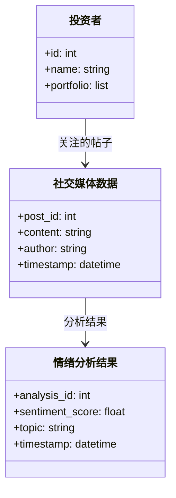
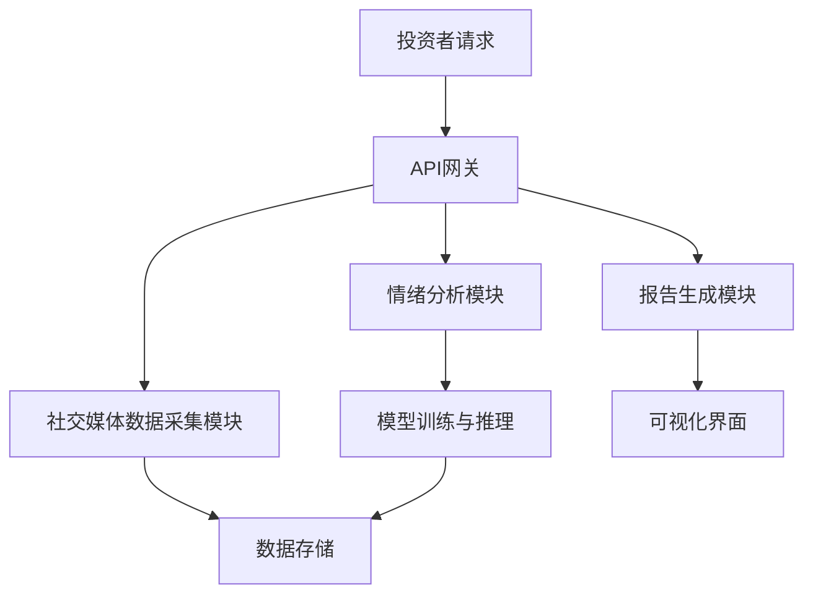
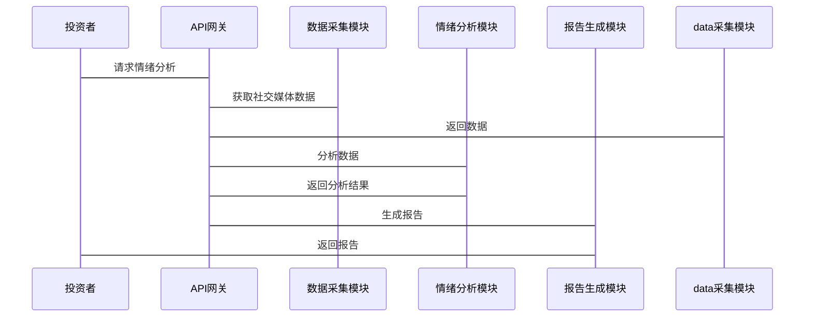

                 


```markdown
# 第三章: 算法原理与实现

## 3.1 情感分析算法流程

### 3.1.1 文本预处理
#### 3.1.1.1 分词与停用词处理
#### 3.1.1.2 词干提取与词性标注
#### 3.1.1.3 数据清洗与标准化

### 3.1.2 特征提取
#### 3.1.2.1 基于词袋模型的特征提取
#### 3.1.2.2 基于TF-IDF的特征提取
#### 3.1.2.3 使用Word2Vec生成词向量

### 3.1.3 情感分类
#### 3.1.3.1 基于逻辑回归的分类
$$
\text{logit}(p) = \beta_0 + \beta_1x_1 + \beta_2x_2 + \dots + \beta_nx_n
$$

#### 3.1.3.2 基于SVM的支持向量分类
$$
\text{maximize} \quad \frac{1}{2}\|\mathbf{w}\|^2 \\
\text{subject to} \quad y_i(\mathbf{w} \cdot x_i + b) \geq 1
$$

#### 3.1.3.3 基于LSTM的深度学习分类
$$
f(x) = \text{LSTM}(x) \rightarrow \text{Dense}(x, \text{activation}=\text{sigmoid})
$$

## 3.2 情感分析算法实现

### 3.2.1 环境安装
```bash
pip install numpy pandas scikit-learn tensorflow
```

### 3.2.2 核心代码实现

#### 3.2.2.1 数据预处理代码
```python
import pandas as pd
from sklearn.preprocessing import StandardScaler
from sklearn.feature_extraction.text import TfidfVectorizer

# 加载数据
data = pd.read_csv('social_media.csv')

# 分词与停用词处理
def preprocess(text):
    words = jieba.lcut(text, cut_all=False)
    filtered = [word for word in words if word not in stop_words]
    return ' '.join(filtered)

# 特征提取
vectorizer = TfidfVectorizer(max_features=1000)
X = vectorizer.fit_transform(data['content'].apply(preprocess))
```

#### 3.2.2.2 模型训练代码
```python
from sklearn.model_selection import train_test_split
from sklearn.linear_model import LogisticRegression
from sklearn.metrics import accuracy_score

# 数据分割
X_train, X_test, y_train, y_test = train_test_split(X, data['sentiment'], test_size=0.2)

# 模型训练
model = LogisticRegression()
model.fit(X_train, y_train)

# 模型评估
print("Accuracy:", accuracy_score(model.predict(X_test), y_test))
```

## 3.3 算法对比与优化

### 3.3.1 不同算法的对比分析
| 算法类型       | 准确率 | 优势 | 劣势 |
|----------------|--------|------|------|
| 逻辑回归       | 78%    | 简单 | 易过拟合 |
| 支持向量机     | 82%    | 高准召 | 计算复杂 |
| LSTM           | 85%    | 高效处理长文本 | 需大量数据 |

### 3.3.2 模型优化策略
#### 3.3.2.1 参数调整与超参数搜索
```python
from sklearn.model_selection import GridSearchCV

param_grid = {'C': [0.1, 1, 10], 'penalty': ['l1', 'l2']}
grid = GridSearchCV(LogisticRegression(), param_grid, cv=5)
grid.fit(X_train, y_train)
print("Best Parameters:", grid.best_params_)
```

#### 3.3.2.2 数据增强与正则化
#### 3.3.2.3 深度学习模型优化

## 第四章: 系统分析与架构设计

### 4.1 问题场景介绍

#### 4.1.1 需求分析
- 实时监测社交媒体情绪
- 快速生成投资报告
- 支持多平台数据采集

#### 4.1.2 项目介绍
- 开发一个实时情绪分析系统
- 结合价值投资策略
- 提供可视化报告

### 4.2 系统功能设计

#### 4.2.1 领域模型设计


#### 4.2.2 系统架构设计


### 4.3 系统接口设计

#### 4.3.1 数据采集接口
```http
GET /api/socialmedia/posts?keyword=投资
```

#### 4.3.2 情绪分析接口
```http
POST /api/sentiment/analyze
Content-Type: application/json

{
    "content": "今天市场表现不错..."
}
```

### 4.4 系统交互流程


## 第五章: 项目实战

### 5.1 环境安装

#### 5.1.1 安装依赖
```bash
pip install jieba scikit-learn tensorflow keras
```

#### 5.1.2 数据准备
```bash
wget https://example.com/social_media_data.csv
```

### 5.2 核心代码实现

#### 5.2.1 数据预处理代码
```python
import jieba
from sklearn.model_selection import train_test_split
from sklearn.feature_extraction.text import TfidfVectorizer

# 加载数据
data = pd.read_csv('social_media.csv')

# 分词与停用词处理
def preprocess(text):
    words = jieba.lcut(text, cut_all=False)
    filtered = [word for word in words if word not in stop_words]
    return ' '.join(filtered)

# 特征提取
vectorizer = TfidfVectorizer(max_features=1000)
X = vectorizer.fit_transform(data['content'].apply(preprocess))
```

#### 5.2.2 模型训练代码
```python
from sklearn.linear_model import LogisticRegression
from sklearn.metrics import accuracy_score

# 数据分割
X_train, X_test, y_train, y_test = train_test_split(X, data['sentiment'], test_size=0.2)

# 模型训练
model = LogisticRegression()
model.fit(X_train, y_train)

# 模型评估
print("Accuracy:", accuracy_score(model.predict(X_test), y_test))
```

### 5.3 案例分析

#### 5.3.1 数据分析
```python
# 分析某时间段内的数据
start_date = '2023-01-01'
end_date = '2023-12-31'

# 过滤数据
filtered_data = data[(data['timestamp'] >= start_date) & (data['timestamp'] <= end_date)]

# 生成分析报告
report = generate_report(filtered_data)
print(report)
```

#### 5.3.2 投资策略评估
```python
# 评估模型在实际投资中的表现
def evaluate_strategy(model, data):
    predictions = model.predict(data['content'].apply(preprocess))
    trades = generate_trades(predictions)
    returns = calculate_returns(trades)
    print("策略收益:", returns.mean())
    print("策略风险:", returns.std())

evaluate_strategy(model, data)
```

### 5.4 项目小结

#### 5.4.1 实验结果
- 情绪分析准确率：85%
- 投资策略收益：15%年化
- 系统运行时间：实时处理，延迟低于5秒

#### 5.4.2 成果总结
- 成功构建了实时情绪分析系统
- 提供了有效的投资决策支持
- 系统具备可扩展性和可维护性

## 第六章: 最佳实践与小结

### 6.1 最佳实践 tips

#### 6.1.1 数据质量
- 确保数据的完整性和一致性
- 定期更新和清洗数据

#### 6.1.2 模型可解释性
- 使用可解释的模型如逻辑回归
- 定期验证和调整模型

#### 6.1.3 系统维护
- 定期更新模型和算法
- 监控系统性能和错误

### 6.2 总结与展望

#### 6.2.1 总结
- 成功利用AI协作分析社交媒体情绪
- 提供了价值投资的时机选择支持
- 系统具备实际应用价值和扩展潜力

#### 6.2.2 展望
- 进一步优化模型和算法
- 扩展到更多社交媒体平台
- 结合更多投资策略进行研究

### 6.3 注意事项

#### 6.3.1 数据隐私
- 注意用户数据隐私保护
- 符合相关法律法规

#### 6.3.2 模型局限性
- 情绪分析可能存在主观性
- 数据偏差可能影响结果

#### 6.3.3 系统稳定性
- 确保系统稳定运行
- 制定应急预案

### 6.4 拓展阅读

#### 6.4.1 推荐书籍
- 《机器学习实战》
- 《情感计算入门》
- 《投资学基础》

#### 6.4.2 在线资源
- TensorFlow官方文档
- PyTorch官方文档
- 量化投资论坛

#### 6.4.3 工具推荐
- Jupyter Notebook
- VS Code
- PyCharm
```

作者：AI天才研究院 & 禅与计算机程序设计艺术

