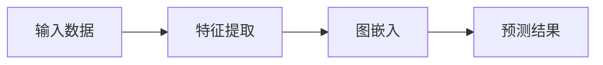
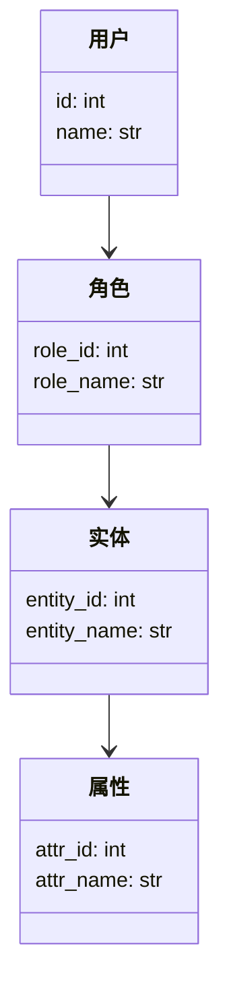

                 


```markdown
# AI协作构建动态产业生态图：全面把握投资环境

> 关键词：AI协作、动态产业生态图、投资环境、协同学习、图神经网络

> 摘要：本文深入探讨AI协作在构建动态产业生态图中的作用，分析投资环境的变化，并通过具体案例展示如何利用AI技术进行产业生态图的构建与投资决策。

---

## 第一部分: AI协作构建动态产业生态图的背景与概念

### 第1章: AI协作与动态产业生态图概述

#### 1.1 AI协作的背景与意义
##### 1.1.1 从传统协作到AI协作的演进
在传统协作模式下，人类主要依赖经验和直觉进行决策。然而，随着数据量的爆炸式增长和业务复杂性的提升，传统协作方式逐渐暴露出效率低下、信息孤岛等问题。AI协作的引入，通过智能化工具和算法，显著提升了协作效率和决策的准确性。

##### 1.1.2 AI协作的核心概念与特点
AI协作是一种基于人工智能技术的新型协作模式，它利用机器学习、自然语言处理和知识图谱等技术，帮助人类更高效地完成任务。其特点包括智能化、实时性、可扩展性和个性化。

##### 1.1.3 动态产业生态图的定义与外延
动态产业生态图是一种可视化工具，用于描述产业间的关系、资源流动和价值传递。它能够动态更新，反映市场变化和企业互动，为企业战略制定和投资决策提供支持。

#### 1.2 投资环境的动态变化
##### 1.2.1 投资环境的复杂性与不确定性
现代投资环境受到全球经济波动、政策变化和技术革新的影响，呈现出高度复杂性和不确定性。投资者需要实时掌握市场动态，以做出明智决策。

##### 1.2.2 产业生态图与投资决策的关系
产业生态图通过展示产业链上下游的关系，帮助投资者识别潜在风险和机会，优化投资组合，提高投资效率。

##### 1.2.3 AI在投资环境分析中的作用
AI技术能够处理海量数据，识别数据中的模式和趋势，为投资环境分析提供有力支持。例如，通过自然语言处理技术分析新闻和社交媒体，预测市场情绪变化。

---

### 第2章: AI协作的核心概念与联系

#### 2.1 AI协作的核心原理
##### 2.1.1 协同学习的基本原理
协同学习是一种机器学习技术，通过多个学习器的协作，提高模型的准确性和鲁棒性。例如，使用投票法或平均法整合多个模型的预测结果。

##### 2.1.2 图神经网络的构建与应用
图神经网络是一种处理图结构数据的深度学习方法，广泛应用于社交网络分析、推荐系统等领域。通过构建产业生态图，图神经网络能够捕捉企业之间的复杂关系。

##### 2.1.3 动态产业生态图的构建方法
动态产业生态图的构建需要整合多源数据，利用图数据库和流数据处理技术，实时更新图结构。例如，使用Neo4j构建图数据库，结合Apache Kafka处理实时数据流。

#### 2.2 核心概念对比与ER实体关系图
##### 2.2.1 AI协作与传统协作的对比分析
| 对比维度 | AI协作 | 传统协作 |
|----------|--------|----------|
| 协作效率 | 高     | 较低     |
| 决策依据 | 数据驱动 | 经验驱动 |
| 可扩展性 | 强     | 较弱     |

##### 2.2.2 产业生态图与传统产业图的对比
| 对比维度 | 动态产业生态图 | 传统产业图 |
|----------|----------------|------------|
| 动态性   | 高             | 较低       |
| 交互性   | 强             | 较弱       |
| 数据源   | 多源异构       | 单一       |

##### 2.2.3 ER实体关系图的构建与分析
```mermaid
er
    actor: 用户
    actor --> role: 角色
    role --> entity: 实体
    entity --> attribute: 属性
```

#### 2.3 算法原理与数学模型
##### 2.3.1 协同过滤算法的数学模型
协同过滤算法通过计算用户之间的相似度，推荐相似用户的商品。相似度计算公式为：
$$
sim(i,j) = \frac{\sum_{k} r_{ik} r_{jk}}{\sqrt{\sum_{k} r_{ik}^2} \sqrt{\sum_{k} r_{jk}^2}}
$$

##### 2.3.2 图神经网络的构建流程


##### 2.3.3 代码实现与解读
```python
import numpy as np

def similarity_matrix(matrix):
    numerator = matrix.dot(matrix.T)
    denominator = np.sqrt((matrix**2).sum(axis=1)).reshape(-1, 1)
    return numerator / denominator

# 示例数据
matrix = np.array([[1, 2], [2, 3], [3, 4]])
similarity = similarity_matrix(matrix)
print(similarity)
```

---

## 第三部分: 系统分析与架构设计方案

### 第3章: 系统分析与架构设计

#### 3.1 问题场景介绍
通过构建动态产业生态图，帮助企业识别潜在合作伙伴、评估风险，并制定投资策略。

#### 3.2 系统功能设计
##### 3.2.1 领域模型设计


##### 3.2.2 系统架构设计


---

## 第四部分: 项目实战

### 第4章: 项目实战与案例分析

#### 4.1 项目环境安装
##### 4.1.1 安装依赖
```bash
pip install numpy pandas networkx
```

#### 4.2 核心代码实现
##### 4.2.1 读取数据与构建图
```python
import networkx as nx

G = nx.Graph()
G.add_nodes_from(["A", "B", "C"])
G.add_edges_from([("A", "B"), ("B", "C")])
```

#### 4.3 代码应用解读与分析
##### 4.3.1 代码实现步骤
1. 读取数据并构建图结构。
2. 使用网络分析算法识别关键节点。
3. 可视化图结构，分析企业之间的关系。

#### 4.4 案例分析与详细讲解
以某行业为例，构建产业生态图，分析关键企业的合作关系和市场趋势。

#### 4.5 项目小结
通过项目实战，验证了AI协作构建动态产业生态图的有效性，为投资决策提供了有力支持。

---

## 第五部分: 最佳实践与小结

### 第5章: 最佳实践与注意事项

#### 5.1 投资策略优化
##### 5.1.1 数据驱动的决策
基于动态产业生态图进行数据驱动的决策，能够显著提高投资效率。

##### 5.1.2 风险管理
通过实时监控市场变化和企业动态，识别潜在风险，制定应对策略。

#### 5.2 小结与展望
AI协作技术在构建动态产业生态图中的应用前景广阔，未来将更加智能化和个性化。

#### 5.3 注意事项
在实际应用中，需要注意数据隐私、模型可解释性和算法的实时性等问题。

#### 5.4 拓展阅读
推荐阅读《机器学习实战》、《深度学习》等书籍，进一步提升对AI协作技术的理解。

---

## 作者

作者：AI天才研究院/AI Genius Institute & 禅与计算机程序设计艺术 /Zen And The Art of Computer Programming
```

