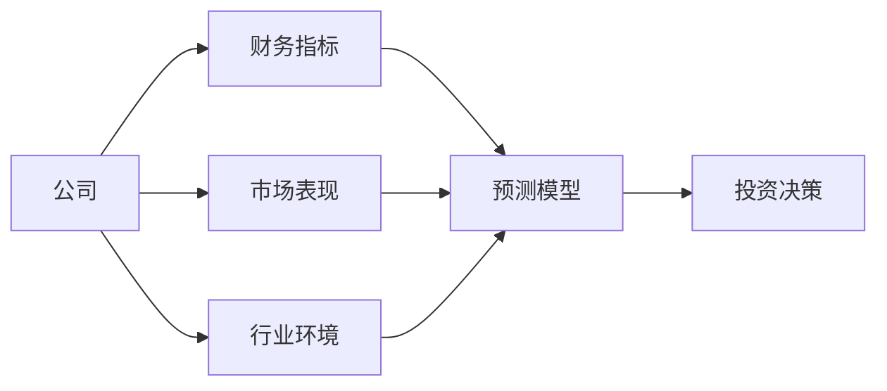
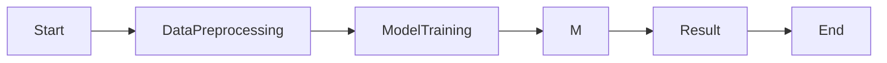

                 


```markdown
# AI协作预测公司成长性：增强价值投资的前瞻性

## 关键词：AI、协作预测、公司成长性、价值投资、前瞻性

## 摘要：  
本文探讨了AI如何通过协作预测公司成长性来增强价值投资的前瞻性。通过分析公司财务数据、市场表现和行业环境等多维度指标，AI能够帮助投资者更精准地预测公司未来表现，优化投资决策。本文结合理论与实践，详细阐述了AI协作预测的核心概念、算法原理、系统架构，并通过案例分析展示了其在价值投资中的实际应用。

---

## 目录

1. [背景与概念](#背景与概念)
2. [AI协作预测的核心概念与联系](#AI协作预测的核心概念与联系)
3. [AI协作预测的算法原理](#AI协作预测的算法原理)
4. [AI协作预测的系统架构](#AI协作预测的系统架构)
5. [AI协作预测的项目实战](#AI协作预测的项目实战)
6. [总结与展望](#总结与展望)

---

## 背景与概念

### 1.1 问题背景  
传统的价值投资依赖于分析师的经验和主观判断，存在信息处理不全面、预测准确性不足等问题。随着AI技术的快速发展，利用AI进行公司成长性预测成为可能。通过AI协作，可以整合多维度数据，构建更精准的预测模型，从而增强投资决策的前瞻性。

### 1.2 问题描述  
公司成长性预测的核心在于分析财务数据、市场表现和行业环境。AI协作预测通过整合这些数据，构建多层次的预测模型，帮助投资者更准确地评估公司的未来表现。  

### 1.3 问题解决  
AI协作预测通过以下方式增强价值投资的前瞻性：  
- 利用机器学习算法分析历史数据，预测未来趋势。  
- 结合多维度指标（如收入增长率、净利润率、行业景气度等）进行综合评估。  
- 提供实时监控和动态调整的预测结果。  

---

## AI协作预测的核心概念与联系

### 2.1 核心概念原理  
AI协作预测的核心在于将多个模型的优势相结合，通过数据驱动和模型驱动的双重分析，提升预测的准确性和全面性。  

### 2.2 核心概念属性对比  
以下是不同预测方法的对比分析：  

| 预测方法 | 优点 | 缺点 |
|----------|------|------|
| 单一模型 | 简单易实现 | 易受数据偏差影响 |
| 多模型协作 | 结果更准确 | 实现复杂度高 |
| 数据驱动 | 依赖历史数据 | 无法预测黑天鹅事件 |
| 模型驱动 | 可解释性强 | 对数据质量要求高 |

### 2.3 实体关系图  
以下是公司成长性预测的实体关系图：  



---

## AI协作预测的算法原理

### 3.1 算法原理概述  
AI协作预测的核心算法包括：  
1. **数据预处理**：清洗和标准化数据。  
2. **特征提取**：从多维度数据中提取关键特征。  
3. **模型训练**：使用机器学习算法（如随机森林、支持向量机等）构建预测模型。  
4. **模型协作**：通过集成学习方法（如投票法、加权平均）优化预测结果。  

### 3.2 算法流程图  


### 3.3 数学模型  
以下是预测模型的数学表达式：  
$$ y = \sum_{i=1}^{n} w_i x_i + b $$  
其中，$w_i$ 是特征 $x_i$ 的权重，$b$ 是偏置项。  

---

## AI协作预测的系统架构

### 4.1 系统架构设计  
以下是AI协作预测系统的架构图：  

```mermaid
graph LR
    Client --> API Gateway
    API Gateway --> Load Balancer
    Load Balancer --> Service1
    Load Balancer --> Service2
    Service1 --> Database
    Service2 --> ModelServer
    ModelServer --> Result
```

### 4.2 功能模块  
- **数据采集模块**：收集公司财务数据、市场数据等。  
- **数据处理模块**：清洗和标准化数据。  
- **模型训练模块**：训练预测模型。  
- **结果输出模块**：生成预测结果并输出。  

---

## AI协作预测的项目实战

### 5.1 环境安装  
需要安装以下工具：  
- Python 3.8+  
- Scikit-learn、Pandas、NumPy等库。  

### 5.2 核心代码实现  
以下是预测模型的实现代码：  

```python
import pandas as pd
from sklearn.ensemble import RandomForestRegressor
from sklearn.metrics import mean_squared_error

# 数据加载
data = pd.read_csv('company_data.csv')

# 特征提取
X = data[['revenue_growth', 'net_profit_margin', 'industry_trend']]
y = data['company_growth']

# 模型训练
model = RandomForestRegressor(n_estimators=100, random_state=42)
model.fit(X, y)

# 预测结果
predicted = model.predict(X)
print(mean_squared_error(y, predicted))
```

### 5.3 实际案例分析  
以某公司为例，分析其财务数据，预测其未来三年的收入增长率。  

---

## 总结与展望

### 6.1 总结  
本文详细探讨了AI协作预测公司成长性的原理、算法和系统架构，并通过实际案例展示了其在价值投资中的应用。AI协作预测能够显著提升投资决策的准确性和前瞻性。  

### 6.2 展望  
未来，随着AI技术的不断发展，公司成长性预测将更加精准，投资决策将更加智能化。同时，如何处理数据隐私和模型解释性问题也是需要进一步研究的方向。

---

## 作者：AI天才研究院 & 禅与计算机程序设计艺术
```

