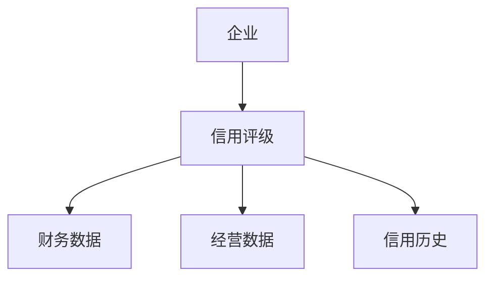
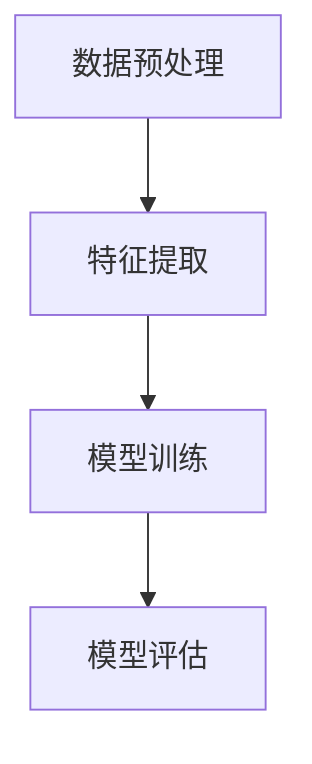
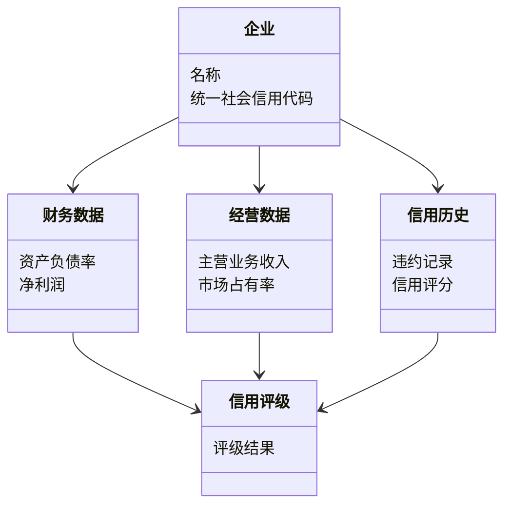
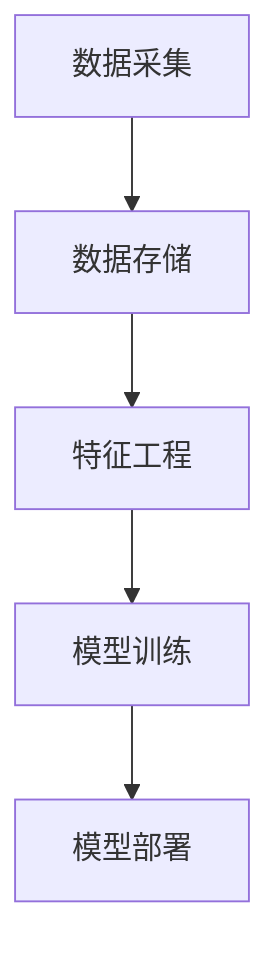

                 


# AI在企业信用评级中的应用与挑战

---

## 关键词：
- 人工智能（AI）
- 企业信用评级
- 机器学习
- 深度学习
- 自然语言处理

---

## 摘要：
随着人工智能技术的快速发展，AI在企业信用评级中的应用越来越广泛。通过机器学习和深度学习算法，AI能够快速分析企业的财务数据、经营数据和信用历史，从而帮助企业做出更准确的信用评级。然而，AI在信用评级中的应用也面临数据质量、模型解释性和隐私保护等挑战。本文将从AI在信用评级中的核心概念、算法原理、系统架构、项目实战以及最佳实践等方面进行深入探讨，为读者提供全面的视角。

---

## 第1章: 企业信用评级的背景与问题背景

### 1.1 企业信用评级的定义与重要性

#### 1.1.1 企业信用评级的定义
企业信用评级是对企业在经济活动中履行债务的能力和可能性的综合评价。它是企业融资、投资决策和风险管理的重要依据。

#### 1.1.2 企业信用评级的重要性
信用评级能够帮助金融机构评估企业的信用风险，降低违约率，同时也有助于企业获得更优惠的融资条件。

#### 1.1.3 传统信用评级的局限性
传统的信用评级方法主要依赖人工分析，耗时且容易受到主观因素的影响，难以处理海量数据和复杂场景。

### 1.2 AI技术在信用评级中的应用背景

#### 1.2.1 AI技术的快速发展
人工智能技术的进步，尤其是机器学习和深度学习算法的成熟，为信用评级提供了新的解决方案。

#### 1.2.2 信用评级行业的痛点
传统信用评级方法效率低、成本高，难以应对日益复杂的金融环境和多样化的数据需求。

#### 1.2.3 AI技术如何解决信用评级问题
AI可以通过自动化数据处理、特征提取和模型训练，快速生成信用评级结果，提高效率和准确性。

---

## 第2章: AI在企业信用评级中的核心概念

### 2.1 信用评级的核心要素

#### 2.1.1 企业财务状况
包括资产负债表、利润表等财务数据，用于评估企业的偿债能力和盈利能力。

#### 2.1.2 企业经营状况
包括主营业务收入、市场占有率等经营数据，反映企业的经营健康状况。

#### 2.1.3 企业信用历史
包括过去的违约记录和信用评分，用于评估企业的信用行为和信用风险。

### 2.2 AI模型在信用评级中的应用

#### 2.2.1 机器学习模型
常用的机器学习模型包括逻辑回归、支持向量机（SVM）和随机森林（Random Forest）。

#### 2.2.2 深度学习模型
深度学习模型如卷积神经网络（CNN）和循环神经网络（RNN）在处理非结构化数据时表现优异。

#### 2.2.3 自然语言处理模型
自然语言处理（NLP）技术可以用于分析企业的新闻报道、公告等文本数据，提取隐含信息。

### 2.3 核心概念与联系

#### 2.3.1 实体关系图


#### 2.3.2 属性特征对比表
| 特征类型 | 描述 | 示例 |
|----------|------|------|
| 财务特征 | 财务指标 | 资产负债率 |
| 经营特征 | 经营指标 | 主营业务收入增长率 |
| 信用特征 | 信用指标 | 违约历史 |

---

## 第3章: AI在信用评级中的算法原理

### 3.1 常见算法介绍

#### 3.1.1 逻辑回归
逻辑回归是一种经典的分类算法，适用于二分类问题。

#### 3.1.2 支持向量机（SVM）
SVM适用于高维数据的分类和回归问题，具有良好的泛化能力。

#### 3.1.3 神经网络
神经网络通过多层结构模拟人脑的神经网络，能够处理复杂的非线性关系。

### 3.2 算法流程图



### 3.3 逻辑回归算法实现

#### 3.3.1 损失函数
$$ L(\theta) = -\frac{1}{m} \sum_{i=1}^{m} [y_i \ln h(x_i) + (1 - y_i) \ln (1 - h(x_i))] $$

其中，$h(x_i) = \frac{1}{1 + e^{-\theta^T x_i}}$ 是sigmoid函数。

#### 3.3.2 优化过程
使用梯度下降方法优化损失函数，更新参数 $\theta$，直到收敛。

---

## 第4章: 系统分析与架构设计方案

### 4.1 问题场景介绍

#### 4.1.1 项目介绍
设计一个基于AI的企业信用评级系统，实现对企业信用风险的自动化评估。

#### 4.1.2 领域模型设计


#### 4.1.3 系统架构设计


---

## 第5章: 项目实战

### 5.1 环境安装
安装必要的Python库：
```bash
pip install pandas numpy scikit-learn
```

### 5.2 系统核心实现源代码

#### 5.2.1 数据预处理
```python
import pandas as pd
import numpy as np

# 加载数据
data = pd.read_csv('enterprise_data.csv')

# 数据清洗
data.dropna(inplace=True)
```

#### 5.2.2 特征工程
```python
from sklearn.preprocessing import StandardScaler

# 特征标准化
scaler = StandardScaler()
X_scaled = scaler.fit_transform(data.drop('label', axis=1))
```

#### 5.2.3 模型训练
```python
from sklearn.linear_model import LogisticRegression

# 训练逻辑回归模型
model = LogisticRegression()
model.fit(X_scaled, data['label'])
```

#### 5.2.4 模型评估
```python
from sklearn.metrics import accuracy_score

# 预测结果
y_pred = model.predict(X_scaled)
print('准确率:', accuracy_score(data['label'], y_pred))
```

### 5.3 代码应用解读与分析

#### 5.3.1 数据预处理
- 使用`pandas`读取数据并进行清洗，处理缺失值。

#### 5.3.2 特征工程
- 使用`StandardScaler`对特征进行标准化，消除特征之间的量纲差异。

#### 5.3.3 模型训练
- 使用逻辑回归模型进行训练，目标是将企业分为高风险和低风险两类。

#### 5.3.4 模型评估
- 使用准确率评估模型性能，准确率越高，模型效果越好。

---

## 第6章: 最佳实践与小结

### 6.1 最佳实践 tips
- 数据质量是模型性能的基础，需确保数据的完整性和准确性。
- 模型解释性是信用评级的重要要求，需选择适合业务需求的模型。
- 隐私保护是信用评级系统设计中的重要考虑因素。

### 6.2 小结
AI技术为信用评级带来了新的可能性，但同时也面临数据质量和模型解释性等挑战。未来，随着技术的进步，AI在信用评级中的应用将更加广泛和深入。

### 6.3 注意事项
- 在实际应用中，需结合业务需求选择合适的算法。
- 数据隐私和合规性需严格遵守相关法律法规。

### 6.4 拓展阅读
- 《机器学习实战》
- 《深度学习》
- 《自然语言处理入门》

---

## 附录

### 附录A: 数据集
企业信用评级数据集示例：
```csv
企业名称,统一社会信用代码,资产负债率,净利润,主营业务收入,市场占有率,违约记录,信用评分,标签
公司A,123456789012345,60%,100万,1000万,20%,否,70,低风险
公司B,654321098765432,70%,50万,500万,10%,否,60,高风险
...
```

### 附录B: 参考文献
- [1] 周志华. 《机器学习实战》. 清华大学出版社, 2017.
- [2] Ian Goodfellow. 《Deep Learning》. MIT Press, 2016.
- [3] 赵春江. 《自然语言处理入门》. 人民邮电出版社, 2020.

---

## 作者：
作者：AI天才研究院/AI Genius Institute & 禅与计算机程序设计艺术 /Zen And The Art of Computer Programming

