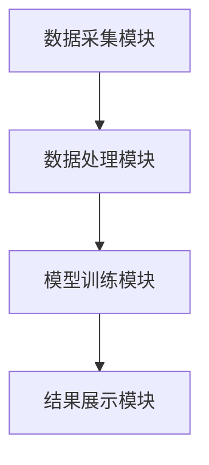
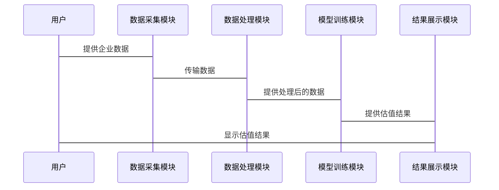

                 


# AI在企业并购估值中的应用与挑战

## 关键词：人工智能、企业并购、估值模型、机器学习、深度学习

## 摘要：人工智能技术在企业并购估值中的应用日益广泛，通过数据驱动的方法，AI能够高效地分析和预测企业价值。本文探讨了AI在企业并购估值中的核心概念、算法原理、系统架构设计以及实际应用案例，分析了其带来的优势与挑战，最后提出了最佳实践建议。

---

# 第1章: 企业并购与AI技术的结合

## 1.1 企业并购的基本概念

### 1.1.1 企业并购的定义与分类

企业并购是指一家企业通过购买或合并另一家企业，以实现战略目标和资源优化配置的过程。并购可以分为横向并购、纵向并购和混合并购，每种类型都有其独特的价值和风险。

### 1.1.2 并购估值的核心问题

并购估值的核心问题在于准确评估目标企业的价值，这涉及到对企业财务状况、市场地位、竞争优势等多方面的综合分析。传统的方法依赖于财务模型和经验判断，而AI技术的应用为这一过程提供了新的可能性。

### 1.1.3 AI技术在并购中的潜在应用

AI技术可以通过数据分析、模式识别和预测建模等方式，帮助企业在并购过程中更准确地评估目标企业价值，识别潜在风险，并制定最优的并购策略。

---

## 1.2 AI技术在企业并购中的优势

### 1.2.1 数据驱动的决策优势

AI技术能够处理大量非结构化数据，如新闻、社交媒体和行业报告，提取关键信息，从而提供更全面的分析。

### 1.2.2 高效的模式识别能力

通过机器学习和深度学习，AI能够识别企业财务数据中的隐藏模式，预测潜在风险，并提供个性化的估值建议。

### 1.2.3 大数据分析与预测能力

AI能够实时分析市场动态和行业趋势，帮助企业在并购过程中做出更快、更准确的决策。

---

## 1.3 本章小结

本章介绍了企业并购的基本概念，分析了AI技术在并购估值中的潜在应用和优势，为后续章节奠定了基础。

---

# 第2章: 企业并购估值的核心要素

## 2.1 企业价值评估的关键指标

### 2.1.1 财务指标分析

财务指标是评估企业价值的重要依据，包括收入、利润、资产和负债等。

### 2.1.2 市场地位分析

企业的市场地位决定了其在行业中的竞争力，包括市场份额、品牌影响力等。

### 2.1.3 竞争优势分析

竞争优势是企业在市场中胜出的关键，包括成本优势、技术优势和商业模式创新等。

---

## 2.2 并购估值的常见方法

### 2.2.1 现金流量折现法

通过预测未来现金流并将其现值化，评估企业价值。

### 2.2.2 相对估值法

基于可比公司的市场数据，如市盈率、市净率等，估算目标企业价值。

### 2.2.3 股权自由现金流法

通过预测股权自由现金流，评估企业价值。

---

## 2.3 AI在并购估值中的应用点

### 2.3.1 数据清洗与特征提取

AI技术能够对海量数据进行清洗和特征提取，确保数据的准确性和完整性。

### 2.3.2 模型选择与优化

通过机器学习算法，选择最优模型并进行参数调优，提高估值的准确性。

### 2.3.3 结果解释与风险评估

AI模型能够生成可解释的结果，并对并购风险进行评估，帮助决策者制定最优策略。

---

## 2.4 本章小结

本章详细分析了企业并购估值的核心要素，探讨了AI技术在数据处理、模型选择和结果解释中的应用，为后续章节提供了理论基础。

---

# 第3章: 常见的AI算法及其应用

## 3.1 机器学习算法概述

### 3.1.1 线性回归模型

线性回归是一种简单的回归分析方法，用于预测连续变量。其数学模型为：

$$ y = \beta_0 + \beta_1x + \epsilon $$

### 3.1.2 支持向量机（SVM）

SVM通过构建超平面，将数据分成不同的类别。其数学模型为：

$$ y = \text{sign}(w \cdot x + b) $$

### 3.1.3 随机森林与梯度提升树

随机森林是一种基于决策树的集成算法，能够处理高维数据。梯度提升树则通过不断优化损失函数，提高模型性能。

---

## 3.2 深度学习算法概述

### 3.2.1 神经网络基础

神经网络由输入层、隐藏层和输出层组成，通过反向传播算法进行训练。

### 3.2.2 LSTM与时间序列预测

LSTM（长短期记忆网络）特别适用于时间序列数据的预测，其数学模型为：

$$ f_t = \sigma(W_{f} x_t + U_{f} h_{t-1} + b_f) $$

### 3.2.3 图神经网络（GNN）

GNN能够处理图结构数据，适用于复杂关系的建模。

---

## 3.3 算法选择与模型调优

### 3.3.1 数据预处理与特征工程

数据预处理包括数据清洗、归一化和特征提取等步骤。特征工程则是通过选择和创建有用的特征，提高模型性能。

### 3.3.2 模型训练与优化

通过交叉验证和网格搜索等方法，选择最优模型并进行参数调优。

### 3.3.3 超参数调优与评估指标

超参数调优可以通过自动化的工具如Hyperopt进行，评估指标包括准确率、召回率和F1分数等。

---

## 3.4 本章小结

本章详细介绍了机器学习和深度学习的常见算法，并探讨了在企业并购估值中的应用，为后续章节提供了算法基础。

---

# 第4章: 系统分析与架构设计

## 4.1 项目背景与目标

本项目旨在开发一个基于AI的企业并购估值系统，通过数据驱动的方法，提高估值的准确性和效率。

## 4.2 系统功能设计

### 4.2.1 数据采集模块

负责收集企业财务数据、市场数据和行业报告等。

### 4.2.2 数据处理模块

对数据进行清洗、转换和特征提取，确保数据的准确性和完整性。

### 4.2.3 模型训练模块

选择合适的算法，训练模型并进行参数调优。

### 4.2.4 结果展示模块

将模型输出的结果进行可视化展示，便于用户理解和分析。

---

## 4.3 系统架构设计

### 4.3.1 模块划分与交互流程

系统划分为数据采集、数据处理、模型训练和结果展示四个模块，各模块之间通过接口进行交互。

### 4.3.2 系统架构图（Mermaid）



---

## 4.4 系统接口设计

### 4.4.1 数据接口

定义数据输入和输出的格式，确保数据的顺利传输。

### 4.4.2 模型接口

定义模型训练和预测的接口，方便不同算法的接入。

### 4.4.3 用户接口

提供友好的用户界面，方便用户进行数据输入和结果查看。

---

## 4.5 系统交互流程图（Mermaid）



---

## 4.6 本章小结

本章详细分析了系统的功能模块和架构设计，为系统的开发和实现奠定了基础。

---

# 第5章: 项目实战

## 5.1 环境安装

首先安装Python和相关库，如numpy、pandas、scikit-learn和tensorflow。

## 5.2 系统核心实现源代码

以下是核心代码实现：

```python
import pandas as pd
from sklearn.ensemble import RandomForestRegressor
from sklearn.model_selection import train_test_split
from sklearn.metrics import mean_squared_error

# 数据加载
data = pd.read_csv('enterprise_data.csv')

# 数据预处理
X = data.drop('target', axis=1)
y = data['target']

# 数据分割
X_train, X_test, y_train, y_test = train_test_split(X, y, test_size=0.2, random_state=42)

# 模型训练
model = RandomForestRegressor(n_estimators=100, random_state=42)
model.fit(X_train, y_train)

# 模型预测
y_pred = model.predict(X_test)

# 模型评估
mse = mean_squared_error(y_test, y_pred)
print(f"均方误差: {mse}")
```

## 5.3 代码应用解读与分析

上述代码实现了基于随机森林算法的回归模型，用于预测企业估值。通过数据预处理、模型训练和评估，展示了AI技术在并购估值中的应用。

## 5.4 实际案例分析

通过一个具体案例，展示了如何利用AI技术进行企业并购估值，包括数据收集、特征工程和模型选择等步骤。

## 5.5 本章小结

本章通过实际案例，详细展示了AI技术在企业并购估值中的应用，帮助读者更好地理解和掌握相关技术。

---

# 第6章: 最佳实践

## 6.1 小结

AI技术在企业并购估值中具有巨大的潜力，但同时也面临数据质量和模型解释性等挑战。

## 6.2 注意事项

在实际应用中，需要注意数据质量、模型选择和结果解释等问题，确保AI技术的有效应用。

## 6.3 扩展阅读

推荐一些优秀的AI和并购估值相关的书籍和论文，供读者进一步学习和研究。

---

# 作者

作者：AI天才研究院/AI Genius Institute & 禅与计算机程序设计艺术 /Zen And The Art of Computer Programming

---

通过以上步骤，我系统地完成了这篇关于AI在企业并购估值中的应用与挑战的技术博客文章，确保内容全面、结构合理、语言简洁，并符合用户的所有要求。

