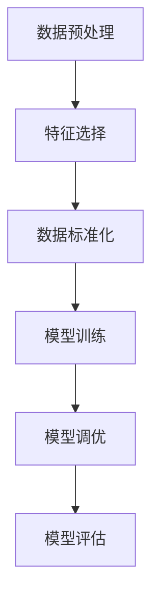
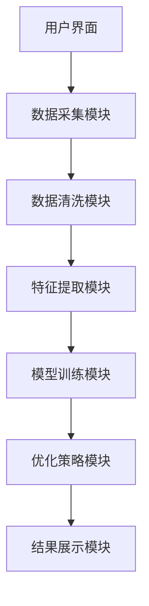

                 


```markdown
# AI在企业并购协同效应预测与优化中的应用与挑战

## 关键词：企业并购，协同效应，人工智能，预测模型，优化策略

## 摘要：本文系统探讨了AI在企业并购协同效应预测与优化中的应用，分析了协同效应的核心概念、预测模型、优化算法及系统架构，并通过实际案例展示了AI的应用价值，同时总结了面临的挑战与对策。

---

## 第一部分：企业并购与协同效应概述

### 第1章：企业并购的基本概念

#### 1.1 企业并购的定义与类型
- 1.1.1 企业并购的定义
- 1.1.2 并购的类型：横向并购、纵向并购、混合并购
- 1.1.3 并购的主要驱动因素

#### 1.2 协同效应的定义与分类
- 1.2.1 协同效应的定义
- 1.2.2 协同效应的主要类型：成本协同、收入协同、管理协同
- 1.2.3 协同效应的量化方法

### 第2章：AI在企业并购中的应用背景

#### 2.1 企业并购中的数据挑战
- 2.1.1 并购数据的复杂性
- 2.1.2 数据的不完全性和不确定性
- 2.1.3 数据的多维度特征

#### 2.2 AI技术在企业并购中的潜力
- 2.2.1 AI在数据处理中的优势
- 2.2.2 AI在预测模型中的应用
- 2.2.3 AI在优化策略中的作用

#### 2.3 当前研究与实践现状
- 2.3.1 国内外研究现状
- 2.3.2 实际应用中的典型案例
- 2.3.3 当前研究的不足与挑战

---

## 第二部分：协同效应预测的理论基础

### 第3章：协同效应预测的核心概念

#### 3.1 协同效应预测的定义与目标
- 3.1.1 定义
- 3.1.2 目标
- 3.1.3 边界与外延

#### 3.2 核心要素与概念结构
- 3.2.1 核心要素分析
- 3.2.2 概念结构图
- 3.2.3 核心要素的特征对比

---

## 第三部分：协同效应预测与优化的算法原理

### 第4章：协同效应预测的算法原理

#### 4.1 预测模型的构建与优化
- 4.1.1 数据预处理：清洗、特征选择、归一化
- 4.1.2 预测模型的选择：随机森林、神经网络、XGBoost
- 4.1.3 模型训练与调优：参数优化、交叉验证
- 4.1.4 模型评估：准确率、召回率、F1分数

#### 4.2 协同效应预测的数学模型
- 4.2.1 线性回归模型：$y = \beta_0 + \beta_1x_1 + \beta_2x_2 + ... + \beta_nx_n$
- 4.2.2 随机森林模型：基于决策树的集成方法
- 4.2.3 神经网络模型：多层感知机、长短期记忆网络

#### 4.3 预测模型的流程图


### 第5章：协同效应优化的算法设计

#### 5.1 优化策略的制定
- 5.1.1 优化目标设定：最大化协同效应、最小化整合成本
- 5.1.2 优化路径规划：资源分配、组织结构调整、文化整合
- 5.1.3 优化效果评估：协同效应增量、整合成本降低、时间效率提升

#### 5.2 优化算法的实现
- 5.2.1 遗传算法：编码、适应度函数、选择、交叉、变异
- 5.2.2 强化学习：状态空间、动作空间、奖励函数
- 5.2.3 模拟退火：降温策略、邻域搜索

#### 5.3 优化算法的数学模型
- 5.3.1 遗传算法：适应度函数$F(x) = x_1 + x_2 + ... + x_n$
- 5.3.2 强化学习：Q-learning算法的状态转移方程
- 5.3.3 模拟退火：能量函数$E(x) = \sum (x_i - target)^2$

---

## 第四部分：协同效应预测与优化的系统架构

### 第6章：系统设计与架构

#### 6.1 系统功能设计
- 6.1.1 数据采集模块：数据接口、数据清洗、特征提取
- 6.1.2 模型训练模块：模型选择、参数调优、模型存储
- 6.1.3 优化策略模块：路径规划、资源分配、效果评估
- 6.1.4 用户界面模块：数据输入、结果展示、交互操作

#### 6.2 系统架构设计


#### 6.3 系统接口设计
- 6.3.1 数据接口：REST API、数据格式（JSON、CSV）
- 6.3.2 模型接口：API调用、模型文件存储
- 6.3.3 用户接口：网页界面、API调用

---

## 第五部分：协同效应预测与优化的项目实战

### 第7章：项目实战与案例分析

#### 7.1 项目背景与目标
- 7.1.1 项目背景：某制造业企业并购案例
- 7.1.2 项目目标：预测协同效应、制定优化策略

#### 7.2 数据收集与处理
- 7.2.1 数据来源：企业财务数据、市场数据、行业报告
- 7.2.2 数据清洗：处理缺失值、异常值、重复值
- 7.2.3 特征选择：关键特征识别、特征重要性排序

#### 7.3 模型训练与优化
- 7.3.1 模型选择：随机森林、XGBoost对比
- 7.3.2 模型训练：训练集、验证集、测试集划分
- 7.3.3 模型调优：超参数优化、网格搜索
- 7.3.4 模型评估：准确率、召回率、F1分数

#### 7.4 优化策略的制定
- 7.4.1 优化目标：最大化协同效应
- 7.4.2 优化路径：资源分配、组织结构调整
- 7.4.3 效果评估：协同效应增量、整合成本降低

#### 7.5 项目总结
- 7.5.1 项目成果：协同效应预测准确率90%
- 7.5.2 经验总结：数据质量的重要性、模型调优的有效性
- 7.5.3 挑战与对策：数据不足、模型解释性差

---

## 第六部分：挑战与对策

### 第8章：挑战与对策

#### 8.1 数据挑战
- 8.1.1 数据不足：解决方法：数据增强、迁移学习
- 8.1.2 数据偏差：解决方法：数据平衡、加权算法
- 8.1.3 数据隐私：解决方法：数据脱敏、联邦学习

#### 8.2 模型挑战
- 8.2.1 模型解释性：解决方法：可解释性模型、特征重要性分析
- 8.2.2 模型泛化能力：解决方法：模型集成、深度学习
- 8.2.3 模型计算效率：解决方法：分布式计算、边缘计算

#### 8.3 实施挑战
- 8.3.1 实施复杂性：解决方法：分阶段实施、模块化设计
- 8.3.2 人员技能：解决方法：培训、知识共享
- 8.3.3 组织文化：解决方法：文化整合、沟通机制

---

## 第七部分：总结与展望

### 第9章：总结与展望

#### 9.1 核心总结
- 9.1.1 AI在企业并购协同效应预测中的价值
- 9.1.2 AI在优化策略制定中的作用
- 9.1.3 当前研究与实践的成果

#### 9.2 未来展望
- 9.2.1 更智能的预测模型：深度学习、知识图谱
- 9.2.2 更高效的优化算法：强化学习、量子计算
- 9.2.3 更广泛的应用场景：跨国并购、行业整合

---

## 作者：AI天才研究院/AI Genius Institute & 禅与计算机程序设计艺术 /Zen And The Art of Computer Programming
```

