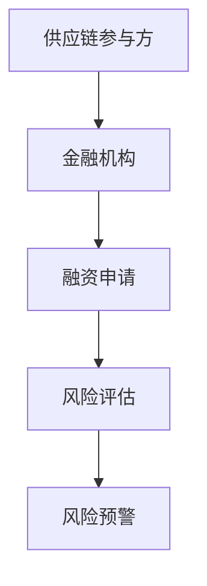
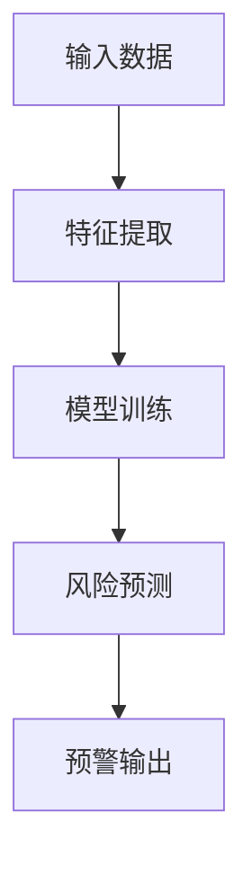
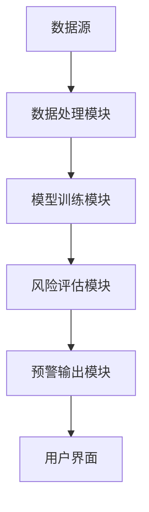
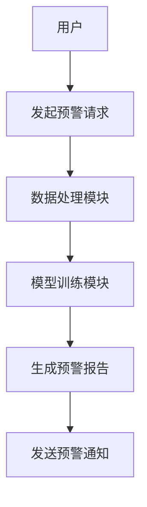

                 


# AI在供应链金融风险预警中的深度应用

## 关键词：供应链金融，AI，风险预警，机器学习，深度学习

## 摘要

供应链金融作为现代金融体系的重要组成部分，通过整合供应链上的多个参与方，实现资金的有效配置。然而，传统供应链金融风险预警方法存在效率低下、覆盖面窄、滞后性强等问题，难以应对复杂多变的市场环境。随着人工智能技术的快速发展，AI在供应链金融风险预警中的应用逐渐成为研究热点。本文将深入探讨AI技术如何在供应链金融风险预警中发挥作用，从算法原理、系统架构到实际应用，全面解析其深度应用的各个方面。

---

# 第一部分: 供应链金融与AI风险预警的背景与基础

## 第1章: 供应链金融概述

### 1.1 供应链金融的基本概念

供应链金融是指通过整合供应链上的供应商、制造商、分销商、零售商等多方资源，为核心企业提供融资支持的一种金融模式。其核心在于通过优化资金流，提高供应链整体效率，降低运营成本。

### 1.2 供应链金融的核心要素

- **供应商**：提供原材料或服务的上游企业。
- **制造商**：整合供应链资源的核心企业。
- **分销商/零售商**：负责产品销售的下游企业。
- **银行/金融机构**：提供融资支持的机构。

### 1.3 供应链金融的风险类型

- **信用风险**：供应商或客户无法按时履行合同义务。
- **市场风险**：市场需求波动导致库存积压或销售下降。
- **操作风险**：供应链运作中的流程或系统故障。

### 1.4 供应链金融的传统风险预警方法

传统方法依赖财务指标分析和经验判断，但存在以下局限性：

- 数据来源单一，难以全面反映供应链风险。
- 预警周期长，难以及时应对风险。
- 需要大量人工干预，效率低下。

## 第2章: 供应链金融风险预警的核心概念与联系

### 2.1 核心概念原理

供应链金融风险预警系统通过收集和分析供应链上的数据，识别潜在风险，并提前发出预警信号。AI技术的应用使得风险识别更加精准和高效。

### 2.2 核心概念属性特征对比表格

下表对比了传统风险预警方法和AI驱动风险预警方法的核心特征：

| 特性                | 传统方法           | AI驱动方法         |
|---------------------|------------------|------------------|
| 数据来源            | 财务数据为主       | 多源数据（包括物流、销售、舆情等） |
| 预警周期            | 长                | 短                |
| 预警精度            | 低                | 高                |
| 人工干预            | 高                | 低                |

### 2.3 ER实体关系图架构

供应链金融风险预警系统的实体关系图如下：



## 第3章: AI在供应链金融风险预警中的算法原理

### 3.1 常见算法原理

- **逻辑回归**：适用于二分类问题，如预测企业是否违约。
- **支持向量机（SVM）**：适用于小样本、高维数据的分类问题。
- **随机森林**：通过集成学习提高模型的泛化能力。
- **长短期记忆网络（LSTM）**：适用于时间序列数据，如销售数据波动预测。

### 3.2 算法原理的数学模型与公式

#### 3.2.1 逻辑回归的损失函数

$$ L = -\sum_{i=1}^{n} [y_i \ln p_i + (1-y_i) \ln (1-p_i)] $$

其中，$p_i$ 是第 $i$ 个样本的预测概率，$y_i$ 是标签。

#### 3.2.2 LSTM网络的结构

$$ f(t) = \text{LSTM}(x_t, f(t-1)) $$

LSTM通过细胞状态 $c$ 和隐藏状态 $h$ 来捕捉长期依赖关系。

### 3.3 算法流程图（mermaid）



---

# 第二部分: AI驱动的供应链金融风险预警系统

## 第4章: 供应链金融风险预警系统的架构设计

### 4.1 系统功能设计

#### 4.1.1 数据采集模块

- 收集供应链上各参与方的交易数据、物流数据、舆情数据等。

#### 4.1.2 风险评估模块

- 使用机器学习模型对数据进行分析，识别潜在风险。

#### 4.1.3 预警模块

- 根据评估结果，生成风险预警信号。

### 4.2 系统架构设计



### 4.3 系统接口设计

- 数据接口：与供应链各参与方的数据系统对接。
- 用户接口：向金融机构提供预警信息。

### 4.4 系统交互流程图（mermaid）



---

## 第5章: 项目实战

### 5.1 环境搭建

- 安装Python、TensorFlow、Pandas等工具。

### 5.2 核心实现代码

#### 5.2.1 数据预处理代码

```python
import pandas as pd

# 读取数据
data = pd.read_csv('supply_chain_data.csv')

# 删除缺失值
data = data.dropna()

# 标准化处理
from sklearn.preprocessing import StandardScaler

scaler = StandardScaler()
scaled_data = scaler.fit_transform(data)
```

#### 5.2.2 模型训练代码

```python
from sklearn.ensemble import RandomForestClassifier

model = RandomForestClassifier(n_estimators=100, random_state=42)
model.fit(X_train, y_train)
```

### 5.3 实际案例分析

假设我们有一个供应链数据集，其中包含供应商的交货周期、历史违约记录等信息。通过训练随机森林模型，我们可以预测某供应商在未来的三个月内是否存在违约风险。

### 5.4 代码解读与分析

- **数据预处理**：标准化处理确保不同特征在模型训练中权重相同。
- **模型训练**：随机森林通过集成学习提高了模型的鲁棒性。

---

## 第6章: 总结与展望

### 6.1 总结

本文详细探讨了AI技术在供应链金融风险预警中的应用，从算法原理到系统架构，再到实际案例，全面展示了其深度应用的潜力。

### 6.2 展望

未来，随着AI技术的不断发展，供应链金融风险预警将更加智能化和精准化。深度学习模型的引入将进一步提升风险识别能力，实时数据流的处理也将使预警更加及时。

---

## 作者：AI天才研究院 & 禅与计算机程序设计艺术

感谢您的阅读！如需进一步探讨，欢迎关注我们的公众号或访问官方网站。

