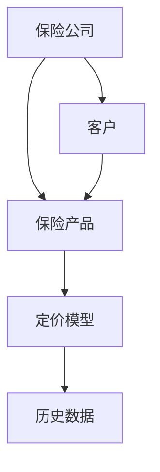
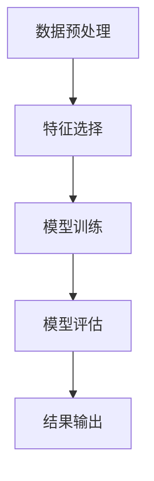

                 


# AI在保险产品定价中的创新应用

## 关键词：保险定价，人工智能，机器学习，深度学习，数据分析

## 摘要

随着人工智能技术的迅速发展，保险行业正经历一场深刻的变革。传统的保险产品定价依赖于经验丰富的精算师，而人工智能的引入为这一领域带来了新的可能性。本文深入探讨AI在保险产品定价中的创新应用，分析数据驱动的定价模型、机器学习和深度学习在风险评估中的应用，以及这些技术如何提升定价的准确性和效率。

---

## 第1章：保险产品定价的背景与挑战

### 1.1 保险行业的现状与发展趋势

#### 1.1.1 保险行业的基本概念

保险是一种风险管理工具，通过将风险转移到保险公司，为客户提供经济保障。保险产品定价是保险公司确定保费的核心任务，直接影响公司的财务健康和客户满意度。

#### 1.1.2 保险产品定价的核心问题

保险产品定价涉及多个因素，包括风险评估、历史数据分析、市场趋势预测等。传统方法依赖精算师的经验和历史数据，但随着数据量的增加和复杂性的提升，传统方法逐渐暴露出效率低下和精度不足的问题。

#### 1.1.3 数字化转型对保险行业的推动作用

数字化转型通过引入大数据、人工智能和云计算等技术，显著提升了保险行业的效率。AI技术的应用使得保险公司能够更精准地评估风险，优化定价策略，提升客户体验。

### 1.2 AI技术的基本概念与特点

#### 1.2.1 人工智能的定义与分类

人工智能（AI）是模拟人类智能的技术，涵盖机器学习、自然语言处理、计算机视觉等领域。机器学习是AI的核心，通过数据训练模型，使其能够自动改进。

#### 1.2.2 机器学习与深度学习的区别

机器学习是通过算法从数据中学习模式，深度学习是机器学习的一种，使用多层神经网络处理复杂数据。

#### 1.2.3 AI在保险行业的应用现状

AI技术在保险行业的应用包括风险评估、欺诈检测、客户细分和产品推荐。在定价方面，AI技术能够处理大量数据，发现传统方法难以察觉的模式。

### 1.3 保险产品定价中的创新应用

#### 1.3.1 AI技术如何改变保险定价模式

AI技术通过数据驱动的方法，实时分析客户行为和市场趋势，提供动态定价策略。例如，使用实时数据调整保费，优化客户体验。

#### 1.3.2 数据驱动的定价方法

数据驱动的定价方法利用大量数据，包括客户行为、市场趋势和历史数据，构建预测模型，实现更精准的定价。

#### 1.3.3 创新定价工具与平台

保险公司正在开发AI驱动的定价工具，帮助精算师快速分析数据，优化定价策略。这些工具结合机器学习和大数据分析，显著提升了定价效率。

---

## 第2章：AI在保险定价中的核心概念与联系

### 2.1 核心概念原理

#### 2.1.1 数据驱动的定价模型

数据驱动的定价模型利用机器学习算法，分析客户数据，预测风险，优化保费。例如，使用回归分析预测保费。

#### 2.1.2 机器学习在风险评估中的应用

机器学习算法能够分析客户数据，识别高风险客户，优化定价策略。例如，使用决策树算法进行客户细分。

#### 2.1.3 深度学习在保险定价中的创新

深度学习通过多层神经网络处理复杂数据，提升定价模型的准确性。例如，使用卷积神经网络分析图像数据。

### 2.2 核心概念属性特征对比表

| **传统定价方法** | **AI定价方法** |
|------------------|----------------|
| 依赖历史数据     | 结合实时数据    |
| 精算师经验主导     | 数据驱动        |
| 定价周期较长       | 实时调整        |

### 2.3 ER实体关系图



---

## 第3章：AI定价算法原理与流程图

### 3.1 常见AI定价算法

#### 3.1.1 线性回归模型

线性回归是一种简单的回归算法，适用于线性关系的数据。公式为：

$$ y = \beta_0 + \beta_1x + \epsilon $$

#### 3.1.2 决策树算法

决策树是一种树状结构，通过特征选择进行分类或回归。常用算法包括ID3、C4.5和C5.0。

#### 3.1.3 支持向量机

支持向量机通过构建超平面，将数据分成不同类别。适用于高维数据的分类和回归。

#### 3.1.4 神经网络模型

神经网络由多个层组成，通过训练数据学习复杂模式。广泛应用于深度学习任务。

### 3.2 算法流程图



### 3.3 算法实现代码示例

```python
import numpy as np
from sklearn.linear_model import LinearRegression

# 数据准备
X = np.array([[1], [2], [3], [4], [5]])
y = np.array([2, 4, 5, 4, 6])

# 模型训练
model = LinearRegression()
model.fit(X, y)

# 预测
print(model.predict([[6]]))
```

---

## 第4章：数学模型与公式

### 4.1 线性回归模型

线性回归模型的公式为：

$$ y = \beta_0 + \beta_1x + \epsilon $$

其中，$\beta_0$是截距，$\beta_1$是斜率，$\epsilon$是误差项。

### 4.2 决策树模型

决策树模型通过特征选择构建树状结构，常用算法包括ID3、C4.5和C5.0。

### 4.3 神经网络模型

神经网络模型的公式为：

$$ z = Wx + b $$
$$ a = \sigma(z) $$

其中，$W$是权重矩阵，$x$是输入向量，$b$是偏置，$\sigma$是激活函数。

---

## 第5章：系统架构设计

### 5.1 系统功能设计


### 5.2 系统架构设计


---

## 第6章：项目实战

### 6.1 环境安装

- Python 3.8+
- TensorFlow、Scikit-learn、Pandas

### 6.2 核心实现代码

```python
import pandas as pd
from sklearn.model_selection import train_test_split
from sklearn.ensemble import RandomForestRegressor

# 数据加载
df = pd.read_csv('insurance_data.csv')

# 数据分割
X = df.drop('price', axis=1)
y = df['price']
X_train, X_test, y_train, y_test = train_test_split(X, y, test_size=0.2)

# 模型训练
model = RandomForestRegressor(n_estimators=100)
model.fit(X_train, y_train)

# 预测与评估
print(model.score(X_test, y_test))
```

---

## 第7章：总结与展望

### 7.1 总结

AI技术彻底改变了保险产品定价的方式，通过数据驱动和模型优化，提升了定价的准确性和效率。保险公司能够实时分析客户行为和市场趋势，优化定价策略，提升客户体验。

### 7.2 展望

随着AI技术的不断进步，未来保险产品定价将更加智能化。新兴技术如强化学习和可解释性AI将推动行业进一步发展，使定价更加精准和个性化。

---

## 作者

**作者：AI天才研究院/AI Genius Institute & 禅与计算机程序设计艺术 /Zen And The Art of Computer Programming**

---

通过以上结构，我们可以看到AI技术如何在保险产品定价中发挥重要作用，从数据分析到模型构建，再到系统实现，AI技术为保险行业带来了前所未有的创新和效率提升。

