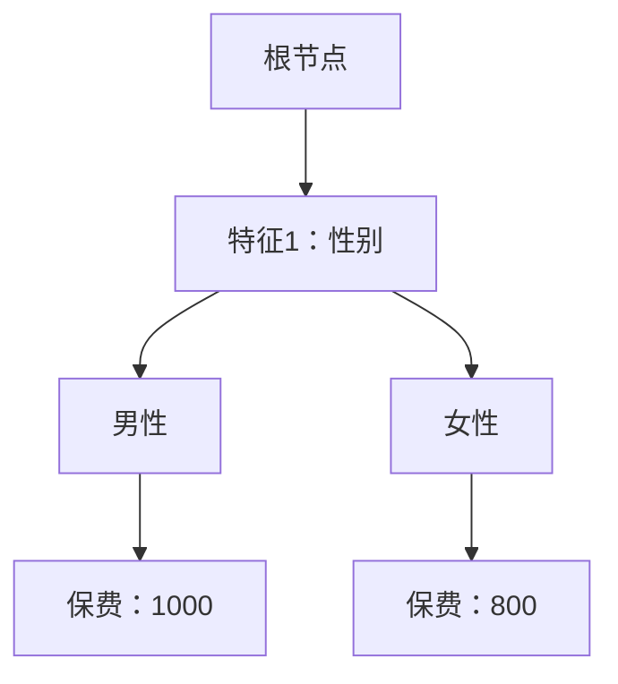
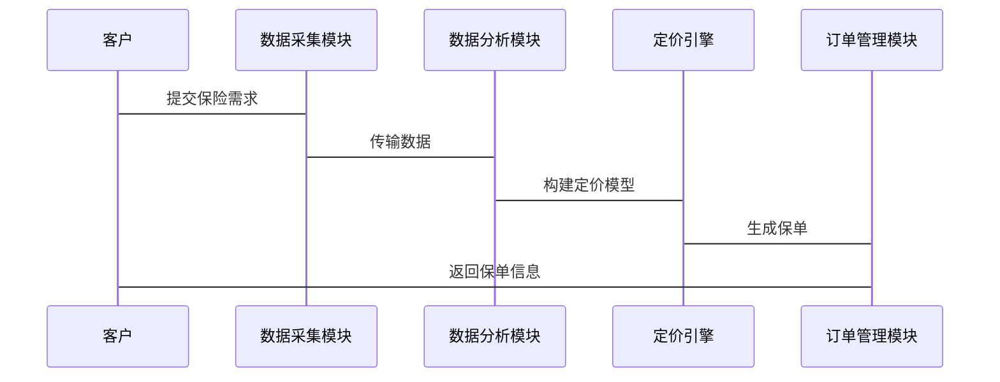

                 


# AI在保险定价个性化中的创新应用

> 关键词：保险定价、人工智能、个性化定价、机器学习、保险科技、数据驱动定价

> 摘要：本文深入探讨了人工智能在保险定价个性化中的创新应用，结合实际案例，系统地分析了AI技术如何改变传统保险定价模式，通过机器学习算法和数据分析，实现个性化、精准化的保险定价策略。文章从背景、核心概念、算法原理、系统架构、项目实战等多维度展开，全面剖析AI在保险定价中的价值与挑战。

---

## 第一部分: 保险定价与AI技术的背景与现状

### 第1章: 保险定价的基本概念与个性化需求

#### 1.1 保险定价的基本概念

保险定价是指保险公司根据风险评估和市场环境，确定保险产品的价格（保费）的过程。传统保险定价方法依赖于精算模型，主要基于历史数据、风险因素和经验法则。以下是保险定价的传统方法：

- **纯风险保费法**：根据风险的预期损失计算保费，通常用于简单的风险评估。
- **经验费率法**：基于历史赔付数据，结合行业经验制定费率。
- **分类法**：将客户按风险等级分类，制定差异化的保费。

保险定价的核心要素包括风险评估、市场定位、产品设计和定价策略。

#### 1.2 个性化定价的必要性

个性化定价是指根据客户的具体需求、风险特征和行为模式，制定差异化的保费策略。随着保险市场的竞争加剧和客户需求的多样化，个性化定价成为保险公司提升竞争力的关键。

- **客户细分**：通过数据分析，识别不同客户群体的需求差异。
- **动态定价**：实时根据市场变化和客户行为调整保费。
- **客户体验**：个性化定价能够提升客户满意度和忠诚度。

个性化定价的实现依赖于大数据和人工智能技术，通过分析客户的详细信息，构建精准的定价模型。

#### 1.3 AI技术在保险定价中的应用现状

AI技术在保险行业的应用日益广泛，特别是在保险定价领域。以下是AI技术在保险定价中的主要应用：

- **数据挖掘与分析**：利用机器学习算法，挖掘海量数据中的潜在规律。
- **风险评估**：通过自然语言处理（NLP）和图像识别技术，分析客户的信用记录、健康状况等信息。
- **动态定价模型**：基于实时数据，构建动态定价系统，优化保费策略。

AI技术的应用显著提高了保险定价的精准性和效率，但也面临数据隐私、模型解释性等挑战。

---

## 第二部分: AI在保险定价中的核心概念与模型

### 第2章: 保险定价中的机器学习模型

#### 2.1 机器学习在保险定价中的核心作用

机器学习通过分析大量数据，发现传统方法难以识别的模式和关系，为保险定价提供新的可能性。以下是机器学习在保险定价中的核心作用：

- **特征选择**：从海量数据中提取关键特征，构建精准的定价模型。
- **风险预测**：利用监督学习算法，预测客户的风险等级和赔付概率。
- **定价优化**：通过回归分析，优化保费定价策略。

#### 2.2 保险定价中的特征工程

特征工程是机器学习模型构建的关键步骤，以下是保险定价中的常见特征：

- **客户特征**：年龄、性别、职业、收入等。
- **行为特征**：驾驶习惯、投保记录、理赔历史等。
- **环境特征**：地理位置、天气状况等。

特征工程的目标是将这些特征转化为模型可识别的数值形式，例如使用独热编码处理分类变量。

#### 2.3 保险定价模型的构建与评估

构建保险定价模型需要遵循以下步骤：

1. **数据清洗**：处理缺失值、异常值和重复数据。
2. **特征选择**：筛选对目标变量影响较大的特征。
3. **模型训练**：使用训练数据训练模型，调整模型参数。
4. **模型评估**：通过测试数据评估模型的性能，使用准确率、召回率等指标衡量。

以下是几种常见的保险定价模型：

- **线性回归模型**：适用于线性关系的数据，如简单的风险因素预测。
- **决策树模型**：能够处理复杂的非线性关系，适合客户细分。
- **随机森林模型**：通过集成学习提高模型的准确性和稳定性。

---

## 第三部分: AI在保险定价中的算法原理与实现

### 第3章: 保险定价中的回归算法

#### 3.1 线性回归模型

线性回归是一种简单而强大的回归算法，适用于线性关系的数据。以下是线性回归的基本原理：

1. **模型假设**：假设目标变量与特征变量之间存在线性关系。
2. **损失函数**：使用均方误差（MSE）作为损失函数。
3. **优化方法**：通过最小二乘法优化模型参数。

线性回归的数学模型如下：

$$ y = \beta_0 + \beta_1x_1 + \beta_2x_2 + ... + \beta_nx_n + \epsilon $$

其中，$\beta_0$是截距项，$\beta_1, \beta_2, ..., \beta_n$是特征变量的系数，$\epsilon$是误差项。

线性回归的优点是简单易懂，计算效率高，但其缺点是无法处理复杂的非线性关系。

#### 3.2 决策树模型

决策树是一种基于树状结构的回归算法，能够处理复杂的非线性关系。以下是决策树的基本原理：

1. **特征选择**：通过信息增益或基尼指数选择最优特征。
2. **树的构建**：递归地构建树的结构，直到满足停止条件。
3. **剪枝**：通过剪枝技术防止过拟合。

决策树的数学模型可以通过树状图表示，如下所示：



决策树的优点是易于解释，能够处理缺失值，但其缺点是计算复杂度高，容易过拟合。

---

## 第四部分: 保险定价系统架构设计

### 第4章: 系统功能设计

#### 4.1 领域模型

以下是保险定价系统的领域模型：


#### 4.2 系统架构设计

以下是保险定价系统的系统架构图：



---

## 第五部分: 项目实战与案例分析

### 第5章: 项目实战

#### 5.1 环境安装

以下是项目实战的环境安装步骤：

1. **安装Python**：下载并安装Python 3.8或更高版本。
2. **安装依赖库**：使用以下命令安装所需的依赖库：
   ```bash
   pip install numpy scikit-learn pandas matplotlib
   ```

#### 5.2 核心实现

以下是线性回归模型的核心实现代码：

```python
import numpy as np
from sklearn.linear_model import LinearRegression
from sklearn.metrics import mean_squared_error

# 数据准备
X = np.array([[2, 3], [4, 5], [6, 7]])  # 特征矩阵
y = np.array([1, 2, 3])  # 目标变量

# 模型训练
model = LinearRegression()
model.fit(X, y)

# 模型预测
y_pred = model.predict(X)
print("预测结果:", y_pred)
print("均方误差:", mean_squared_error(y, y_pred))
```

#### 5.3 案例分析

以下是保险定价系统的实际案例分析：

1. **数据准备**：收集客户的基本信息、驾驶记录和历史理赔数据。
2. **特征工程**：提取关键特征，如年龄、性别和驾驶记录。
3. **模型训练**：使用随机森林模型进行训练，评估模型的准确率。
4. **定价策略**：根据模型预测结果，制定差异化的保费策略。

---

## 第六部分: 总结与展望

### 第6章: 总结与展望

#### 6.1 总结

本文详细探讨了人工智能在保险定价个性化中的创新应用，结合实际案例，系统地分析了AI技术如何改变传统保险定价模式。通过机器学习算法和数据分析，实现个性化、精准化的保险定价策略。

#### 6.2 展望

未来，随着AI技术的不断发展，保险定价将更加智能化和个性化。以下是未来的发展趋势：

1. **数据隐私保护**：随着数据隐私法规的不断完善，如何在保护客户隐私的前提下，利用数据进行定价将成为一个重要挑战。
2. **模型解释性**：如何提高AI模型的解释性，增强客户的信任度，是未来研究的重要方向。
3. **动态定价**：基于实时数据和客户行为，实现动态定价，进一步提升定价的精准性和灵活性。

---

作者：AI天才研究院 & 禅与计算机程序设计艺术

