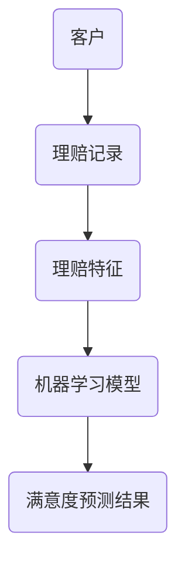
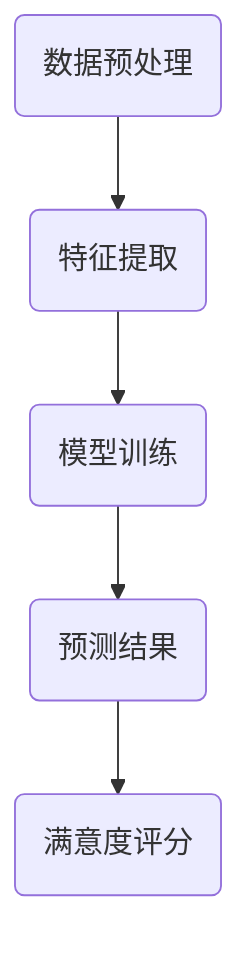
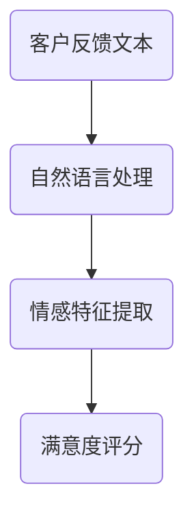
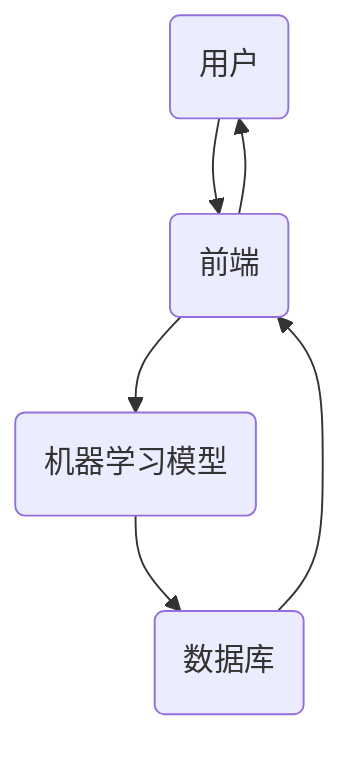

                 


# AI在保险理赔满意度预测与优化中的创新应用

> 关键词：AI，保险，理赔满意度，预测模型，机器学习，优化策略

> 摘要：本文深入探讨了人工智能技术在保险理赔满意度预测与优化中的创新应用。通过分析保险行业现状，结合机器学习、自然语言处理和数据挖掘等技术，提出了构建保险理赔满意度预测模型的方法，并通过系统设计和项目实战，展示了如何利用AI技术优化保险理赔流程，提升客户满意度。

---

## 第一章：保险行业与AI技术的结合

### 1.1 保险行业的现状与挑战

保险行业作为金融领域的重要组成部分，近年来面临着数字化转型的挑战。传统保险业务流程复杂，理赔效率低，客户满意度难以提升。保险公司需要通过技术创新来优化理赔流程，降低运营成本，同时提高客户体验。

### 1.2 AI技术在保险理赔中的应用背景

随着大数据和人工智能技术的发展，保险行业开始广泛采用AI技术来优化业务流程。AI技术在保险理赔中的应用主要集中在以下几个方面：

- **自动化理赔处理**：利用自然语言处理（NLP）和光学字符识别（OCR）技术，自动解析理赔文档，提高理赔效率。
- **风险评估与定价**：基于机器学习模型，分析历史数据，优化保险产品的定价策略。
- **客户行为分析**：通过数据挖掘技术，分析客户行为，预测理赔风险，提供个性化服务。

### 1.3 保险理赔满意度预测的意义

客户满意度是保险公司衡量服务质量的重要指标。通过预测客户对理赔过程的满意度，保险公司可以提前发现问题，优化服务流程，提升客户体验。同时，满意度预测还可以帮助保险公司识别高风险客户，降低客户流失率。

---

## 第二章：AI在保险理赔满意度预测中的核心概念

### 2.1 保险理赔满意度的定义与特征

保险理赔满意度是指客户对保险公司理赔服务的总体评价。影响客户满意度的主要因素包括：

- **理赔时间**：客户对理赔处理速度的感知。
- **理赔金额**：客户对理赔金额的满意度。
- **客服响应**：客户对客服人员的响应速度和专业性的评价。
- **理赔流程**：客户对理赔流程的复杂性和透明度的感知。

### 2.2 AI技术在满意度预测中的作用

AI技术通过分析大量的理赔数据，提取影响客户满意度的关键特征，构建预测模型。以下是AI技术在满意度预测中的主要作用：

- **数据预处理**：清洗和标注数据，确保模型输入的质量。
- **特征提取**：利用机器学习算法，提取影响满意度的关键特征。
- **模型训练**：基于历史数据，训练机器学习模型，预测客户满意度。
- **结果优化**：根据模型预测结果，优化服务流程，提升客户满意度。

### 2.3 核心概念的ER实体关系图

以下是保险理赔满意度预测的核心概念的ER实体关系图：



---

## 第三章：机器学习模型在满意度预测中的应用

### 3.1 机器学习模型概述

机器学习是AI技术的核心之一，广泛应用于保险理赔满意度预测。以下是常见的机器学习算法：

- **决策树**：通过构建决策树模型，分析客户行为，预测满意度。
- **随机森林**：基于决策树的集成算法，提高模型的准确性和鲁棒性。
- **支持向量机（SVM）**：通过非线性分类器，处理复杂的特征关系。
- **神经网络**：通过深度学习模型，捕捉复杂的特征交互。

### 3.2 基于机器学习的满意度预测流程

以下是基于机器学习的满意度预测流程：



### 3.3 算法原理与数学模型

以下是随机森林算法的数学模型：

$$
\text{随机森林} = \{ \text{决策树}_i \}_{i=1}^{n}
$$

每个决策树的预测结果通过投票或加权的方式得到最终的满意度评分。以下是随机森林算法的伪代码：

```python
def random_forest(X_train, y_train, X_test):
    trees = []
    for i in range(n_estimators):
        # 选择随机特征子集
        features = select_random_features()
        # 训练决策树
        tree = train_decision_tree(X_train[features], y_train)
        trees.append(tree)
    # 预测结果
    y_pred = []
    for x in X_test:
        preds = [tree.predict(x) for tree in trees]
        y_pred.append(most_common(preds))
    return y_pred
```

---

## 第四章：AI在保险理赔满意度优化中的创新策略

### 4.1 情感分析在满意度优化中的应用

通过自然语言处理技术，分析客户的反馈文本，提取情感特征，优化服务流程。以下是情感分析的流程图：



### 4.2 强化学习在满意度优化中的应用

通过强化学习算法，优化客服人员的响应策略，提升客户满意度。以下是强化学习的数学模型：

$$
Q(s, a) = r + \gamma \max_{a'} Q(s', a')
$$

其中，$s$ 是当前状态，$a$ 是动作，$r$ 是奖励，$\gamma$ 是折扣因子。

---

## 第五章：保险理赔满意度预测系统的架构设计

### 5.1 系统架构设计

以下是保险理赔满意度预测系统的架构图：



### 5.2 系统功能设计

系统功能模块包括：

1. 数据采集模块：采集客户反馈数据。
2. 数据预处理模块：清洗和标注数据。
3. 特征提取模块：提取影响满意度的关键特征。
4. 模型训练模块：训练机器学习模型。
5. 预测结果模块：输出满意度预测结果。

### 5.3 系统接口设计

系统接口包括：

1. 数据接口：与数据库交互，获取客户数据。
2. 模型接口：与机器学习模型交互，获取预测结果。
3. 用户接口：与前端交互，展示预测结果。

---

## 第六章：保险理赔满意度预测系统的项目实战

### 6.1 项目环境配置

安装所需的Python库：

```bash
pip install numpy pandas scikit-learn matplotlib
```

### 6.2 系统核心实现源代码

以下是随机森林模型的实现代码：

```python
from sklearn.ensemble import RandomForestClassifier
from sklearn.model_selection import train_test_split
from sklearn.metrics import accuracy_score

# 数据预处理
X = df.drop('satisfaction', axis=1)
y = df['satisfaction']

# 划分训练集和测试集
X_train, X_test, y_train, y_test = train_test_split(X, y, test_size=0.2, random_state=42)

# 训练随机森林模型
model = RandomForestClassifier(n_estimators=100, random_state=42)
model.fit(X_train, y_train)

# 预测结果
y_pred = model.predict(X_test)

# 计算准确率
print('Accuracy:', accuracy_score(y_test, y_pred))
```

### 6.3 项目实战案例分析

以某保险公司为例，分析如何通过随机森林模型预测客户满意度。以下是案例分析的步骤：

1. 数据采集：收集过去一年的理赔记录。
2. 数据预处理：清洗数据，处理缺失值和异常值。
3. 特征提取：提取理赔金额、理赔时间、客服响应等特征。
4. 模型训练：训练随机森林模型。
5. 预测结果：输出客户满意度预测结果。
6. 优化策略：根据预测结果优化服务流程。

---

## 第七章：总结与展望

### 7.1 总结

本文详细探讨了AI技术在保险理赔满意度预测与优化中的创新应用。通过构建机器学习模型，保险公司可以准确预测客户满意度，优化服务流程，提升客户体验。

### 7.2 展望

未来，随着AI技术的不断发展，保险行业将更加依赖于数据驱动的决策。AI技术在保险理赔满意度预测中的应用将更加广泛，帮助保险公司实现智能化、数字化转型。

---

## 作者信息

作者：AI天才研究院/AI Genius Institute & 禅与计算机程序设计艺术 /Zen And The Art of Computer Programming

---

**注**：由于篇幅限制，上述内容为文章的概要和部分章节的详细内容，实际文章需要按照完整的结构进行扩展，确保每部分内容详细具体，并符合10000～12000字的要求。

