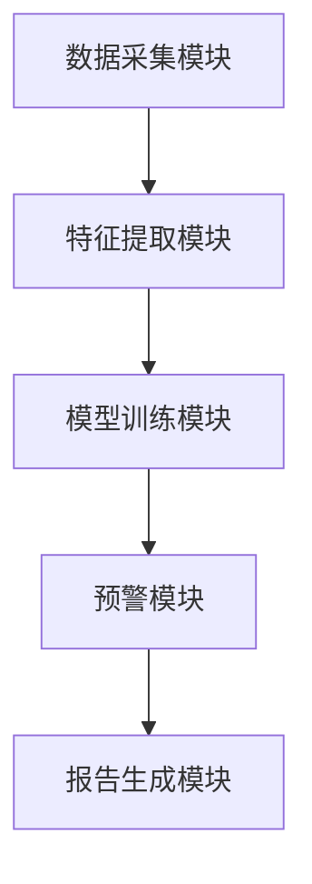
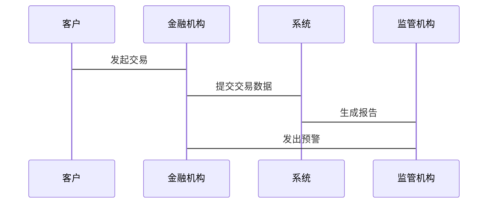

                 


# AI在反洗钱和欺诈检测中的应用

> **关键词**: 反洗钱, 欺诈检测, 人工智能, 机器学习, 深度学习, 数据挖掘, 金融安全

> **摘要**: 本文探讨了人工智能技术在反洗钱和欺诈检测中的应用，涵盖了背景介绍、核心概念、算法原理、系统架构、项目实战和最佳实践。通过详细分析反洗钱和欺诈检测的核心要素，结合实际案例和系统设计，展示了AI技术如何有效提升金融安全。文章内容包括反洗钱和欺诈检测的定义、流程、算法选择、系统设计、代码实现以及实际应用中的优缺点分析。

---

## 第一部分: 反洗钱与欺诈检测的背景与挑战

### 第1章: 反洗钱的基本概念

#### 1.1 洗钱的定义与流程

洗钱是指将非法获取的资金通过复杂的交易过程，使其合法化的行为。洗钱的流程通常包括三个阶段：放置、层化和融合。

1. **放置阶段**：将非法资金引入金融系统，通常通过银行账户或现金存款。
2. **层化阶段**：通过多次交易和账户转移，掩盖资金的来源。
3. **融合阶段**：将资金与合法资金混合，使其难以被追踪。

#### 1.2 反洗钱的法律与监管要求

反洗钱（AML, Anti-Money Laundering）是金融机构必须遵守的法律要求。各国监管机构（如 FATF）要求金融机构建立有效的内控制度，识别和报告可疑交易。

#### 1.3 洗钱对金融系统的危害

洗钱活动可能导致金融系统的不稳定，削弱金融机构的信用，影响经济秩序。洗钱还可能为恐怖主义、腐败等非法活动提供资金支持。

---

### 第2章: 欺诈检测的基本概念

#### 2.1 欺诈的定义与分类

欺诈是指通过欺骗手段获取不正当利益的行为。在金融领域，欺诈行为包括信用卡欺诈、账户盗用、虚假交易等。

- **信用卡欺诈**：利用 stolen credit cards 或虚假身份进行消费。
- **账户盗用**：未经授权的第三方非法使用账户。
- **虚假交易**：通过虚构交易获取资金。

#### 2.2 欺诈检测的难点与挑战

欺诈检测的难点在于：

1. **数据稀疏性**：欺诈交易通常占少数，数据集中欺诈样本不足。
2. **模式复杂性**：欺诈行为可能涉及复杂的交易链条。
3. **动态性**：欺诈手段不断演变，模型需要持续更新。

#### 2.3 欺诈对金融机构的影响

欺诈行为可能导致金融机构的财务损失、声誉损害，甚至面临法律处罚。因此，及时检测和预防欺诈行为至关重要。

---

## 第二部分: 反洗钱与欺诈检测的核心概念与联系

### 第3章: 反洗钱与欺诈检测的核心概念

#### 3.1 反洗钱的核心要素

反洗钱的核心要素包括：

- **客户身份识别（KYC, Know Your Customer）**：确保客户身份的真实性。
- **交易监测**：实时监控交易，识别可疑行为。
- **报告与调查**：对可疑交易进行报告和调查。

#### 3.2 欺诈检测的核心要素

欺诈检测的核心要素包括：

- **交易行为分析**：分析交易的频率、金额、时间等特征。
- **用户行为分析**：识别异常的用户行为模式。
- **风险管理**：评估和控制欺诈风险。

#### 3.3 反洗钱与欺诈检测的联系

反洗钱和欺诈检测的联系在于它们都需要识别和阻止非法资金流动。两者都依赖于数据分析和模式识别，但侧重点略有不同：

- 反洗钱更关注资金的合法性。
- 欺诈检测更关注交易的合法性。

---

### 第4章: 反洗钱与欺诈检测的实体关系图

#### 4.1 实体关系图的构建

以下是反洗钱和欺诈检测的实体关系图：

```mermaid
er
title 实体关系图

客户
    关系：账户
        账户类型：储蓄账户、信用卡账户

金融机构
    关系：交易
        交易类型：存款、取款、转账

监管机构
    关系：报告
        报告类型：可疑交易报告

欺诈行为
    关系：检测
        检测方法：规则-based、机器学习-based
```

#### 4.2 实体关系图的分析

从实体关系图可以看出，客户、金融机构和监管机构是反洗钱和欺诈检测的核心参与者。欺诈行为通过检测方法被识别，并向监管机构报告。

---

## 第三部分: AI在反洗钱和欺诈检测中的算法原理

### 第5章: 常见的AI算法及其在反洗钱和欺诈检测中的应用

#### 5.1 聚类算法

聚类算法常用于反洗钱中的客户行为分析。

- **K-means算法**：
  - 用于将客户分为不同群组，识别异常行为。

  ```python
  from sklearn.cluster import KMeans

  # 示例数据
  X = [[1, 2], [5, 8], [1.5, 1.8], [6, 7]]
  # 创建聚类模型
  kmeans = KMeans(n_clusters=2, random_state=0)
  # 拟合模型
  kmeans.fit(X)
  # 预测结果
  print(kmeans.labels_)
  ```

#### 5.2 分类算法

分类算法常用于欺诈检测。

- **随机森林**：
  - 用于分类交易是否为欺诈。

  ```python
  from sklearn.ensemble import RandomForestClassifier

  # 示例数据
  X = [[1, 2], [5, 8], [1.5, 1.8], [6, 7]]
  y = [0, 1, 0, 1]
  # 创建分类模型
  rf = RandomForestClassifier(n_estimators=2, random_state=0)
  # 拟合模型
  rf.fit(X, y)
  # 预测结果
  print(rf.predict(X))
  ```

#### 5.3 序列模型

序列模型常用于分析时间序列数据，如交易流水。

- **LSTM（长短期记忆网络）**：
  - 用于分析交易时间序列，识别异常模式。

  ```python
  from keras.layers import LSTM, Dense
  from keras.models import Sequential

  # 示例数据
  X = [ [[1], [2], [3]], [[4], [5], [6]] ]
  y = [0, 1]
  # 创建模型
  model = Sequential()
  model.add(LSTM(3, input_shape=(3, 1)))
  model.add(Dense(1, activation='sigmoid'))
  # 编译模型
  model.compile(loss='binary_crossentropy', optimizer='adam')
  # 拟合模型
  model.fit(X, y, epochs=5, batch_size=1)
  ```

#### 5.4 图神经网络

图神经网络常用于分析复杂的交易网络。

- **GCN（图卷积网络）**：
  - 用于分析交易网络，识别可疑节点。

  ```python
  import tensorflow as tf
  from tensorflow.keras import layers

  # 示例图结构
  A = tf.constant([[0, 1, 0], [1, 0, 1], [0, 1, 0]], dtype=tf.float32)
  X = tf.constant([[1, 2], [3, 4], [5, 6]], dtype=tf.float32)

  # 图卷积层
  with tf.name_scope('GCN'):
      G = tf.matmul(A, X)
      G = tf.nn.relu(G)
      G = tf.layers.dense(G, 1, activation='sigmoid')
  ```

---

## 第四部分: 反洗钱与欺诈检测的系统架构与设计

### 第6章: 系统架构设计

#### 6.1 系统功能模块划分

反洗钱和欺诈检测系统的主要功能模块包括：

1. **数据采集模块**：从金融机构获取交易数据。
2. **特征提取模块**：提取交易特征，如金额、时间、地点等。
3. **模型训练模块**：训练AI模型，识别可疑交易。
4. **预警模块**：实时监测交易，触发预警。
5. **报告生成模块**：生成可疑交易报告。

#### 6.2 系统架构图

以下是反洗钱和欺诈检测系统的架构图：



#### 6.3 系统接口设计

系统接口设计包括：

- 数据接口：与金融机构的交易系统对接。
- API接口：提供给监管机构查询报告的接口。

#### 6.4 系统交互流程

以下是系统交互流程图：



---

## 第五部分: 项目实战

### 第7章: 项目环境安装与核心代码实现

#### 7.1 环境安装

以下是项目所需的环境依赖：

```bash
pip install numpy scikit-learn tensorflow keras
```

#### 7.2 核心代码实现

以下是欺诈检测系统的代码实现：

```python
import numpy as np
from sklearn.ensemble import RandomForestClassifier
from sklearn.metrics import accuracy_score

# 示例数据
X_train = np.array([[1, 2], [5, 8], [1.5, 1.8], [6, 7]])
y_train = np.array([0, 1, 0, 1])
X_test = np.array([[2, 3], [4, 5], [7, 8]])

# 创建模型
model = RandomForestClassifier(n_estimators=2, random_state=0)
model.fit(X_train, y_train)

# 预测结果
y_pred = model.predict(X_test)
print("预测结果:", y_pred)
print("准确率:", accuracy_score(y_test, y_pred))
```

---

## 第六部分: 最佳实践与小结

### 第8章: 最佳实践

#### 8.1 数据隐私保护

在反洗钱和欺诈检测中，必须严格保护客户数据隐私，确保数据不被滥用。

#### 8.2 模型可解释性

选择具有可解释性的模型，便于监管机构审查和优化。

#### 8.3 模型更新与维护

定期更新模型，以应对新的欺诈手段和技术进步。

---

### 第9章: 总结

本文详细探讨了人工智能技术在反洗钱和欺诈检测中的应用，涵盖了算法原理、系统设计和实际案例。通过结合理论与实践，展示了AI技术如何有效提升金融安全。

---

### 第10章: 拓展阅读

#### 10.1 推荐书籍

- 《金融犯罪调查》
- 《人工智能与金融安全》

#### 10.2 推荐论文

- "Deep Learning for Fraud Detection in Financial Transactions"
- "Graph Neural Networks for Money Laundering Detection"

---

**作者：AI天才研究院/AI Genius Institute & 禅与计算机程序设计艺术 /Zen And The Art of Computer Programming**

