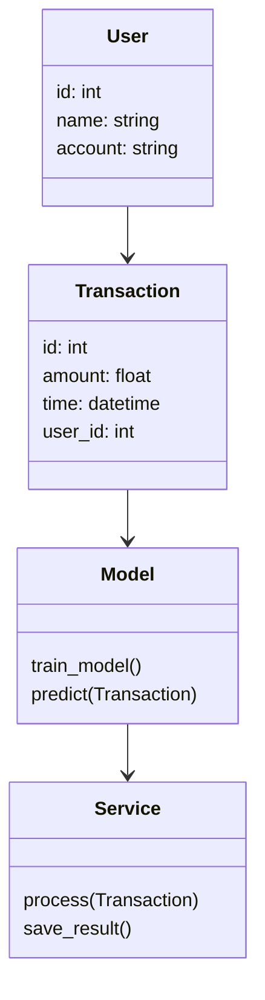

                 


# AI在反洗钱模式识别中的创新应用

> 关键词：人工智能，反洗钱，模式识别，机器学习，深度学习，NLP，金融安全

> 摘要：本文探讨了人工智能在反洗钱模式识别中的创新应用，结合机器学习、深度学习和自然语言处理等技术，分析了AI在反洗钱中的优势和挑战，并通过实际案例展示了AI技术在提升反洗钱效率和准确性方面的潜力。

---

# 第1章: 引言

## 1.1 反洗钱的重要性和挑战

### 1.1.1 洗钱的定义与常见手段

洗钱是指将非法获得的资金通过复杂的金融交易转化为看似合法资产的过程。常见的洗钱手段包括：

- **隐藏资金来源**：通过多层交易掩盖资金的实际来源。
- **利用空壳公司**：创建虚假公司进行资金流转。
- **分散交易**：将大额资金拆分成小额交易以逃避监管。
- **利用金融工具**：通过复杂金融产品转移资金。

### 1.1.2 反洗钱的监管要求与难点

反洗钱的监管要求包括实名制、大额交易报告、可疑交易监控等。然而，传统方法存在以下难点：

- **人工审核效率低**：需要手动分析大量交易数据。
- **洗钱手段多样化**：洗钱者不断变换手法，增加识别难度。
- **数据孤岛问题**：金融机构之间数据共享困难，难以全面监控。

### 1.1.3 AI技术在反洗钱中的应用前景

人工智能技术，尤其是机器学习和深度学习，能够通过分析海量数据，发现隐藏的模式和异常行为，从而有效提升反洗钱的效率和准确性。

---

## 1.2 本书内容概述

### 1.2.1 本书的核心主题

本书的核心主题是探讨AI技术在反洗钱模式识别中的创新应用，分析其优势、挑战及未来发展趋势。

### 1.2.2 本书的结构安排

- 第1章：引言，介绍反洗钱的重要性和AI的应用前景。
- 第2章：AI与反洗钱的基本概念。
- 第3章：反洗钱的背景与挑战。
- 第4章：AI在反洗钱模式识别中的创新应用。
- 第5章：反洗钱模式识别的算法原理。
- 第6章：反洗钱系统的架构设计。
- 第7章：项目实战与案例分析。
- 第8章：结论与展望。

### 1.2.3 本书的目标读者

本书适合金融从业者、数据科学家、人工智能工程师以及对反洗钱技术感兴趣的读者阅读。

---

# 第2章: AI与反洗钱的基本概念

## 2.1 人工智能的基本原理

### 2.1.1 机器学习的定义与分类

机器学习是一种通过数据训练模型，使其能够从经验中学习并做出预测的技术。主要分类包括：

- **监督学习**：基于标记数据进行训练，如分类和回归任务。
- **无监督学习**：基于未标记数据进行聚类分析。
- **强化学习**：通过与环境交互学习最优策略。

### 2.1.2 深度学习的定义与特点

深度学习是机器学习的一种，通过多层神经网络模拟人脑的处理方式，具有以下特点：

- **非线性特征提取**：能够捕捉复杂的特征模式。
- **自动特征工程**：无需手动提取特征，模型自动学习。
- **强大的表达能力**：适用于高维数据，如图像和文本。

### 2.1.3 自然语言处理（NLP）的基本原理

NLP是研究人机交互中语言理解与生成的技术，核心任务包括：

- **文本处理**：如分词、句法分析和实体识别。
- **信息提取**：如情感分析和主题抽取。
- **对话生成**：如智能客服和聊天机器人。

## 2.2 反洗钱模式识别的核心概念

### 2.2.1 模式识别的定义与分类

模式识别是通过计算机技术识别数据中的模式，分类包括：

- **图像识别**：如人脸识别和指纹识别。
- **语音识别**：如语音助手和自动电话服务。
- **文本识别**：如垃圾邮件检测和文本分类。

### 2.2.2 AI在反洗钱模式识别中的优势

AI的优势在于能够处理海量数据，发现隐藏的关联和异常行为。

### 2.2.3 反洗钱模式识别的关键技术

- **交易监测**：通过分析交易数据发现可疑模式。
- **客户画像**：基于行为数据构建客户画像。
- **网络分析**：识别洗钱网络的结构和关联。

---

# 第3章: 反洗钱的背景与挑战

## 3.1 洗钱活动的现状与趋势

### 3.1.1 全球洗钱活动的现状

洗钱活动涉及非法资金流动，对金融系统和国家安全构成威胁。

### 3.1.2 洗钱手段的多样化与复杂化

洗钱者不断采用新技术和新手段，如利用加密货币和区块链技术进行资金转移。

### 3.1.3 洗钱对金融系统的威胁

洗钱不仅损害金融机构的声誉，还可能引发系统性风险。

## 3.2 反洗钱的传统方法与局限性

### 3.2.1 传统反洗钱的规则与流程

传统方法依赖于人工审核和固定规则，难以应对复杂多变的洗钱手段。

### 3.2.2 传统方法的局限性

- **效率低下**：人工审核耗时耗力。
- **误报与漏报**：固定规则难以覆盖所有异常情况。
- **数据孤岛**：缺乏跨机构的数据共享。

### 3.2.3 提高反洗钱效率的需求

亟需引入新技术，提升反洗钱的效率和准确性。

---

# 第4章: AI在反洗钱模式识别中的创新应用

## 4.1 基于机器学习的反洗钱技术

### 4.1.1 机器学习在交易监测中的应用

- **异常检测**：通过无监督学习发现异常交易。
- **分类模型**：使用随机森林或支持向量机（SVM）进行交易分类。

### 4.1.2 基于聚类分析的客户行为分析

- **客户分群**：通过K-means算法将客户分为不同群体。
- **行为模式识别**：分析客户的交易行为是否异常。

### 4.1.3 基于分类算法的可疑交易识别

- **监督学习**：使用训练好的分类器识别可疑交易。
- **特征工程**：提取交易金额、频率、时间等特征。

## 4.2 深度学习在反洗钱中的应用

### 4.2.1 卷积神经网络（CNN）在图像识别中的应用

- **交易图像识别**：如支票识别和交易凭证分析。

### 4.2.2 循环神经网络（RNN）在时间序列分析中的应用

- **交易时间序列分析**：识别交易中的时间模式。

### 4.2.3 Transformer模型在自然语言处理中的应用

- **交易描述分析**：通过NLP技术分析交易说明文本。

## 4.3 NLP在反洗钱中的创新应用

### 4.3.1 文本挖掘在反洗钱中的应用

- **交易记录分析**：提取交易中的关键词和实体信息。

### 4.3.2 基于情感分析的交易风险评估

- **情感分析**：分析交易描述中的情感倾向，识别异常交易。

### 4.3.3 基于实体识别的洗钱网络分析

- **实体识别**：识别交易中的关键实体，如公司、个人和地址。

---

# 第5章: 反洗钱模式识别的算法原理

## 5.1 常见的反洗钱算法及其原理

### 5.1.1 随机森林算法

随机森林是一种基于决策树的集成学习方法，适用于分类和回归任务。其原理如下：

1. **生成随机子集**：从训练数据中随机选取子集。
2. **构建决策树**：在每个子集上构建决策树。
3. **集成预测结果**：将所有决策树的预测结果进行投票或平均。

### 5.1.2 支持向量机（SVM）

SVM是一种监督学习算法，适用于分类任务。其原理如下：

1. **特征映射**：将数据映射到高维空间，使得数据可分。
2. **构建超平面**：找到一个超平面，使得正负类数据分开。
3. **支持向量**：使用支持向量优化模型，提升分类性能。

### 5.1.3 卷积神经网络（CNN）

CNN是一种深度学习算法，适用于图像识别任务。其原理如下：

1. **卷积层**：提取图像的局部特征。
2. **池化层**：降低特征维度，减少计算量。
3. **全连接层**：将特征向量输入分类器，进行最终分类。

---

# 第6章: 反洗钱系统的架构设计

## 6.1 问题场景介绍

反洗钱系统需要实时监控和分析大量的金融交易数据，发现可疑行为并进行预警。

## 6.2 系统功能设计

### 6.2.1 领域模型（Mermaid 类图）



### 6.2.2 系统架构设计（Mermaid 架构图）


---

# 第7章: 项目实战与案例分析

## 7.1 环境安装

### 7.1.1 安装Python和必要的库

```bash
pip install numpy pandas scikit-learn tensorflow transformers
```

### 7.1.2 数据集准备

数据集包括交易记录、用户信息等，需清洗和预处理。

## 7.2 系统核心实现源代码

### 7.2.1 交易分类模型

```python
from sklearn.ensemble import RandomForestClassifier
from sklearn.model_selection import train_test_split
from sklearn.metrics import accuracy_score

# 加载数据
data = pd.read_csv('transactions.csv')
X = data.drop('is_fraud', axis=1)
y = data['is_fraud']

# 划分训练集和测试集
X_train, X_test, y_train, y_test = train_test_split(X, y, test_size=0.2)

# 训练模型
model = RandomForestClassifier()
model.fit(X_train, y_train)

# 预测与评估
y_pred = model.predict(X_test)
print("Accuracy:", accuracy_score(y_test, y_pred))
```

### 7.2.2 NLP文本分析

```python
from transformers import pipeline

# 加载预训练模型
nlp = pipeline("text-classification", model="facebook/roberta-base")

# 分析交易描述
text = "This transaction is suspicious."
result = nlp(text)
print(result)
```

## 7.3 案例分析

### 7.3.1 案例背景

分析一个真实的洗钱案例，利用AI技术识别异常交易。

### 7.3.2 数据分析与建模

使用机器学习模型分析交易数据，识别可疑行为。

### 7.3.3 模型优化

通过调整超参数和优化特征选择，提升模型性能。

---

# 第8章: 结论与展望

## 8.1 本文总结

AI技术在反洗钱模式识别中展现了巨大潜力，能够有效提升检测效率和准确性。

## 8.2 未来展望

随着技术进步，AI在反洗钱中的应用将更加广泛，如区块链、联邦学习等新技术的结合将进一步提升反洗钱能力。

---

# 作者

作者：AI天才研究院/AI Genius Institute & 禅与计算机程序设计艺术 /Zen And The Art of Computer Programming

