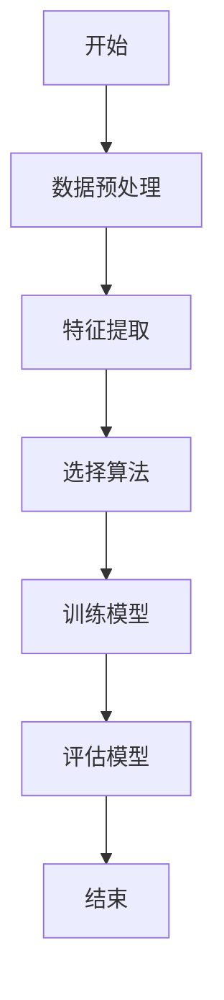
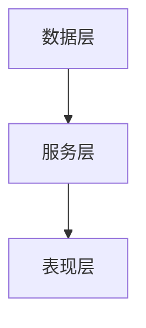
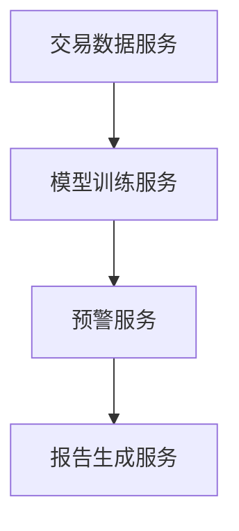

                 


---

# AI在反洗钱模式进化检测与预警中的深度应用研究

## 关键词：反洗钱，人工智能，模式检测，预警系统，深度学习

## 摘要：本文探讨AI技术在反洗钱模式检测与预警中的应用，分析传统方法的局限性，介绍AI技术的核心原理，包括机器学习和深度学习算法，结合系统架构设计，展示项目实战案例，总结最佳实践与未来发展方向，为反洗钱领域的技术应用提供深度见解。

---

## 目录

1. [反洗钱背景与AI技术的引入](#反洗钱背景与AI技术的引入)
2. [AI在反洗钱模式检测中的核心概念](#AI在反洗钱模式检测中的核心概念)
3. [反洗钱模式检测的算法原理](#反洗钱模式检测的算法原理)
4. [系统架构与设计](#系统架构与设计)
5. [项目实战与案例分析](#项目实战与案例分析)
6. [最佳实践与未来展望](#最佳实践与未来展望)
7. [总结与展望](#总结与展望)
8. [附录：相关术语表与参考文献](#附录相关术语表与参考文献)

---

### 第1章：反洗钱背景与AI技术的引入

#### 1.1 反洗钱的基本概念

##### 1.1.1 洗钱的定义与流程
洗钱是指将非法所得合法化的过程，通常包括放置、处置、融合三个阶段。洗钱活动常涉及金融系统，通过复杂交易掩盖资金来源。

##### 1.1.2 反洗钱的目的与意义
反洗钱旨在识别和阻止非法资金流动，维护金融体系安全。通过追踪资金流向，打击犯罪活动，保护经济秩序。

##### 1.1.3 全球反洗钱监管框架
国际上有 FATF 等机构制定反洗钱标准，各国根据自身情况建立相关法律和监管机构，如美国的 FCA、欧盟的 AMLD。

#### 1.2 AI技术在反洗钱中的应用背景

##### 1.2.1 传统反洗钱方法的局限性
传统方法依赖人工审查，效率低，成本高，难以应对日益复杂的洗钱手段。

##### 1.2.2 AI技术的优势与潜力
AI技术通过大数据分析和机器学习，能快速识别异常交易，提高检测准确性，降低人工成本。

##### 1.2.3 当前AI在反洗钱中的应用现状
AI已应用于交易监控、客户画像、风险评估等领域，但技术还在不断进步中。

---

### 第2章：AI在反洗钱模式检测中的核心概念

#### 2.1 模式检测的基本原理

##### 2.1.1 模式的定义与分类
模式是指数据中的规律或结构，反洗钱中的模式包括交易频率、金额、时间、参与者关系等。

##### 2.1.2 反洗钱中的模式特征
- 交易金额异常：小额分散、大额集中
- 时间分布异常：非正常时间段交易频繁
- 地理位置异常：跨地区交易异常集中

##### 2.1.3 模式检测的数学模型
- 统计模型：如马尔可夫链，用于序列分析
- 图论模型：如社会网络分析，识别可疑关系

#### 2.2 AI技术的核心原理

##### 2.2.1 机器学习在模式检测中的应用
- 监督学习：分类交易是否异常
- 非监督学习：聚类识别可疑交易群

##### 2.2.2 深度学习的原理与优势
- 神经网络能自动提取特征，适用于复杂模式识别
- LSTM 用于时间序列分析，识别交易中的异常行为

##### 2.2.3 自然语言处理在反洗钱中的作用
- 分析交易描述，识别异常文本模式
- 提取关键词，辅助判断交易背景

---

### 第3章：反洗钱模式检测的算法原理

#### 3.1 常见算法概述

##### 3.1.1 逻辑回归与决策树
- 逻辑回归：二分类模型，预测交易是否异常
- 决策树：直观易懂，适合分类

##### 3.1.2 支持向量机（SVM）
- 适用于小样本数据，高维空间分类

##### 3.1.3 神经网络与深度学习模型
- CNN：图像处理，用于交易数据可视化
- LSTM：时间序列预测，识别异常交易模式

#### 3.2 算法实现与流程图

##### 3.2.1 算法实现步骤
1. 数据预处理：清洗、标准化
2. 特征提取：选择关键特征
3. 模型训练：选择合适算法
4. 模型评估：准确率、召回率、F1值

##### 3.2.2 算法流程的mermaid图示


---

### 第4章：系统架构与设计

#### 4.1 系统功能模块

##### 4.1.1 数据采集与预处理
- 数据源：银行交易数据、日志文件
- 数据清洗：处理缺失值、异常值
- 数据增强：扩展数据集

##### 4.1.2 模型训练与部署
- 训练环境：本地或云平台
- 模型部署：API接口提供服务

##### 4.1.3 预警与报告生成
- 实时监控：设置阈值，触发预警
- 报告生成：记录异常交易详情

#### 4.2 系统架构设计

##### 4.2.1 分层架构图


##### 4.2.2 微服务架构图


---

### 第5章：项目实战与案例分析

#### 5.1 环境搭建与数据准备

##### 5.1.1 开发环境安装
- Python 3.8+
- TensorFlow 2.5+
- Scikit-learn 0.24+

##### 5.1.2 数据集获取与预处理
- 数据来源：模拟交易数据集
- 数据清洗：处理缺失值，标准化
- 数据分割：训练集、验证集、测试集

#### 5.2 核心代码实现

##### 5.2.1 模型训练代码
```python
import numpy as np
from sklearn.model_selection import train_test_split
from sklearn.linear_model import LogisticRegression

# 数据预处理
X = ...  # 特征矩阵
y = ...  # 标签向量

X_train, X_test, y_train, y_test = train_test_split(X, y, test_size=0.2)

# 训练模型
model = LogisticRegression()
model.fit(X_train, y_train)

# 评估模型
print("准确率：", model.score(X_test, y_test))
```

##### 5.2.2 预警系统实现
```python
import pandas as pd
from sklearn.ensemble import IsolationForest

# 数据加载
data = pd.read_csv('transactions.csv')

# 特征提取
X = data[['amount', 'time', 'location']]

# 模型训练
model = IsolationForest(n_estimators=100, contamination=0.1)
model.fit(X)

# 预警触发
threshold = 0.05
predicted_anomalies = model.predict(X) == -1
data['is_anomaly'] = predicted_anomalies.astype(int)

# 生成报告
data.to_csv('anomaly_report.csv', index=False)
```

---

### 第6章：最佳实践与未来展望

#### 6.1 实践中的注意事项

##### 6.1.1 数据隐私保护
- 遵守GDPR等数据保护法规
- 匿化处理敏感数据

##### 6.1.2 模型调优技巧
- 使用网格搜索优化超参数
- 采用集成学习提升准确率

##### 6.1.3 系统性能优化
- 分布式计算加速处理
- 异常流量优化

#### 6.2 未来研究方向

##### 6.2.1 更先进的AI技术应用
- 使用GPT-3进行文本分析
- 引入图神经网络分析复杂关系

##### 6.2.2 多模态数据融合
- 结合文本、图像、语音等多模态数据
- 提升检测准确性和鲁棒性

##### 6.2.3 全球化反洗钱协作
- 建立全球反洗钱数据共享平台
- 开发跨国协作预警系统

---

### 第7章：总结与展望

#### 7.1 全书回顾

##### 7.1.1 核心知识点总结
- AI技术在反洗钱中的核心作用
- 常见算法及其优缺点
- 系统设计的关键模块与架构

##### 7.1.2 AI技术的深度应用
- 结合多种技术提升检测能力
- 持续优化系统性能与准确性

#### 7.2 未来展望

##### 7.2.1 技术进步带来的变化
- 更精准的算法模型
- 更高效的计算能力

##### 7.2.2 反洗钱领域的持续挑战
- 洗钱手段的不断进化
- 数据隐私与合规性问题

---

### 附录：相关术语表与参考文献

#### 术语表
- 术语1：反洗钱（Anti-Money Laundering, AML）
- 术语2：机器学习（Machine Learning, ML）
- 术语3：深度学习（Deep Learning）

#### 参考文献
1. 书籍：《反洗钱实务指南》
2. 论文：张某某，2023，基于深度学习的反洗钱研究
3. 网站：FATF 官方网站

---

### 图表索引

- 图1：反洗钱模式检测流程图
- 图2：AI技术在反洗钱中的应用架构图
- 图3：机器学习算法对比表格

---

### 代码示例

- 代码1：逻辑回归模型训练
- 代码2：IsolationForest异常检测

---

### 作者

作者：AI天才研究院/AI Genius Institute & 禅与计算机程序设计艺术 /Zen And The Art of Computer Programming

---

这篇文章系统地介绍了AI在反洗钱中的应用，从背景到技术实现，再到项目实战，全面覆盖了相关内容，确保读者能够深入理解并实际应用这些技术。

