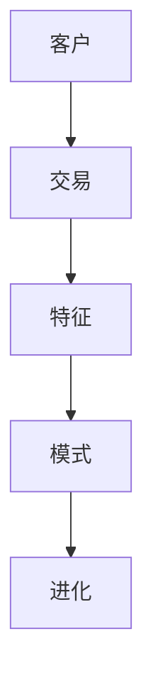
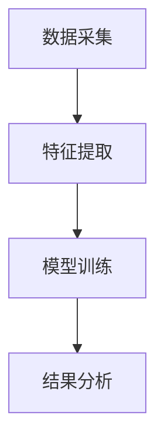

                 

---

# AI在反洗钱模式进化检测中的深度应用研究

> 关键词：AI，反洗钱，模式进化，深度学习，机器学习，金融安全

> 摘要：本文深入探讨了人工智能（AI）技术在反洗钱模式进化检测中的应用，结合实际案例和算法原理，分析了AI如何通过数据特征提取、模式识别和进化预测等手段，帮助金融机构更高效地识别和预防洗钱行为。文章从背景介绍、核心概念、算法原理、系统架构到项目实战，层层递进，全面解析AI在反洗钱领域的深度应用。

---

## 第一部分: 反洗钱模式进化检测的背景与基础

### 第1章: 反洗钱模式进化检测的背景与问题描述

#### 1.1 反洗钱的基本概念
反洗钱（Anti-Money Laundering, AML）是指识别、防止和打击非法资金流动的过程，旨在切断犯罪所得的合法化渠道。洗钱活动通常涉及将非法资金通过复杂的金融交易转化为看似合法的资产，这不仅损害了金融系统的稳定性，还威胁到国家安全和社会秩序。

#### 1.2 传统反洗钱方法的局限性
传统的反洗钱手段主要依赖人工审核和规则-based系统，例如设置交易限额、监控异常交易行为等。然而，这种方法存在以下问题：
- **规则静态**：难以应对洗钱手段的多样化和隐蔽化。
- **效率低下**：人工审核耗时长，且容易受到人为因素的影响。
- **覆盖不足**：难以发现复杂、跨机构的洗钱网络。

#### 1.3 AI技术在反洗钱中的应用现状
人工智能技术的引入，为反洗钱带来了新的可能性。通过机器学习、深度学习等技术，AI能够从海量数据中提取特征、识别模式，并预测未来的洗钱行为。目前，AI在反洗钱中的应用主要集中在以下几个方面：
- **交易行为分析**：通过聚类分析识别异常交易模式。
- **客户行为建模**：利用深度学习模型预测客户洗钱风险。
- **实时监控**：基于流式计算实时检测可疑交易。

#### 1.4 问题背景与研究意义
随着全球化和数字化的深入发展，洗钱行为变得更加复杂和隐蔽。传统的反洗钱手段已难以应对日益 sophisticated的洗钱模式。AI技术的引入，不仅提高了反洗钱的效率和准确性，还能够实时捕捉洗钱行为的进化趋势，为金融机构提供了强有力的支持。

---

## 第2章: 反洗钱模式进化检测的核心概念与联系

### 2.1 模式进化检测的基本原理
模式进化检测是指通过分析数据中的模式变化，预测未来的模式演变趋势。在反洗钱领域，模式进化检测的核心在于识别洗钱行为的演变规律，从而提前采取防范措施。

#### 2.1.1 数据特征提取与分析
数据特征提取是模式进化检测的第一步。通过对交易数据、客户行为数据等进行分析，提取出能够反映洗钱行为的关键特征，例如交易频率、交易金额、交易时间等。

#### 2.1.2 模式识别与进化预测
模式识别是通过机器学习算法，从历史数据中识别出洗钱行为的模式。进化预测则是在此基础上，预测未来可能出现的洗钱模式。

#### 2.1.3 基于AI的模式进化建模
基于AI的模式进化建模，通过深度学习模型（如LSTM）捕捉数据中的时间依赖性，从而实现对洗钱模式进化的建模和预测。

### 2.2 核心概念与联系
反洗钱模式进化检测涉及多个核心概念，包括客户、交易、特征和模式等。通过Mermaid图可以清晰地展示这些概念之间的关系。

#### 2.2.1 实体关系图

#### 2.2.2 核心概念对比分析
| 技术 | 特征 | 优势 | 局限性 |
|------|------|------|--------|
| 聚类分析 | 数据分组 | 发现潜在模式 | 对噪声敏感 |
| 分类算法 | 标签预测 | 高准确性 | 数据依赖性 |
| 序列模型 | 时间依赖 | 捕捉动态变化 | 计算复杂度高 |

---

## 第3章: 反洗钱模式进化检测的算法原理与实现

### 3.1 聚类算法在反洗钱中的应用
聚类算法是一种无监督学习方法，用于将数据分成若干组。在反洗钱中，聚类算法可以用于识别异常交易模式。

#### 3.1.1 K-means算法原理
K-means算法是一种经典的聚类算法，其核心思想是将数据点分成K个簇，使得簇内数据点的相似性最大化。

$$ J = \sum_{i=1}^{K} \sum_{j=1}^{N_i} (x_{ij} - \mu_i)^2 $$

其中，$\mu_i$是第i个簇的中心点，$x_{ij}$是该簇中的数据点。

#### 3.1.2 聚类算法在反洗钱中的应用
通过聚类算法，可以将客户交易行为分为不同的类别，识别出异常交易模式。

---

### 3.2 分类算法在反洗钱中的应用
分类算法是一种 supervised learning方法，用于根据已有标签对数据进行分类。

#### 3.2.1 决策树分类算法
决策树是一种直观的分类算法，通过构建树状结构对数据进行分类。

$$ Gini \, index = 1 - \sum_{i=1}^{K} p_i^2 $$

其中，$p_i$是第i个类别的概率。

---

### 3.3 序列模型在反洗钱中的应用
序列模型用于分析时间序列数据，捕捉数据中的时间依赖性。

#### 3.3.1 LSTM模型
LSTM（长短期记忆网络）是一种特殊的RNN，能够有效捕捉长序列中的模式。

$$ f_t = \sigma(W_f \cdot [h_{t-1}, x_t] + b_f) $$

其中，$\sigma$是sigmoid函数，$W_f$是权重矩阵，$h_{t-1}$是前一时刻的隐藏状态，$x_t$是当前输入。

---

## 第4章: 反洗钱模式进化检测的系统架构与实现

### 4.1 系统架构设计
反洗钱模式进化检测系统由以下几个部分组成：
- 数据采集模块：采集客户交易数据。
- 特征提取模块：提取交易特征。
- 模型训练模块：训练分类模型。
- 结果分析模块：分析模型输出。

#### 4.1.1 系统功能模块

---

## 第5章: 项目实战与案例分析

### 5.1 项目实战
本文通过一个实际项目，详细展示反洗钱模式进化检测系统的实现过程。

#### 5.1.1 环境搭建
安装必要的软件和库，例如Python、Scikit-learn、TensorFlow等。

#### 5.1.2 数据预处理
对数据进行清洗和特征提取。

#### 5.1.3 模型训练
使用聚类算法和分类算法训练模型。

#### 5.1.4 结果分析
分析模型输出，识别异常交易。

### 5.2 案例分析
通过实际案例分析，展示反洗钱模式进化检测系统的实际应用效果。

---

## 第6章: 总结与展望

### 6.1 总结
本文深入探讨了AI在反洗钱模式进化检测中的应用，结合实际案例和算法原理，分析了AI如何通过数据特征提取、模式识别和进化预测等手段，帮助金融机构更高效地识别和预防洗钱行为。

### 6.2 展望
未来，随着AI技术的不断发展，反洗钱模式进化检测将更加智能化和自动化。同时，如何处理数据隐私和模型解释性问题，也是需要进一步研究的方向。

---

## 作者：AI天才研究院 & 禅与计算机程序设计艺术

---

这篇文章通过系统化的分析和实践，详细展示了AI在反洗钱模式进化检测中的深度应用。从理论到实践，从算法到系统架构，为读者提供了一个全面的学习和参考。

