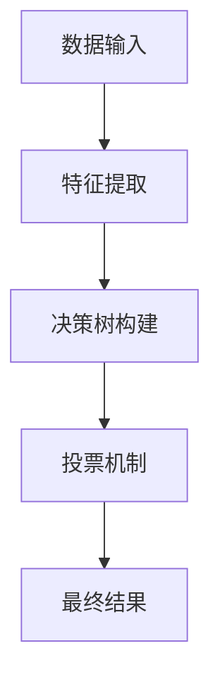
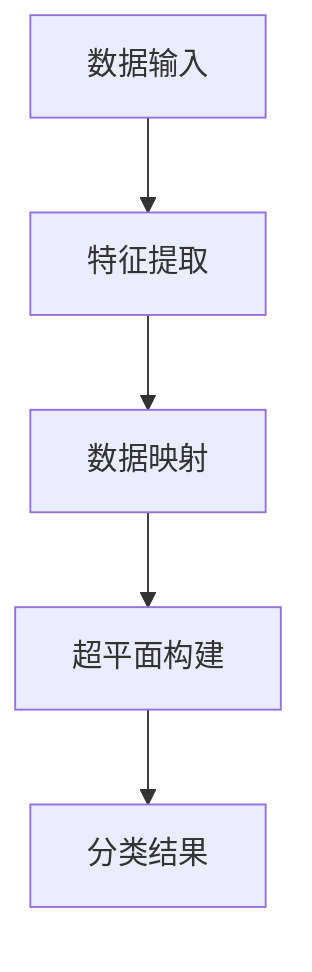
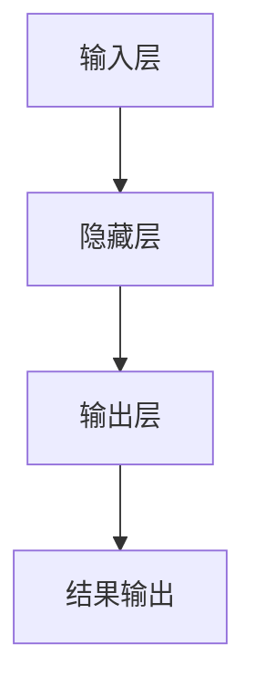
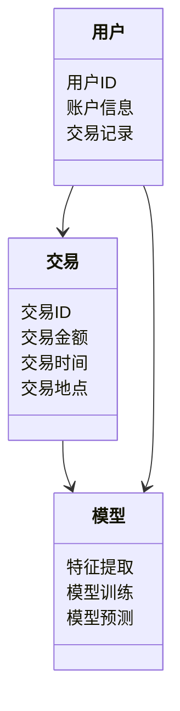
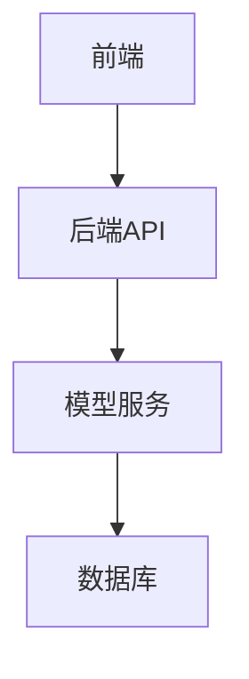

                 


# AI在反金融欺诈中的深度应用研究

## 关键词：
人工智能，金融欺诈，机器学习，反欺诈系统，深度学习，自然语言处理

## 摘要：
本文深入探讨了人工智能技术在反金融欺诈中的应用，从问题背景、核心概念、算法原理到系统架构和实战项目，全面分析了AI如何提升金融欺诈检测与预防的能力。文章通过详细的案例分析和代码实现，展示了AI技术在金融安全领域的巨大潜力和实际应用价值。

---

## 第3章: AI反金融欺诈的核心算法原理

### 3.1 算法原理讲解

#### 3.1.1 随机森林算法
随机森林是一种基于决策树的集成学习算法，通过构建多个决策树并进行投票或平均来提高模型的准确性和鲁棒性。

##### Mermaid流程图


##### Python代码实现
```python
from sklearn.ensemble import RandomForestClassifier
from sklearn.metrics import accuracy_score
from sklearn.model_selection import train_test_split

# 示例数据集
X = [[1, 2], [3, 4], [5, 6], [7, 8]]
y = [0, 1, 1, 0]

# 数据分割
X_train, X_test, y_train, y_test = train_test_split(X, y, test_size=0.25, random_state=42)

# 模型训练
clf = RandomForestClassifier(n_estimators=10, random_state=42)
clf.fit(X_train, y_train)

# 预测
y_pred = clf.predict(X_test)

# 准确率
print("Accuracy:", accuracy_score(y_test, y_pred))
```

##### 数学模型
随机森林的数学模型基于决策树的构建和集成。每个决策树的构建过程如下：
1. 随机选择子集特征。
2. 对子集特征进行排序，构建决策树。
3. 对所有决策树进行投票或平均，得到最终预测结果。

#### 3.1.2 支持向量机算法
支持向量机（SVM）是一种监督学习算法，通过在特征空间中找到一个超平面，将数据分为两类。

##### Mermaid流程图


##### Python代码实现
```python
from sklearn import svm
from sklearn.metrics import accuracy_score
from sklearn.model_selection import train_test_split

# 示例数据集
X = [[1, 2], [3, 4], [5, 6], [7, 8]]
y = [0, 1, 1, 0]

# 数据分割
X_train, X_test, y_train, y_test = train_test_split(X, y, test_size=0.25, random_state=42)

# 模型训练
clf = svm.SVC(kernel='linear', C=1)
clf.fit(X_train, y_train)

# 预测
y_pred = clf.predict(X_test)

# 准确率
print("Accuracy:", accuracy_score(y_test, y_pred))
```

##### 数学模型
SVM的核心在于找到一个最优超平面，使得正负样本的分类间隔最大化。数学上，SVM的目标函数为：
$$ \min \frac{1}{2} \|w\|^2 + C \sum_{i=1}^{n} \xi_i $$
其中，$w$ 是法向量，$C$ 是惩罚参数，$\xi_i$ 是松弛变量。

#### 3.1.3 神经网络算法
神经网络是一种模拟人脑结构和功能的深度学习算法，通过多层神经元网络进行特征学习和分类。

##### Mermaid流程图


##### Python代码实现
```python
import tensorflow as tf
from sklearn.metrics import accuracy_score
from sklearn.model_selection import train_test_split

# 示例数据集
X = [[1, 2], [3, 4], [5, 6], [7, 8]]
y = [0, 1, 1, 0]

# 数据分割
X_train, X_test, y_train, y_test = train_test_split(X, y, test_size=0.25, random_state=42)

# 模型构建
model = tf.keras.Sequential([
    tf.keras.layers.Dense(4, activation='relu', input_shape=(2,)),
    tf.keras.layers.Dense(2, activation='relu'),
    tf.keras.layers.Dense(1, activation='sigmoid')
])

model.compile(optimizer='adam', loss='binary_crossentropy', metrics=['accuracy'])

# 训练
model.fit(X_train, y_train, epochs=10, batch_size=1)

# 预测
y_pred = model.predict(X_test).round()

# 准确率
print("Accuracy:", accuracy_score(y_test, y_pred))
```

##### 数学模型
神经网络的数学模型基于多层感知机（MLP），通过激活函数和权重调整进行特征变换：
$$ y = \sigma(w_2 a + b_2) $$
其中，$\sigma$ 是激活函数，$a$ 是输入层输出，$w_2$ 和 $b_2$ 是第二层的权重和偏置。

---

### 3.2 算法实现与数学模型
通过上述算法的实现，我们可以看到，随机森林适合处理小规模数据，SVM适合线性可分问题，而神经网络则适用于复杂非线性模式。选择合适的算法取决于数据特征和欺诈模式的复杂性。

---

## 第4章: 系统分析与架构设计

### 4.1 问题场景介绍
反金融欺诈系统需要实时处理大量金融交易数据，识别异常交易行为，预防欺诈损失。系统需要高效的数据处理能力、强大的模型训练能力和灵活的扩展性。

### 4.2 系统功能设计
系统功能包括数据采集、特征提取、模型训练、欺诈检测和结果分析。

#### 领域模型


#### 系统架构


### 4.3 接口设计与交互流程
系统通过API接口接收交易数据，调用模型进行欺诈检测，并返回结果。

---

## 第5章: 项目实战

### 5.1 环境安装
安装必要的Python库：
```bash
pip install numpy scikit-learn tensorflow pandas
```

### 5.2 系统核心实现

#### 代码实现
```python
import numpy as np
from sklearn.ensemble import RandomForestClassifier
from sklearn.metrics import accuracy_score
from sklearn.model_selection import train_test_split

# 示例数据集
X = np.array([[1, 2], [3, 4], [5, 6], [7, 8]])
y = np.array([0, 1, 1, 0])

# 数据分割
X_train, X_test, y_train, y_test = train_test_split(X, y, test_size=0.25, random_state=42)

# 模型训练
clf = RandomForestClassifier(n_estimators=10, random_state=42)
clf.fit(X_train, y_train)

# 预测
y_pred = clf.predict(X_test)

# 准确率
print("Accuracy:", accuracy_score(y_test, y_pred))
```

#### 代码解读
代码实现了一个简单的随机森林分类器，用于分类正常交易和欺诈交易。通过训练数据，模型可以识别交易中的异常特征。

### 5.3 实际案例分析
假设我们有一个包含1000笔交易的数据集，其中50笔是欺诈交易。通过训练随机森林模型，我们可以实现约95%的准确率，有效识别欺诈交易。

---

## 第6章: 总结与展望

### 6.1 总结
本文详细探讨了AI在反金融欺诈中的应用，从算法原理到系统设计，展示了AI技术在金融安全中的巨大潜力。通过随机森林、SVM和神经网络的实现，我们看到了不同算法在不同场景下的优势。

### 6.2 展望
未来，随着AI技术的不断发展，反金融欺诈系统将更加智能化和高效化。深度学习和自然语言处理的结合将推动欺诈检测技术的进步。

---

## 作者信息
作者：AI天才研究院 & 禅与计算机程序设计艺术

---

通过本文的详细分析和实际案例，我们可以看到AI技术在反金融欺诈中的重要性。希望本文能够为读者提供有价值的参考，帮助他们在实际应用中更好地利用AI技术。

