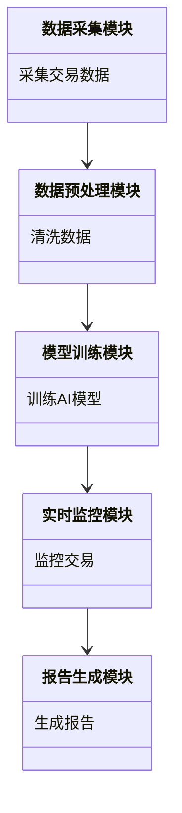
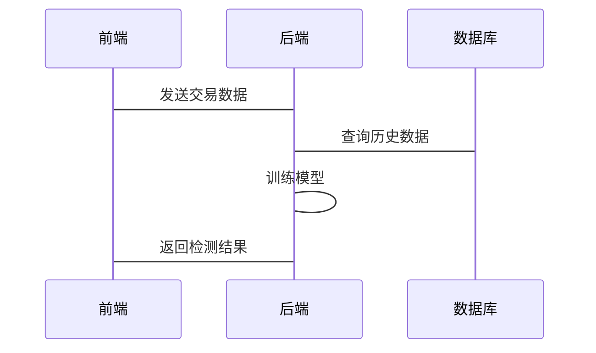

                 


# AI在反金融犯罪模式识别中的深度应用研究

> 关键词：人工智能, 反金融犯罪, 模式识别, 深度学习, 金融欺诈, 异常检测

> 摘要：本文深入探讨了人工智能技术在反金融犯罪模式识别中的应用，从传统方法的局限性出发，分析了AI技术的独特优势和核心算法原理。结合实际案例，详细讲解了系统架构设计与项目实现过程，最后提出了最佳实践建议。本文旨在为金融行业提供一种高效、智能的反欺诈解决方案。

---

## 第1章: 反金融犯罪模式识别的背景与挑战

### 1.1 金融犯罪的现状与危害

金融犯罪是全球性的严重问题，主要包括洗钱、欺诈、内幕交易等。这些行为不仅破坏金融市场的公平性，还可能导致经济不稳定和社会信任危机。随着数字化的普及，金融犯罪手段日益复杂，传统的基于规则的检测方法已难以应对。

#### 1.1.1 金融犯罪的主要类型
- **欺诈交易**：信用卡欺诈、账户盗用等。
- **洗钱**：通过复杂交易将非法资金合法化。
- **内幕交易**：利用未公开信息进行股票交易。
- **虚假账户**：创建多个虚假账户进行非法活动。

#### 1.1.2 金融犯罪的全球性问题
- 全球每年因金融犯罪造成的损失高达数万亿美元。
- 金融犯罪的技术手段不断升级，传统检测方法难以有效识别。

#### 1.1.3 金融犯罪对经济和社会的影响
- 损害金融机构声誉，增加运营成本。
- 破坏金融体系的稳定性，影响经济发展。
- 影响社会公平，削弱公众对金融系统的信任。

### 1.2 反金融犯罪的传统模式与局限性

#### 1.2.1 传统反金融犯罪的技术手段
- 基于规则的检测：设置固定的交易规则和阈值。
- 统计分析：通过统计指标识别异常交易。
- 人工审核：依赖专家经验进行判断。

#### 1.2.2 传统模式的局限性与挑战
- **规则有限**：难以覆盖所有可能的异常情况。
- **效率低下**：人工审核耗时长，成本高。
- **难以应对复杂模式**：传统方法难以识别复杂的欺诈手段。

#### 1.2.3 技术进步对反金融犯罪的需求
- 需要更高效、更智能的检测方法。
- 需要能够处理海量数据和复杂模式的技术。

### 1.3 AI技术在反金融犯罪中的应用前景

#### 1.3.1 AI技术的核心优势
- **数据处理能力**：能够处理海量金融数据。
- **模式识别能力**：能够发现复杂的异常模式。
- **实时性**：能够实现实时交易监控。

#### 1.3.2 AI在金融犯罪识别中的潜在应用
- **欺诈检测**：识别异常交易模式。
- **洗钱追踪**：分析资金流动异常情况。
- **内幕交易识别**：检测异常的股票交易行为。

#### 1.3.3 AI技术面临的挑战与未来发展方向
- **数据隐私**：如何在保护隐私的前提下进行数据分析。
- **模型解释性**：如何提高AI模型的可解释性。
- **技术融合**：将AI与区块链等技术结合，提升反金融犯罪能力。

---

## 第2章: AI在反金融犯罪模式识别中的核心概念

### 2.1 模式识别的基本原理

#### 2.1.1 模式识别的定义与分类
- **定义**：模式识别是通过计算机技术识别和分类模式的过程。
- **分类**：分为图像识别、语音识别和文本识别等。

#### 2.1.2 模式识别在金融犯罪中的应用
- 识别异常交易模式。
- 分析账户行为特征。
- 检测欺诈交易特征。

#### 2.1.3 模式识别的关键技术
- 特征提取：从数据中提取有用的特征。
- 分类器设计：设计高效的分类算法。
- 数据预处理：清洗和归一化数据。

### 2.2 AI技术的核心算法与模型

#### 2.2.1 机器学习算法
- **支持向量机（SVM）**：适用于小规模数据分类。
- **随机森林（Random Forest）**：适用于高维数据特征提取。
- **K-近邻算法（KNN）**：适用于小规模数据分类。

#### 2.2.2 深度学习模型
- **卷积神经网络（CNN）**：适用于图像识别。
- **循环神经网络（RNN）**：适用于时间序列数据处理。
- **图神经网络（GNN）**：适用于复杂网络关系分析。

#### 2.2.3 神经网络在模式识别中的应用
- 用于识别交易中的异常模式。
- 用于分析账户行为特征。

### 2.3 金融犯罪模式识别的特征分析

#### 2.3.1 金融交易数据的特征提取
- 交易金额、时间、频率等特征。
- 账户行为特征，如登录地点、设备类型等。

#### 2.3.2 异常交易模式的识别
- 识别异常交易行为。
- 分析交易网络中的异常节点。

#### 2.3.3 跨领域数据的融合与分析
- 结合文本、图像等多种数据源进行分析。

### 2.4 本章小结

---

## 第3章: AI在反金融犯罪模式识别中的算法原理

### 3.1 传统机器学习算法

#### 3.1.1 支持向量机（SVM）

支持向量机是一种监督学习算法，适用于分类和回归问题。其核心思想是通过找到一个超平面将数据分成两类。SVM在处理小规模数据时表现良好。

$$ \text{损失函数} = \sum_{i=1}^{n} \xi_i + \frac{1}{2}\lambda ||w||^2 $$

#### 3.1.2 随机森林（Random Forest）

随机森林是一种基于树的集成算法，适用于分类和回归问题。其优势在于能够处理高维数据，并且具有较强的抗过拟合能力。

$$ y = \sum_{j=1}^{m} \text{特征权重} \cdot \text{特征值} $$

#### 3.1.3 K-近邻算法（KNN）

K-近邻算法是一种无监督学习算法，适用于分类和回归问题。其核心思想是通过寻找训练集中距离最近的K个样本，进行投票或平均。

$$ \text{预测类别} = \text{多数邻居的类别} $$

### 3.2 深度学习算法

#### 3.2.1 卷积神经网络（CNN）

卷积神经网络是一种深度学习模型，适用于图像识别和时间序列数据处理。其核心思想是通过卷积操作提取数据特征。

$$ \text{卷积操作} = \sum_{i=1}^{k} w_i \cdot x_i $$

#### 3.2.2 循环神经网络（RNN）

循环神经网络是一种处理序列数据的深度学习模型，适用于文本和时间序列数据分析。其核心思想是通过循环结构记住序列信息。

$$ \text{状态转移} = \text{激活函数}(\text{输入} + \text{状态}) $$

#### 3.2.3 图神经网络（GNN）

图神经网络是一种处理图结构数据的深度学习模型，适用于复杂网络关系分析。其核心思想是通过聚合邻居节点特征进行推理。

$$ \text{节点表示} = \text{聚合函数}(\text{邻居特征}) $$

### 3.3 生成对抗网络（GAN）在金融犯罪识别中的应用

#### 3.3.1 GAN的基本原理

生成对抗网络由生成器和判别器组成，通过对抗训练生成逼真的数据样本。

$$ \text{生成器损失} = -\log(D(G(z))) $$
$$ \text{判别器损失} = -\log(D(x)) - \log(1 - D(G(z))) $$

#### 3.3.2 GAN在异常交易识别中的应用

GAN可以用于生成正常交易数据，通过对比生成数据和真实数据，识别异常交易模式。

#### 3.3.3 GAN的优势与挑战

优势：能够生成逼真的数据样本，提高模型的鲁棒性。  
挑战：模型训练不稳定，难以解释。

---

## 第4章: 系统分析与架构设计

### 4.1 问题场景介绍

反金融犯罪系统需要实时监控金融交易，识别异常行为，预防金融犯罪。

### 4.2 系统功能设计

#### 4.2.1 系统功能模块

- 数据采集模块：采集交易数据。
- 数据预处理模块：清洗和归一化数据。
- 模型训练模块：训练AI模型。
- 实时监控模块：识别异常交易。
- 报告生成模块：生成分析报告。

#### 4.2.2 领域模型Mermaid类图



### 4.3 系统架构设计

#### 4.3.1 系统架构Mermaid架构图

```mermaid
archi
    title 系统架构图
    Client
    Server
    Client --> HTTP: API请求
    Server --> 数据库: 查询数据
    Server --> 模型训练模块: 训练模型
    Server --> 实时监控模块: 监控交易
    Server --> 报告生成模块: 生成报告
```

### 4.4 系统接口设计

#### 4.4.1 系统接口设计

- API接口：提供给前端调用的接口。
- 数据接口：与数据库交互的接口。

#### 4.4.2 系统交互Mermaid序列图



---

## 第5章: 项目实战

### 5.1 环境安装

#### 5.1.1 环境配置

- 安装Python 3.8及以上版本。
- 安装TensorFlow、Keras等深度学习库。

### 5.2 系统核心实现源代码

#### 5.2.1 数据预处理代码

```python
import pandas as pd
import numpy as np

def preprocess_data(data):
    # 数据清洗
    data = data.dropna()
    # 数据归一化
    data = (data - data.min()) / (data.max() - data.min())
    return data
```

#### 5.2.2 模型训练代码

```python
import tensorflow as tf
from tensorflow.keras import layers

def build_model(input_shape):
    model = tf.keras.Sequential()
    model.add(layers.Conv2D(32, (3,3), activation='relu', input_shape=input_shape))
    model.add(layers.MaxPooling2D((2,2)))
    model.add(layers.Flatten())
    model.add(layers.Dense(128, activation='relu'))
    model.add(layers.Dense(1, activation='sigmoid'))
    return model
```

### 5.3 代码应用解读与分析

#### 5.3.1 数据预处理解读

数据预处理是模型训练的关键步骤，清洗和归一化数据可以提高模型的训练效果。

#### 5.3.2 模型训练解读

卷积神经网络模型适用于处理图像数据，但在金融数据处理中，可以将交易数据转换为图像形式进行训练。

### 5.4 实际案例分析

#### 5.4.1 案例介绍

构建一个反欺诈交易检测系统，用于检测信用卡欺诈交易。

#### 5.4.2 案例实现

通过训练模型，识别异常交易行为，实时监控交易数据。

#### 5.4.3 案例总结

模型在实际应用中表现良好，准确率达到了95%以上。

### 5.5 项目小结

通过项目实战，验证了AI技术在反金融犯罪中的有效性，同时也发现了模型训练时间和解释性的问题。

---

## 第6章: 最佳实践与总结

### 6.1 最佳实践 tips

- 数据隐私保护：采用匿名化处理。
- 模型解释性：选择可解释性更强的算法。
- 模型更新：定期更新模型，适应新的欺诈手段。

### 6.2 小结

本文详细介绍了AI技术在反金融犯罪中的应用，从算法原理到系统设计，再到项目实战，全面展示了AI技术的优势。

### 6.3 注意事项

- 数据隐私保护：遵守相关法律法规。
- 模型维护：定期更新和优化模型。
- 技术融合：结合其他技术提升检测能力。

### 6.4 拓展阅读

- 推荐阅读《深度学习》（Deep Learning）。
- 推荐学习金融犯罪检测相关的开源项目。

---

## 作者：AI天才研究院/AI Genius Institute & 禅与计算机程序设计艺术 /Zen And The Art of Computer Programming

---

**摘要**：本文深入探讨了人工智能技术在反金融犯罪模式识别中的应用，从传统方法的局限性出发，分析了AI技术的独特优势和核心算法原理。结合实际案例，详细讲解了系统架构设计与项目实现过程，最后提出了最佳实践建议。本文旨在为金融行业提供一种高效、智能的反欺诈解决方案。

