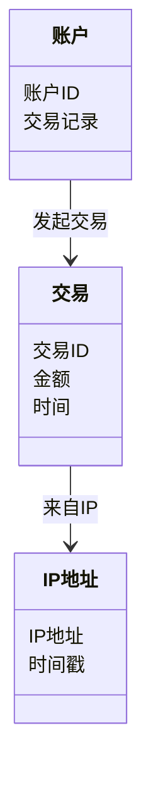
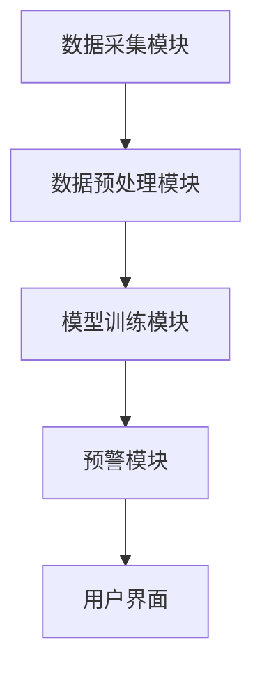
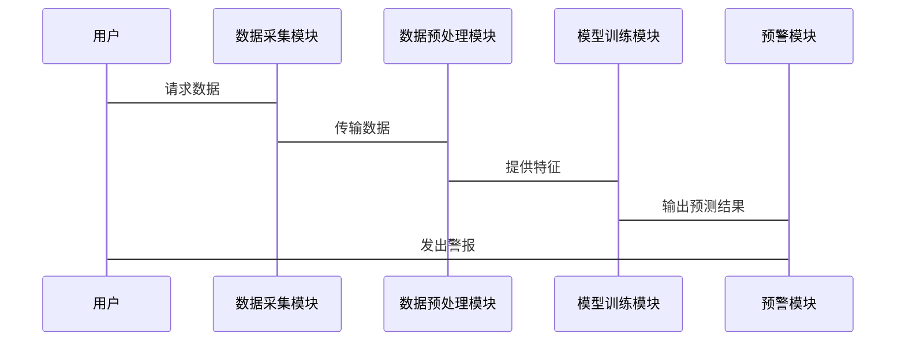

                 


# AI在反金融犯罪网络识别中的深度应用研究

> **关键词**：AI，反金融犯罪，网络识别，深度学习，图神经网络  
> **摘要**：本文深入探讨了人工智能技术在反金融犯罪网络识别中的应用，结合深度学习和图神经网络的核心算法原理，分析了金融犯罪网络的结构特征，并通过实际案例展示了AI技术在金融犯罪检测中的实践价值。文章从理论到实践，全面阐述了AI在反金融犯罪网络识别中的创新应用与技术突破。

---

## 第一部分: AI在反金融犯罪网络识别中的背景与概念

### 第1章: 反金融犯罪网络识别的背景与问题

#### 1.1 问题背景
##### 1.1.1 传统金融犯罪的特征与挑战
金融犯罪是指利用金融系统进行的非法活动，包括洗钱、欺诈、恐怖融资等。传统金融犯罪具有隐蔽性、复杂性和跨国性特点，给金融机构和社会经济带来巨大损失。传统的反金融犯罪技术依赖于规则-based系统，难以应对犯罪手段的不断进化。

##### 1.1.2 金融犯罪对社会经济的影响
金融犯罪不仅破坏金融市场的秩序，还可能导致企业破产、失业率上升等问题。例如，洗钱活动可能导致资金流向非法经济领域，加剧经济不平等。

##### 1.1.3 传统反金融犯罪技术的局限性
传统技术主要依赖人工审查和简单的规则匹配，难以发现复杂的关联性犯罪行为。此外，面对海量数据，传统方法效率低下，且容易受到人为因素的干扰。

#### 1.2 问题描述
##### 1.2.1 金融犯罪的多样性和复杂性
金融犯罪行为日益复杂化和网络化，犯罪分子通过多层次、多渠道的资金流动掩盖非法行为，增加了检测难度。

##### 1.2.2 网络化金融犯罪的特点
网络化金融犯罪通过跨国支付系统、虚拟货币等手段进行，具有跨国性和隐蔽性。犯罪分子利用技术手段绕过传统监管措施。

##### 1.2.3 反金融犯罪网络识别的核心目标
通过技术手段识别和预测金融犯罪行为，建立高效的网络识别系统，帮助金融机构和监管机构及时发现和阻止犯罪活动。

#### 1.3 问题解决与AI技术的引入
##### 1.3.1 AI技术在金融犯罪检测中的优势
AI技术（特别是深度学习）能够处理海量数据，发现隐藏的关联性，识别异常行为模式。

##### 1.3.2 深度学习在反金融犯罪中的应用前景
深度学习模型（如LSTM、CNN）在处理序列数据和图像数据方面具有显著优势，适用于金融交易数据的分析。

##### 1.3.3 网络识别技术的创新与突破
通过图神经网络（GNN）对金融网络进行建模，识别网络中的异常节点和关联关系，实现精准的犯罪行为预测。

#### 1.4 问题的边界与外延
##### 1.4.1 金融犯罪的类型划分
常见的金融犯罪类型包括洗钱、欺诈、恐怖融资等，每种类型的特点和数据模式不同。

##### 1.4.2 反金融犯罪网络识别的适用范围
适用于银行、支付平台、虚拟货币交易等金融场景，但需结合具体业务特点进行调整。

##### 1.4.3 相关领域的关联与区别
与网络安全、反洗钱、风险管理等领域密切相关，但侧重点有所不同。

#### 1.5 概念结构与核心要素
##### 1.5.1 反金融犯罪网络识别的系统架构
- 数据采集模块：收集交易数据、账户信息等。
- 特征提取模块：提取关键特征，如交易频率、金额、时间等。
- 模型训练模块：训练深度学习模型，识别异常行为。
- 预警系统模块：实时监控并发出预警信号。

##### 1.5.2 核心要素的组成与关系
- 数据源：交易数据、账户信息、IP地址等。
- 特征：时间特征、金额特征、行为模式特征。
- 模型：深度学习模型、图神经网络模型。
- 预警机制：实时监控、异常检测、风险评估。

##### 1.5.3 系统功能的模块化设计
- 数据预处理模块：清洗、归一化、特征工程。
- 模型训练模块：选择算法、调参、训练。
- 预警模块：实时监控、阈值设定、警报输出。

---

### 第2章: AI技术在反金融犯罪中的核心概念

#### 2.1 深度学习与反金融犯罪网络识别
##### 2.1.1 深度学习的定义与特点
深度学习是一种基于人工神经网络的机器学习方法，具有非线性表达能力强、自动提取特征的优势。

##### 2.1.2 深度学习在金融数据分析中的应用
- 时间序列分析（如LSTM）：适用于交易时间序列数据的异常检测。
- 图像识别（如CNN）：适用于交易记录的图像分析。

##### 2.1.3 网络识别中的深度学习模型
- LSTM：适用于时序数据，识别交易中的异常模式。
- CNN：适用于图像数据，识别交易记录中的异常特征。

#### 2.2 图神经网络与金融网络分析
##### 2.2.1 图神经网络的基本原理
图神经网络（GNN）通过聚合节点及其邻居的信息，进行图结构数据的分析。

##### 2.2.2 金融网络的图结构特征
- 节点：账户、交易、IP地址等。
- 边：交易关系、资金流动关系。

##### 2.2.3 图神经网络在金融犯罪检测中的应用
- 异常节点检测：识别可疑账户。
- 群组分析：识别非法交易网络。

#### 2.3 AI与金融网络分析的结合
##### 2.3.1 AI技术在金融网络分析中的优势
- 自动化分析：快速处理海量数据。
- 关联性识别：发现隐藏的关联关系。

##### 2.3.2 金融网络分析中的关键算法
- GNN：用于图数据建模。
- LSTM：用于时序数据建模。

##### 2.3.3 AI与金融网络分析的协同作用
- 综合分析：结合图结构和时序数据，实现精准检测。

#### 2.4 核心概念对比分析
##### 2.4.1 深度学习与传统机器学习的对比
| 对比维度 | 深度学习 | 传统机器学习 |
|----------|----------|---------------|
| 特征提取 | 自动提取 | 需人工设计 | 
| 模型复杂度 | 高 | 低 |
| 数据需求 | 大 | 小 |

##### 2.4.2 图神经网络与其他网络分析方法的对比
| 对比维度 | 图神经网络 | 其他方法（如传统网络分析） |
|----------|------------|-----------------------------|
| 分析能力 | 强，自动聚合信息 | 弱，依赖人工特征工程 |
| 计算效率 | 高 | 低 |

##### 2.4.3 AI技术在不同金融犯罪类型中的适用性对比
| 犯罪类型 | 深度学习适用性 | 图神经网络适用性 |
|----------|----------------|-----------------------|
| 洗钱 | 高 | 高 |
| 欺诈 | 高 | 中 |
| 恐怖融资 | 中 | 高 |

---

### 第3章: 反金融犯罪网络识别的核心算法原理

#### 3.1 深度学习算法原理
##### 3.1.1 深度学习的基本原理
深度学习通过多层非线性变换，从输入数据中自动提取特征。常用模型包括LSTM和CNN。

##### 3.1.2 常见深度学习模型
- LSTM：适用于时间序列数据，能够捕捉长期依赖关系。
- CNN：适用于图像数据，通过卷积核提取局部特征。

##### 3.1.3 网络识别中的深度学习模型
- LSTM用于分析交易时间序列数据，识别异常交易模式。
- CNN用于分析交易记录图像，识别异常特征。

#### 3.2 图神经网络算法原理
##### 3.2.1 图神经网络的基本原理
图神经网络通过聚合节点及其邻居的信息，更新节点表示，最终输出节点的异常分数。

##### 3.2.2 金融网络的图结构特征
金融网络中的节点包括账户、交易、IP地址等，边表示交易关系或资金流动关系。

##### 3.2.3 图神经网络在金融犯罪检测中的应用
- 异常节点检测：通过节点表示，识别可疑账户。
- 群组分析：识别非法交易网络。

#### 3.3 算法的数学模型与公式
##### 3.3.1 LSTM的数学模型
LSTM通过遗忘门、输入门和输出门更新细胞状态和隐藏状态：
$$
f_{\text{forget}} = \sigma(W_f x + U_f h_{\text{prev}})
$$
$$
i_{\text{input}} = \sigma(W_i x + U_i h_{\text{prev}})
$$
$$
o_{\text{output}} = \sigma(W_o x + U_o h_{\text{prev}})
$$
$$
c_{\text{new}} = f_{\text{forget}} \cdot c_{\text{prev}} + i_{\text{input}} \cdot \tilde{c}
$$
$$
h_{\text{new}} = o_{\text{output}} \cdot \tanh(c_{\text{new}})
$$

##### 3.3.2 图神经网络的数学模型
GNN通过聚合邻居信息更新节点表示：
$$
h_v^{(k)} = \text{aggregate}(\{h_u^{(k-1)} | u \in N(v)\})
$$
$$
h_v^{(k)} = \text{combine}(h_v^{(k-1)}, h_v^{(k)})
$$

---

## 第4章: 系统分析与架构设计

### 4.1 系统功能设计
#### 4.1.1 领域模型设计
Mermaid 类图：


#### 4.1.2 系统架构设计
Mermaid 架构图：


#### 4.1.3 系统接口设计
- 数据接口：与金融机构的数据库对接，获取交易数据。
- 预警接口：向监管机构发送警报信号。

#### 4.1.4 系统交互设计
Mermaid 序列图：


---

## 第5章: 项目实战

### 5.1 环境安装
#### 5.1.1 安装Python和相关库
```bash
pip install numpy pandas tensorflow keras
```

#### 5.1.2 安装图神经网络库
```bash
pip install networkx pyg
```

### 5.2 系统核心实现源代码
#### 5.2.1 LSTM模型实现
```python
import numpy as np
from tensorflow.keras.layers import LSTM, Dense
from tensorflow.keras.models import Sequential

model = Sequential()
model.add(LSTM(64, input_shape=(timesteps, features)))
model.add(Dense(1, activation='sigmoid'))
model.compile(optimizer='adam', loss='binary_crossentropy')
```

#### 5.2.2 图神经网络实现
```python
import torch
from torch.nn import Conv2d
import torch.nn.functional as F

class GNN(torch.nn.Module):
    def __init__(self):
        super(GNN, self).__init__()
        self.conv = Conv2d(1, 64, kernel_size=3, padding=1)

    def forward(self, x):
        out = F.relu(self.conv(x))
        return out
```

### 5.3 实际案例分析
#### 5.3.1 案例背景
某银行发现大量异常交易，疑似洗钱行为。

#### 5.3.2 数据分析
通过LSTM模型分析交易时间序列，发现异常交易模式。

#### 5.3.3 结果解读
模型识别出可疑账户，并通过图神经网络确认其关联的非法交易网络。

### 5.4 项目小结
通过AI技术实现金融犯罪网络识别，能够有效提高检测效率和准确性，为金融机构和监管机构提供有力支持。

---

## 第6章: 最佳实践

### 6.1 小结
AI技术在反金融犯罪网络识别中的应用前景广阔，深度学习和图神经网络的结合能够显著提升检测能力。

### 6.2 注意事项
- 数据隐私保护：确保数据处理符合隐私法规。
- 模型调优：根据不同场景调整模型参数。
- 实际应用中的局限性：AI技术不能完全替代人工审核。

### 6.3 拓展阅读
- 《深度学习实战》
- 《图神经网络入门》
- 《金融犯罪分析与预防》

---

## 作者：AI天才研究院/AI Genius Institute & 禅与计算机程序设计艺术/Zen And The Art of Computer Programming

