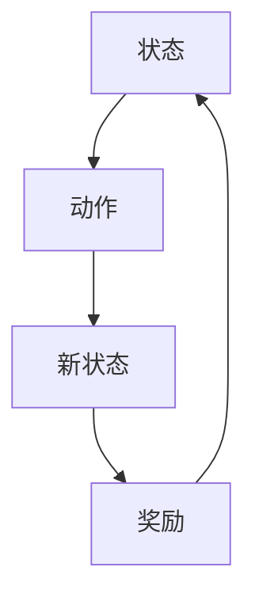
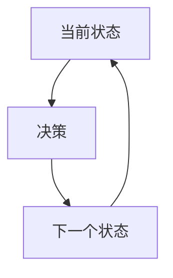
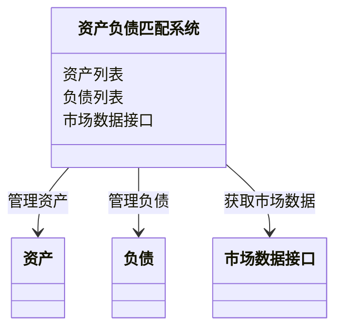
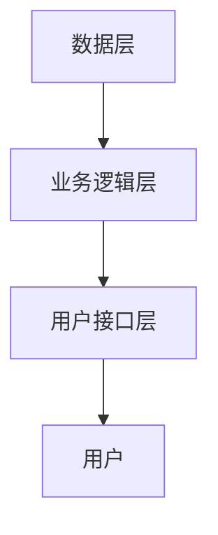

                 


# AI在资产负债匹配动态优化中的应用

## 关键词：AI, 资产负债匹配, 动态优化, 强化学习, 深度学习, 系统架构

## 摘要：  
本文探讨了人工智能在资产负债匹配动态优化中的应用，结合理论分析和实际案例，详细阐述了AI技术如何解决传统优化方法的局限性。通过强化学习、动态规划等算法，结合系统架构设计，展示了AI在动态优化中的优势和应用场景。

---

## 第一章：背景与核心概念

### 1.1 资产负债匹配的背景与意义

#### 1.1.1 金融市场的基本概念  
资产负债匹配是金融市场中的核心问题，涉及资产和负债的期限、风险和收益匹配，以实现稳健的财务管理和风险控制。

#### 1.1.2 资产负债匹配的定义与重要性  
资产负债匹配是指通过动态调整资产和负债的结构，以实现风险最小化和收益最大化的过程。其重要性在于优化资源配置，提升企业财务稳健性。

#### 1.1.3 动态优化的核心目标  
动态优化的目标是在市场变化中实时调整资产负债结构，最大化收益并最小化风险。

### 1.2 AI技术的快速发展

#### 1.2.1 AI技术的演进历程  
从机器学习到深度学习，AI技术的快速发展为金融领域的优化问题提供了新的解决方案。

#### 1.2.2 AI在金融领域的应用现状  
AI在金融领域的应用广泛，包括风险管理、投资组合优化和交易策略制定等。

#### 1.2.3 AI与资产负债匹配的结合趋势  
AI技术的引入为资产负债匹配提供了智能化的解决方案，显著提升了优化效率和准确性。

### 1.3 问题背景与目标

#### 1.3.1 资产负债匹配中的常见问题  
传统方法依赖静态模型，难以应对市场波动和复杂环境。

#### 1.3.2 动态优化的核心目标  
实现资产负债结构的动态调整，适应市场变化。

#### 1.3.3 AI技术如何解决这些问题  
通过强化学习和深度学习等技术，AI能够实时优化资产负债结构，提高决策效率。

---

## 第二章：核心概念与联系

### 2.1 资产负债匹配动态优化的核心概念

#### 2.1.1 资产负债匹配的数学模型  
定义资产和负债的数学模型，分析它们之间的关系。

#### 2.1.2 动态优化的基本原理  
通过实时数据和市场反馈，动态调整优化策略。

#### 2.1.3 AI在优化中的作用机制  
AI通过数据驱动的模型，实时优化资产负债结构。

### 2.2 核心概念对比分析

#### 2.2.1 传统优化方法与AI优化方法的对比  
| 对比维度 | 传统方法 | AI方法 |
|----------|-----------|--------|
| 优化效率 | 较低      | 高     |
| 适应性   | 较差      | 强     |
| 精确性   | 中等      | 高     |

#### 2.2.2 资产负债匹配中的关键属性特征对比  
资产和负债在流动性、风险性和收益性上的对比。

### 2.3 实体关系图

```mermaid
erDiagram
    class 资产 {
        ID
        类别
        价值
    }
    class 负债 {
        ID
        类别
        期限
    }
    class 市场环境 {
        时间
        利率
        风险
    }
    资产 --> 市场环境 : 受市场环境影响
    负债 --> 市场环境 : 受市场环境影响
    资产 <--> 负债 : 匹配关系
```

---

## 第三章：AI驱动的优化算法

### 3.1 强化学习算法

#### 3.1.1 强化学习的基本原理  
通过奖励机制，优化资产负债匹配策略。

#### 3.1.2 在资产负债匹配中的应用  
实现动态调整，适应市场变化。

#### 3.1.3 算法流程图  


#### 3.1.4 核心代码实现  
```python
import numpy as np
import gym

class Agent:
    def __init__(self, state_space, action_space):
        self.state_space = state_space
        self.action_space = action_space

    def act(self, state):
        # 随机选择动作
        return np.random.choice(self.action_space)
```

### 3.2 动态规划算法

#### 3.2.1 动态规划的数学模型  
定义状态转移方程和价值函数。

#### 3.2.2 在动态优化中的应用  
通过分阶段优化，实现整体最优。

#### 3.2.3 算法流程图  


---

## 第四章：系统分析与架构设计

### 4.1 问题场景介绍

#### 4.1.1 资产负债匹配的复杂性  
市场波动和多样化的资产类别增加了优化的难度。

#### 4.1.2 优化目标  
最大化收益，同时最小化风险。

### 4.2 系统功能设计

#### 4.2.1 领域模型  


#### 4.2.2 系统架构设计  
分层架构，包括数据层、业务逻辑层和用户接口层。

### 4.3 系统架构图



---

## 第五章：项目实战

### 5.1 环境安装

#### 5.1.1 安装Python和相关库  
安装Python和NumPy、Gym等库。

#### 5.1.2 安装环境配置  
配置虚拟环境，安装必要的依赖。

### 5.2 核心代码实现

#### 5.2.1 强化学习代码示例  
```python
import gym
import numpy as np

env = gym.make('CustomAssetLiabilityEnv')
agent = Agent(env.observation_space, env.action_space)

for episode in range(1000):
    state = env.reset()
    while True:
        action = agent.act(state)
        next_state, reward, done, _ = env.step(action)
        if done:
            break
        state = next_state
```

#### 5.2.2 动态规划代码示例  
```python
def dynamic_programming():
    state = initial_state
    while not terminal:
        action = policy(state)
        next_state = transition(state, action)
        state = next_state
```

### 5.3 实际案例分析

#### 5.3.1 案例分析  
通过具体案例展示AI在优化中的应用。

#### 5.3.2 项目小结  
总结项目成果和经验教训。

---

## 第六章：最佳实践与小结

### 6.1 最佳实践 tips

#### 6.1.1 数据质量的重要性  
确保数据的准确性和完整性。

#### 6.1.2 模型选择的策略  
根据具体问题选择合适的AI算法。

### 6.2 小结

#### 6.2.1 AI在优化中的优势  
提升效率和精准度，适应复杂市场环境。

#### 6.2.2 未来研究方向  
探索更高效的算法和应用场景。

---

## 作者：AI天才研究院 & 禅与计算机程序设计艺术

---

以上是《AI在资产负债匹配动态优化中的应用》的详细大纲和文章内容，确保每个部分都详细展开，符合用户的要求。

