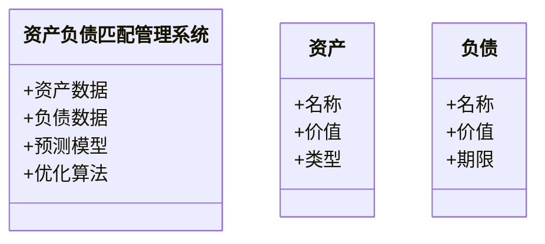
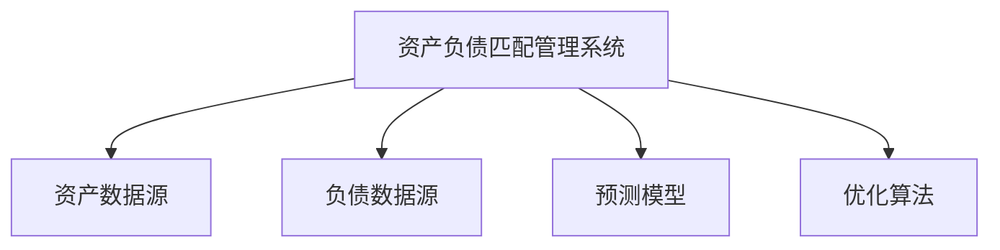
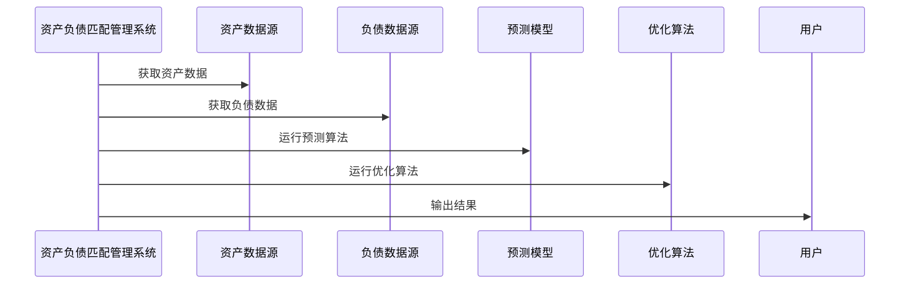

                 


# AI在资产负债匹配管理中的应用

> 关键词：AI、资产负债管理、机器学习、强化学习、随机森林

> 摘要：本文探讨了人工智能（AI）在资产负债匹配管理中的应用，分析了AI技术如何提升金融业务的效率和准确性。文章从核心概念、算法原理、系统架构到实际案例，全面阐述了AI在资产负债匹配管理中的潜力与价值。

---

# 第一部分: 背景介绍

## 第1章: 资产负债管理与AI的结合

### 1.1 资产负债管理的基本概念

#### 1.1.1 资产负债管理的定义
资产负债管理是金融领域的重要组成部分，涉及资产与负债的匹配，以实现风险最小化和收益最大化。资产包括现金、投资等，负债包括债务、贷款等。

#### 1.1.2 资产负债管理的核心目标
资产负债管理的核心目标是在不同市场条件下，保持资产与负债的匹配，避免流动性风险和信用风险。

#### 1.1.3 资产负债管理的实施框架
- 风险评估
- 模型构建
- 战略制定
- 实施监控

### 1.2 AI在金融领域的应用背景

#### 1.2.1 人工智能在金融行业的应用现状
AI在金融领域的应用广泛，包括风险管理、信用评分、算法交易等。

#### 1.2.2 AI在资产负债管理中的潜在价值
AI能够提高预测精度，优化资产配置，降低风险。

#### 1.2.3 资产负债匹配管理的挑战与机遇
- 数据复杂性
- 模型准确性
- 技术进步带来的机遇

---

# 第二部分: 资产负债匹配管理中的AI核心概念与联系

## 第2章: AI在资产负债管理中的核心概念

### 2.1 资产负债匹配管理的数学模型

#### 2.1.1 资产负债匹配的基本原理
$$ 资产 = 负债 + 所有者权益 $$

#### 2.1.2 资产负债匹配的数学表达式
$$ 资产负债匹配问题可以通过优化模型来解决，例如线性规划。$$

### 2.2 AI算法在资产负债管理中的应用

#### 2.2.1 机器学习在资产负债预测中的作用
机器学习用于预测市场波动，优化资产配置。

#### 2.2.2 强化学习在资产负债优化中的应用
强化学习用于动态调整资产与负债的匹配，适应市场变化。

#### 2.2.3 群智能算法在资产负债匹配中的优势
群智能算法（如遗传算法）用于寻找最优匹配方案。

### 2.3 资产负债匹配管理的ER实体关系图

```mermaid
er
actor: 资产负债匹配管理系统
asset: 资产
liability: 负债
equity: 所有者权益
```

---

# 第三部分: AI在资产负债管理中的算法原理

## 第3章: 基于机器学习的资产负债预测算法

### 3.1 线性回归模型在资产负债预测中的应用

#### 3.1.1 线性回归的基本原理
线性回归通过建立因变量与自变量之间的线性关系进行预测。

#### 3.1.2 线性回归模型的数学公式
$$ y = \beta_0 + \beta_1x + \epsilon $$

#### 3.1.3 线性回归模型在资产负债预测中的应用示例
通过历史数据预测未来负债规模。

### 3.2 支持向量机在资产负债分类中的应用

#### 3.2.1 支持向量机的基本原理
支持向量机通过构建超平面进行分类。

#### 3.2.2 支持向量机在资产负债分类中的应用示例
用于识别高风险负债类别。

### 3.3 随机森林在资产负债风险评估中的应用

#### 3.3.1 随机森林的基本原理
随机森林通过集成多个决策树进行预测。

#### 3.3.2 随机森林在资产负债风险评估中的应用示例
评估资产组合的风险敞口。

---

## 第4章: 基于强化学习的资产负债优化算法

### 4.1 强化学习的基本原理

#### 4.1.1 强化学习的定义
强化学习通过智能体与环境的交互，学习最优策略。

#### 4.1.2 强化学习的核心要素
- 状态
- 行动
- 奖励

### 4.2 强化学习在资产负债优化中的应用

#### 4.2.1 强化学习在动态资产配置中的应用
通过实时调整资产组合应对市场变化。

#### 4.2.2 强化学习在负债管理中的应用
优化负债结构，降低融资成本。

### 4.3 强化学习算法实现步骤

#### 4.3.1 状态空间的定义
- 当前资产配置
- 市场状况

#### 4.3.2 动作空间的定义
- 资产调整比例

#### 4.3.3 奖励函数的定义
- 收益最大化
- 风险最小化

---

# 第四部分: 资产负债匹配管理系统的架构设计

## 第5章: 系统架构与实现

### 5.1 系统功能设计

#### 5.1.1 领域模型类图



### 5.2 系统架构设计

#### 5.2.1 系统架构图



### 5.3 系统接口设计

#### 5.3.1 输入接口
- 资产负债数据输入
- 用户指令输入

#### 5.3.2 输出接口
- 预测结果输出
- 优化方案输出

### 5.4 系统交互流程

#### 5.4.1 系统交互序列图



---

# 第五部分: 项目实战

## 第6章: 项目实战与案例分析

### 6.1 智能投资组合优化项目

#### 6.1.1 项目目标
构建智能投资组合优化系统，实现资产与负债的动态匹配。

#### 6.1.2 项目实现

```python
# 智能投资组合优化代码示例
import numpy as np
import pandas as pd
from sklearn.linear_model import LinearRegression

# 数据加载
data = pd.read_csv('assets_liabilities.csv')

# 模型训练
model = LinearRegression()
model.fit(data[['资产', '负债']], data['收益'])

# 预测结果
predicted_returns = model.predict(data[['资产', '负债']])
```

#### 6.1.3 实际案例分析
以某金融机构为例，分析系统的实际应用效果。

---

# 第六部分: 总结与展望

## 第7章: 总结与展望

### 7.1 本书总结
总结了AI在资产负债管理中的应用，强调了技术的重要性。

### 7.2 未来展望
探讨了AI技术在资产负债管理中的未来发展，包括更复杂模型的应用。

### 7.3 最佳实践Tips
- 数据质量至关重要
- 模型需要持续优化
- 保持对市场的敏感性

### 7.4 注意事项
- 风险控制
- 数据隐私保护

---

# 作者：AI天才研究院 & 禅与计算机程序设计艺术

