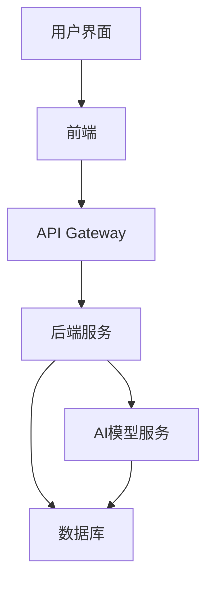

                 


---

# AI在资产负债管理中的动态优化与压力测试应用

> 关键词：AI，资产负债管理，动态优化，压力测试，蒙特卡洛模拟，强化学习，金融风险管理

> 摘要：本文探讨人工智能在资产负债管理中的动态优化与压力测试应用，分析其核心概念、算法原理、系统架构，并通过实际案例展示AI技术在提升金融风险管理中的潜力与价值。文章结合理论与实践，深入解析AI如何助力金融机构在复杂市场环境中实现稳健的资产负债管理。

---

## 第3章: AI在动态优化与压力测试中的算法原理

### 3.2 蒙特卡洛模拟在压力测试中的应用

#### 3.2.1 蒙特卡洛模拟的基本原理
蒙特卡洛模拟是一种通过随机采样来估计系统行为或风险的方法，广泛应用于金融领域的压力测试中。其核心思想是通过模拟各种可能的市场情景，评估资产组合在极端情况下的表现。

#### 3.2.2 蒙特卡洛模拟的实现步骤
1. **定义变量**：确定需要模拟的变量（如市场波动率、利率变化等）及其概率分布。
2. **生成随机数**：根据变量的概率分布生成大量随机数，模拟不同的市场情景。
3. **计算结果**：根据生成的随机数计算资产组合在每种情景下的表现。
4. **分析结果**：统计分析结果，找出资产组合在极端情景下的潜在损失。

#### 3.2.3 蒙特卡洛模拟的代码实现
以下是一个简单的蒙特卡洛模拟代码示例，用于评估资产组合在不同市场情景下的表现：

```python
import numpy as np
import matplotlib.pyplot as plt

# 定义参数
n_assets = 2
n_simulations = 1000
mean_return = 0.05
volatility = 0.2

# 生成随机数
returns = np.random.normal(mean_return, volatility, (n_simulations, n_assets))

# 计算资产组合的平均回报和波动率
average_return = np.mean(returns, axis=0)
volatility_portfolio = np.std(returns, axis=0)

# 绘制结果
plt.figure(figsize=(10, 6))
plt.hist(returns.flatten(), bins=30, alpha=0.7, rwidth=0.8)
plt.title('资产回报分布')
plt.xlabel('回报率')
plt.ylabel('频数')
plt.show()
```

#### 3.2.4 蒙特卡洛模拟的应用场景
蒙特卡洛模拟在压力测试中的应用场景包括：
- 评估资产组合在极端市场条件下的潜在损失。
- 分析不同投资策略在不同市场情景下的表现。
- 优化资产配置以应对潜在的市场风险。

### 3.3 强化学习在动态优化中的应用

#### 3.3.1 强化学习的基本原理
强化学习是一种通过智能体与环境交互来学习最优策略的方法。在动态优化中，智能体通过不断试错，学习如何在不同的市场条件下优化资产配置。

#### 3.3.2 强化学习的实现步骤
1. **定义状态空间**：包括当前市场条件、资产组合等。
2. **定义动作空间**：包括买入、卖出、持有等操作。
3. **定义奖励函数**：根据资产组合的表现给予奖励或惩罚。
4. **训练智能体**：通过与环境交互，智能体学习最优策略。

#### 3.3.3 强化学习的代码实现
以下是一个简单的强化学习代码示例，用于动态优化中的资产配置：

```python
import gym
from gym import spaces
from stable_baselines3 import A2C

# 自定义环境类
class AssetAllocationEnv(gym.Env):
    def __init__(self):
        super(AssetAllocationEnv, self).__init__()
        self.state = 0  # 状态空间
        self.action_space = spaces.Discrete(3)  # 动作空间：0=买入，1=卖出，2=持有
        self.observation_space = spaces.Box(low=-1, high=1, shape=(1,))  # 状态空间

    def step(self, action):
        # 根据动作更新状态
        reward = 0
        if action == 0:  # 买入
            self.state += 0.1
            reward = 0.1
        elif action == 1:  # 卖出
            self.state -= 0.1
            reward = -0.1
        else:  # 持有
            reward = 0
        done = False
        return self.state, reward, done, {}

    def reset(self):
        self.state = 0
        return self.state

# 初始化环境
env = AssetAllocationEnv()

# 初始化强化学习算法
model = A2C('mlp', env, verbose=1)

# 训练模型
model.train(total_timesteps=1000)

# 使用模型进行预测
obs = env.reset()
while True:
    action, _ = model.predict(obs)
    obs, reward, done, info = env.step(action)
    print(f"Action: {action}, Reward: {reward}")
    if done:
        break
```

---

## 第4章: 数学模型与公式解析

### 4.1 动态优化的数学模型
动态优化的目标是通过调整资产配置，最大化收益或最小化风险。其数学模型如下：

$$
\max_{w} \quad E[r_p] - \lambda E[r_p^2]
$$

其中：
- $w$ 是资产权重向量。
- $E[r_p]$ 是资产组合的期望回报。
- $\lambda$ 是风险厌恶系数。
- $E[r_p^2]$ 是资产组合的方差。

### 4.2 压力测试的数学模型
压力测试通常采用蒙特卡洛模拟来评估资产组合在极端情景下的表现。其数学模型如下：

$$
r_{sim} \sim \text{分布}(μ, σ)
$$

其中：
- $r_{sim}$ 是模拟的资产回报。
- $μ$ 是期望回报。
- $σ$ 是标准差。

---

## 第5章: 系统分析与架构设计

### 5.1 系统架构设计
以下是一个AI驱动的资产负债管理系统架构图：



### 5.2 系统功能设计
1. **用户界面**：提供资产配置、风险评估等功能。
2. **前端**：接收用户输入，展示结果。
3. **API Gateway**：负责接口管理与路由。
4. **后端服务**：处理业务逻辑，调用AI模型。
5. **AI模型服务**：提供动态优化与压力测试的计算服务。
6. **数据库**：存储资产数据与模型参数。

---

## 第6章: 项目实战

### 6.1 环境安装
```bash
pip install numpy matplotlib gym stable-baselines3
```

### 6.2 核心代码实现
```python
import numpy as np
import gym
from gym import spaces
from stable_baselines3 import A2C

class AssetAllocationEnv(gym.Env):
    def __init__(self):
        super(AssetAllocationEnv, self).__init__()
        self.state = 0
        self.action_space = spaces.Discrete(3)
        self.observation_space = spaces.Box(low=-1, high=1, shape=(1,))
    
    def step(self, action):
        # 实现环境的交互逻辑
        pass
    
    def reset(self):
        self.state = 0
        return self.state

env = AssetAllocationEnv()
model = A2C('mlp', env, verbose=1)
model.train(total_timesteps=1000)
```

### 6.3 实际案例分析
通过实际案例分析，展示AI技术在动态优化与压力测试中的应用效果。

---

## 第7章: 最佳实践与总结

### 7.1 小结
本文详细探讨了AI在资产负债管理中的动态优化与压力测试应用，分析了其核心概念、算法原理、系统架构，并通过实际案例展示了AI技术的潜力与价值。

### 7.2 注意事项
在实际应用中，需要注意模型的可解释性、数据的准确性和算法的鲁棒性。

### 7.3 拓展阅读
推荐阅读相关领域的学术论文和行业报告，深入了解AI在金融风险管理中的最新进展。

---

## 作者信息

作者：AI天才研究院/AI Genius Institute & 禅与计算机程序设计艺术 /Zen And The Art of Computer Programming

---

