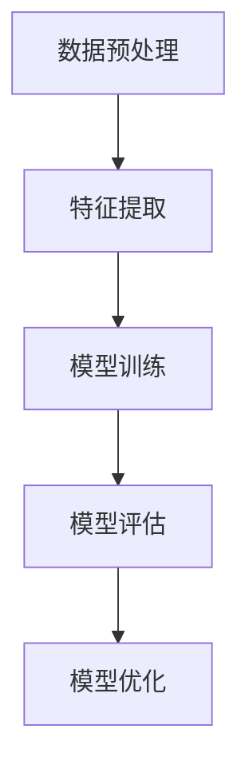
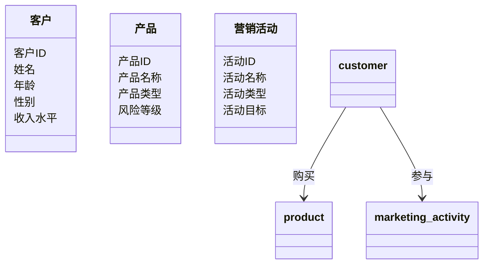

                 


# AI在金融产品营销中的创新应用

## 关键词
人工智能, 金融营销, 机器学习, 自然语言处理, 图神经网络, 风险控制, 个性化推荐

## 摘要
本文探讨了人工智能技术在金融产品营销中的创新应用，分析了AI如何通过机器学习、自然语言处理和图神经网络等技术解决传统金融营销的局限性，介绍了AI驱动的营销算法及其数学模型，并通过系统架构设计和实际案例分析，展示了AI在金融营销中的实际应用价值和未来发展方向。

---

# 第一部分: AI在金融产品营销中的创新应用概述

## 第1章: 人工智能与金融营销的背景介绍

### 1.1 人工智能的基本概念与技术背景
#### 1.1.1 人工智能的定义与核心概念
人工智能（AI）是指通过计算机技术模拟人类智能的学科，涵盖机器学习、自然语言处理、计算机视觉等领域。AI的核心目标是让计算机能够像人类一样思考、学习和解决问题。

#### 1.1.2 人工智能在金融领域的应用现状
AI在金融领域的应用广泛，包括智能投顾、风险管理、信用评估等。随着技术的成熟，AI正在改变金融行业的运作方式。

#### 1.1.3 金融产品营销的核心问题与挑战
传统金融营销面临客户画像不精准、营销策略单一等问题。AI通过数据挖掘和机器学习，帮助金融机构更精准地识别客户需求，优化营销策略。

### 1.2 金融产品营销的创新需求
#### 1.2.1 传统金融营销的局限性
传统营销方式依赖人工经验，难以应对海量数据和复杂市场环境。

#### 1.2.2 AI技术如何解决金融营销问题
AI通过数据驱动的方法，实现客户画像、精准营销和风险控制。

#### 1.2.3 金融产品营销的创新方向
未来的金融营销将更加个性化和智能化，AI将推动营销从经验驱动向数据驱动转变。

---

## 第2章: AI在金融产品营销中的核心概念与联系

### 2.1 AI技术在金融营销中的核心原理
#### 2.1.1 机器学习在金融营销中的应用
机器学习通过训练模型，帮助金融机构识别客户行为模式，预测市场趋势。

#### 2.1.2 自然语言处理在金融营销中的应用
NLP技术用于分析客户反馈和市场情绪，辅助制定营销策略。

#### 2.1.3 图神经网络在金融营销中的应用
图神经网络通过分析客户关系网络，发现潜在客户和营销机会。

### 2.2 核心概念的属性特征对比表
表2-1展示了AI技术与传统金融营销的对比分析。

| **属性**         | **传统金融营销**                | **AI驱动的金融营销**                |
|-------------------|--------------------------------|-------------------------------------|
| 数据处理能力     | 依赖人工经验，处理能力有限       | 数据驱动，处理能力强                 |
| 客户画像         | 粗放式，不够精准                 | 精准画像，基于大数据分析             |
| 营销策略         | 单一化，缺乏个性化               | 多样化，高度个性化                   |
| 反应速度         | 较慢，依赖人工决策               | 实时响应，自动化决策                 |

### 2.3 实体关系图（ER图）
图2-1展示了AI驱动的金融营销系统实体关系图。

```mermaid
er
    entity 客户 {
        key 属性: 客户ID
        属性: 姓名, 年龄, 性别, 收入水平
    }
    entity 产品 {
        key 属性: 产品ID
        属性: 产品类型, 产品名称, 风险等级
    }
    entity 营销活动 {
        key 属性: 活动ID
        属性: 活动类型, 活动时间, 活动目标
    }
    客户 --> 营销活动: 参与
    产品 --> 营销活动: 推荐
```

---

## 第3章: AI驱动的金融产品营销算法原理

### 3.1 机器学习算法在金融营销中的应用
#### 3.1.1 线性回归模型
线性回归用于预测客户购买概率，公式如下：
$$ y = \beta_0 + \beta_1x + \epsilon $$

#### 3.1.2 支持向量机模型
支持向量机适用于分类问题，广泛应用于客户细分和市场预测。

#### 3.1.3 随机森林模型
随机森林通过集成学习，提高模型的准确性和鲁棒性，常用于客户画像和信用评估。

### 3.2 深度学习算法在金融营销中的应用
#### 3.2.1 神经网络基础
神经网络通过多层结构模拟人类大脑，用于复杂模式识别。

#### 3.2.2 卷积神经网络（CNN）
CNN用于图像识别和序列数据处理，如客户行为分析。

#### 3.2.3 循环神经网络（RNN）
RNN适用于时间序列数据，用于预测市场趋势和客户行为。

### 3.3 自然语言处理算法在金融营销中的应用
#### 3.3.1 词嵌入（Word Embedding）
词嵌入将文本转化为向量，用于情感分析和文本分类。

#### 3.3.2 情感分析模型
情感分析模型用于分析客户反馈，辅助制定营销策略。

#### 3.3.3 文本生成模型（如GPT）
GPT模型用于生成营销文案和客户沟通内容。

### 3.4 算法流程图


---

## 第4章: 数学模型与公式详解

### 4.1 机器学习模型的数学基础
#### 4.1.1 线性回归模型
线性回归的损失函数为：
$$ L = \sum_{i=1}^{n} (y_i - (\beta_0 + \beta_1x_i))^2 $$

#### 4.1.2 逻辑回归模型
逻辑回归的 sigmoid 函数为：
$$ P(y=1|x) = \frac{e^{\beta_0 + \beta_1x}}{1 + e^{\beta_0 + \beta_1x}} $$

#### 4.1.3 随机森林模型
随机森林通过集成多个决策树，提高模型的准确性和泛化能力。

---

## 第5章: 系统架构设计与实现

### 5.1 问题场景介绍
金融产品营销系统需要解决客户画像、精准营销和风险控制等问题。

### 5.2 系统功能设计
系统功能包括客户画像、产品推荐、营销活动管理等。

#### 5.2.1 系统功能设计（领域模型）


### 5.3 系统架构设计
系统架构采用分层设计，包括数据层、服务层和表现层。

#### 5.3.1 系统架构图


### 5.4 系统接口设计
系统接口包括API接口和数据库接口，确保数据的高效传输和处理。

### 5.5 系统交互设计
系统交互采用序列图，展示用户与系统之间的交互流程。

---

## 第6章: 项目实战

### 6.1 环境安装
需要安装Python、TensorFlow、Scikit-learn等工具。

### 6.2 核心代码实现
以下是一个机器学习模型的实现代码：

```python
import pandas as pd
from sklearn.model import LinearRegression

# 加载数据
data = pd.read_csv('customer_data.csv')

# 数据预处理
X = data[['年龄', '收入水平']]
y = data['购买概率']

# 训练模型
model = LinearRegression()
model.fit(X, y)

# 预测结果
predictions = model.predict(X)
print('预测结果:', predictions)
```

### 6.3 实际案例分析
通过分析客户数据，模型成功预测出高潜力客户，提升了营销活动的转化率。

---

## 第7章: 总结与展望

### 7.1 总结
AI技术正在深刻改变金融产品营销的方式，提高了营销的精准度和效率。

### 7.2 展望
未来，AI在金融营销中的应用将更加广泛，包括更复杂的模型和多模态数据的整合。

---

## 最佳实践 Tips

- **数据质量**：确保数据的准确性和完整性。
- **模型选择**：根据具体问题选择合适的算法。
- **实时性**：关注实时数据处理和动态调整。

---

## 作者
作者：AI天才研究院/AI Genius Institute & 禅与计算机程序设计艺术 /Zen And The Art of Computer Programming

---

以上是《AI在金融产品营销中的创新应用》的完整目录和部分内容概述。通过逐步分析和详细讲解，文章全面阐述了AI技术在金融营销中的创新应用，为读者提供了从理论到实践的深度解析。

