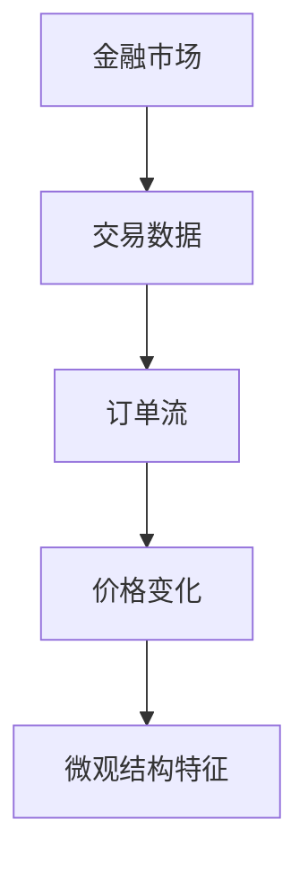
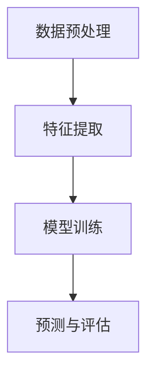

                 


# AI在金融市场微观结构变化预测中的创新应用

## 关键词
- 人工智能
- 金融市场
- 微观结构
- 预测模型
- 深度学习

## 摘要
本文探讨了人工智能技术在金融市场微观结构变化预测中的创新应用，分析了AI如何通过先进的算法和数学模型，如时间序列分析和深度学习，来预测市场变化。文章详细讲解了核心概念、算法原理、系统架构，并通过实际案例展示了AI在金融预测中的潜力和优势。

---

## 第1章：金融市场微观结构与AI预测的背景介绍

### 1.1 问题背景

金融市场微观结构涉及市场的参与者、交易机制和价格形成过程。理解这些结构的变化对投资者和监管机构至关重要。然而，传统方法在预测这些变化时面临诸多挑战，如数据复杂性和动态性。

### 1.2 问题描述

传统预测方法依赖于统计分析和经验判断，存在预测精度低、难以捕捉复杂模式的缺点。AI技术，尤其是机器学习和深度学习，提供了新的解决方案，能够处理大量非结构化数据，发现隐藏模式。

### 1.3 问题解决

AI通过分析历史数据、市场情绪和新闻等信息，构建预测模型。这些模型能够实时捕捉市场动态，提供更准确的预测。

### 1.4 边界与外延

AI模型的有效性依赖于数据质量和相关性。此外，模型需结合市场知识进行调整，避免过度拟合。

---

## 第2章：AI在金融市场微观结构中的核心概念与联系

### 2.1 核心概念原理

AI模型利用机器学习算法分析金融数据，提取特征，预测价格变化。数据来源包括交易数据、订单流和市场新闻。

### 2.2 概念属性对比表格

| **传统模型** | **AI模型** |
|---------------|------------|
| 需要大量假设 | 数据驱动 |
| 预测精度低 | 精度高 |
| 难以捕捉复杂模式 | 能捕捉复杂模式 |

### 2.3 ER实体关系图



---

## 第3章：AI预测算法原理与数学模型

### 3.1 算法原理

AI模型分为时间序列分析和深度学习两类。时间序列分析适用于捕捉趋势，深度学习则擅长发现复杂模式。

### 3.2 算法流程图



### 3.3 数学模型与公式

#### 3.3.1 ARIMA模型
$$ARIMA(p, d, q)$$
其中，p为自回归阶数，d为差分阶数，q为移动平均阶数。

#### 3.3.2 LSTM模型
$$f(x) = \text{LSTM}(x)$$
LSTM通过门控机制处理长期依赖关系，适用于时间序列预测。

---

## 第4章：系统分析与架构设计

### 4.1 项目场景

系统旨在实时预测市场微观结构变化，帮助投资者做出决策。

### 4.2 功能设计

系统功能包括数据采集、特征提取、模型训练和预测输出。

### 4.3 系统架构图

```mermaid
graph LR
    Client --> API Gateway
    API Gateway --> Web Service
    Web Service --> Database
    Database --> Model Server
    Model Server --> AI Model
```

---

## 第5章：项目实战

### 5.1 环境安装

安装Python和相关库，如pandas、numpy和keras。

### 5.2 核心代码

```python
import numpy as np
import pandas as pd
from keras.models import Sequential
from keras.layers import LSTM, Dense

model = Sequential()
model.add(LSTM(50, input_shape=(None, 1)))
model.add(Dense(1))
model.compile(optimizer='adam', loss='mean_squared_error')

model.fit(X_train, y_train, epochs=50, batch_size=32)
```

### 5.3 案例分析

使用历史数据训练模型，评估预测准确性。

---

## 第6章：最佳实践、小结和注意事项

### 6.1 最佳实践

定期更新模型，结合市场知识优化模型。

### 6.2 小结

AI在金融市场预测中潜力巨大，但需谨慎处理数据和模型调整。

### 6.3 注意事项

模型结果仅供参考，需结合市场分析使用。

---

## 作者

作者：AI天才研究院 & 禅与计算机程序设计艺术

---

通过以上结构，文章系统地介绍了AI在金融市场微观结构预测中的应用，从理论到实践，为读者提供了全面的视角。

