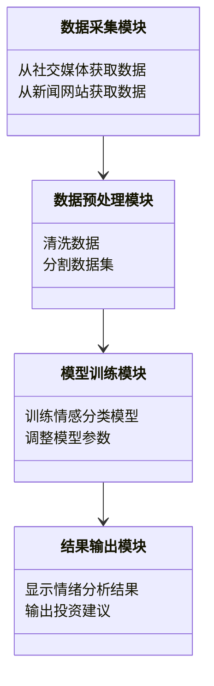

                 


# AI在金融市场情绪分析中的创新应用

## 关键词：AI技术、金融市场、情绪分析、自然语言处理、投资决策、深度学习

## 摘要：本文深入探讨了人工智能技术在金融市场情绪分析中的创新应用，分析了情绪分析的核心概念、常见算法及其在金融领域的实际应用。文章详细讲解了从数据采集到模型构建的整个流程，结合实际案例，展示了AI如何帮助投资者做出更明智的决策。

---

# 第1章: 金融市场情绪分析的背景与意义

## 1.1 情绪分析的定义与核心概念

### 1.1.1 情绪分析的基本概念
情绪分析是一种自然语言处理技术，旨在识别和分类文本中的情感倾向。在金融市场中，情绪分析用于分析投资者、交易员和市场参与者的情绪状态，以预测市场趋势和投资决策。

### 1.1.2 情绪分析在金融领域的独特性
金融市场的数据具有高度的复杂性和不确定性，情绪分析需要处理大量非结构化数据，如新闻、社交媒体评论和公司财报。这些数据中蕴含的情绪信息对市场走势有重要影响。

### 1.1.3 情绪分析的核心要素与边界
情绪分析的核心要素包括文本数据、情感词汇、上下文信息和市场行为数据。其边界在于如何准确捕捉短期情绪波动与长期市场趋势之间的关系。

---

## 1.2 金融市场情绪分析的背景

### 1.2.1 金融市场的数据特征
金融市场数据包括实时交易数据、历史价格数据、新闻数据、社交媒体数据等。这些数据的复杂性和多样性为情绪分析提供了丰富的素材。

### 1.2.2 情绪分析在金融中的应用场景
情绪分析广泛应用于风险管理、投资决策支持、市场趋势预测等领域。例如，通过分析社交媒体上的投资者情绪，可以帮助预测市场波动。

### 1.2.3 情绪分析对投资决策的影响
情绪分析能够捕捉市场参与者的集体情绪，帮助投资者识别市场情绪拐点，从而做出更明智的投资决策。

---

## 1.3 情绪分析的创新性与挑战

### 1.3.1 创新性分析
传统的情绪分析方法依赖于规则和统计模型，而深度学习的引入显著提高了情绪分析的准确性和鲁棒性。创新性体现在算法优化、数据处理和应用场景的扩展。

### 1.3.2 情绪分析的主要挑战
- 数据质量：金融市场数据复杂，噪声多。
- 情绪漂移：市场参与者情绪易受外部因素影响。
- 模型解释性：深度学习模型的黑箱问题影响实际应用。

### 1.3.3 未来研究方向
未来的研究可能集中在如何提高模型的解释性、优化数据处理流程以及探索多模态数据的应用。

---

# 第2章: 情绪分析的核心概念与联系

## 2.1 情绪分析的原理与方法

### 2.1.1 基于NLP的情感计算
自然语言处理（NLP）技术用于提取文本中的情感信息。常用的技术包括词袋模型、TF-IDF和词嵌入（如Word2Vec）。

### 2.1.2 基于机器学习的情绪分类
机器学习算法（如SVM、NB）用于分类文本的情绪。这些方法依赖于特征工程，如情感词汇的识别。

### 2.1.3 深度学习在情绪分析中的应用
深度学习模型（如LSTM、Transformer）能够捕捉文本中的上下文信息，提高情绪分析的准确性。

---

## 2.2 核心概念的对比分析

### 2.2.1 情感计算与文本挖掘的对比
情感计算关注情绪的量化，而文本挖掘侧重于从文本中提取结构化信息。两者结合可以提供更全面的市场洞察。

### 2.2.2 传统统计方法与深度学习的对比
传统方法依赖于人工特征工程，而深度学习自动提取特征，适用于复杂数据。

### 2.2.3 情绪分析与市场行为预测的联系
情绪分析能够预测市场行为，但需要结合其他因素，如宏观经济指标和市场结构。

---

## 2.3 实体关系图与流程图

### 2.3.1 实体关系图（ER图）
```mermaid
graph LR
A[投资者] --> B[交易数据]
C[市场分析师] --> B
D[社交媒体数据] --> B
E[情绪分析模型] --> B
F[投资决策] <-- B
```

### 2.3.2 情绪分析流程图


---

# 第3章: 常见情绪分析算法原理与实现

## 3.1 基于规则的情绪分析算法

### 3.1.1 规则的构建与优化
通过预定义的情感词汇表和规则，识别文本中的情感倾向。例如，使用否定词和情感强度词来调整情感评分。

### 3.1.2 基于规则的分类器实现
代码示例：
```python
def sentiment_score(text):
    words = text.split()
    score = 0
    for word in words:
        if word in positive_words:
            score += 1
        elif word in negative_words:
            score -= 1
    return score
```

### 3.1.3 规则方法的优缺点
优点：简单易懂，适用于特定场景；缺点：难以处理复杂情感和上下文信息。

---

## 3.2 基于机器学习的情绪分析算法

### 3.2.1 传统机器学习模型
- 朴素贝叶斯（Naive Bayes）：常用于文本分类。
- 支持向量机（SVM）：适用于小规模数据。

### 3.2.2 基于词嵌入的模型
- Word2Vec：将单词转换为向量表示。
- GloVe：全局向量词嵌入。

---

## 3.3 基于深度学习的情绪分析算法

### 3.3.1 RNN与LSTM在情绪分析中的应用
LSTM能够捕捉长序列中的情感信息，适用于社交媒体文本分析。

### 3.3.2 Transformer架构的创新应用
Transformer架构（如BERT）在情感分析中表现出色，能够处理上下文信息。

### 3.3.3 图神经网络的最新进展
图神经网络结合了文本和市场结构信息，用于预测市场情绪。

---

## 3.4 算法流程图


---

## 3.5 数学模型与公式

### 3.5.1 朴素贝叶斯分类器
$$ P(y|x) = \frac{P(x|y)P(y)}{P(x)} $$

### 3.5.2 LSTM网络结构
$$ f(t) = \text{tanh}(W_f \cdot [h_{t-1}, x_t] + b_f) $$

### 3.5.3 注意力机制
$$ \text{Attention}(Q, K, V) = \text{softmax}\left(\frac{QK^T}{\sqrt{d_k}}\right)V $$

---

# 第4章: 系统分析与架构设计方案

## 4.1 系统功能设计

### 4.1.1 领域模型


### 4.1.2 系统架构设计


---

## 4.2 系统接口设计

### 4.2.1 API接口
- 输入：文本数据
- 输出：情感评分和投资建议

---

## 4.3 系统交互设计

### 4.3.1 交互流程图


---

# 第5章: 项目实战

## 5.1 环境安装

### 5.1.1 安装Python和相关库
- Python 3.8+
- TensorFlow、Keras、NLTK

## 5.2 系统核心实现源代码

### 5.2.1 数据采集
```python
import requests
from bs4 import BeautifulSoup

def scrape_website(url):
    response = requests.get(url)
    soup = BeautifulSoup(response.text, 'html.parser')
    text = soup.find('div', {'class': 'article'}).text
    return text
```

### 5.2.2 数据预处理
```python
from nltk.tokenize import word_tokenize
from nltk.corpus import stopwords

def preprocess(text):
    tokens = word_tokenize(text.lower())
    filtered = [word for word in tokens if word not in stopwords.words('english')]
    return ' '.join(filtered)
```

### 5.2.3 模型训练
```python
from tensorflow.keras.models import Sequential
from tensorflow.keras.layers import Dense, LSTM, Embedding

model = Sequential()
model.add(Embedding(vocab_size, 100))
model.add(LSTM(64))
model.add(Dense(1, activation='sigmoid'))
model.compile(loss='binary_crossentropy', optimizer='adam', metrics=['accuracy'])
model.fit(X_train, y_train, epochs=10, batch_size=32)
```

### 5.2.4 投资建议生成
```python
def generate_recommendation(score):
    if score > 0.7:
        return "买入"
    elif score < 0.3:
        return "卖出"
    else:
        return "观望"
```

## 5.3 代码应用解读与分析

### 5.3.1 数据采集模块
从新闻网站获取文本数据，提取相关文章内容。

### 5.3.2 数据预处理模块
去除停用词，进行词干提取，转换为可训练的格式。

### 5.3.3 模型训练模块
使用LSTM网络训练情感分类模型，优化模型参数以提高准确率。

### 5.3.4 投资建议生成
根据模型输出的情绪评分，生成买入、卖出或观望的投资建议。

## 5.4 实际案例分析

### 5.4.1 数据来源与预处理
从社交媒体获取用户评论，预处理后输入模型。

### 5.4.2 模型预测结果
输出情绪评分和投资建议，帮助投资者做出决策。

### 5.4.3 案例总结
通过实际案例，验证模型的有效性和实用性，分析模型的优缺点。

## 5.5 项目小结

---

# 第6章: 总结与展望

## 6.1 核心内容总结
本文详细介绍了AI在金融市场情绪分析中的应用，从数据处理到模型构建，再到实际应用，全面展示了AI技术的优势。

## 6.2 未来研究方向
- 提高模型的解释性
- 结合宏观经济指标进行预测
- 探索多模态数据的应用

## 6.3 注意事项与最佳实践
- 数据清洗和特征工程的重要性
- 模型调优和验证
- 实际应用中的风险控制

## 6.4 拓展阅读
推荐相关书籍和论文，鼓励读者深入研究。

---

# 作者：AI天才研究院/AI Genius Institute & 禅与计算机程序设计艺术 /Zen And The Art of Computer Programming

