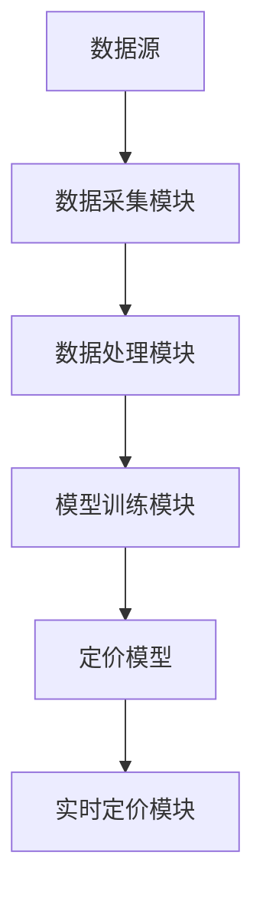
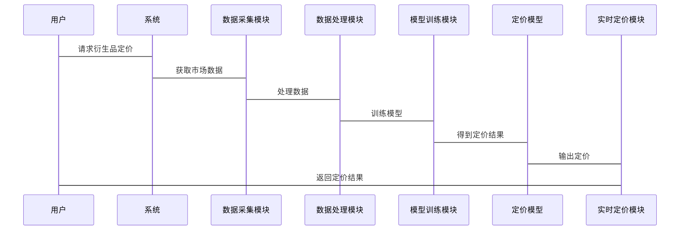

                 

# AI在金融衍生品定价中的创新应用

---

## 关键词：人工智能、金融衍生品、定价模型、风险管理、机器学习、深度学习

---

## 摘要：  
金融衍生品定价是金融市场中的核心问题之一，传统的定价模型在面对复杂市场环境和高频交易时常常显得力不从心。人工智能（AI）的引入为金融衍生品定价带来了革命性的变化。通过机器学习、深度学习等技术，AI能够处理海量市场数据，构建更复杂的定价模型，并实时优化定价策略。本文将详细探讨AI在金融衍生品定价中的创新应用，包括传统定价模型的局限性、AI技术的核心优势、基于机器学习的定价算法实现，以及系统架构设计等内容。通过本文的分析，读者将全面理解AI如何革新金融衍生品定价，为金融市场带来更高的效率和准确性。

---

# 第一部分: AI与金融衍生品定价的背景与基础

## 第1章: AI与金融衍生品定价概述

### 1.1 人工智能与金融行业的结合  
#### 1.1.1 人工智能的基本概念  
人工智能（AI）是指通过计算机技术模拟人类智能的系统。AI的核心技术包括机器学习、自然语言处理、计算机视觉等。在金融领域，AI被广泛应用于数据分析、交易决策、风险管理等领域。  

#### 1.1.2 人工智能在金融领域的应用现状  
AI在金融领域的应用日益广泛，包括股票交易、信用评估、欺诈检测等。通过AI技术，金融机构能够更高效地处理数据，提高决策的准确性。  

#### 1.1.3 金融衍生品的基本概念与分类  
金融衍生品是以其他金融资产为基础的金融工具，常见的衍生品包括期权、期货、掉期等。衍生品的定价需要考虑多种因素，如标的资产价格、波动率、时间价值等。  

### 1.2 金融衍生品定价的核心问题  
#### 1.2.1 衍生品定价的基本原理  
衍生品的定价需要基于其标的资产的价格波动和市场条件。传统的定价模型，如Black-Scholes模型，是基于假设市场波动率为常数，且标的资产价格服从几何布朗运动。  

#### 1.2.2 传统衍生品定价模型的局限性  
传统定价模型假设过于简单，难以应对实际市场中的复杂情况。例如，市场波动率可能随时间变化，标的资产价格可能受到跳跃性事件的影响。  

#### 1.2.3 AI在衍生品定价中的创新潜力  
AI能够处理非线性关系和复杂数据模式，为衍生品定价提供更灵活和精确的解决方案。  

### 1.3 AI技术在金融衍生品定价中的优势  
#### 1.3.1 数据处理能力的提升  
AI能够处理海量市场数据，包括高频交易数据、新闻数据等，提取更多的市场信息。  

#### 1.3.2 模型复杂度的增强  
通过深度学习等技术，AI能够构建更复杂的定价模型，捕捉更多的市场特征。  

#### 1.3.3 实时定价与风险管理的优势  
AI能够实时更新定价模型，根据市场变化快速调整定价策略，同时有效管理市场风险。  

### 1.4 本章小结  
本章介绍了AI与金融行业的结合，分析了金融衍生品定价的核心问题，探讨了AI在衍生品定价中的创新潜力和优势。  

---

## 第2章: 机器学习与深度学习在衍生品定价中的应用  

### 2.1 机器学习的基本原理  
#### 2.1.1 机器学习的核心概念  
机器学习是一种通过数据训练模型的技术，分为监督学习、无监督学习和强化学习等类型。  

#### 2.1.2 监督学习与无监督学习的对比  
监督学习基于标记数据训练模型，适用于分类和回归任务；无监督学习基于无标记数据，适用于聚类和降维任务。  

#### 2.1.3 线性回归与支持向量机的简单介绍  
线性回归是一种简单的回归模型，适用于线性关系；支持向量机是一种分类模型，适用于高维数据的分类任务。  

### 2.2 深度学习在衍生品定价中的应用  
#### 2.2.1 神经网络的基本结构  
神经网络由输入层、隐藏层和输出层组成，能够处理非线性关系。  

#### 2.2.2 卷积神经网络与循环神经网络的对比  
卷积神经网络（CNN）适用于图像数据；循环神经网络（RNN）适用于时间序列数据。  

#### 2.2.3 Transformer模型在时间序列数据中的应用  
Transformer模型通过自注意力机制，能够捕捉时间序列数据中的长距离依赖关系。  

### 2.3 基于机器学习的衍生品定价模型  
#### 2.3.1 模型训练的基本流程  
数据预处理、特征提取、模型训练、模型评估和优化。  

#### 2.3.2 数据特征的选择与处理  
选择影响衍生品价格的关键特征，如标的资产价格、波动率、市场情绪等。  

#### 2.3.3 模型的验证与优化  
通过交叉验证和超参数调优，提高模型的泛化能力。  

### 2.4 本章小结  
本章详细介绍了机器学习和深度学习在衍生品定价中的应用，探讨了不同模型的优缺点和实现流程。  

---

## 第3章: 传统衍生品定价模型的数学基础  

### 3.1 Black-Scholes模型  
#### 3.1.1 模型的基本假设  
标的资产价格服从几何布朗运动，波动率和无风险利率为常数。  

#### 3.1.2 模型的数学公式推导  
期权价格公式：$$ C = S_0 e^{-r t} N(d_1) - K e^{-r T} N(d_2) $$  
其中，$$ d_1 = \frac{\ln(S_0/K) + (r + \sigma^2/2)(T-t)}{\sigma \sqrt{T-t}} $$  
$$ d_2 = d_1 - \sigma \sqrt{T-t} $$  

#### 3.1.3 模型的应用场景与局限性  
适用于欧式期权定价，但难以应对市场波动率的时间依赖性。  

### 3.2 复利与贴现的数学原理  
#### 3.2.1 复利计算的基本公式  
复利公式：$$ A = P (1 + r)^t $$  

#### 3.2.2 贴现因子的计算方法  
贴现公式：$$ PV = \frac{FV}{(1 + r)^t} $$  

#### 3.2.3 时间价值与内在价值的分解  
期权价格由内在价值和时间价值组成，时间价值由波动率和剩余期限决定。  

### 3.3 随机过程与蒙特卡洛模拟  
#### 3.3.1 随机微分方程的基本概念  
随机微分方程（SDE）描述了随机变量的动态变化。  

#### 3.3.2 蒙特卡洛模拟的实现步骤  
生成随机数、模拟标的资产价格路径、计算期权价格期望值。  

#### 3.3.3 模拟在衍生品定价中的应用  
用于计算复杂衍生品的期望价格和风险指标。  

### 3.4 本章小结  
本章回顾了传统衍生品定价模型的数学基础，分析了其局限性，为后续AI创新应用提供了理论基础。  

---

## 第4章: 基于机器学习的定价算法与实现  

### 4.1 算法选择与优化  
#### 4.1.1 线性回归与逻辑回归的对比  
线性回归适用于连续型目标变量，逻辑回归适用于二分类问题。  

#### 4.1.2 支持向量机与随机森林的优劣分析  
支持向量机适用于小规模数据，随机森林适用于高维数据。  

#### 4.1.3 神经网络的超参数调优  
调整学习率、批量大小、神经网络层数等参数，优化模型性能。  

### 4.2 基于深度学习的定价模型  
#### 4.2.1 Transformer模型在时间序列数据中的应用  
通过自注意力机制捕捉时间依赖关系，适用于高频交易数据。  

#### 4.2.2 图神经网络在衍生品关系图中的应用  
构建衍生品关系图，分析不同衍生品之间的相互影响。  

#### 4.2.3 深度强化学习在动态定价中的应用  
通过强化学习优化动态定价策略，提高交易收益。  

### 4.3 算法实现与代码解读  
#### 4.3.1 Python代码实现  
使用Python和TensorFlow框架实现深度学习定价模型。  

#### 4.3.2 数据预处理与特征工程  
标准化数据、提取技术指标和市场情绪特征。  

#### 4.3.3 模型训练与评估  
使用训练数据训练模型，通过验证集评估模型性能。  

### 4.4 本章小结  
本章详细介绍了基于机器学习的定价算法，探讨了不同算法的实现和优化方法。  

---

## 第5章: 系统架构与实现  

### 5.1 系统功能模块划分  
#### 5.1.1 数据采集模块  
实时采集市场数据，包括标的资产价格、成交量、市场新闻等。  

#### 5.1.2 数据处理模块  
清洗数据、提取特征、构建数据集。  

#### 5.1.3 模型训练模块  
训练定价模型，优化模型参数。  

#### 5.1.4 实时定价模块  
根据市场变化，实时更新衍生品价格。  

### 5.2 系统架构图  

### 5.3 系统交互图  

### 5.4 本章小结  
本章设计了基于AI的衍生品定价系统的架构，详细描述了各模块的功能和交互流程。  

---

## 第六部分: 未来展望与最佳实践  

## 第6章: 未来展望与最佳实践  

### 6.1 未来发展趋势  
#### 6.1.1 多模态数据的融合  
结合文本、图像等多种数据源，提高定价模型的准确性。  

#### 6.1.2 自适应模型的优化  
开发能够自适应市场变化的动态定价模型。  

#### 6.1.3 可解释性与透明度的提升  
提高AI模型的可解释性，增强用户信任。  

### 6.2 最佳实践 tips  
#### 6.2.1 数据质量的重要性  
确保数据的准确性和完整性，避免噪声数据干扰。  

#### 6.2.2 模型选择与优化  
根据具体场景选择合适的模型，并进行充分的调优。  

#### 6.2.3 风险管理与监控  
建立有效的风险控制机制，防范模型失效带来的损失。  

### 6.3 本章小结  
本章展望了AI在衍生品定价中的未来发展方向，并提出了最佳实践建议。  

---

## 作者：AI天才研究院/AI Genius Institute & 禅与计算机程序设计艺术 /Zen And The Art of Computer Programming  

---

本文通过系统地分析AI在金融衍生品定价中的创新应用，为读者提供了从理论到实践的全面指导。希望本文能够为金融行业和技术爱好者提供有价值的参考和启发。

