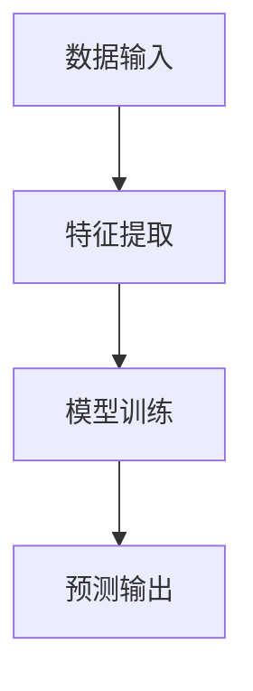
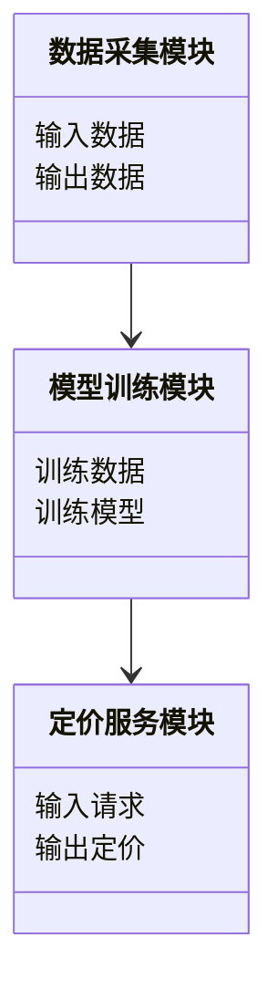
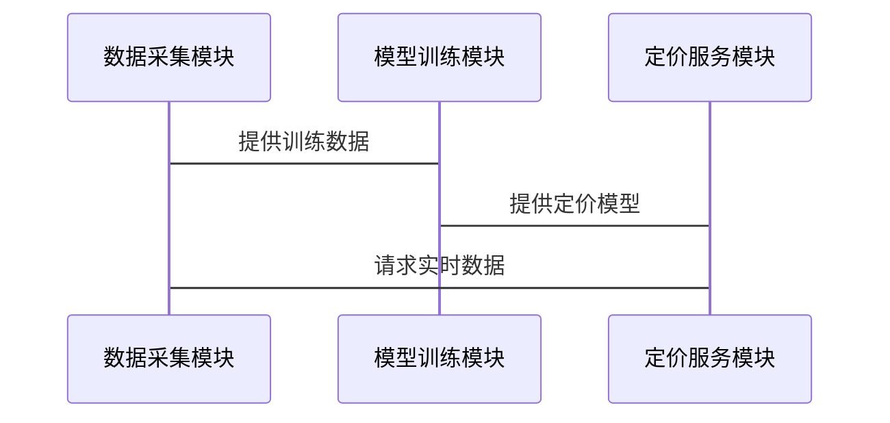

                 


# AI在金融衍生品定价中的深度应用研究

> 关键词：AI技术，金融衍生品，定价模型，机器学习，深度学习，Black-Scholes模型

> 摘要：本文探讨了AI技术在金融衍生品定价中的应用，分析了传统定价模型的局限性，介绍了AI算法的核心原理，并通过实际案例展示了AI在金融衍生品定价中的深度应用。文章内容涵盖背景介绍、AI技术核心概念、数学模型与算法原理、系统架构设计、项目实战以及总结与展望。

---

## 第1章: 金融衍生品与AI的概述

### 1.1 金融衍生品的定义与特点

金融衍生品是一种金融合约，其价值取决于基础资产的价格波动。常见的衍生品包括期权、期货、掉期和认沽权证等。衍生品的特点包括杠杆效应、高风险性、标准化和流动性等。

### 1.2 AI技术在金融领域的应用现状

AI技术在金融领域的应用主要集中在智能投顾、风险管理、市场预测和欺诈检测等方面。在金融衍生品定价中，AI技术能够通过大数据分析和复杂模型提高定价的准确性。

### 1.3 本章小结

本章介绍了金融衍生品的基本概念及其在现代金融体系中的重要性，分析了AI技术在金融领域的广泛应用，并为后续章节奠定了基础。

---

## 第2章: AI技术的核心概念与原理

### 2.1 机器学习与深度学习的基本原理

- **机器学习**：通过数据训练模型，使其能够从数据中学习并做出预测。常用的算法包括线性回归、支持向量机（SVM）和随机森林等。
- **深度学习**：基于人工神经网络，通过多层非线性变换提取数据特征。常用的模型包括卷积神经网络（CNN）、循环神经网络（RNN）和长短期记忆网络（LSTM）。

### 2.2 AI在金融衍生品定价中的应用原理

- **数据驱动的定价模型**：通过历史数据训练模型，预测衍生品的市场价格。
- **AI算法在风险评估中的应用**：利用神经网络模型评估市场波动性，预测衍生品的风险。
- **AI在市场预测中的优势**：通过时间序列分析和模式识别，提高市场预测的准确性。

### 2.3 核心概念对比分析

| **技术**       | **优点**                           | **缺点**                           |
|----------------|-----------------------------------|-----------------------------------|
| 机器学习       | 数据需求低，适合中小规模数据       | 对复杂模式的捕捉能力有限           |
| 深度学习       | 能够捕捉复杂模式，适合大数据       | 数据需求高，计算资源消耗大         |
| 强化学习       | 适用于动态环境，能够优化决策       | 需要明确的奖励机制，难以处理复杂问题 |

### 2.4 本章小结

本章详细介绍了AI技术的核心概念与原理，分析了不同算法在金融衍生品定价中的应用，并通过对比分析帮助读者选择合适的算法。

---

## 第3章: 金融衍生品定价的数学模型与AI算法

### 3.1 传统金融定价模型

- **Black-Scholes模型**：用于期权定价的经典模型，公式如下：
  $$ C = S_0 \Phi(d_1) - K e^{-rT} \Phi(d_2) $$
  其中，$d_1 = \frac{\ln(S_0/K) + (r + \sigma^2/2)T}{\sigma \sqrt{T}} $，$d_2 = d_1 - \sigma \sqrt{T}$。

- **蒙特卡罗模拟**：通过随机采样估计衍生品的期望值，适用于高维问题。

- **随机微分方程**：描述资产价格的随机波动，常用于金融建模。

### 3.2 AI算法在定价中的应用

- **神经网络定价模型**：通过训练神经网络，直接从市场数据中学习定价策略。
- **LSTM网络**：适用于时间序列预测，能够捕捉市场波动的长期依赖关系。
- **强化学习定价**：通过与市场的交互，优化定价策略。

### 3.3 算法原理与流程图



### 3.4 本章小结

本章结合传统定价模型与AI算法，分析了AI在金融衍生品定价中的优势，并通过流程图展示了AI定价模型的整体架构。

---

## 第4章: 系统架构设计

### 4.1 问题场景介绍

金融衍生品定价系统需要处理海量数据，实时更新市场信息，并提供高精度的定价服务。

### 4.2 系统功能设计

- **数据采集模块**：从金融市场获取实时数据。
- **模型训练模块**：利用历史数据训练AI模型。
- **定价服务模块**：根据模型输出定价结果。
- **风险评估模块**：评估定价模型的风险。

### 4.3 系统架构设计



### 4.4 系统接口设计

- **API接口**：提供HTTP接口，供其他系统调用定价服务。
- **数据接口**：与金融市场数据源对接，获取实时数据。

### 4.5 系统交互流程



### 4.6 本章小结

本章详细设计了金融衍生品定价系统的架构，包括功能模块、接口设计和系统交互流程。

---

## 第5章: 项目实战

### 5.1 环境配置

安装必要的库：
```bash
pip install numpy pandas matplotlib keras tensorflow
```

### 5.2 系统核心实现源代码

```python
import numpy as np
import pandas as pd
from keras.models import Sequential
from keras.layers import LSTM, Dense

# 数据预处理
data = pd.read_csv('market_data.csv')
features = data[['open', 'high', 'low', 'close']]
labels = data['price']

# 模型训练
model = Sequential()
model.add(LSTM(64, input_shape=(4, 1)))
model.add(Dense(1))
model.compile(loss='mean_squared_error', optimizer='adam')
model.fit(features, labels, epochs=100, batch_size=32)
```

### 5.3 代码应用解读与分析

- **数据预处理**：将市场数据转化为模型输入格式。
- **模型训练**：使用LSTM网络训练定价模型。
- **结果分析**：评估模型的预测准确性。

### 5.4 实际案例分析

假设我们有一个期权定价案例，使用训练好的模型进行预测：
```python
predicted_price = model.predict(new_data)
print(predicted_price)
```

### 5.5 项目小结

本章通过实际案例展示了AI在金融衍生品定价中的应用，详细讲解了系统的核心实现和代码逻辑。

---

## 第6章: 总结与展望

### 6.1 本章总结

本文全面探讨了AI技术在金融衍生品定价中的应用，分析了传统模型的局限性，并通过AI算法提高了定价的准确性。

### 6.2 当前研究的不足

- 数据质量和实时性问题。
- 模型的可解释性问题。
- 计算资源的限制。

### 6.3 未来发展方向

- 提高模型的可解释性。
- 结合边缘计算优化实时性。
- 研究多模态数据的应用。

### 6.4 最佳实践 tips

- 数据预处理是关键，确保数据质量。
- 选择合适的算法，结合业务需求。
- 定期更新模型，适应市场变化。

### 6.5 本章小结

本章总结了全文内容，并展望了未来的研究方向，为读者提供了宝贵的参考。

---

## 作者信息

作者：AI天才研究院/AI Genius Institute & 禅与计算机程序设计艺术 /Zen And The Art of Computer Programming

---

**附录：**  
- **数据来源**：市场数据来源及获取方法。  
- **代码库**：完整的源代码实现。  
- **参考文献**：相关文献和资料的引用。

