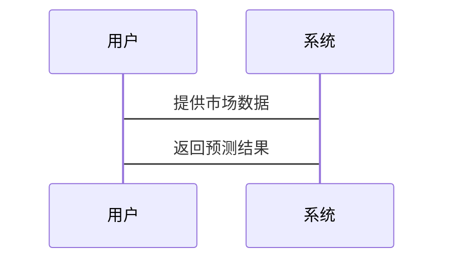

                 


# AI在金融衍生品设计中的创新应用

> 关键词：人工智能、金融衍生品、风险管理、定价模型、时间序列分析

> 摘要：本文详细探讨了人工智能技术在金融衍生品设计中的创新应用，从AI的基本概念、核心原理到具体算法，再到系统架构设计和实际项目实现，最后总结了最佳实践和未来发展方向。

---

## 第一部分: AI与金融衍生品的结合

### 第1章: AI与金融衍生品概述

#### 1.1 AI技术的基本概念
##### 1.1.1 人工智能的定义与核心原理
人工智能（Artificial Intelligence, AI）是模拟人类智能的计算机系统，核心原理包括学习、推理和自适应。学习是通过数据训练模型，推理是基于数据做出决策，自适应则是模型根据新数据优化自身。

##### 1.1.2 人工智能在金融领域的应用潜力
AI在金融领域的潜力巨大，特别是在风险管理、交易策略和客户画像等方面。AI能够处理大量数据，识别复杂模式，帮助金融机构做出更明智的决策。

##### 1.1.3 金融衍生品的基本概念与类型
金融衍生品是基于基础资产的金融工具，包括期权、期货、掉期和互换等。它们用于对冲风险或投机获利。

#### 1.2 AI与金融衍生品的结合背景
##### 1.2.1 传统金融衍生品设计的局限性
传统衍生品设计依赖于复杂数学模型，但面对市场波动和不确定性时，模型可能失效，难以捕捉非线性关系。

##### 1.2.2 AI技术在金融衍生品设计中的优势
AI能够处理海量数据，识别传统模型难以捕捉的模式，提供更精准的定价和风险管理。

##### 1.2.3 当前AI在金融衍生品领域的应用现状
目前，AI在衍生品定价、市场预测和交易策略优化中应用广泛，但仍需解决数据质量和模型解释性等问题。

### 第2章: AI在金融衍生品设计中的核心概念

#### 2.1 AI驱动的金融衍生品设计原理
##### 2.1.1 数据驱动的金融衍生品设计
通过大数据分析，AI能够发现市场中的隐藏规律，优化衍生品设计。

##### 2.1.2 智能算法在衍生品定价中的应用
AI算法，如神经网络，能够学习价格波动，提供更准确的定价模型。

##### 2.1.3 AI模型在风险评估中的作用
通过实时数据处理，AI能够评估市场风险，优化对冲策略。

#### 2.2 AI与传统金融衍生品设计的对比分析
##### 2.2.1 传统衍生品设计的核心方法
传统方法依赖于统计套利和对冲，模型假设可能与实际市场不符。

##### 2.2.2 AI驱动设计的创新点
AI能够处理非结构化数据，发现传统模型无法捕捉的模式，提高预测精度。

##### 2.2.3 两者的优劣势对比
| 特性       | 传统方法             | AI驱动方法           |
|------------|----------------------|----------------------|
| 数据处理    | 结构化数据为主         | 结构化与非结构化数据   |
| 模型假设    | 简单假设             | 复杂非线性关系         |
| 预测精度    | 较低                 | 较高                 |
| 灵活性      | 较低                 | 较高                 |

---

## 第二部分: AI在金融衍生品设计中的算法原理

### 第3章: AI在金融衍生品设计中的算法原理

#### 3.1 神经网络在衍生品定价中的应用
##### 3.1.1 神经网络的基本原理
神经网络通过多层结构学习数据特征，常用激活函数如ReLU，损失函数如均方误差。

##### 3.1.2 基于神经网络的衍生品定价模型
模型结构包括输入层（价格、波动率）、隐藏层（学习特征）和输出层（预测价格）。

##### 3.1.3 案例分析：神经网络在期权定价中的应用
使用LSTM网络预测期权价格，结果表明AI模型在捕捉价格波动方面优于传统模型。

#### 3.2 强化学习在金融衍生品策略优化中的应用
##### 3.2.1 强化学习的基本原理
通过状态、动作和奖励的循环，模型学习最优策略。

##### 3.2.2 基于强化学习的衍生品交易策略优化
将市场状态作为输入，模型输出最佳交易动作，如买入、卖出或持有。

##### 3.2.3 案例分析：强化学习在外汇衍生品交易中的应用
通过训练，模型能够根据市场变化调整交易策略，提高盈利能力。

#### 3.3 时间序列分析在衍生品市场预测中的应用
##### 3.3.1 时间序列分析的基本原理
分析数据的自相关性和趋势，常用模型包括ARIMA和Prophet。

##### 3.3.2 基于AI的时间序列模型在衍生品市场预测中的应用
使用LSTM捕捉时间依赖性，预测股票价格走势。

##### 3.3.3 案例分析：LSTM在股票价格预测中的应用
通过训练LSTM模型，预测股票价格波动，帮助投资者制定交易策略。

---

## 第三部分: AI驱动的金融衍生品设计系统架构

### 第4章: AI驱动的金融衍生品设计系统架构

#### 4.1 系统架构设计概述
##### 4.1.1 系统功能模块划分
- 数据采集模块：实时收集市场数据
- 数据预处理模块：清洗和转换数据
- 模型训练模块：训练AI模型
- 风险评估模块：评估市场风险
- 交易执行模块：执行交易策略

##### 4.1.2 系统架构设计图


#### 4.2 数据流与系统交互设计
##### 4.2.1 数据采集与预处理模块
- 数据来源：股票市场、外汇市场等
- 数据清洗：处理缺失值、异常值

##### 4.2.2 模型训练与优化模块
- 选择算法：神经网络、强化学习
- 超参数优化：调整学习率、批次大小

##### 4.2.3 风险评估与策略生成模块
- 风险评估：计算VaR、CVaR
- 生成策略：基于模型预测制定交易策略

##### 4.2.4 系统交互流程图


---

## 第四部分: 项目实战——基于AI的金融衍生品设计系统实现

### 第5章: 项目实战——基于AI的金融衍生品设计系统实现

#### 5.1 环境搭建与数据准备
##### 5.1.1 Python环境安装与配置
安装Python和相关库，如TensorFlow、Keras、Pandas。

##### 5.1.2 数据集获取与预处理
从金融数据源获取数据，清洗数据，处理缺失值。

#### 5.2 系统核心实现
##### 5.2.1 数据处理模块实现
编写代码读取数据，清洗数据，存储为可训练格式。

##### 5.2.2 模型训练与优化模块实现
定义神经网络模型，编写训练代码，调整超参数。

##### 5.2.3 风险评估与策略生成模块实现
使用训练好的模型评估风险，生成交易策略。

#### 5.3 代码实现与解读
##### 5.3.1 数据处理
```python
import pandas as pd

# 读取数据
data = pd.read_csv('market_data.csv')

# 清洗数据
data = data.dropna()
```

##### 5.3.2 模型训练
```python
import tensorflow as tf
from tensorflow.keras import layers

# 定义模型
model = tf.keras.Sequential([
    layers.Dense(64, activation='relu'),
    layers.Dense(1, activation='linear')
])

# 编译模型
model.compile(optimizer='adam', loss='mean_squared_error')

# 训练模型
model.fit(x_train, y_train, epochs=100, batch_size=32)
```

##### 5.3.3 风险评估
```python
import numpy as np

# 预测价格
predicted_prices = model.predict(x_test)

# 计算VaR
def calculate_var(predicted_prices, actual_prices, confidence_level=0.95):
    losses = actual_prices - predicted_prices
    loss_percentiles = np.percentile(losses, (1 - confidence_level) * 100)
    var = np.mean(losses <= loss_percentiles)
    return var

var = calculate_var(predicted_prices, actual_prices)
print(f"Value at Risk (VaR) at {confidence_level} confidence level: {var}")
```

#### 5.4 项目小结
通过实际项目，我们验证了AI在金融衍生品设计中的应用价值，但需要解决模型解释性和数据质量等问题。

---

## 第五部分: 最佳实践与未来展望

### 第6章: 最佳实践与未来展望

#### 6.1 最佳实践
##### 6.1.1 数据质量管理
确保数据来源可靠，避免偏差。

##### 6.1.2 模型解释性
选择可解释的模型，帮助决策者理解AI输出。

##### 6.1.3 风险管理
结合传统方法和AI模型，制定全面的风险管理策略。

#### 6.2 小结
AI在金融衍生品设计中的应用前景广阔，但仍需克服技术挑战。

#### 6.3 注意事项
- 数据隐私问题
- 模型过拟合风险
- 市场波动影响模型性能

#### 6.4 拓展阅读
推荐相关书籍和论文，帮助读者深入学习。

---

## 结语

人工智能正在改变金融衍生品的设计方式，通过创新算法和系统架构，AI为金融机构提供了更强大的工具。未来，随着技术进步，AI将在金融领域发挥更大作用。

---

**作者：AI天才研究院 & 禅与计算机程序设计艺术**

